# Introducción

En este documento elaborado por Jesús Suero y Germán Linares se desarrolla el proyecto para la asignatura de Fundamentos Matemáticos del Análisis de Datos del Máster de Big Data de ICAI.

Se va a analizar un dataset llamado Melbourne Housing Market y obtenido de Kaggle en [este enlace](https://www.kaggle.com/anthonypino/melbourne-housing-market).

El dataset incluye datos sobre viviendas puestas a la venta en el mercado inmobiliario de Melbourne (Australia), precio de venta, dirección, barrio, número de habitaciones, agente inmobiliario...


## Preliminares

+ Se limpia el directorio de trabajo y se cargan las librerías que se van a usar:


```r
rm(list = ls())
library(tidyverse)
```

```
## -- Attaching packages --------------------------------------- tidyverse 1.3.1 --
```

```
## v ggplot2 3.3.5     v purrr   0.3.4
## v tibble  3.1.4     v dplyr   1.0.7
## v tidyr   1.1.3     v stringr 1.4.0
## v readr   2.0.1     v forcats 0.5.1
```

```
## -- Conflicts ------------------------------------------ tidyverse_conflicts() --
## x dplyr::filter() masks stats::filter()
## x dplyr::lag()    masks stats::lag()
```

```r
library(leaflet)
library(corrplot)
```

```
## corrplot 0.90 loaded
```

```r
library(GGally)
```

```
## Registered S3 method overwritten by 'GGally':
##   method from   
##   +.gg   ggplot2
```

```r
library(MLTools)
```

```
##    __    __   _            _________
##   |  \  /  | | |          |___   ___| _____   _____   _      _____
##   |   \/   | | |     ____     | |    |  _  | |  _  | | |    |  ___|
##   | |\  /| | | |    |____|    | |    | | | | | | | | | |    |___  |
##   | | \/ | | | |____          | |    | |_| | | |_| | | |__   ___| |
##   |_|    |_| |______|         |_|    |_____| |_____| |____| |_____|
## 
##            Learning is fun, Machine Learning is funnier
##             -----------------------------------------
##            With great power comes great responsibility
##             -----------------------------------------
```

```
## Created by:
##         José Portela González   <Jose.Portela@iit.comillas.edu>
##         Guillermo Mestre Marcos <Guillermo.Mestre@comillas.edu>
##         Jaime Pizarroso Gonzalo <jpizarroso@comillas.edu>
##         Antonio Muñoz San Roque <antonio.munoz@iit.comillas.edu>
```

```
## 
##             Escuela Técnica Superior de Ingeniería ICAI
```

```r
library(caret)
```

```
## Loading required package: lattice
```

```
## 
## Attaching package: 'caret'
```

```
## The following object is masked from 'package:purrr':
## 
##     lift
```

+ Se carga el dataset y se guarda en la variable housing:


```r
housing <- read_csv('data/Melbourne_housing_FULL.csv')
```

```
## Rows: 34857 Columns: 21
```

```
## -- Column specification --------------------------------------------------------
## Delimiter: ","
## chr  (8): Suburb, Address, Type, Method, SellerG, Date, CouncilArea, Regionname
## dbl (13): Rooms, Price, Distance, Postcode, Bedroom2, Bathroom, Car, Landsiz...
```

```
## 
## i Use `spec()` to retrieve the full column specification for this data.
## i Specify the column types or set `show_col_types = FALSE` to quiet this message.
```


# Análisis del dataset

## Tipos de variables

El dataset original se compone de 34857 observaciones distribuidas en 21 variables.

Se observa la distribución de las variables mediante el comando summary: si es numérica o categórica, entre que valores se mueve, su media...


```r
summary(housing)
```

```
## Warning: One or more parsing issues, see `problems()` for details
```

```
##     Suburb            Address              Rooms            Type          
##  Length:34857       Length:34857       Min.   : 1.000   Length:34857      
##  Class :character   Class :character   1st Qu.: 2.000   Class :character  
##  Mode  :character   Mode  :character   Median : 3.000   Mode  :character  
##                                        Mean   : 3.031                     
##                                        3rd Qu.: 4.000                     
##                                        Max.   :16.000                     
##                                                                           
##      Price             Method            SellerG              Date          
##  Min.   :   85000   Length:34857       Length:34857       Length:34857      
##  1st Qu.:  635000   Class :character   Class :character   Class :character  
##  Median :  870000   Mode  :character   Mode  :character   Mode  :character  
##  Mean   : 1050173                                                           
##  3rd Qu.: 1295000                                                           
##  Max.   :11200000                                                           
##  NA's   :7610                                                               
##     Distance        Postcode       Bedroom2         Bathroom     
##  Min.   : 0.00   Min.   :3000   Min.   : 0.000   Min.   : 0.000  
##  1st Qu.: 6.40   1st Qu.:3051   1st Qu.: 2.000   1st Qu.: 1.000  
##  Median :10.30   Median :3103   Median : 3.000   Median : 2.000  
##  Mean   :11.18   Mean   :3116   Mean   : 3.085   Mean   : 1.625  
##  3rd Qu.:14.00   3rd Qu.:3156   3rd Qu.: 4.000   3rd Qu.: 2.000  
##  Max.   :48.10   Max.   :3978   Max.   :30.000   Max.   :12.000  
##  NA's   :1       NA's   :1      NA's   :8217     NA's   :8226    
##       Car            Landsize         BuildingArea       YearBuilt    
##  Min.   : 0.000   Min.   :     0.0   Min.   :    0.0   Min.   :1196   
##  1st Qu.: 1.000   1st Qu.:   224.0   1st Qu.:  102.0   1st Qu.:1940   
##  Median : 2.000   Median :   521.0   Median :  136.0   Median :1970   
##  Mean   : 1.729   Mean   :   593.6   Mean   :  160.3   Mean   :1965   
##  3rd Qu.: 2.000   3rd Qu.:   670.0   3rd Qu.:  188.0   3rd Qu.:2000   
##  Max.   :26.000   Max.   :433014.0   Max.   :44515.0   Max.   :2106   
##  NA's   :8728     NA's   :11810      NA's   :21115     NA's   :19306  
##  CouncilArea          Lattitude        Longtitude     Regionname       
##  Length:34857       Min.   :-38.19   Min.   :144.4   Length:34857      
##  Class :character   1st Qu.:-37.86   1st Qu.:144.9   Class :character  
##  Mode  :character   Median :-37.81   Median :145.0   Mode  :character  
##                     Mean   :-37.81   Mean   :145.0                     
##                     3rd Qu.:-37.75   3rd Qu.:145.1                     
##                     Max.   :-37.39   Max.   :145.5                     
##                     NA's   :7976     NA's   :7976                      
##  Propertycount  
##  Min.   :   83  
##  1st Qu.: 4385  
##  Median : 6763  
##  Mean   : 7573  
##  3rd Qu.:10412  
##  Max.   :21650  
##  NA's   :3
```

A continuación, se proporciona una descripción de cada una de las variables presentes en el dataset:

+ Suburb: Barrio en el que se sitúa la vivienda (categórica)
+ Address: Dirección de la vivienda (categórica)
+ Rooms: Número de habitaciones de la vivienda (discreta)
+ Type: Tipo de vivienda (categórica)
      h - house, cottage, villa, semi, terrace 
      u - unit, duplex
      t - townhouse
+ Price: Precio en dólares australianos de la vivienda (continua)
+ Method: Método de venta de la vivienda (categórica)
      S - property sold 
      SP - property sold prior 
      PI - property passed in 
      PN - sold prior not disclosed 
      SN - sold not disclosed
      VB - vendor bid; 
      W - withdrawn prior to auction
      SA - sold after auction 
      SS - sold after auction price not disclosed 
+ SellerG: Agente inmobiliario (categórica)
+ Date: Fecha de venta (categórica)
+ Distance: Distancia al Central Business District de Melbourne (continua)
+ Postcode: Código postal (categórica)
+ Bedroom2: Número de habitaciones, dato scraped de otra fuente (discreta)
+ Bathroom: Número de baños (discreta)
+ Car: Número de plazas de garaje (discreta)
+ Landsize: Tamaño del terreno en metros (continua)
+ Building Area: Tamaño construido en metros (continua)
+ YearBuilt: Año de contrucción de la vivienda (discreta)
+ CouncilArea: Ayuntamiento al que pertecene (categórica)
+ Latitude: Latitud en la que se sitúa la vivienda (continua)
+ Longitude: Longitud en la que se sitúa la vivienda (continua)
+ Regionname: Región en la que se sitúa la vivienda (categórica)
+ Propertycount: Número de propiedades que hay en ese Barrio (discreta)


## Tratamiento de valores ausentes (NAs)

Tal y como se vio en el summary existen bastantes registros con valores NAs en alguna de sus variables, se va a proceder a eliminarlos según diferentes criterios.

Se eliminan todas las observaciones con NAs en la columna Price.


```r
housing = housing %>% 
  drop_na(Price)
```

Ahora hay un total de 27247 observaciones, se ejecuta un summary para ver la distribucion de NAs.


```r
summary(housing)
```

```
##     Suburb            Address              Rooms            Type          
##  Length:27247       Length:27247       Min.   : 1.000   Length:27247      
##  Class :character   Class :character   1st Qu.: 2.000   Class :character  
##  Mode  :character   Mode  :character   Median : 3.000   Mode  :character  
##                                        Mean   : 2.992                     
##                                        3rd Qu.: 4.000                     
##                                        Max.   :16.000                     
##                                                                           
##      Price             Method            SellerG              Date          
##  Min.   :   85000   Length:27247       Length:27247       Length:27247      
##  1st Qu.:  635000   Class :character   Class :character   Class :character  
##  Median :  870000   Mode  :character   Mode  :character   Mode  :character  
##  Mean   : 1050173                                                           
##  3rd Qu.: 1295000                                                           
##  Max.   :11200000                                                           
##                                                                             
##     Distance        Postcode       Bedroom2         Bathroom    
##  Min.   : 0.00   Min.   :3000   Min.   : 0.000   Min.   :0.000  
##  1st Qu.: 6.40   1st Qu.:3046   1st Qu.: 2.000   1st Qu.:1.000  
##  Median :10.50   Median :3088   Median : 3.000   Median :1.000  
##  Mean   :11.28   Mean   :3114   Mean   : 3.046   Mean   :1.592  
##  3rd Qu.:14.00   3rd Qu.:3153   3rd Qu.: 4.000   3rd Qu.:2.000  
##  Max.   :48.10   Max.   :3978   Max.   :20.000   Max.   :9.000  
##  NA's   :1       NA's   :1      NA's   :6441     NA's   :6447   
##       Car            Landsize         BuildingArea       YearBuilt    
##  Min.   : 0.000   Min.   :     0.0   Min.   :    0.0   Min.   :1196   
##  1st Qu.: 1.000   1st Qu.:   219.0   1st Qu.:  100.0   1st Qu.:1950   
##  Median : 2.000   Median :   512.0   Median :  133.0   Median :1970   
##  Mean   : 1.715   Mean   :   593.5   Mean   :  156.8   Mean   :1967   
##  3rd Qu.: 2.000   3rd Qu.:   664.0   3rd Qu.:  182.0   3rd Qu.:2000   
##  Max.   :18.000   Max.   :433014.0   Max.   :44515.0   Max.   :2019   
##  NA's   :6824     NA's   :9265       NA's   :16591     NA's   :15163  
##  CouncilArea          Lattitude        Longtitude     Regionname       
##  Length:27247       Min.   :-38.19   Min.   :144.4   Length:27247      
##  Class :character   1st Qu.:-37.86   1st Qu.:144.9   Class :character  
##  Mode  :character   Median :-37.80   Median :145.0   Mode  :character  
##                     Mean   :-37.81   Mean   :145.0                     
##                     3rd Qu.:-37.75   3rd Qu.:145.1                     
##                     Max.   :-37.40   Max.   :145.5                     
##                     NA's   :6254     NA's   :6254                      
##  Propertycount  
##  Min.   :   83  
##  1st Qu.: 4294  
##  Median : 6567  
##  Mean   : 7567  
##  3rd Qu.:10412  
##  Max.   :21650  
##  NA's   :3
```

Se decide eliminar los valores ausentes presentes en las columnas con pocos NAs.


```r
housing = housing %>% 
  drop_na(Distance, Postcode, Propertycount)
```

Se eliminan ahora del dataset las columnas BuildingArea y Yearbuilt debido al alto porcentaje de NAs que contienen.


```r
housing$BuildingArea = NULL
housing$YearBuilt = NULL
```

Parece que coindicen las observaciones NAs de las variables Car, Bathroom y Bedroom2 (cuando una observación tiene una de estas variables ausentes, tiene todas ellas). Además, la variable que Landsize tiene un elevado número de valores ausentes.
Por tanto, se eliminan las observaciones con NAs en las variables comentadas.


```r
housing = housing %>% 
  drop_na(Landsize, Car, Bathroom, Bedroom2)
```

Se comprueba si queda algún valor ausente en la tabla:


```r
apply(is.na(housing),2,which)
```

```
## $Suburb
## integer(0)
## 
## $Address
## integer(0)
## 
## $Rooms
## integer(0)
## 
## $Type
## integer(0)
## 
## $Price
## integer(0)
## 
## $Method
## integer(0)
## 
## $SellerG
## integer(0)
## 
## $Date
## integer(0)
## 
## $Distance
## integer(0)
## 
## $Postcode
## integer(0)
## 
## $Bedroom2
## integer(0)
## 
## $Bathroom
## integer(0)
## 
## $Car
## integer(0)
## 
## $Landsize
## integer(0)
## 
## $CouncilArea
## integer(0)
## 
## $Lattitude
##  [1]  1541  1912  2736  3113  6567  8093  8588  8667  8673  8675  8676  9161
## [13]  9331  9508  9951 10071 10742 10746 11121 11453 11571 11716
## 
## $Longtitude
##  [1]  1541  1912  2736  3113  6567  8093  8588  8667  8673  8675  8676  9161
## [13]  9331  9508  9951 10071 10742 10746 11121 11453 11571 11716
## 
## $Regionname
## integer(0)
## 
## $Propertycount
## integer(0)
```

Existen 22 registros NAs comunes en las variables Lattitude y Longitude, se procede con su eliminación.


```r
housing = housing %>% 
  drop_na(Lattitude, Longtitude)
```

Se comprueba que ya no queda ningún valor ausente en la tabla:


```r
any(is.na(housing))
```

```
## [1] FALSE
```


## Estudio de variables

### Variable Address
Se quiere ver cuántos valores únicos tiene la variable Address por si se pudiera dividir de alguna forma:


```r
length(unique(housing$Address))
```

```
## [1] 17369
```

La granularidad de Address es muy alta, por lo que agrupaciones por Address proporcionaran demasiados resultados. Debido a esto, se decide eliminar la columna porque no aportará información de utilidad.


```r
housing$Address = NULL
```


### Variable Suburb

Se convierte la variable a factor y se muestra cuántos niveles tiene, indicando de esta forma el número de suburbios entre los que se distribuyen las viviendas.


```r
housing$Suburb = as.factor(housing$Suburb)
length(levels(housing$Suburb))
```

```
## [1] 333
```


### Variable Rooms

Se muestra la frecuencia absoluta para la variable Rooms, indicando cuantas viviendas hay para un número de habitaciones. Los valores se distribuyen entre 1 y 12 concentrándose entre 1 y 5.


```r
table(housing$Rooms)
```

```
## 
##    1    2    3    4    5    6    7    8   10   12 
##  688 3944 7944 4105  875   96   14   10    2    1
```


### Variable Car

Esta variable indica el número de plazas de aparcamiento que tiene una vivienda. Se decide convertirla a factor y dividirla en dos niveles en función de si tiene (YES) o no (NO) plaza de aparcamiento.


```r
housing$Car = as.factor(housing$Car)
levels(housing$Car) = c("NO", "YES", "YES", "YES", "YES", "YES", "YES", "YES", "YES", "YES", "YES", "YES", "YES", "YES", "YES")
levels(housing$Car)
```

```
## [1] "NO"  "YES"
```


### Variable Regionname

Se convierte la variable Regionname a factor y se muestra sus niveles, observándose 8 niveles.


```r
housing$Regionname = as.factor(housing$Regionname)
levels(housing$Regionname)
```

```
## [1] "Eastern Metropolitan"       "Eastern Victoria"          
## [3] "Northern Metropolitan"      "Northern Victoria"         
## [5] "South-Eastern Metropolitan" "Southern Metropolitan"     
## [7] "Western Metropolitan"       "Western Victoria"
```


### Variable SellerG

Para esta variable se va a hacer un estudio detallado en el que se descubrirá quiénes son los vendedores que más venden y dónde se sitúan las viviendas vendidas por ellos.

En primer lugar, se calcula el número de viviendas vendidas por cada vendedor y el porcentaje que representa respecto al total. Se muestran los 5 vendedores con más viviendas.


```r
TopSellers = housing %>% 
  group_by(SellerG) %>% 
  dplyr::summarise(numberofhouses_sold = n()) %>% 
  mutate(percentageSold = round((numberofhouses_sold*100)/nrow(housing),2)) %>% 
  arrange(desc(percentageSold))
head(TopSellers, 5)
```

```
## # A tibble: 5 x 3
##   SellerG       numberofhouses_sold percentageSold
##   <chr>                       <int>          <dbl>
## 1 Nelson                       1884          10.7 
## 2 Jellis                       1638           9.27
## 3 Barry                        1550           8.77
## 4 hockingstuart                1373           7.77
## 5 Ray                           993           5.62
```

Nelson es el seller con más viviendas, se calcula ahora el numero de viviendas vendidas por Nelson para cada región y la probabilidad de que haya vendido viviendas en cada una.


```r
housing %>% 
  filter(SellerG == "Nelson") %>% 
  group_by(Regionname) %>% 
  dplyr::summarise(houses_by_nelson = n()) %>% 
  mutate(prob = round((houses_by_nelson / sum(houses_by_nelson)*100),2))
```

```
## # A tibble: 5 x 3
##   Regionname                 houses_by_nelson  prob
##   <fct>                                 <int> <dbl>
## 1 Eastern Metropolitan                    104  5.52
## 2 Northern Metropolitan                  1106 58.7 
## 3 South-Eastern Metropolitan                2  0.11
## 4 Southern Metropolitan                    60  3.18
## 5 Western Metropolitan                    612 32.5
```

A continuación, se muestra un gráfico de barras con los 5 vendedores con más viviendas, mostrando cuántas tiene cada uno ordenadas de mayor a menor.


```r
sellerData = housing %>%
             group_by(SellerG) %>% 
             dplyr::summarise(CountPerSeller = n()) %>%
             arrange(desc(CountPerSeller))

sellerData = sellerData[0:5,]

ggplot(sellerData, aes(x = reorder(SellerG, CountPerSeller), 
                     y = CountPerSeller)) +
  geom_bar(stat='identity',colour="black", fill = '#f5a742') +
  geom_text(aes(x = SellerG, y = 1, label = paste0("(",CountPerSeller,")",sep="")),
            hjust=0, vjust=0.5, size = 4, colour = 'black',
            fontface = 'bold') +
  labs(x = 'Seller', y = 'Nº viviendas', title = 'Top 5 vendedores por nº de viviendas') +
  coord_flip()
```

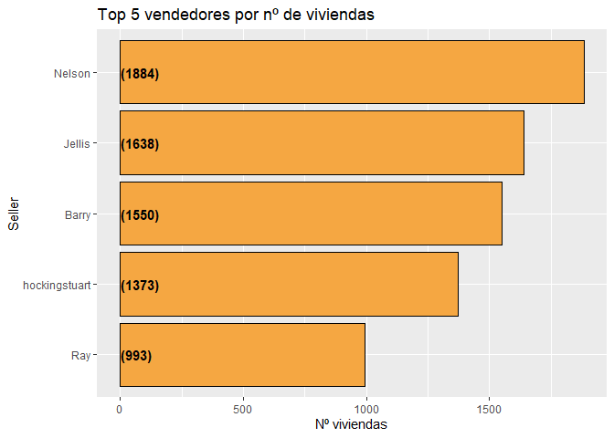<!-- -->

Por último, se va a representar (usando la librería leaflet) en un mapa donde se encuentran las viviendas vendidas por los 5 vendedores con más viviendas. Cada punto en el mapa es una vivienda (situada según sus valores de latitud y longitud) y cada color representa cada uno de los 5 vendedores. 


```r
Sellers = c(head(as.character(sellerData$SellerG),5))

SellersTop = housing %>% 
  filter(SellerG %in% Sellers)

center_lon = median(SellersTop$Longtitude)
center_lat = median(SellersTop$Lattitude)

pal <- colorFactor(
  palette = c('red', 'blue', 'green', 'purple', 'black'),
  domain = SellersTop$SellerG
)

leaflet(SellersTop) %>% addTiles() %>%
  addCircles(lng = ~Longtitude, lat = ~Lattitude,radius = 3,
             color = ~pal(SellerG))  %>%
  addLegend("bottomright", pal = pal, values = ~SellerG,
    title = "Distribución de viviendas Top 5 sellers",
    opacity = 1
  ) %>%
  # controls
  setView(lng=center_lon, lat=center_lat, zoom=10)
```

```{=html}
<div id="htmlwidget-884a0cc8773eff7c1526" style="width:672px;height:480px;" class="leaflet html-widget"></div>
<script type="application/json" data-for="htmlwidget-884a0cc8773eff7c1526">{"x":{"options":{"crs":{"crsClass":"L.CRS.EPSG3857","code":null,"proj4def":null,"projectedBounds":null,"options":{}}},"calls":[{"method":"addTiles","args":["//{s}.tile.openstreetmap.org/{z}/{x}/{y}.png",null,null,{"minZoom":0,"maxZoom":18,"tileSize":256,"subdomains":"abc","errorTileUrl":"","tms":false,"noWrap":false,"zoomOffset":0,"zoomReverse":false,"opacity":1,"zIndex":1,"detectRetina":false,"attribution":"&copy; <a href=\"http://openstreetmap.org\">OpenStreetMap<\/a> contributors, <a href=\"http://creativecommons.org/licenses/by-sa/2.0/\">CC-BY-SA<\/a>"}]},{"method":"addCircles","args":[[-37.8072,-37.8041,-37.8024,-37.806,-37.811,-37.8085,-37.809,-37.8056,-37.8078,-37.8017,-37.8078,-37.8005,-37.8055,-37.8016,-37.8022,-37.8021,-37.718,-37.7203,-37.7203,-37.7294,-37.7215,-37.7173,-37.7239,-37.7216,-37.7298,-37.7234,-37.7217,-37.7302,-37.7177,-37.7186,-37.7218,-37.7269,-37.7187,-37.7173,-37.7285,-37.7194,-37.7231,-37.72,-37.7226,-37.7184,-37.7202,-37.7181,-37.7263,-37.72,-37.8459,-37.8422,-37.8429,-37.8488,-37.7854,-37.7713,-37.775,-37.78,-37.7755,-37.7747,-37.7743,-37.7723,-37.7802,-37.7773,-37.7792,-37.7719,-37.8687,-37.8693,-37.8697,-37.8734,-37.871,-37.8579,-37.8659,-37.8658,-37.8676,-37.8608,-37.8674,-37.8583,-37.8653,-37.8351,-37.8337,-37.8327,-37.8382,-37.8318,-37.8543,-37.854,-37.8614,-37.8538,-37.8537,-37.8619,-37.8552,-37.8555,-37.858,-37.8638,-37.8528,-37.8564,-37.8619,-37.8605,-37.8574,-37.8614,-37.8613,-37.8537,-37.8558,-37.8571,-37.8531,-37.8646,-37.8542,-37.8509,-37.8573,-37.8604,-37.8593,-37.8593,-37.8618,-37.8574,-37.8542,-37.853,-37.8573,-37.8549,-37.8568,-37.8503,-37.7756,-37.7777,-37.7777,-37.7736,-37.775,-37.7776,-37.7748,-37.7756,-37.773,-37.7807,-37.7819,-37.7738,-37.7774,-37.7732,-37.7725,-37.7731,-37.781,-37.7737,-37.7821,-37.775,-37.7791,-37.7759,-37.78,-37.7727,-37.7778,-37.7713,-37.7786,-37.7744,-37.7766,-37.7779,-37.7774,-37.7778,-37.7731,-37.7769,-37.7727,-37.7778,-37.7778,-37.7825,-37.7807,-37.7766,-37.7775,-37.7765,-37.7767,-37.7767,-37.7768,-37.7738,-37.7772,-37.7774,-37.7756,-37.7756,-37.8673,-37.869,-37.8666,-37.8729,-37.8675,-37.8695,-37.8599,-37.8742,-37.8737,-37.8745,-37.8598,-37.8709,-37.8655,-37.8605,-37.8714,-37.8653,-37.8669,-37.8619,-37.872,-37.8711,-37.8664,-37.8694,-37.8662,-37.8711,-37.8621,-37.8709,-37.858,-37.8655,-37.8723,-37.77,-37.7706,-37.7654,-37.7593,-37.7545,-37.7605,-37.7591,-37.7721,-37.7532,-37.7623,-37.7664,-37.7681,-37.7686,-37.7697,-37.7691,-37.7642,-37.756,-37.7649,-37.7507,-37.7573,-37.7608,-37.7513,-37.7563,-37.7607,-37.7644,-37.7584,-37.7546,-37.8731,-37.8733,-37.8667,-37.8739,-37.8071,-37.8051,-37.8134,-37.8092,-37.8162,-37.8055,-37.814,-37.8032,-37.8144,-37.8125,-37.8125,-37.8122,-37.8152,-37.8068,-37.8036,-37.8044,-37.8025,-37.8039,-37.8135,-37.8095,-37.8147,-37.8054,-37.8131,-37.8164,-37.8039,-37.8161,-37.8056,-37.8161,-37.8028,-37.8167,-37.812,-37.8049,-37.7966,-37.7939,-37.8014,-37.7912,-37.7923,-37.7907,-37.7947,-37.7862,-37.7863,-37.804,-37.7898,-37.8021,-37.798,-37.784,-37.7982,-37.7851,-37.8025,-37.8007,-37.7843,-37.7981,-37.783,-37.7943,-37.8008,-37.8023,-37.794,-37.7928,-37.7898,-37.7951,-37.7964,-37.7988,-37.7885,-37.7908,-37.7945,-37.7976,-37.7968,-37.796,-37.7867,-37.7935,-37.8022,-37.7832,-37.7882,-37.7839,-37.786,-37.7961,-37.7895,-37.7975,-37.7908,-37.7985,-37.7998,-37.9165,-37.9273,-37.9336,-37.9204,-37.9272,-37.9232,-37.9155,-37.9172,-37.9269,-37.9278,-37.9134,-37.9199,-37.9344,-37.9291,-37.9279,-37.9245,-37.9132,-37.9274,-37.9149,-37.9256,-37.9326,-37.9326,-37.9187,-37.9228,-37.9256,-37.9152,-37.9287,-37.9257,-37.9173,-37.9215,-37.9224,-37.9246,-37.929,-37.9289,-37.9245,-37.9161,-37.9181,-37.9206,-37.9305,-37.9261,-37.9255,-37.9166,-37.9234,-37.9193,-37.9132,-37.9347,-37.914,-37.9358,-37.9232,-37.9069,-37.9309,-37.9082,-37.9126,-37.9245,-37.9239,-37.9343,-37.9196,-37.9173,-37.9228,-37.9252,-37.9073,-37.9244,-37.9144,-37.9269,-37.9369,-37.9272,-37.9079,-37.9178,-37.9146,-37.9179,-37.9324,-37.9233,-37.9138,-37.912,-37.9307,-37.9272,-37.9257,-37.9272,-37.9315,-37.9075,-37.9107,-37.9108,-37.9143,-37.9286,-37.9181,-37.9159,-37.9351,-37.908,-37.9291,-37.8151,-37.828,-37.8233,-37.8241,-37.8167,-37.8216,-37.8287,-37.8285,-37.8235,-37.818,-37.8261,-37.8248,-37.8264,-37.8246,-37.8253,-37.7824,-37.7839,-37.7865,-37.7815,-37.7934,-37.7908,-37.7948,-37.7775,-37.7761,-37.7885,-37.7844,-37.8954,-37.9119,-37.899,-37.9206,-37.9011,-37.9181,-37.9164,-37.909,-37.896,-37.91,-37.9205,-37.9162,-37.9077,-37.9195,-37.9179,-37.9271,-37.932,-37.9269,-37.9102,-37.9075,-37.9089,-37.91,-37.9184,-37.9124,-37.9241,-37.9164,-37.7676,-37.7713,-37.7624,-37.7637,-37.7611,-37.7695,-37.7575,-37.7608,-37.7661,-37.7759,-37.7772,-37.7742,-37.7742,-37.7588,-37.7653,-37.777,-37.7634,-37.7637,-37.7604,-37.7611,-37.7701,-37.7622,-37.7642,-37.7581,-37.7705,-37.7723,-37.757,-37.7619,-37.7702,-37.7631,-37.7636,-37.7717,-37.7672,-37.7758,-37.7597,-37.758,-37.7704,-37.7727,-37.7676,-37.7769,-37.7617,-37.7573,-37.756,-37.7611,-37.7769,-37.7728,-37.7722,-37.7597,-37.7566,-37.7572,-37.7581,-37.7746,-37.7642,-37.773,-37.7776,-37.7788,-37.7572,-37.7634,-37.7702,-37.762,-37.7661,-37.769,-37.7597,-37.7653,-37.773,-37.7767,-37.7704,-37.7598,-37.7653,-37.7671,-37.7722,-37.7626,-37.7602,-37.7587,-37.7563,-37.7769,-37.7657,-37.758,-37.7603,-37.7632,-37.7625,-37.773,-37.7775,-37.77,-37.7621,-37.7744,-37.7687,-37.7766,-37.7634,-37.7737,-37.763,-37.7725,-37.7589,-37.7611,-37.7763,-37.7649,-37.7738,-37.7741,-37.7554,-37.7738,-37.7687,-37.7706,-37.7639,-37.7775,-37.759,-37.7719,-37.7745,-37.7629,-37.7643,-37.775,-37.7656,-37.7514,-37.7564,-37.7665,-37.769,-37.764,-37.7659,-37.7607,-37.763,-37.7528,-37.7582,-37.7519,-37.7727,-37.753,-37.7618,-37.764,-37.7618,-37.7613,-37.7676,-37.7728,-37.772,-37.7619,-37.7694,-37.7646,-37.7688,-37.7524,-37.7661,-37.7733,-37.7752,-37.7576,-37.7741,-37.7575,-37.7715,-37.7606,-37.7659,-37.7628,-37.7764,-37.7604,-37.7686,-37.7543,-37.7652,-37.7747,-37.7614,-37.7747,-37.766,-37.7643,-37.7577,-37.7552,-37.7538,-37.7599,-37.7608,-37.7628,-37.7657,-37.7695,-37.7695,-37.7683,-37.7683,-37.7729,-37.7778,-37.7689,-37.7582,-37.779,-37.7724,-37.7607,-37.778,-37.7606,-37.7733,-37.7644,-37.7679,-37.7621,-37.7792,-37.7615,-37.7711,-37.7698,-37.765,-37.7689,-37.7771,-37.7786,-37.7798,-37.7674,-37.7743,-37.7569,-37.7624,-37.7679,-37.7781,-37.7762,-37.7712,-37.848,-37.8538,-37.8516,-37.8473,-37.8494,-37.8561,-37.8525,-37.8528,-37.856,-37.8542,-37.8445,-37.8484,-37.8463,-37.8597,-37.8593,-37.8554,-37.8286,-37.8231,-37.842,-37.8448,-37.8457,-37.8431,-37.8493,-37.8237,-37.8452,-37.8459,-37.8439,-37.8255,-37.836,-37.8438,-37.8442,-37.8405,-37.8489,-37.847,-37.8238,-37.8447,-37.8437,-37.8439,-37.8362,-37.8328,-37.8336,-37.8406,-37.8441,-37.8458,-37.8295,-37.8292,-37.8181,-37.8326,-37.8317,-37.8323,-37.8205,-37.8252,-37.8227,-37.826,-37.8184,-37.8207,-37.8213,-37.8273,-37.7871,-37.7821,-37.7893,-37.7844,-37.7824,-37.784,-37.7852,-37.786,-37.7816,-37.7851,-37.7847,-37.7904,-37.7805,-37.7885,-37.786,-37.7888,-37.7879,-37.7879,-37.7911,-37.7804,-37.7846,-37.7798,-37.7828,-37.7813,-37.7902,-37.897,-37.8876,-37.8877,-37.8875,-37.8957,-37.9003,-37.8863,-37.8934,-37.8893,-37.8858,-37.8982,-37.8973,-37.889,-37.8888,-37.8988,-37.8971,-37.8982,-37.8982,-37.8881,-37.8909,-37.8936,-37.8925,-37.892,-37.9,-37.8856,-37.8955,-37.8905,-37.8873,-37.8934,-37.9031,-37.8864,-37.8889,-37.8978,-37.8854,-37.8894,-37.9023,-37.8873,-37.8927,-37.8978,-37.8993,-37.9011,-37.8868,-37.891,-37.8869,-37.8936,-37.886,-37.8887,-37.8894,-37.8866,-37.8694,-37.8694,-37.8744,-37.8625,-37.8896,-37.8874,-37.895,-37.8912,-37.8993,-37.8974,-37.8923,-37.8901,-37.8891,-37.8936,-37.9027,-37.9012,-37.8996,-37.8891,-37.8792,-37.8859,-37.8738,-37.8781,-37.7902,-37.7899,-37.7928,-37.7919,-37.7918,-37.7924,-37.7912,-37.7917,-37.787,-37.7882,-37.7923,-37.7892,-37.7936,-37.7884,-37.7898,-37.7946,-37.7931,-37.7885,-37.7925,-37.7921,-37.7427,-37.7391,-37.7456,-37.7546,-37.7374,-37.7494,-37.7493,-37.7549,-37.7358,-37.744,-37.7555,-37.7508,-37.7429,-37.7432,-37.7405,-37.7546,-37.7527,-37.7546,-37.7359,-37.7478,-37.7466,-37.7544,-37.7405,-37.7403,-37.7433,-37.7376,-37.7523,-37.7402,-37.7427,-37.7484,-37.75,-37.7529,-37.7367,-37.7458,-37.7501,-37.7516,-37.7431,-37.7477,-37.7493,-37.7436,-37.7471,-37.7464,-37.7435,-37.7379,-37.735,-37.7459,-37.7537,-37.7505,-37.7474,-37.7509,-37.7494,-37.7408,-37.7382,-37.7535,-37.7474,-37.747,-37.7477,-37.7519,-37.7454,-37.7434,-37.7388,-37.743,-37.7493,-37.74,-37.7461,-37.7369,-37.7489,-37.7531,-37.7463,-37.7534,-37.7493,-37.7424,-37.7384,-37.7443,-37.7363,-37.7517,-37.7246,-37.7305,-37.7308,-37.7303,-37.7283,-37.7201,-37.7271,-37.721,-37.7205,-37.7307,-37.7266,-37.7269,-37.7197,-37.7276,-37.7215,-37.728,-37.7305,-37.7295,-37.7308,-37.7297,-37.734,-37.7302,-37.7263,-37.7284,-37.7351,-37.7242,-37.7236,-37.7307,-37.7968,-37.8042,-37.8042,-37.7962,-37.7969,-37.7969,-37.8083,-37.8035,-37.8035,-37.802,-37.7948,-37.8032,-37.8006,-37.8042,-37.7953,-37.796,-37.7961,-37.7985,-37.7948,-37.8037,-37.8035,-37.7964,-37.7968,-37.7976,-37.8019,-37.7954,-37.8042,-37.8046,-37.8035,-37.8026,-37.8046,-37.8035,-37.7779,-37.7887,-37.7942,-37.7891,-37.7915,-37.7912,-37.7791,-37.7827,-37.7722,-37.781,-37.7862,-37.794,-37.7869,-37.7798,-37.7815,-37.7929,-37.7772,-37.7912,-37.778,-37.7752,-37.7808,-37.782,-37.7955,-37.7776,-37.7738,-37.7946,-37.7939,-37.79,-37.7826,-37.7743,-37.7915,-37.7807,-37.7863,-37.7892,-37.7816,-37.792,-37.7813,-37.7848,-37.7827,-37.7903,-37.7927,-37.7887,-37.7856,-37.7798,-37.7863,-37.7753,-37.7882,-37.7934,-37.7932,-37.7881,-37.7739,-37.7809,-37.7954,-37.7933,-37.7945,-37.7901,-37.7932,-37.7749,-37.7794,-37.7781,-37.7774,-37.7942,-37.7674,-37.7666,-37.7612,-37.765,-37.7652,-37.8852,-37.8904,-37.8831,-37.8749,-37.8725,-37.881,-37.8831,-37.8831,-37.8843,-37.8716,-37.8751,-37.8749,-37.8715,-37.8798,-37.8839,-37.8842,-37.8768,-37.8753,-37.7585,-37.7418,-37.7575,-37.7505,-37.7578,-37.7587,-37.7562,-37.7495,-37.7491,-37.758,-37.7544,-37.7558,-37.7493,-37.7528,-37.7502,-37.7406,-37.7534,-37.7543,-37.7491,-37.7504,-37.7531,-37.7527,-37.7502,-37.7462,-37.7499,-37.7508,-37.7415,-37.7484,-37.7551,-37.7547,-37.7527,-37.7418,-37.7403,-37.7545,-37.7545,-37.7486,-37.7421,-37.7465,-37.7515,-37.7523,-37.7468,-37.7543,-37.7534,-37.7445,-37.7555,-37.7442,-37.7571,-37.7547,-37.746,-37.7503,-37.7426,-37.7432,-37.7548,-37.755,-37.7461,-37.7497,-37.7441,-37.7442,-37.7393,-37.7554,-37.7494,-37.7465,-37.7523,-37.7565,-37.7461,-37.7534,-37.7412,-37.7401,-37.7457,-37.7452,-37.7585,-37.7417,-37.7525,-37.754,-37.7475,-37.7579,-37.7399,-37.7543,-37.7548,-37.7541,-37.7453,-37.7442,-37.7466,-37.752,-37.757,-37.7542,-37.7482,-37.7489,-37.7428,-37.7401,-37.7389,-37.7379,-37.7433,-37.7364,-37.7371,-37.7374,-37.7723,-37.7788,-37.7698,-37.7689,-37.7735,-37.7755,-37.7845,-37.7719,-37.7782,-37.7818,-37.7749,-37.7728,-37.7781,-37.7674,-37.7728,-37.7671,-37.774,-37.7713,-37.7845,-37.7732,-37.7772,-37.7941,-37.8029,-37.7941,-37.7988,-37.8019,-37.8006,-37.7951,-37.7953,-37.795,-37.8003,-37.7966,-37.8032,-37.7946,-37.7999,-37.799,-37.7974,-37.8004,-37.803,-37.8005,-37.7967,-37.7968,-37.8035,-37.7941,-37.7967,-37.7964,-37.7953,-37.8024,-37.7999,-37.7898,-37.791,-37.7797,-37.7903,-37.7851,-37.7925,-37.7754,-37.7835,-37.7892,-37.7835,-37.7829,-37.7749,-37.791,-37.7786,-37.786,-37.7815,-37.7887,-37.7829,-37.7813,-37.7739,-37.782,-37.7918,-37.7855,-37.7823,-37.7923,-37.7852,-37.782,-37.7848,-37.7851,-37.7786,-37.788,-37.7834,-37.7828,-37.7846,-37.776,-37.7835,-37.7836,-37.7794,-37.777,-37.7824,-37.7839,-37.7835,-37.7839,-37.7825,-37.7852,-37.7856,-37.7857,-37.7861,-37.7839,-37.7867,-37.7826,-37.7849,-37.7849,-37.7869,-37.7853,-37.7837,-37.7854,-37.7838,-37.7826,-37.7857,-37.7847,-37.7866,-37.788,-37.7857,-37.7823,-37.783,-37.7955,-37.7943,-37.7959,-37.7949,-37.7923,-37.8016,-37.8025,-37.7952,-37.7943,-37.7939,-37.854,-37.8573,-37.853,-37.8599,-37.8543,-37.8646,-37.8552,-37.8567,-37.8501,-37.8602,-37.8556,-37.8526,-37.8579,-37.8597,-37.8526,-37.8571,-37.8576,-37.8567,-37.8479,-37.8627,-37.8541,-37.8505,-37.8628,-37.8528,-37.8559,-37.8517,-37.8566,-37.8574,-37.8547,-37.8627,-37.8577,-37.8588,-37.8561,-37.8581,-37.8488,-37.8542,-37.8468,-37.8464,-37.8572,-37.8538,-37.8555,-37.8531,-37.8592,-37.8478,-37.8497,-37.8547,-37.8529,-37.8578,-37.6972,-37.7088,-37.6988,-37.7095,-37.7088,-37.7126,-37.7082,-37.6978,-37.6953,-37.6999,-37.6993,-37.7112,-37.706,-37.708,-37.711,-37.7071,-37.7022,-37.7042,-37.7053,-37.6955,-37.7098,-37.7002,-37.6997,-37.7111,-37.7009,-37.6977,-37.695,-37.7067,-37.7004,-37.7063,-37.6967,-37.7047,-37.6952,-37.7019,-37.6972,-37.6969,-37.709,-37.7068,-37.7071,-37.709,-37.7087,-37.705,-37.7016,-37.7089,-37.7076,-37.7091,-37.7062,-37.7016,-37.711,-37.7127,-37.7114,-37.7056,-37.7106,-37.7077,-37.7133,-37.7083,-37.7099,-37.7096,-37.707,-37.709,-37.7074,-37.9355,-37.9419,-37.9389,-37.9338,-37.9361,-37.9389,-37.9437,-37.9395,-37.9429,-37.9442,-37.9393,-37.9371,-37.9429,-37.9364,-37.9448,-37.9446,-37.9372,-37.9336,-37.9382,-37.9446,-37.9386,-37.9431,-37.8344,-37.8332,-37.8183,-37.8157,-37.8263,-37.816,-37.8299,-37.8153,-37.8155,-37.8258,-37.8248,-37.8272,-37.8143,-37.8173,-37.8213,-37.8276,-37.8192,-37.8281,-37.8258,-37.8343,-37.8251,-37.8165,-37.8314,-37.8299,-37.8128,-37.8268,-37.814,-37.8261,-37.8202,-37.8257,-37.8271,-37.8268,-37.8153,-37.8169,-37.8268,-37.824,-37.8268,-37.8185,-37.8184,-37.8235,-37.8249,-37.8177,-37.8287,-37.8176,-37.813,-37.8202,-37.8183,-37.8172,-37.8249,-37.8169,-37.818,-37.8305,-37.8171,-37.8219,-37.813,-37.8159,-37.8213,-37.8264,-37.8216,-37.8224,-37.8186,-37.7375,-37.7494,-37.7375,-37.7427,-37.7505,-37.7428,-37.7477,-37.7376,-37.7449,-37.7418,-37.7487,-37.7483,-37.7421,-37.747,-37.7389,-37.7333,-37.7428,-37.7432,-37.7354,-37.737,-37.7357,-37.7359,-37.747,-37.7446,-37.7405,-37.7344,-37.7386,-37.7356,-37.7441,-37.7389,-37.7341,-37.7386,-37.7469,-37.7443,-37.739,-37.738,-37.7471,-37.747,-37.7344,-37.7454,-37.7418,-37.7343,-37.7383,-37.7411,-37.7403,-37.7399,-37.739,-37.8967,-37.8994,-37.8909,-37.9072,-37.8966,-37.8988,-37.9002,-37.9054,-37.8991,-37.8945,-37.9014,-37.9034,-37.9084,-37.7662,-37.7641,-37.76,-37.7727,-37.766,-37.7773,-37.7726,-37.7712,-37.7591,-37.7634,-37.7702,-37.7616,-37.7744,-37.7671,-37.7634,-37.765,-37.7591,-37.7784,-37.7634,-37.7645,-37.7587,-37.7618,-37.758,-37.7771,-37.7753,-37.7661,-37.757,-37.7582,-37.7694,-37.7638,-37.7311,-37.7359,-37.7402,-37.7441,-37.7325,-37.7424,-37.7455,-37.7506,-37.738,-37.7514,-37.7482,-37.7411,-37.7465,-37.747,-37.7295,-37.7504,-37.7435,-37.7293,-37.7467,-37.7338,-37.7359,-37.7459,-37.7384,-37.7453,-37.7301,-37.7337,-37.748,-37.7502,-37.7426,-37.7504,-37.7452,-37.7517,-37.749,-37.7361,-37.748,-37.7505,-37.7311,-37.734,-37.7346,-37.7428,-37.7423,-37.7378,-37.742,-37.7381,-37.7362,-37.7303,-37.7483,-37.7305,-37.7444,-37.7432,-37.7312,-37.7486,-37.7449,-37.7415,-37.7479,-37.7906,-37.7929,-37.7963,-37.7957,-37.7886,-37.7907,-37.7914,-37.7899,-37.7925,-37.7959,-37.7938,-37.7923,-37.7893,-37.7954,-37.7976,-37.7922,-37.7896,-37.7941,-37.7893,-37.7913,-37.7934,-37.792,-37.7926,-37.7907,-37.7919,-37.7903,-37.7896,-37.793,-37.7899,-37.7925,-37.7921,-37.7959,-37.7935,-37.8102,-37.812,-37.804,-37.8024,-37.8093,-37.8034,-37.802,-37.8046,-37.8012,-37.8092,-37.8095,-37.8081,-37.8023,-37.8017,-37.8128,-37.8029,-37.8071,-37.8034,-37.805,-37.8007,-37.7925,-37.8094,-37.8047,-37.8148,-37.7995,-37.8036,-37.7997,-37.8098,-37.804,-37.8033,-37.7993,-37.8135,-37.8053,-37.8006,-37.7925,-37.8034,-37.8067,-37.8044,-37.8024,-37.7938,-37.8046,-37.801,-37.7944,-37.8027,-37.8065,-37.7982,-37.8087,-37.8042,-37.8064,-37.7915,-37.7916,-37.8126,-37.7978,-37.8074,-37.7999,-37.7971,-37.7955,-37.7923,-37.7969,-37.789,-37.7916,-37.7894,-37.7922,-37.7956,-37.7951,-37.7881,-37.7981,-37.7997,-37.7974,-37.7904,-37.793,-37.7938,-37.7981,-37.8407,-37.7885,-37.7859,-37.7905,-37.7795,-37.781,-37.7784,-37.7795,-37.787,-37.8597,-37.8607,-37.8493,-37.8515,-37.8562,-37.8636,-37.8644,-37.8537,-37.8502,-37.8462,-37.8633,-37.8511,-37.858,-37.8684,-37.8549,-37.8638,-37.8514,-37.8563,-37.8633,-37.8603,-37.8757,-37.8786,-37.8717,-37.8742,-37.866,-37.8708,-37.8747,-37.8826,-37.8782,-37.8707,-37.8801,-37.8835,-37.8812,-37.8822,-37.8823,-37.8769,-37.8654,-37.8689,-37.865,-37.8718,-37.8834,-37.8811,-37.8695,-37.8805,-37.8728,-37.8846,-37.8704,-37.866,-37.8804,-37.878,-37.8847,-37.8752,-37.8846,-37.8828,-37.774,-37.7865,-37.7707,-37.7861,-37.7859,-37.7662,-37.7697,-37.7648,-37.7752,-37.7681,-37.7682,-37.7732,-37.773,-37.772,-37.7848,-37.8095,-37.8474,-37.82,-37.8145,-37.8167,-37.8226,-37.8172,-37.8195,-37.8161,-37.8186,-37.8147,-37.8192,-37.8173,-37.8161,-37.7672,-37.7688,-37.7677,-37.77,-37.7696,-37.7698,-37.7692,-37.7617,-37.761,-37.7659,-37.7702,-37.7709,-37.7701,-37.7672,-37.7632,-37.7696,-37.77,-37.7674,-37.7639,-37.7695,-37.7708,-37.7701,-37.7609,-37.7615,-37.7696,-37.7685,-37.7686,-37.7704,-37.7709,-37.7625,-37.7702,-37.7609,-37.7682,-37.7595,-37.7615,-37.7715,-37.7608,-37.7649,-37.7607,-37.7639,-37.7654,-37.761,-37.7631,-37.7609,-37.7682,-37.758,-37.7692,-37.7666,-37.7677,-37.7685,-37.7702,-37.7687,-37.7693,-37.7651,-37.7627,-37.7641,-37.7708,-37.9374,-37.9449,-37.9412,-37.9385,-37.9363,-37.9431,-37.939,-37.9429,-37.9387,-37.9389,-37.9392,-37.9428,-37.8466,-37.8394,-37.742,-37.7423,-37.7465,-37.7413,-37.7387,-37.7462,-37.7452,-37.7377,-37.7343,-37.7449,-37.7379,-37.7479,-37.7424,-37.7321,-37.7445,-37.7412,-37.7317,-37.7391,-37.7444,-37.734,-37.7324,-37.7389,-37.7357,-37.7378,-37.736,-37.738,-37.7352,-37.7383,-37.7328,-37.7459,-37.7433,-37.7396,-37.741,-37.736,-37.7465,-37.7958,-37.7967,-37.8044,-37.7994,-37.7936,-37.8018,-37.7953,-37.8055,-37.802,-37.7955,-37.8016,-37.8014,-37.8,-37.804,-37.7976,-37.8016,-37.8004,-37.8022,-37.802,-37.7977,-37.8004,-37.8029,-37.795,-37.8043,-37.7959,-37.7997,-37.8014,-37.7926,-37.7971,-37.8039,-37.802,-37.8044,-37.7759,-37.7708,-37.7805,-37.7744,-37.7709,-37.7683,-37.7672,-37.7813,-37.7793,-37.768,-37.766,-37.7627,-37.7807,-37.7765,-37.7731,-37.763,-37.7687,-37.7765,-37.763,-37.7842,-37.7739,-37.7741,-37.7709,-37.7732,-37.7681,-37.7626,-37.7652,-37.7707,-37.7827,-37.7663,-37.7726,-37.7784,-37.7709,-37.7756,-37.771,-37.7784,-37.7813,-37.7752,-37.7667,-37.7638,-37.7684,-37.7642,-37.7792,-37.7801,-37.7763,-37.7745,-37.7648,-37.7711,-37.7793,-37.7762,-37.7715,-37.7666,-37.7736,-37.7642,-37.7814,-37.77,-37.7653,-37.7641,-37.7673,-37.7815,-37.7644,-37.7821,-37.7635,-37.764,-37.772,-37.777,-37.7668,-37.7663,-37.7833,-37.7636,-37.774,-37.7701,-37.7757,-37.7771,-37.7831,-37.7662,-37.7762,-37.7677,-37.7763,-37.7839,-37.7642,-37.7789,-37.7665,-37.7784,-37.7671,-37.7767,-37.7741,-37.7825,-37.7825,-37.718,-37.7137,-37.7151,-37.7168,-37.7207,-37.7232,-37.722,-37.722,-37.7187,-37.7143,-37.7209,-37.9348,-37.9248,-37.9355,-37.9366,-37.9245,-37.9215,-37.9377,-37.918,-37.9213,-37.9112,-37.7767,-37.7818,-37.7864,-37.7864,-37.7823,-37.7931,-37.7852,-37.7944,-37.7829,-37.7821,-37.7818,-37.7818,-37.7829,-37.7813,-37.7156,-37.7234,-37.7308,-37.731,-37.7236,-37.718,-37.7269,-37.7291,-37.7286,-37.7282,-37.7311,-37.7262,-37.7328,-37.7337,-37.7207,-37.7283,-37.7182,-37.717,-37.717,-37.7223,-37.7184,-37.7295,-37.7282,-37.7305,-37.7282,-37.7174,-37.7319,-37.7195,-37.7214,-37.7256,-37.7242,-37.7186,-37.7211,-37.724,-37.7253,-37.7268,-37.7326,-37.721,-37.7283,-37.7286,-37.7231,-37.7333,-37.7304,-37.7182,-37.7271,-37.7346,-37.7257,-37.7161,-37.7168,-37.7304,-37.7215,-37.8399,-37.8415,-37.8329,-37.8352,-37.8346,-37.8407,-37.8405,-37.8407,-37.8405,-37.8371,-37.8486,-37.8503,-37.8519,-37.851,-37.8527,-37.847,-37.8496,-37.8595,-37.851,-37.8531,-37.8561,-37.8467,-37.851,-37.8559,-37.8525,-37.851,-37.8543,-37.847,-37.8588,-37.8592,-37.8498,-37.8518,-37.8481,-37.8577,-37.8513,-37.8493,-37.8479,-37.8553,-37.8517,-37.8478,-37.8519,-37.8494,-37.7332,-37.7369,-37.7416,-37.7346,-37.7418,-37.7471,-37.7428,-37.7311,-37.7339,-37.7343,-37.7309,-37.7508,-37.7318,-37.7331,-37.7322,-37.733,-37.7384,-37.7333,-37.7373,-37.7418,-37.7411,-37.7339,-37.7441,-37.7441,-37.7359,-37.7339,-37.7379,-37.737,-37.7442,-37.7367,-37.7389,-37.7413,-37.7314,-37.7381,-37.7485,-37.7307,-37.7344,-37.7293,-37.739,-37.7355,-37.7444,-37.7396,-37.7353,-37.7352,-37.7395,-37.7365,-37.7484,-37.7396,-37.7514,-37.7512,-37.7359,-37.7361,-37.751,-37.7306,-37.7462,-37.7386,-37.7497,-37.7372,-37.7366,-37.7414,-37.7314,-37.7468,-37.7345,-37.7491,-37.7347,-37.7377,-37.733,-37.7495,-37.7445,-37.7307,-37.7358,-37.7351,-37.7287,-37.7443,-37.7413,-37.738,-37.7336,-37.7486,-37.7525,-37.7353,-37.7379,-37.7455,-37.7484,-37.7427,-37.7367,-37.7451,-37.7354,-37.7476,-37.7456,-37.7441,-37.74,-37.7531,-37.7388,-37.7427,-37.7476,-37.7366,-37.7331,-37.7521,-37.7423,-37.7415,-37.7481,-37.7348,-37.7337,-37.7362,-37.7371,-37.7361,-37.7369,-37.7344,-37.7406,-37.7506,-37.7441,-37.7436,-37.7418,-37.7486,-37.7345,-37.7444,-37.7507,-37.743,-37.7302,-37.7395,-37.7479,-37.75,-37.732,-37.7019,-37.708,-37.7292,-37.7101,-37.7299,-37.7139,-37.7021,-37.7262,-37.713,-37.7286,-37.7183,-37.7279,-37.702,-37.7182,-37.7276,-37.7093,-37.6946,-37.705,-37.7152,-37.7273,-37.711,-37.7293,-37.721,-37.7025,-37.7226,-37.7132,-37.7099,-37.6926,-37.7271,-37.7288,-37.7283,-37.711,-37.7304,-37.7262,-37.726,-37.7154,-37.7172,-37.718,-37.7177,-37.719,-37.7036,-37.702,-37.7108,-37.709,-37.7099,-37.7059,-37.7205,-37.7199,-37.7272,-37.721,-37.7285,-37.7126,-37.7125,-37.7293,-37.7196,-37.7009,-37.71,-37.7091,-37.7257,-37.7223,-37.7107,-37.7171,-37.6945,-37.7139,-37.7246,-37.7034,-37.6957,-37.7249,-37.7231,-37.7239,-37.7064,-37.703,-37.7293,-37.7327,-37.7327,-37.728,-37.7092,-37.7176,-37.7094,-37.7261,-37.6974,-37.7033,-37.7134,-37.7092,-37.7214,-37.709,-37.7255,-37.7064,-37.7104,-37.7093,-37.6983,-37.7141,-37.7283,-37.7261,-37.7184,-37.7156,-37.7295,-37.7086,-37.7038,-37.704,-37.7245,-37.6989,-37.7247,-37.7285,-37.7277,-37.7152,-37.7303,-37.7113,-37.7066,-37.7149,-37.7007,-37.7027,-37.7024,-37.692,-37.6981,-37.7076,-37.7022,-37.7053,-37.7098,-37.7276,-37.7108,-37.7238,-37.7186,-37.7229,-37.7061,-37.7097,-37.7098,-37.7217,-37.7271,-37.7001,-37.7104,-37.7208,-37.7211,-37.7243,-37.726,-37.6961,-37.7195,-37.705,-37.7313,-37.7164,-37.719,-37.7106,-37.7218,-37.7021,-37.7208,-37.7217,-37.7195,-37.7106,-37.7156,-37.6984,-37.7089,-37.7013,-37.7265,-37.7264,-37.7101,-37.7263,-37.7306,-37.7115,-37.7285,-37.7219,-37.7146,-37.7175,-37.7129,-37.704,-37.7099,-37.7012,-37.7192,-37.7103,-37.7173,-37.7207,-37.697,-37.7291,-37.7243,-37.8206,-37.8164,-37.8163,-37.8244,-37.8157,-37.8258,-37.8126,-37.8174,-37.8193,-37.8235,-37.815,-37.817,-37.8215,-37.8198,-37.8187,-37.8127,-37.8285,-37.8116,-37.8201,-37.8333,-37.815,-37.8198,-37.8214,-37.8231,-37.8193,-37.8209,-37.8251,-37.814,-37.8171,-37.8331,-37.8173,-37.8225,-37.8214,-37.8215,-37.823,-37.814,-37.8292,-37.8126,-37.8259,-37.8234,-37.8246,-37.8203,-37.8134,-37.8232,-37.813,-37.8246,-37.82,-37.8145,-37.8132,-37.8225,-37.8201,-37.8244,-37.8218,-37.8166,-37.8215,-37.8242,-37.8203,-37.8248,-37.8208,-37.8214,-37.8217,-37.8212,-37.8148,-37.8194,-37.8229,-37.8214,-37.8278,-37.823,-37.8263,-37.8155,-37.8198,-37.822,-37.822,-37.8183,-37.8128,-37.8211,-37.8185,-37.8198,-37.8202,-37.8199,-37.7395,-37.747,-37.7367,-37.7338,-37.7377,-37.7437,-37.7449,-37.7312,-37.7362,-37.7472,-37.7347,-37.7352,-37.7352,-37.7388,-37.7393,-37.7458,-37.7433,-37.8032,-37.8374,-37.8369,-37.8346,-37.8369,-37.8351,-37.8393,-37.8361,-37.8393,-37.8372,-37.837,-37.8374,-37.8361,-37.8357,-37.8338,-37.8439,-37.8394,-37.8368,-37.8334,-37.8426,-37.8361,-37.8314,-37.8421,-37.8405,-37.8404,-37.8359,-37.8415,-37.8332,-37.8375,-37.8403,-37.8407,-37.8437,-37.8374,-37.8406,-37.844,-37.8336,-37.8472,-37.8458,-37.8437,-37.8432,-37.8355,-37.8442,-37.8328,-37.8368,-37.8356,-37.8374,-37.8395,-37.8395,-37.8406,-37.8446,-37.8319,-37.8427,-37.8418,-37.838,-37.8323,-37.8361,-37.8361,-37.8436,-37.8337,-37.8414,-37.845,-37.835,-37.8425,-37.8406,-37.8342,-37.8267,-37.8227,-37.8299,-37.8272,-37.829,-37.8679,-37.8715,-37.8573,-37.861,-37.861,-37.8722,-37.8614,-37.8579,-37.8599,-37.8653,-37.8659,-37.8642,-37.8638,-37.8706,-37.8641,-37.8722,-37.8612,-37.8654,-37.8629,-37.8677,-37.7346,-37.7436,-37.7386,-37.7337,-37.7261,-37.7217,-37.7376,-37.7302,-37.7319,-37.7245,-37.736,-37.7303,-37.7373,-37.7225,-37.7416,-37.735,-37.7234,-37.7225,-37.7373,-37.7809,-37.7853,-37.7878,-37.7933,-37.7796,-37.7895,-37.7793,-37.7795,-37.7912,-37.7877,-37.8005,-37.7952,-37.7919,-37.7893,-37.7881,-37.7969,-37.7856,-37.7982,-37.7925,-37.7694,-37.7683,-37.758,-37.7751,-37.774,-37.7651,-37.7661,-37.7675,-37.7683,-37.7652,-37.7706,-37.7704,-37.757,-37.8004,-37.7952,-37.7906,-37.786,-37.7891,-37.7981,-37.7968,-37.7942,-37.7897,-37.7904,-37.7871,-37.7928,-37.7913,-37.7836,-37.7902,-37.8003,-37.7892,-37.7914,-37.7894,-37.7886,-37.7843,-37.8018,-37.7963,-37.7904,-37.8004,-37.8023,-37.7912,-37.7913,-37.8356,-37.8327,-37.8322,-37.8181,-37.8286,-37.8287,-37.8346,-37.8203,-37.8317,-37.8339,-37.8255,-37.8234,-37.8291,-37.8188,-37.8286,-37.819,-37.8361,-37.8312,-37.8308,-37.8138,-37.8173,-37.8165,-37.8302,-37.8365,-37.8324,-37.8264,-37.8204,-37.8294,-37.8171,-37.8176,-37.7642,-37.7647,-37.7601,-37.7597,-37.7602,-37.7694,-37.7733,-37.76,-37.7573,-37.767,-37.764,-37.7658,-37.7694,-37.7644,-37.7637,-37.773,-37.7692,-37.7646,-37.7696,-37.768,-37.7564,-37.77,-37.7569,-37.7567,-37.7629,-37.764,-37.7549,-37.7639,-37.77,-37.7613,-37.7611,-37.7656,-37.7698,-37.7705,-37.7617,-37.7625,-37.7683,-37.7564,-37.7668,-37.7726,-37.7647,-37.7764,-37.7557,-37.7699,-37.7629,-37.7714,-37.7701,-37.7591,-37.7561,-37.7634,-37.7536,-37.7631,-37.7581,-37.7585,-37.7611,-37.7564,-37.763,-37.763,-37.7633,-37.7542,-37.7564,-37.7515,-37.7569,-37.7551,-37.7583,-37.759,-37.7574,-37.7595,-37.7591,-37.7595,-37.752,-37.7604,-37.7602,-37.7582,-37.7591,-37.7524,-37.7633,-37.7588,-37.7592,-37.7576,-37.7607,-37.7641,-37.7516,-37.7585,-37.7612,-37.7598,-37.7617,-37.7588,-37.761,-37.7614,-37.7549,-37.7566,-37.7569,-37.7609,-37.7611,-37.7595,-37.7587,-37.7544,-37.7584,-37.7634,-37.7602,-37.7556,-37.7529,-37.7565,-37.7569,-37.8486,-37.8498,-37.8424,-37.8366,-37.8392,-37.8338,-37.8428,-37.842,-37.8373,-37.8428,-37.844,-37.8373,-37.8512,-37.8371,-37.8464,-37.8398,-37.8373,-37.8424,-37.7405,-37.7328,-37.7376,-37.7324,-37.7396,-37.7346,-37.7321,-37.7378,-37.7343,-37.7397,-37.7375,-37.7148,-37.7114,-37.7166,-37.7153,-37.7094,-37.7147,-37.7125,-37.7023,-37.7112,-37.7084,-37.7165,-37.7112,-37.7065,-37.7161,-37.8048,-37.8076,-37.8094,-37.8076,-37.8118,-37.8094,-37.806,-37.8067,-37.8076,-37.8091,-37.855,-37.8517,-37.8558,-37.8581,-37.8552,-37.8584,-37.8555,-37.8518,-37.8526,-37.8563,-37.8556,-37.8554,-37.8533,-37.8554,-37.8522,-37.7251,-37.7198,-37.7233,-37.7279,-37.7305,-37.7218,-37.731,-37.728,-37.7195,-37.7214,-37.7303,-37.8209,-37.8156,-37.8128,-37.8129,-37.8173,-37.8134,-37.8196,-37.8222,-37.815,-37.8146,-37.8202,-37.8195,-37.8191,-37.8131,-37.7561,-37.7589,-37.7614,-37.7591,-37.7637,-37.7642,-37.7614,-37.7632,-37.7587,-37.7626,-37.759,-37.7559,-37.7614,-37.7606,-37.7584,-37.7553,-37.7548,-37.7609,-37.752,-37.7509,-37.7534,-37.7506,-37.7504,-37.7518,-37.7516,-37.7638,-37.7668,-37.7753,-37.7663,-37.7643,-37.7658,-37.7762,-37.7776,-37.7749,-37.7667,-37.7717,-37.7656,-37.7776,-37.7772,-37.7769,-37.7724,-37.7755,-37.765,-37.7671,-37.7721,-37.7788,-37.7776,-37.7739,-37.7722,-37.7729,-37.7723,-37.774,-37.7759,-37.7729,-37.7685,-37.7689,-37.7673,-37.7684,-37.7679,-37.765,-37.7603,-37.7736,-37.7713,-37.7732,-37.7655,-37.8285,-37.8283,-37.8287,-37.8289,-37.7992,-37.8009,-37.8009,-37.793,-37.8049,-37.8009,-37.7939,-37.7988,-37.7945,-37.7989,-37.8052,-37.7984,-37.7965,-37.7929,-37.7945,-37.7998,-37.7946,-37.8012,-37.7986,-37.8018,-37.8127,-37.8127,-37.7552,-37.7518,-37.755,-37.7517,-37.7535,-37.7537,-37.7535,-37.7497,-37.7532,-37.7513,-37.75,-37.7493,-37.7522,-37.7577,-37.7519,-37.7118,-37.6985,-37.7076,-37.7104,-37.7111,-37.6996,-37.7015,-37.7194,-37.7027,-37.7038,-37.7185,-37.6989,-37.7086,-37.7106,-37.6912,-37.7089,-37.7156,-37.7071,-37.6973,-37.7172,-37.7054,-37.6994,-37.716,-37.6968,-37.6972,-37.7092,-37.7062,-37.8245,-37.8404,-37.8308,-37.8269,-37.8205,-37.8305,-37.8302,-37.8298,-37.8337,-37.8322,-37.8339,-37.8374,-37.8233,-37.8348,-37.8235,-37.8356,-37.8269,-37.8165,-37.844,-37.8245,-37.8292,-37.8302,-37.8397,-37.8451,-37.8319,-37.8254,-37.8437,-37.8343,-37.8234,-37.8456,-37.8267,-37.8191,-37.7519,-37.7506,-37.7502,-37.7529,-37.752,-37.7494,-37.7539,-37.7514,-37.7509,-37.7502,-37.7713,-37.7749,-37.7719,-37.7793,-37.772,-37.6866,-37.687,-37.6876,-37.6862,-37.6864,-37.7143,-37.7147,-37.717,-37.7126,-37.715,-37.7174,-37.7125,-37.8083,-37.8958,-37.8918,-37.9043,-37.9017,-37.8927,-37.9027,-37.8875,-37.8996,-37.8932,-37.898,-37.8888,-37.8969,-37.9033,-37.906,-37.902,-37.8916,-37.9028,-37.9032,-37.9064,-37.906,-37.9063,-37.906,-37.9056,-37.9088,-37.9061,-37.903,-37.9018,-37.9018,-37.9001,-37.9036,-37.905,-37.8993,-37.9032,-37.9033,-37.9016,-37.9016,-37.9021,-37.9014,-37.7952,-37.7968,-37.8001,-37.8038,-37.7911,-37.7956,-37.7812,-37.7801,-37.7835,-37.7765,-37.7795,-37.7852,-37.7761,-37.7796,-37.7806,-37.7809,-37.7813,-37.8226,-37.8239,-37.8925,-37.8868,-37.8877,-37.9001,-37.8994,-37.9033,-37.8923,-37.9086,-37.8956,-37.9028,-37.9002,-37.9024,-37.9023,-37.9058,-37.8952,-37.8973,-37.8788,-37.8281,-37.8285,-37.8301,-37.8258,-37.8301,-37.8266,-37.8255,-37.8291,-37.8301,-37.8311,-37.834,-37.7141,-37.7137,-37.7156,-37.7822,-37.7813,-37.7778,-37.7818,-37.7796,-37.7847,-37.884,-37.725,-37.7251,-37.7216,-37.7243,-37.7231,-37.7226,-37.7169,-37.7263,-37.7212,-37.7212,-37.8988,-37.7833,-37.7574,-37.762,-37.7564,-37.7595,-37.8487,-37.7817,-37.771,-37.8322,-37.8624,-37.8544,-37.8611,-37.8536,-37.7822,-37.7756,-37.7761,-37.7774,-37.7721,-37.781,-37.7808,-37.8683,-37.8625,-37.7532,-37.7522,-37.7619,-37.8016,-37.789,-37.7897,-37.785,-37.7939,-37.7524,-37.9284,-37.9317,-37.9323,-37.9179,-37.9145,-37.9228,-37.9127,-37.9316,-37.911,-37.9076,-37.9133,-37.8158,-37.8219,-37.7854,-37.7894,-37.7759,-37.902,-37.9181,-37.8847,-37.9049,-37.8953,-37.9291,-37.7723,-37.7598,-37.7767,-37.7759,-37.762,-37.7548,-37.7743,-37.7648,-37.7591,-37.766,-37.7575,-37.7698,-37.7609,-37.775,-37.762,-37.7761,-37.7778,-37.7743,-37.7731,-37.7589,-37.7587,-37.7671,-37.7661,-37.7744,-37.7738,-37.7721,-37.7685,-37.76,-37.7762,-37.7679,-37.7761,-37.7682,-37.7686,-37.7622,-37.7559,-37.7677,-37.7585,-37.7735,-37.7609,-37.7744,-37.7711,-37.7606,-37.7769,-37.7787,-37.7766,-37.7664,-37.7612,-37.7784,-37.7618,-37.7601,-37.8493,-37.8603,-37.8405,-37.8378,-37.823,-37.8178,-37.7817,-37.7822,-37.7823,-37.8898,-37.8924,-37.8958,-37.8912,-37.8928,-37.8944,-37.8866,-37.8806,-37.8738,-37.8895,-37.8906,-37.8856,-37.8827,-37.788,-37.7881,-37.7925,-37.7933,-37.7938,-37.7936,-37.7506,-37.7422,-37.7509,-37.7519,-37.7445,-37.7348,-37.7462,-37.7355,-37.7485,-37.7418,-37.7377,-37.7503,-37.746,-37.7483,-37.7364,-37.7432,-37.7382,-37.7411,-37.7516,-37.7449,-37.7317,-37.72,-37.7981,-37.7953,-37.8035,-37.8053,-37.7975,-37.8001,-37.7906,-37.7895,-37.7883,-37.7905,-37.7731,-37.7866,-37.7803,-37.7909,-37.7859,-37.7819,-37.7929,-37.749,-37.7445,-37.7459,-37.7558,-37.7427,-37.7491,-37.7577,-37.7478,-37.7547,-37.7514,-37.7496,-37.7504,-37.7544,-37.7515,-37.7847,-37.7023,-37.7049,-37.6995,-37.6931,-37.6956,-37.6952,-37.6992,-37.7925,-37.777,-37.7843,-37.7904,-37.7911,-37.7837,-37.788,-37.7844,-37.7859,-37.7829,-37.7826,-37.7851,-37.7823,-37.7839,-37.7846,-37.7868,-37.854,-37.8562,-37.8578,-37.858,-37.8521,-37.8637,-37.7088,-37.7097,-37.6962,-37.6972,-37.6979,-37.7047,-37.709,-37.6974,-37.7058,-37.9449,-37.9411,-37.9358,-37.8194,-37.8294,-37.8261,-37.8143,-37.8163,-37.8292,-37.8255,-37.8162,-37.8173,-37.8287,-37.8237,-37.8414,-37.8302,-37.8315,-37.8227,-37.8309,-37.8355,-37.8374,-37.8362,-37.7428,-37.7437,-37.7521,-37.7421,-37.7383,-37.7366,-37.7397,-37.7445,-37.7349,-37.7339,-37.7434,-37.7348,-37.9031,-37.7573,-37.777,-37.7615,-37.7817,-37.7794,-37.774,-37.7358,-37.7279,-37.7473,-37.7308,-37.7346,-37.7475,-37.7466,-37.7426,-37.7388,-37.7317,-37.8064,-37.7977,-37.794,-37.8083,-37.7993,-37.8018,-37.7974,-37.7927,-37.7864,-37.8105,-37.8691,-37.8486,-37.8515,-37.8636,-37.8779,-37.8718,-37.8806,-37.8792,-37.873,-37.8784,-37.8177,-37.8095,-37.7663,-37.7644,-37.7595,-37.7589,-37.7611,-37.7692,-37.7641,-37.7616,-37.7685,-37.9059,-37.8907,-37.844,-37.7421,-37.738,-37.736,-37.7473,-37.7343,-37.7355,-37.7418,-37.7368,-37.736,-37.7356,-37.777,-37.7715,-37.7717,-37.7751,-37.7825,-37.7767,-37.7744,-37.7659,-37.7741,-37.7677,-37.712,-37.7131,-37.7149,-37.7188,-37.8952,-37.8946,-37.9098,-37.9067,-37.895,-37.8999,-37.9034,-37.9032,-37.7867,-37.7215,-37.7189,-37.7306,-37.7182,-37.7278,-37.7195,-37.7217,-37.7242,-37.7181,-37.7302,-37.7216,-37.7177,-37.7328,-37.8392,-37.833,-37.8443,-37.851,-37.8538,-37.8508,-37.8508,-37.8519,-37.849,-37.736,-37.7505,-37.7438,-37.7317,-37.7336,-37.7334,-37.7506,-37.7377,-37.7506,-37.7353,-37.7373,-37.7489,-37.7356,-37.7341,-37.7452,-37.7305,-37.7341,-37.7442,-37.7344,-37.7288,-37.7362,-37.7148,-37.7039,-37.7018,-37.7093,-37.7258,-37.7152,-37.714,-37.7074,-37.7085,-37.701,-37.7054,-37.6987,-37.721,-37.7179,-37.7236,-37.6955,-37.7071,-37.7199,-37.7196,-37.7205,-37.7218,-37.7091,-37.6947,-37.7302,-37.8191,-37.8172,-37.8119,-37.821,-37.8162,-37.8235,-37.8175,-37.8221,-37.822,-37.825,-37.8221,-37.8213,-37.8264,-37.8226,-37.8225,-37.7323,-37.8046,-37.8344,-37.8353,-37.8361,-37.8378,-37.8452,-37.8454,-37.837,-37.8433,-37.8361,-37.8383,-37.8354,-37.8644,-37.8607,-37.8585,-37.8661,-37.8579,-37.7199,-37.7192,-37.7296,-37.7988,-37.7886,-37.7997,-37.8017,-37.8201,-37.8263,-37.7586,-37.7658,-37.7703,-37.769,-37.7686,-37.762,-37.7561,-37.7579,-37.7579,-37.7544,-37.7575,-37.7638,-37.7587,-37.7606,-37.7355,-37.713,-37.705,-37.711,-37.7031,-37.7075,-37.7994,-37.7963,-37.8575,-37.8158,-37.811,-37.8099,-37.8052,-37.797,-37.7203,-37.7191,-37.7216,-37.7765,-37.864,-37.8718,-37.8701,-37.866,-37.8686,-37.8021,-37.8241,-37.8177,-37.7947,-37.7998,-37.762,-37.8865,-37.8888,-37.8753,-37.7372,-37.743,-37.7976,-37.799,-37.7967,-37.7999,-37.8007,-37.7959,-37.8065,-37.7964,-37.7039,-37.7055,-37.7071,-37.7088,-37.6822,-37.721,-37.724,-37.7989,-37.791,-37.7928,-37.7985,-37.8527,-37.7987,-37.8029,-37.8373,-37.8428,-37.8384,-37.8359,-37.8559,-37.8573,-37.8556,-37.8757,-37.8686,-37.7506,-37.7157,-37.71655,-37.72274,-37.77917,-37.78122,-37.87257,-37.80156,-37.79362,-37.98139,-37.98942,-37.92999,-37.70822,-37.68358,-37.77742,-37.76732,-37.70834,-37.70074,-37.7331,-37.8534,-37.83202,-37.82091,-37.79449,-37.89565,-37.95629,-37.79297,-37.74483,-37.75279,-37.72495,-37.80267,-37.96322,-37.78053,-37.76598,-37.70913,-37.65099,-37.63888,-37.75121,-37.75148,-37.78022,-37.69863,-37.78493,-37.78714,-37.83816,-38.1523,-38.11948,-38.16492,-37.86231,-37.70168,-37.71399,-37.82987,-37.81931,-37.82824,-37.73764,-37.90415,-37.70115,-37.78906,-37.79059,-37.79719,-37.7972,-38.00293,-37.9865,-37.66747,-37.72399,-37.86996,-37.66903,-37.81402,-37.72857,-37.77019,-37.75782,-37.76121,-38.00406,-37.86989,-37.8778,-37.86071,-37.86618,-37.79939,-37.80487,-37.76501,-37.77124,-37.76622,-37.712,-37.90119,-37.909,-37.90164,-37.72796,-37.72392,-37.72565,-37.73103,-37.85279,-37.72874,-37.71073,-37.72487,-37.80526,-37.95236,-38.10542,-37.84369,-37.84024,-37.87174,-37.7404,-37.83729,-37.70308,-37.77083,-37.67748,-37.76281,-37.88695,-37.88688,-37.8543,-37.61401,-37.89757,-37.75571,-37.72207,-37.72265,-37.72649,-37.77917,-37.86444,-37.85385,-37.87159,-37.86513,-37.77222,-37.86752,-37.80004,-37.8543,-37.92135,-37.9203,-37.91657,-37.81726,-38.06257,-37.87377,-37.90597,-37.76316,-37.77588,-37.77539,-37.76569,-37.766,-37.7649,-37.75697,-37.7617,-37.76733,-37.77524,-37.75569,-37.77173,-37.78006,-37.69388,-37.85213,-37.848,-37.84,-37.78381,-37.90248,-37.89267,-37.72484,-38.07405,-37.8681,-38.05304,-38.04683,-37.96342,-37.79443,-37.74524,-37.75535,-37.73894,-37.74373,-37.7296,-37.73285,-37.79531,-37.57201,-37.97806,-37.95431,-37.79094,-37.77969,-37.77536,-37.77934,-37.78535,-37.7738,-37.76689,-37.89438,-37.75582,-37.75472,-37.7525,-37.75284,-37.77558,-37.71693,-37.70037,-37.71193,-37.78358,-37.78474,-38.1187,-37.88245,-37.70619,-37.71437,-37.70817,-37.64049,-37.65439,-37.70527,-37.82193,-37.82258,-37.82911,-37.84506,-37.86515,-37.86852,-37.84931,-37.87498,-37.76737,-37.76538,-37.77127,-37.72544,-37.79554,-37.7902,-37.81439,-37.8055,-37.79172,-37.79017,-37.67056,-37.90688,-37.97917,-37.97584,-37.73103,-37.76856,-38.002,-37.87135,-37.87142,-37.92266,-37.89166,-37.88674,-37.74103,-37.76708,-37.81065,-37.72001,-37.90241,-37.84957,-37.73472,-37.7377,-37.73506,-37.74794,-37.74818,-37.73311,-37.73314,-37.74258,-37.73443,-37.74739,-37.78251,-37.72787,-37.7296,-37.72499,-37.71086,-37.72589,-37.71064,-37.82434,-37.91655,-37.63382,-37.6236,-37.83849,-37.8369,-37.7377,-37.71594,-37.6943,-37.69408,-37.69403,-37.75289,-37.76577,-37.75231,-37.83872,-37.84301,-37.68837,-37.7004,-37.90811,-37.89347,-37.67949,-37.86409,-37.71992,-37.80915,-37.80554,-37.77824,-37.7727,-37.88893,-37.8399,-37.86048,-37.85068,-37.77352,-37.85842,-37.80648,-37.80292,-37.79673,-37.79284,-37.82273,-37.91888,-37.91928,-37.92463,-37.91503,-37.91943,-37.70681,-37.68489,-37.69248,-37.77002,-37.76792,-37.75847,-37.76545,-37.75904,-37.77918,-37.69849,-37.68274,-37.68223,-37.82982,-37.84085,-37.84361,-37.78305,-37.89785,-37.89584,-38.09111,-38.10709,-37.96836,-37.93898,-37.74751,-37.59943,-37.80106,-37.76436,-37.77744,-37.79423,-37.78457,-37.77821,-37.77956,-37.81351,-37.7018,-37.72308,-37.8835,-37.62145,-37.74904,-37.74541,-37.76,-37.7545,-37.73746,-37.78203,-37.71729,-37.79714,-37.77626,-37.79178,-37.78353,-37.84188,-37.68329,-37.6852,-37.86024,-37.85671,-37.87853,-37.86924,-37.70626,-37.6499,-37.70342,-37.82712,-37.81724,-37.8351,-37.82365,-37.74863,-37.86659,-37.8688,-37.90805,-37.90822,-37.77521,-37.73514,-37.73137,-37.72529,-37.79561,-37.80506,-37.71499,-37.72754,-37.77824,-37.70478,-37.98035,-37.65478,-37.77154,-37.78883,-38.00585,-38.00549,-38.00482,-37.86838,-37.8622,-37.87718,-37.87833,-37.9319,-37.93226,-37.92773,-37.89345,-37.89561,-37.7415,-37.73666,-37.7702,-37.78024,-37.77358,-37.76926,-37.90354,-37.8124,-37.81113,-37.71433,-37.91693,-37.78033,-37.78212,-37.73072,-37.84961,-37.74356,-37.70985,-37.70952,-37.69964,-37.8147,-37.81893,-37.82214,-37.81109,-37.92985,-37.92502,-38.09083,-37.84283,-37.73915,-37.75098,-37.86736,-37.78874,-37.81665,-37.7209,-37.69496,-37.68903,-37.76951,-37.75965,-37.75309,-37.833,-37.83158,-37.86343,-37.73136,-37.71627,-37.85538,-37.79683,-37.75418,-37.72908,-37.7438,-37.78469,-37.7719,-37.7771,-37.77263,-37.81369,-37.78839,-37.79334,-37.91954,-37.77012,-37.75788,-37.76227,-37.75676,-37.69852,-37.69582,-37.69548,-37.82277,-37.81653,-37.79674,-37.80087,-37.78621,-37.78659,-37.96257,-37.96388,-37.73572,-37.73883,-37.79853,-37.57005,-37.57307,-37.98217,-37.97545,-37.79759,-37.75225,-37.75344,-37.74944,-37.70673,-37.79723,-37.78327,-37.7907,-37.7845,-37.6953,-37.85636,-37.85775,-37.85723,-37.70377,-37.70821,-37.69817,-37.69999,-37.82839,-37.82866,-37.8285,-37.68381,-37.70338,-37.76356,-37.76676,-37.79436,-37.80119,-37.80798,-37.80222,-37.67815,-37.69575,-37.67647,-37.65623,-37.65959,-37.65636,-37.82047,-37.76911,-38.00051,-37.86827,-37.88849,-37.89767,-38.0312,-37.74549,-37.73371,-37.76592,-37.77747,-37.76557,-37.78167,-37.7754,-37.80864,-37.72091,-37.84237,-37.85931,-37.85184,-37.74645,-37.75026,-37.71394,-37.70295,-37.71477,-37.70717,-37.8196,-37.82295,-37.81685,-37.95698,-37.88919,-37.83229,-37.8386,-37.69274,-37.76255,-37.7572,-37.77158,-37.76472,-37.67856,-37.75506,-37.76499,-37.76219,-37.75375,-37.84744,-37.78281,-37.85484,-37.85028,-37.73346,-37.85848,-37.87105,-37.87309,-37.80973,-37.91293,-37.85542,-37.73058,-37.80206,-37.8023,-37.71917,-37.84431,-37.85549,-37.85963,-37.85862,-37.77727,-37.77391,-37.7801,-37.77549,-37.76272,-37.81172,-37.80365,-37.79238,-37.78483,-37.99035,-37.91389,-37.92188,-37.9143,-37.91425,-37.83998,-37.70433,-37.7744,-37.77494,-37.77047,-37.76162,-37.77501,-37.76491,-37.75867,-37.77742,-37.75416,-37.75948,-37.76048,-37.75981,-37.6993,-37.68155,-37.69353,-37.82921,-37.73321,-37.85049,-37.85473,-37.84627,-37.83208,-37.83201,-37.80279,-37.78026,-37.89622,-37.88524,-37.89694,-37.95342,-37.93296,-37.78992,-37.78745,-37.7532,-37.75236,-37.72361,-37.79812,-37.57886,-37.57056,-37.57243,-37.79079,-37.81263,-37.97533,-37.9811,-37.78198,-37.79094,-37.79197,-37.78541,-37.79408,-37.78182,-38.03093,-37.73209,-37.69771,-37.8867,-37.6507,-37.64051,-37.65791,-37.74022,-37.74936,-37.75382,-37.7388,-37.75228,-37.70145,-37.78534,-37.78737,-37.7839,-37.85563,-37.85285,-37.85385,-37.90004,-37.69712,-37.70757,-37.62458,-37.81965,-37.81396,-37.82524,-37.8327,-37.82701,-37.83012,-37.74128,-37.73752,-37.74931,-37.73549,-37.95357,-37.69655,-37.86713,-37.86767,-37.87051,-37.85146,-37.89829,-37.90192,-37.76353,-37.77212,-37.72394,-37.7444,-37.74761,-37.74083,-37.72203,-37.7914,-37.81207,-37.80719,-37.79438,-37.80154,-37.7948,-37.79702,-37.7323,-37.87695,-37.67323,-37.78867,-37.86162,-37.87107,-37.77323,-37.69392,-37.67761,-37.66936,-37.80574,-37.81906,-37.8135,-37.80601,-37.81808,-37.72096,-37.72331,-37.72089,-37.71665,-37.71541,-37.72588,-37.71871,-37.86463,-37.85896,-37.87118,-37.92783,-37.73327,-37.73521,-37.80248,-37.79722,-37.79999,-37.77664,-37.78015,-37.82603,-37.81359,-37.90323,-37.99482,-37.98464,-37.78212,-37.72803,-37.71872,-37.71798,-37.72436,-37.84839,-37.85672,-37.73645,-37.73972,-37.72456,-37.70426,-37.70798,-37.70932,-37.72216,-37.82137,-37.81894,-37.80551,-37.74301,-37.95541,-37.8071,-37.84014,-37.83678,-37.8281,-37.8281,-37.81708,-37.72199,-37.68166,-37.7677,-37.77156,-37.75763,-37.68035,-37.76126,-37.69728,-37.69778,-37.70178,-37.88831,-37.80848,-37.67941,-37.91199,-37.85569,-37.86682,-37.8114,-37.72752,-37.82726,-37.75962,-37.86874,-37.845,-37.82945,-37.84453,-37.86126,-37.78341,-37.91053,-37.6886,-37.82073,-37.76549,-37.75746,-37.76418,-37.76049,-37.70602,-37.85695,-37.8401,-37.9003,-37.89334,-37.7277,-37.88289,-37.74011,-37.79597,-37.65879,-37.79189,-37.78393,-37.80452,-37.80718,-37.76545,-37.77396,-37.79461,-37.78101,-37.79561,-37.77655,-37.77813,-37.79357,-37.75825,-37.71613,-37.70115,-37.74635,-37.75621,-37.8798,-37.7967,-37.79721,-37.79636,-37.78696,-37.68269,-37.85019,-37.88462,-37.70067,-37.71122,-37.7046,-37.71733,-37.64163,-37.70522,-37.81823,-37.94882,-37.6869,-37.75973,-37.75842,-37.71368,-37.72659,-37.71575,-37.7305,-37.74165,-37.7219,-37.72012,-37.80059,-37.80467,-37.67414,-37.6708,-37.67146,-37.87012,-37.78352,-37.66059,-37.97759,-37.67633,-37.65217,-37.6641,-37.65121,-37.65116,-37.65359,-37.81477,-37.76075,-37.76421,-38.00429,-38.00644,-37.88598,-37.87754,-37.93706,-37.80202,-37.80272,-37.89542,-38.00205,-37.72623,-37.84696,-37.72167,-37.72828,-37.70331,-37.81684,-37.89385,-37.83613,-37.73593,-37.73615,-37.73106,-37.73831,-37.73415,-37.80046,-37.75091,-37.76797,-37.77185,-37.85971,-37.68579,-37.75642,-37.84263,-37.84253,-37.87638,-37.87325,-37.70039,-37.88996,-37.66948,-37.6815,-37.87047,-37.82356,-37.80359,-37.80125,-37.80116,-37.75595,-37.73351,-37.72572,-37.77586,-37.85459,-37.86165,-37.77659,-37.87036,-37.86516,-38.02608,-37.78368,-37.79843,-37.97732,-37.75315,-37.92837,-37.96678,-37.8051,-37.85784,-37.68557,-37.76085,-37.77213,-37.7628,-37.77387,-37.76762,-37.76207,-37.68811,-37.68238,-37.70912,-37.68646,-37.67935,-37.85148,-37.82024,-37.73531,-37.96098,-37.9746,-37.75735,-37.9255,-37.92624,-37.79627,-37.57416,-38.08632,-37.76572,-37.77538,-37.79207,-37.78148,-37.70477,-37.62114,-37.64887,-37.64421,-37.74997,-37.74121,-37.74652,-37.75178,-37.70659,-37.70711,-37.70745,-37.7967,-37.79636,-37.80209,-37.79068,-37.78446,-37.78872,-37.83221,-38.1632,-37.68641,-37.6974,-37.85852,-37.85728,-37.70612,-37.70855,-37.69039,-37.71636,-37.82334,-37.81813,-37.82541,-37.83195,-37.82737,-37.82834,-37.83781,-37.82689,-37.82108,-37.82996,-37.75022,-37.75024,-37.74962,-37.73586,-37.74391,-37.85954,-37.86833,-37.9016,-37.75715,-37.73574,-37.73305,-37.74182,-37.79496,-37.80495,-37.80593,-37.7976,-37.79147,-37.8652,-37.68503,-37.76218,-37.76389,-37.7431,-37.80072,-37.7955,-37.91061,-37.98703,-37.72882,-37.85565,-37.85126,-37.85083,-37.85059,-37.74251,-37.74118,-37.72879,-37.70833,-37.72017,-37.70952,-37.71751,-37.72614,-37.89628,-37.8453,-37.8446,-37.83873,-37.84368,-37.8281,-37.93594,-37.73681,-37.74057,-37.79595,-37.78825,-37.8364,-37.81403,-37.75343,-37.75807,-37.76873,-37.75334,-37.74508,-37.75571,-37.76616,-37.77033,-37.77006,-37.67877,-37.77784,-37.83459,-37.7156,-37.71147,-37.88496,-37.89118,-37.67558,-37.6784,-37.91212,-37.91299,-37.81961,-37.86472,-37.78052,-37.77261,-37.77561,-37.77226,-37.8079,-37.82809,-37.82956,-37.90396,-37.82212,-37.76166,-37.75915,-37.76812,-37.7684,-37.76221,-37.71098,-37.89204,-37.88642,-37.88512,-37.87972,-37.88304,-37.75296,-37.79597,-37.57467,-37.79486,-37.98596,-37.97936,-37.78707,-37.77323,-37.71296,-37.62864,-37.64386,-37.74253,-37.74444,-37.73993,-37.75374,-37.88189,-37.80348,-37.77869,-37.78334,-37.7844,-37.85156,-37.84207,-37.83508,-38.16146,-37.87606,-37.81519,-37.74835,-37.74371,-37.69787,-37.87386,-37.72286,-37.74214,-37.73573,-37.7465,-37.99318,-37.71402,-37.88214,-37.64683,-37.70153,-37.6017,-37.67626,-37.7638,-37.7685,-37.77293,-37.88256,-37.86582,-37.9298,-37.73834,-37.8044,-37.76788,-37.77062,-37.77348,-37.71755,-37.90168,-38.07054,-37.99825,-37.71962,-37.90715,-37.89279,-37.8914,-37.85924,-37.7324,-37.70964,-37.72919,-37.69484,-37.70158,-37.709,-37.72561,-37.82201,-37.91713,-38.12477,-38.118,-37.83613,-37.84157,-37.70941,-37.71128,-37.76202,-37.70586,-37.85209,-37.87615,-38.01347,-37.71298,-37.70255,-37.8921,-37.61944,-37.75875,-37.72158,-37.87171,-37.87019,-37.78104,-37.85549,-38.01596,-38.01958,-37.76518,-37.7528,-37.75261,-37.80218,-37.80275,-37.91627,-37.92211,-37.9236,-37.81112,-37.75815,-37.7556,-37.759,-37.77883,-37.69847,-37.69264,-37.7015,-37.75637,-37.79633,-37.79213,-38.07196,-37.97223,-37.79443,-37.74482,-37.79589,-37.6038,-37.58025,-37.56883,-37.57635,-37.59386,-37.96969,-37.96543,-37.94465,-37.81143,-37.75907,-37.78109,-37.78738,-37.79223,-37.70318,-37.64151,-37.62894,-37.75769,-37.75547,-37.7384,-37.78257,-37.79686,-37.83792,-38.16762,-37.69584,-37.69148,-37.85743,-37.90383,-37.88425,-37.86954,-37.87942,-37.70628,-37.70542,-37.68974,-37.87185,-37.76758,-37.7364,-37.73936,-37.74807,-37.79413,-37.72765,-37.67277,-38.16404,-37.69467,-37.70056,-37.66916,-37.80588,-37.81521,-38.00331,-37.89289,-37.88043,-37.92285,-37.93228,-37.73435,-37.79831,-37.76588,-37.7662,-37.72136,-37.71865,-37.72773,-37.72998,-37.83529,-37.85973,-37.74495,-37.7216,-37.71766,-37.72556,-37.70559,-37.81828,-37.82324,-37.794,-37.63556,-37.83564,-37.83547,-37.87223,-37.86761,-37.73051,-37.78666,-37.79573,-37.78945,-37.70686,-37.867,-37.83353,-37.71364,-37.71152,-37.70894,-37.69503,-37.7584,-37.76084,-37.76846,-37.76941,-37.75671,-37.83241,-37.84139,-37.86288,-37.87345,-37.717,-37.69872,-37.91807,-37.89415,-37.91859,-37.90213,-37.90893,-37.77713,-37.85749,-37.7783,-37.86096,-38.02848,-37.79466,-37.91648,-37.8321,-37.85981,-37.81995,-37.92894,-37.75715,-37.76861,-37.77169,-37.77887,-37.76695,-37.77279,-37.75201,-37.85377,-37.84143,-37.83473,-37.79633,-37.78829,-37.88506,-38.05635,-38.03335,-37.79274,-37.78791,-37.74945,-37.74892,-37.73883,-37.72165,-37.73323,-37.73156,-37.66508,-37.58739,-38.07202,-37.79115,-37.77791,-37.79244,-37.79509,-37.7746,-37.78177,-37.7626,-37.6038,-37.7068,-37.63762,-37.75465,-37.74093,-37.75485,-37.74473,-37.77662,-37.87768,-37.89508,-38.16147,-37.85448,-37.69912,-37.70606,-37.68433,-37.81628,-37.82465,-37.83637,-37.74897,-37.94633,-37.94763,-37.70428,-37.87447,-37.90904,-37.76231,-37.72224,-37.79741,-37.7956,-37.80437,-37.88309,-37.66195,-37.65168,-37.67396,-37.6764,-37.66898,-37.93793,-38.00765,-37.86198,-37.85858,-37.92299,-37.89801,-37.888,-37.962,-37.78024,-37.76433,-37.7631,-37.82923,-37.7204,-37.99336,-37.72136,-37.7327,-37.91269,-37.84968,-37.73379,-37.70433,-37.73019,-37.69505,-37.71045,-37.82009,-37.81179,-37.8211,-37.82328,-37.79465,-37.62584,-37.96,-38.10052,-37.62614,-37.83613,-37.84679,-37.83631,-37.85984,-37.85911,-37.78871,-37.79135,-37.83358,-37.70892,-37.76311,-37.77404,-37.75948,-37.70322,-37.84839,-37.85636,-37.89359,-37.87895,-37.89402,-37.68026,-37.91636,-37.51232,-37.85581,-37.81649,-37.78345,-37.87063,-37.8528,-37.80273,-37.93206,-37.91567,-37.97359,-37.80815,-37.77394,-37.76806,-37.69669,-37.70861,-37.75089,-37.68001,-37.78145,-37.79507,-37.80126,-37.79545,-37.78758,-37.74588,-37.7554,-37.74424,-37.74212,-37.73594,-37.77788,-37.87558,-37.80475,-37.78365,-38.15675,-38.13954,-38.16457,-37.68416,-37.6927,-37.69485,-37.68247,-37.7022,-37.70608,-37.70189,-37.71825,-37.65467,-37.85638,-37.87552,-37.75035,-37.80127,-37.66075,-37.65936,-37.64023,-37.68217,-37.68146,-37.76306,-37.94253,-37.93211,-37.92979,-37.74269,-37.74016,-37.80318,-37.80452,-37.79614,-37.72184,-37.72777,-37.71746,-37.9105,-37.85491,-37.70931,-37.69968,-37.72422,-37.82483,-37.62554,-37.57029,-37.58196,-37.71254,-37.76343,-37.87215,-37.88639,-37.91101,-37.75629,-37.72812,-37.7218,-37.7753,-37.86933,-37.7822,-37.78344,-37.87042,-38.01908,-38.01909,-37.80563,-37.78971,-37.97289,-37.97951,-37.80096,-37.68563,-37.75918,-37.75465,-37.77892,-37.67998,-37.82875,-37.75392,-37.80236,-37.7687,-37.77109,-37.78133,-37.78649,-37.78658,-37.79348,-37.76888,-37.64372,-37.74635,-37.88393,-37.78449,-37.78363,-37.79047,-38.1386,-38.16475,-37.69271,-37.68899,-37.85855,-37.85698,-37.89868,-37.90317,-37.89891,-37.70175,-37.7008,-37.70444,-37.82507,-37.69144,-37.77536,-37.74872,-37.74375,-37.73514,-37.73951,-37.79733,-37.87427,-37.71077,-37.97904,-37.81452,-37.76464,-37.75947,-37.74101,-37.77986,-37.76917,-37.90706,-37.73366,-37.85793,-37.73027,-37.7197,-37.69573,-37.81384,-37.81894,-37.80902,-37.78929,-37.94804,-38.09864,-37.76918,-37.85298,-38.01345,-37.89463,-37.67332,-37.60949,-37.61729,-37.81284,-37.7609,-37.87,-38.02094,-37.80576,-37.79681,-37.92098,-37.92041,-37.82665,-37.84307,-38.06189,-37.90192,-37.7697,-37.75792,-37.77685,-37.76766,-37.75995,-37.77592,-37.68591,-37.7002,-37.85029,-37.84136,-37.8926,-37.893,-37.89235,-38.04666,-37.95569,-37.79395,-37.79335,-37.73697,-37.79556,-37.59735,-37.73899,-37.69592,-38.16185,-37.85672,-37.85698,-37.86277,-37.88809,-37.8888,-37.6248,-37.93524,-37.83508,-37.74591,-37.70228,-37.87217,-37.72465,-37.74975,-37.7349,-37.81027,-37.79235,-37.7955,-37.79938,-37.98087,-37.98023,-37.97928,-37.65678,-37.677,-37.76913,-37.94511,-37.88494,-37.86127,-37.93134,-37.9213,-37.73554,-37.77432,-37.71302,-37.7151,-37.92745,-37.71594,-37.72523,-37.90584,-37.73761,-37.73346,-37.71491,-37.70056,-37.72089,-37.7234,-37.71176,-37.72303,-37.81937,-37.9602,-37.75245,-37.68366,-37.6806,-37.84213,-37.84158,-37.7417,-37.40853,-37.87831,-37.85728,-37.7023,-37.91057,-37.85504,-37.85277,-37.85591,-37.74965,-37.83879,-37.8542,-37.86664,-37.86394,-38.01695,-37.80455,-37.80708,-37.78662,-37.78458,-37.78787,-37.91741,-37.91524,-37.91786,-37.91291,-37.81156,-37.70835,-37.90542,-37.7734,-37.78094,-37.70042,-38.04513,-37.73999,-37.74671,-37.75402,-37.56857,-37.58012,-37.56937,-37.57565,-37.67345,-37.98068,-37.96853,-37.79309,-37.79739,-37.78081,-37.77559,-37.78298,-37.76617,-37.68927,-37.8797,-37.65701,-37.64213,-37.74633,-37.77044,-37.87356,-37.79617,-37.78273,-38.16135,-37.85156,-37.84782,-37.85678,-37.8656,-37.89965,-37.89014,-37.70317,-37.69953,-37.94109,-37.82649,-37.83015,-37.95422,-37.69547,-37.70388,-37.7393,-37.74009,-37.74514,-37.74127,-37.74695,-37.80946,-37.79398,-37.79639,-37.87241,-37.59665,-37.6669,-37.78495,-37.87655,-37.88859,-37.74103,-37.82568,-37.91698,-37.90286,-37.72208,-37.7249,-37.75049,-37.74503,-37.71142,-37.69983,-37.70848,-37.62292,-37.84315,-37.75592,-37.77493,-37.75802,-37.88634,-37.74611,-37.71209,-37.90419,-37.89513,-37.91026,-37.9163,-37.90466,-37.88162,-37.73022,-37.77373,-37.8696,-37.79241,-37.91608,-38.03383,-37.97676,-37.82151,-38.06866,-37.6798,-37.8227,-37.75992,-37.75877,-37.77081,-37.75883,-37.76296,-37.76321,-37.77315,-37.76563,-37.76823,-37.70762,-37.84578,-37.89184,-37.88642,-37.73913,-37.57383,-37.58905,-37.57869,-37.78297,-37.79773,-37.77871,-37.77472,-38.03804,-37.65843,-37.63854,-37.74903,-37.89335,-37.78749,-37.783,-37.89231,-37.8893,-37.88551,-37.70072,-37.74821,-37.73098,-37.87695,-37.73522,-37.7356,-37.7482,-37.75046,-37.80526,-37.81439,-37.80442,-37.81202,-37.65826,-37.67363,-37.66869,-37.67121,-37.82863,-37.76996,-37.77403,-37.86301,-37.86445,-37.93173,-37.93041,-37.93271,-37.78398,-37.77171,-37.76898,-37.9027,-37.84969,-37.69618,-37.7104,-37.7183,-37.71556,-37.72318,-37.69583,-37.70176,-37.81981,-37.62191,-37.94723,-37.80257,-37.73545,-37.68646,-37.76497,-37.76649,-37.84919,-37.86231,-37.86328,-37.87079,-37.89423,-37.90001,-37.61379,-37.73254,-37.71919,-37.86058,-37.79131,-37.80217,-37.97258,-37.92599,-37.81245,-37.8429,-37.70591,-37.92364,-37.76292,-37.77726,-37.75461,-37.75336,-37.68878,-37.69852,-37.70765,-37.84533,-37.82359,-37.89877,-38.10429,-38.09187,-38.04922,-37.75356,-37.57589,-37.79546,-37.78466,-37.64972,-37.63904,-37.74967,-37.75759,-37.87837,-37.78852,-37.77796,-37.7833,-37.78346,-37.7977,-37.797,-37.83455,-37.84389,-37.83161,-38.12023,-38.16457,-38.15845,-38.16624,-37.68415,-37.70128,-37.69594,-37.81732,-37.95147,-37.84958,-37.87199,-37.86495,-37.75722,-37.72474,-37.72649,-37.748,-37.73977,-37.73492,-37.80001,-37.81031,-37.80359,-38.00009,-37.73574,-37.84391,-37.66349,-37.67139,-37.87798,-37.65905,-37.97738,-37.75799,-37.93557,-37.94492,-37.88751,-37.87591,-37.76623,-37.8064,-37.89721,-37.90617,-37.98656,-37.75277,-37.71289,-37.73173,-37.8101,-37.74351,-37.73543,-37.62273,-37.88953,-38.10505,-37.78514,-37.79161,-37.76673,-37.76684,-37.7663,-37.76078,-37.75937,-37.69423,-37.84467,-37.73501,-37.85639,-37.87608,-37.8836,-37.86887,-37.89327,-37.90562,-37.80124,-37.77529,-37.75167,-37.93682,-37.77523,-37.7676,-37.69667,-37.678,-38.05339,-37.9717,-37.93869,-37.95962,-37.73686,-37.73748,-37.72699,-37.56828,-37.58961,-37.79219,-37.66716,-37.80278,-37.80111,-38.03842,-37.72185,-37.64967,-37.7724,-37.70697,-37.87093,-38.13552,-38.11337,-38.12564,-37.89698,-37.71136,-37.70305,-37.73765,-37.69028,-37.88129,-37.87488,-37.86481,-37.75003,-37.73976,-37.74318,-37.79764,-37.98588,-37.67418,-37.90966,-37.71205,-37.97761,-37.61338,-37.72196,-37.77035,-38.00269,-37.92933,-37.73524,-37.74016,-37.76571,-37.89157,-37.73661,-37.73164,-37.7303,-37.72502,-37.71007,-37.72796,-37.82105,-37.79259,-37.80238,-37.715,-37.677,-37.7602,-37.83909,-37.86416,-37.70595,-37.69368,-37.90136,-37.62134,-37.8928,-37.8148,-37.75957,-37.72741,-37.72367,-37.72459,-37.7753,-37.86906,-38.0282,-37.76342,-37.75221,-37.81266,-37.78144,-37.80121,-37.91456,-37.92626,-37.91324,-37.92746,-37.92066,-37.81033,-37.75587,-37.76928,-37.76852,-37.92059,-37.78788,-37.74564,-37.75485,-37.75014,-37.72063,-37.57799,-37.57239,-37.5821,-37.79189,-37.78195,-37.784,-37.76402,-37.78968,-37.77875,-37.79883,-37.80321,-37.7127,-37.63291,-37.74559,-37.7372,-37.77174,-37.88497,-37.77933,-37.8007,-37.6983,-37.68387,-37.8693,-37.69885,-37.69913,-37.69884,-37.90468,-37.7363,-37.74588,-37.74804,-37.73129,-37.74525,-37.79135,-37.79437,-37.88343,-37.66088,-37.76485,-37.66513,-37.67234,-37.98019,-37.59783,-37.81103,-37.81333,-37.9256,-37.92608,-37.76627,-37.90037,-37.90402,-37.99309,-37.73343,-37.72516,-37.89247,-37.73184,-37.71222,-37.71798,-37.69765,-37.81852,-37.79111,-37.63746,-37.63555,-37.79003,-37.76872,-37.67353,-37.68439,-37.67309,-37.75965,-37.85227,-37.88358,-37.8915,-37.9117,-37.8943,-37.88352,-37.75923,-37.72313,-37.71841,-37.71968,-37.71757,-37.78236,-37.88306,-37.77872,-37.67355,-37.98902,-37.92176,-37.80805,-37.82665,-37.79373,-37.75607,-37.76314,-37.76386,-37.6972,-37.69979,-37.84859,-37.83818,-37.97223,-37.79379,-37.79364,-37.59312,-37.68081,-37.75869,-37.78674,-37.78104,-37.78336,-37.75991,-37.71687,-37.70893,-37.74228,-37.79651,-37.77705,-37.8328,-38.13484,-38.14404,-37.87215,-37.82575,-37.73837,-37.86376,-37.85701,-37.86681,-37.86682,-37.88401,-37.86983,-37.87864,-37.73642,-37.80688,-37.79556,-37.66246,-37.86411,-37.59748,-37.81131,-37.77197,-37.77374,-37.77892,-37.90537,-37.73009,-37.72088,-37.67531,-37.73664,-37.7483,-37.73115,-37.70058,-37.69868,-37.71445,-37.73113,-37.72653,-37.9487,-37.80868,-37.8349,-37.6353,-37.83998,-37.84073,-37.58271,-37.84743,-37.76573,-37.77466,-37.75521,-37.76598,-37.76948,-37.67948,-37.67501,-37.41802,-37.70864,-37.69741,-37.70214,-37.8833,-37.68047,-37.6768,-37.91024,-37.61938,-37.7204,-37.72394,-37.72483,-37.72564,-37.71734,-37.84476,-37.78127,-37.85469,-37.77609,-37.86783,-37.87027,-37.67087,-37.75728,-37.7526,-37.80038,-37.79191,-37.79799,-37.9867,-37.93087,-37.91635,-37.93167,-37.90967,-37.82825,-37.84489,-37.86821,-37.92304,-37.89335,-37.75996,-37.76007,-37.77782,-37.76125,-37.68473,-37.70046,-37.69939,-37.69046,-37.89086,-37.89755,-37.87442,-37.91737,-37.73327,-37.7401,-37.7543,-37.74587,-37.73108,-37.59627,-37.60717,-37.57532,-37.77481,-37.81695,-37.7805,-37.77524,-37.78035,-37.74476,-37.75164,-37.73977,-37.77226,-37.69529,-37.71734,-37.70071,-37.87451,-37.79796,-37.78309,-37.78643,-37.78629,-37.79208,-38.16756,-38.17436,-38.14168,-38.14599,-37.685,-37.685,-37.85223,-37.8939,-37.88638,-37.70412,-37.70201,-37.7031,-37.7136,-37.69532,-37.7188,-37.938,-37.81309,-37.81296,-37.83465,-37.8363,-37.73575,-37.69618,-37.86045,-37.85703,-37.90379,-37.7785,-37.73806,-37.80053,-37.79341,-37.8085,-37.98224,-37.59641,-37.65541,-37.67339,-37.674,-37.71498,-37.93709,-37.85818,-37.74104,-37.96437,-37.77129,-37.77004,-37.77266,-37.94082,-37.99371,-38.07942,-37.90136,-37.90511,-37.85213,-37.73766,-37.77976,-37.6985,-37.72139,-37.69255,-37.70142,-37.70856,-37.69756,-37.62249,-37.84406,-37.84277,-37.73073,-37.73849,-37.7386,-37.83297,-37.81996,-37.82755,-37.72078,-37.7103,-37.77374,-37.75501,-37.76518,-37.75729,-37.77607,-37.77074,-37.75503,-37.84224,-37.85677,-37.86051,-37.41838,-37.9045,-37.90083,-37.67631,-37.852,-38.0268,-38.0436,-37.9395,-37.9581,-37.5868,-37.608,-37.8163,-37.7786,-37.78,-37.7334,-37.7113,-37.8116,-37.7708,-37.9887,-37.7654,-37.7333,-37.7322,-37.9046,-37.578,-37.8458,-37.6866,-37.4072,-37.7447,-37.8951,-37.8039,-37.7556,-37.744,-37.7517,-37.8111,-37.7977,-37.9874,-37.9785,-37.9087,-37.9166,-37.9238,-38.0325,-38.0644,-37.854,-37.8587,-37.7074,-37.8862,-37.772,-37.7791,-37.6869,-37.6821,-37.7366,-37.7513,-37.7831,-38.0447,-37.7887,-37.7486,-37.7478,-37.5688,-37.7677,-37.6706,-37.79,-37.7818,-37.7928,-37.7913,-37.7832,-37.7739,-37.7208,-37.7288,-37.644,-37.6389,-37.6504,-37.8738,-37.8065,-37.8451,-37.8785,-37.8904,-37.6968,-37.9437,-37.8145,-37.7019,-37.8484,-37.8796,-37.8997,-37.7571,-37.7475,-37.7398,-37.7956,-38.0076,-38.0029,-37.9831,-37.6548,-37.7043,-37.6619,-37.6765,-37.6679,-37.6692,-37.8861,-37.9257,-37.77,-37.7155,-37.7194,-37.9011,-37.7319,-37.8518,-37.7401,-37.7047,-37.6968,-37.7064,-37.7199,-37.832,-37.7892,-37.6584,-37.6438,-37.8467,-37.589,-37.8269,-37.7668,-37.7602,-37.7531,-37.7527,-37.6971,-37.8608,-37.8852,-37.9001,-37.8814,-37.7285,-37.756,-37.7184,-37.8726,-37.7773,-37.7776,-37.7726,-37.7687,-37.7899,-37.7848,-37.8292,-37.9368,-37.9114,-37.7552,-37.762,-37.7646,-37.7729,-37.7779,-37.7049,-37.6947,-37.8366,-37.6887,-38.0792,-37.7874,-37.7408,-37.7346,-37.7538,-37.7484,-37.7246,-37.797,-37.576,-37.5812,-37.5681,-37.6021,-37.594,-37.8301,-37.7901,-37.7896,-37.7952,-37.7741,-37.7526,-37.7381,-37.7362,-37.7526,-37.7788,-37.6996,-37.7083,-37.7052,-37.8029,-37.7868,-37.7851,-37.7971,-38.125,-38.1729,-37.6916,-37.8522,-37.8528,-37.8603,-37.8689,-37.874,-37.868,-37.7068,-37.6558,-37.6468,-37.6529,-37.9352,-37.8321,-37.8371,-37.751,-37.6843,-37.8707,-37.8781,-37.7498,-37.714,-37.858,-37.8491,-37.6479,-37.7418,-37.7017,-37.7033,-37.7845,-37.8443,-37.8413,-38.1549,-38.1233,-37.857,-37.8852,-37.8819,-37.7017,-37.697,-37.7006,-37.6994,-37.705,-37.7055,-37.8438,-37.6903,-37.8587,-37.8666,-37.7191,-37.7344,-37.8017,-37.8008,-37.7361,-37.8707,-37.8732,-37.7733,-37.6979,-37.7017,-37.6784,-37.9797,-37.6654,-37.6697,-37.8155,-37.8258,-37.7683,-37.7635,-37.769,-37.9868,-37.8758,-37.8882,-37.9289,-37.7386,-37.7763,-37.7773,-37.7758,-37.7213,-37.8915,-37.9285,-37.726,-37.7306,-37.7345,-37.7039,-37.7063,-37.6489,-37.7479,-37.7273,-37.7987,-37.78,-37.8307,-37.8666,-37.7607,-37.7675,-37.7681,-37.7617,-37.7652,-37.7613,-37.686,-37.8511,-37.8827,-37.9085,-37.8944,-37.8926,-37.8814,-37.9072,-37.8009,-37.809,-37.8797,-37.72904,-37.73344,-37.72648,-37.85779,-37.8879,-37.86535,-37.86971,-38.02493,-37.7576,-37.85255,-37.92396,-37.91776,-38.01248,-37.84549,-37.70318,-37.76685,-37.76392,-37.75782,-37.77112,-37.76853,-37.75604,-37.89935,-37.87518,-37.9685,-37.74043,-37.7341,-37.73039,-37.5904,-37.5924,-37.82795,-37.67786,-37.98604,-37.78086,-37.78612,-37.78201,-37.64511,-37.74294,-37.70641,-37.69688,-37.79796,-38.16927,-38.14774,-38.16446,-38.16625,-38.15529,-38.16164,-37.69822,-37.68959,-37.85135,-37.7079,-37.69704,-37.71031,-37.70212,-37.70202,-37.70486,-37.709,-37.64374,-37.71329,-37.69477,-37.72573,-37.72912,-37.7301,-37.7209,-37.79246,-37.72942,-37.67411,-37.67559,-38.14025,-37.88398,-37.59091,-37.67728,-37.76304,-37.77086,-37.9226,-37.90219,-37.89074,-37.73644,-37.77983,-37.77997,-37.71907,-37.73425,-37.9102,-37.75238,-37.73829,-37.73258,-37.69241,-37.72486,-37.72156,-37.7052,-37.81581,-37.922,-38.10421,-37.75974,-37.59034,-37.58796,-37.69986,-37.71082,-37.70875,-37.67639,-37.75756,-37.39946,-37.84244,-37.85143,-37.87004,-37.69559,-37.70194,-37.88098,-37.87912,-37.85737,-37.88482,-37.88002,-37.76015,-37.73026,-37.72379,-37.71733,-37.7789,-37.78034,-38.02704,-37.66884,-37.67061,-37.86955,-37.78952,-37.82067,-38.01155,-37.81439,-37.86091,-37.78473,-37.89233,-37.92086,-37.76657,-37.70415,-37.70772,-37.84184,-37.84647,-37.83725,-37.78454,-38.04333,-37.74131,-37.7545,-37.74833,-37.61145,-37.56912,-38.11235,-37.77519,-37.716,-37.78323,-37.7656,-37.80495,-37.6089,-37.89061,-37.87704,-37.63069,-37.65986,-37.64692,-37.70133,-37.71823,-37.87408,-37.77849,-37.79013,-37.78452,-38.14814,-38.12658,-37.69285,-37.86722,-37.62591,-37.81886,-37.69215,-37.86569,-37.86268,-37.717,-37.75045,-37.74329,-37.74886,-37.75037,-37.74796,-37.7956,-37.81549,-37.80632,-37.72819,-37.71502,-37.66504,-37.6691,-37.86567,-37.87966,-37.88066,-37.7691,-37.77186,-37.76834,-37.76323,-37.67418,-37.65248,-37.66927,-37.66461,-37.82698,-37.75956,-37.9371,-37.88562,-37.88578,-37.9263,-37.74063,-37.7765,-37.77033,-37.78163,-37.80981,-37.8964,-38.07273,-37.85053,-37.74656,-37.72021,-37.70955,-37.70586,-37.70506,-37.81795,-37.81784,-37.62203,-37.63797,-37.7411,-37.76484,-37.72843,-37.73894,-37.71344,-37.58588,-37.56159,-37.70756,-37.68251,-37.69102,-37.69048,-37.75297,-37.76744,-37.68082,-37.75558,-37.84351,-37.85681,-37.86422,-37.8661,-37.8786,-37.9009,-37.90721,-37.80635,-37.89969,-37.89651,-37.88318,-37.69886,-37.83923,-37.73962,-37.71322,-37.71357,-37.67003,-37.84037,-37.77556,-37.7775,-37.92201,-37.67355,-37.81985,-37.75908,-37.77739,-37.76259,-37.8506,-38.05013,-37.73661,-37.75291,-37.72385,-37.58588,-37.77488,-37.88685,-37.73027,-37.73587,-37.66699,-37.59759,-37.60426,-37.67427,-37.77078,-37.76195,-37.92569,-37.76703,-37.80794,-37.8812,-37.73281,-37.5732,-37.79585,-37.85303,-37.70715,-37.75616,-37.75715,-37.84477,-37.84391,-37.86148,-37.90426,-37.61762,-37.72282,-37.87515,-37.41953,-37.62702,-37.89194,-37.71716,-37.73174,-37.71968,-37.78292,-37.78598,-37.8454,-37.77881,-37.77202,-37.87132,-37.86448,-38.02454,-37.8092,-37.81191,-37.81705,-37.98376,-37.92594,-37.91745,-37.91372,-37.91653,-37.97585,-37.82598,-37.83533,-37.88786,-37.67841,-37.76289,-37.75703,-37.75663,-37.76111,-37.77321,-37.76043,-37.77088,-37.76285,-37.77856,-37.76281,-37.70299,-37.8576,-37.84767,-37.84717,-37.87986,-37.73936,-37.71943,-37.66351,-37.58783,-37.59307,-37.57606,-37.56819,-37.59902,-37.79385,-37.66686,-37.94691,-37.98068,-37.79941,-37.78682,-37.75528,-37.60044,-37.60779,-37.57785,-37.73401,-37.62844,-37.74441,-37.74305,-37.75144,-37.74999,-37.70762,-37.69747,-37.79726,-37.80105,-37.78109,-37.7896,-37.78624,-37.78189,-38.14354,-38.15838,-37.8557,-37.71364,-37.71831,-37.6607,-37.6102,-37.93428,-37.81529,-37.83453,-37.83628,-37.83057,-37.88137,-37.8664,-37.8547,-37.86782,-37.77661,-37.74804,-37.73247,-37.74618,-37.79611,-37.79666,-37.71795,-37.87426,-37.88149,-37.88247,-37.87405,-37.77068,-37.65268,-37.67642,-37.67129,-37.75879,-37.7707,-37.76393,-37.92854,-37.74035,-37.778,-37.77984,-37.78398,-37.80966,-37.90039,-37.89755,-37.7302,-37.88767,-37.90601,-37.83802,-37.85391,-37.85122,-37.74752,-37.73227,-37.7443,-37.74716,-37.73771,-37.73416,-37.7449,-37.73677,-37.72366,-37.71916,-37.81411,-37.73589,-37.74679,-37.61475,-37.75526,-37.77936,-37.78662,-37.79649,-37.70504,-37.76815,-37.75785,-37.76397,-37.76073,-37.77239,-37.77115,-37.76562,-37.75748,-37.77005,-37.68168,-37.75784,-37.84877,-37.74681,-37.71723,-37.71245,-37.69697,-37.87267,-37.88596,-37.90532,-37.9012,-37.61722,-37.61426,-37.6145,-37.88649,-37.77984,-37.85424,-37.79403,-37.9053,-37.76966,-37.75142,-37.6009,-37.57286,-37.60894,-37.578,-37.60349,-37.58047,-37.60661,-37.78983,-37.79751,-37.64249,-37.86206,-37.89524,-37.71354,-37.74317,-37.74794,-37.7178,-37.92092,-37.76798,-37.77373,-37.7738,-37.77193,-37.91013,-37.69898,-37.72768,-37.70891,-37.88011,-37.61106,-37.61177,-37.7173,-37.87536,-37.78153,-37.76663,-37.80699,-37.92267,-37.93227,-37.93648,-37.91766,-37.80532,-37.85237,-37.82005,-37.75474,-37.77444,-37.69691,-37.68198,-37.82922,-37.8548,-37.82993,-37.79687,-37.97306,-37.74636,-37.74711,-37.73576,-37.75383,-37.72628,-37.72597,-37.59784,-37.58903,-37.59513,-37.59091,-37.58915,-37.60216,-37.59501,-37.60671,-37.60298,-37.60752,-37.7801,-37.81669,-37.75216,-37.76071,-37.76079,-37.78644,-37.79684,-37.58319,-37.60726,-37.61616,-38.03551,-37.65149,-37.74645,-37.70046,-37.80326,-37.78148,-37.83931,-37.88618,-37.65137,-37.71178,-37.81774,-37.85263,-37.87477,-37.88291,-37.72162,-37.73972,-37.73775,-37.71766,-37.72338,-37.85736,-37.87324,-37.78707,-37.67961,-37.97537,-37.6674,-37.81566,-37.72641,-37.77197,-37.76913,-37.76286,-37.86032,-37.93121,-37.92933,-37.76475,-37.90452,-37.71734,-37.85014,-37.70111,-37.7144,-37.72631,-37.7019,-37.8108,-37.81318,-37.80369,-37.89789,-37.73118,-37.75612,-37.74747,-37.7021,-37.75981,-37.75959,-37.67954,-37.76021,-37.7369,-37.68903,-37.90335,-37.90691,-37.91212,-37.89562,-37.82218,-37.80103,-37.76045,-37.75902,-37.71759,-37.71903,-37.84862,-37.77824,-37.77792,-37.78276,-37.84994,-37.77398,-37.77469,-37.77253,-37.77593,-37.77677,-37.86789,-37.87229,-37.86418,-38.0311,-38.02416,-37.80646,-37.81151,-37.80828,-37.78527,-37.79895,-37.78473,-37.79798,-37.92247,-37.91795,-37.91366,-37.93551,-37.81138,-37.82437,-37.85371,-37.90186,-37.68397,-37.82144,-37.75986,-37.75846,-37.77455,-37.77411,-37.76635,-37.7661,-37.77179,-37.77979,-37.70191,-37.6966,-37.68982,-37.68576,-37.71014,-37.68694,-37.76437,-37.96116,-37.78915,-37.74429,-37.74944,-37.73803,-37.75055,-37.73906,-37.72768,-37.73316,-37.58572,-37.56926,-37.58401,-37.58972,-37.58168,-37.79588,-37.7937,-37.66709,-37.71568,-37.78407,-37.67598,-37.67456,-37.98687,-37.77607,-37.78118,-37.7733,-37.78278,-37.7829,-37.78996,-37.77714,-37.80344,-37.80047,-37.62727,-37.62551,-37.62918,-37.75451,-37.7459,-37.75474,-37.75328,-37.74518,-37.69555,-37.70759,-37.87574,-37.77931,-37.77501,-37.78346,-38.16041,-38.14291,-38.19043,-37.6859,-37.68479,-37.89042,-37.88811,-37.90396,-37.70994,-37.70227,-37.70864,-37.70703,-37.69977,-37.68286,-37.61354,-37.64688,-37.62439,-37.62525,-37.70202,-37.83148,-37.82518,-37.74724,-37.70382,-37.87062,-37.86505,-37.9016,-37.68991,-37.5304,-37.72971,-37.75014,-37.80166,-37.81152,-37.79148,-37.78783,-37.79783,-37.87837,-37.88331,-37.88009,-37.78506,-37.6578,-37.64676,-37.70478,-37.97967,-37.66356,-37.66356,-37.6652,-37.66795,-37.65392,-37.67145,-37.72081,-37.77011,-37.76302,-37.76963,-37.79215,-37.88492,-37.89139,-37.86824,-37.89836,-37.84089,-37.73843,-37.73779,-37.741,-37.77018,-37.76718,-37.77813,-37.78207,-37.82665,-37.71626,-37.93735,-37.72619,-37.72196,-37.90265,-37.74542,-37.74064,-37.734,-37.73412,-37.72626,-37.69824,-37.70309,-37.71932,-37.70436,-37.70222,-37.72697,-37.81696,-37.81471,-37.81415,-37.82087,-37.81519,-37.80711,-37.7346,-37.62287,-37.84305,-37.84181,-37.75501,-37.75709,-37.75498,-37.73896,-37.79981,-37.78964,-37.79146,-37.79057,-37.83012,-37.82144,-37.71823,-37.75302,-37.77643,-37.68025,-37.76113,-37.7778,-37.78168,-37.84299,-37.85562,-37.85785,-37.76192,-37.69279,-37.88111,-37.87653,-37.88318,-37.79634,-37.90269,-37.91318,-37.91088,-37.6136,-37.88721,-37.88102,-37.72966,-37.72896,-37.88698,-37.77271,-37.86131,-38.01882,-38.017,-37.6712,-37.79455,-37.78775,-37.79037,-37.75017,-37.92662,-37.93248,-37.92319,-37.92633,-38.0162,-37.80394,-37.83467,-37.90664,-37.92175,-37.76032,-37.77174,-37.76252,-37.77416,-37.75702,-37.76703,-37.75845,-37.76548,-37.77443,-37.77716,-37.6963,-37.68442,-37.849,-37.84899,-37.84865,-37.8371,-37.82294,-37.7829,-37.88719,-37.71012,-37.88212,-37.96963,-37.79335,-37.78894,-37.73367,-37.74601,-37.74793,-37.73932,-37.75339,-37.59928,-37.58918,-37.59962,-37.58023,-37.57027,-37.58131,-37.57914,-37.56861,-37.8072,-37.76037,-37.78213,-37.97801,-37.78021,-37.79365,-37.75918,-37.79769,-37.77602,-37.80224,-37.77848,-37.68973,-37.65491,-37.75175,-37.73613,-37.75156,-37.75243,-37.78265,-37.70428,-38.14529,-38.15969,-37.68395,-37.70147,-37.86019,-37.89834,-37.87327,-37.88768,-37.8931,-37.71189,-37.69672,-37.70716,-37.94328,-37.82845,-37.81684,-37.7425,-37.94948,-37.69639,-37.69011,-37.69332,-37.69012,-37.87263,-37.76154,-37.68725,-37.72075,-37.74442,-37.74752,-37.73582,-37.79343,-37.81155,-37.80177,-37.7965,-37.79602,-37.71289,-37.67324,-37.86062,-37.87291,-37.7682,-37.65863,-37.70534,-37.61185,-37.60446,-37.66653,-37.66744,-37.67218,-37.66305,-37.65305,-37.81003,-37.71617,-37.72014,-37.76872,-37.76763,-37.76085,-37.76905,-37.93908,-37.77754,-37.88192,-37.88578,-37.88143,-37.8655,-37.93318,-37.7347,-37.73771,-37.77331,-37.77826,-37.78078,-37.72714,-37.72644,-37.90037,-37.75276,-37.73159,-37.73522,-37.70199,-37.70869,-37.71107,-37.72381,-37.81952,-37.80435,-37.79863,-37.94117,-37.94527,-37.89237,-37.85994,-37.63066,-37.8457,-37.84299,-37.76454,-37.74207,-37.72834,-37.73638,-37.74083,-37.56292,-37.78923,-37.76753,-37.76883,-37.79726,-37.82338,-37.70087,-37.70823,-37.76206,-37.76985,-37.75468,-37.75184,-37.83473,-37.74008,-37.70858,-37.69405,-37.89857,-37.90145,-37.90943,-37.80787,-37.91637,-37.85545,-37.60981,-37.6194,-37.61331],[144.9941,144.9953,144.9993,144.9954,145.0067,144.9964,144.9976,144.993,144.9965,145.0001,144.9965,144.9952,144.9961,144.9956,144.9954,144.9976,144.878,144.8755,144.8755,144.888,144.8864,144.8872,144.8735,144.871,144.8883,144.8792,144.8783,144.8855,144.8787,144.876,144.8863,144.8742,144.8765,144.8796,144.8694,144.8827,144.8802,144.8776,144.8733,144.882,144.8797,144.8824,144.869,144.878,144.9555,144.949,144.9493,144.9551,145.0325,145.0279,145.0268,145.0341,145.0288,145.0264,145.0316,145.0319,145.0243,145.0314,145.029,145.0309,144.8197,144.8171,144.8249,144.8143,144.8185,144.8181,144.831,144.8155,144.8202,144.8124,144.8375,144.8172,144.8129,144.8529,144.8554,144.8451,144.8649,144.8388,145.0262,145.0135,145.0274,145.0127,145.0267,145.0257,145.016,145.0291,145.0111,145.0229,145.0268,145.0228,145.0185,145.0185,145.0174,145.0222,145.0264,145.0114,145.015,145.0224,145.0115,145.0247,145.0149,145.0203,145.0186,145.0147,145.0156,145.0275,145.0183,145.016,145.0135,145.0264,145.0112,145.0113,145.0161,145.0185,144.9165,144.9195,144.9221,144.9015,144.9091,144.9142,144.929,144.9208,144.9049,144.9288,144.9064,144.9345,144.9186,144.9206,144.9146,144.9074,144.9207,144.904,144.9055,144.932,144.9136,144.9338,144.9295,144.9136,144.9261,144.9038,144.9141,144.9035,144.9187,144.9137,144.928,144.9131,144.9074,144.9138,144.9055,144.9061,144.9042,144.9206,144.9285,144.9277,144.913,144.9132,144.9125,144.9124,144.9223,144.9215,144.9118,144.9104,144.921,144.9105,145.0688,145.0822,145.0676,145.0788,145.0668,145.084,145.0815,145.07,145.0695,145.0738,145.0796,145.0857,145.0808,145.0833,145.073,145.0897,145.077,145.0879,145.0692,145.0746,145.0772,145.0944,145.109,145.1017,145.1021,145.102,145.1038,145.1096,145.1089,144.8572,144.8629,144.8655,144.871,144.8736,144.8581,144.8542,144.8576,144.8766,144.8613,144.8583,144.8592,144.8576,144.8657,144.8575,144.8603,144.8641,144.8633,144.8576,144.8534,144.863,144.859,144.8601,144.8581,144.8575,144.8568,144.8585,144.9958,144.997,144.9917,144.9929,145.0908,145.1016,145.0972,145.0778,145.0771,145.0699,145.0966,145.0693,145.0993,145.0775,145.0849,145.0879,145.0839,145.0827,145.0715,145.0853,145.0665,145.0714,145.0995,145.0782,145.084,145.0771,145.1,145.0846,145.0631,145.0748,145.0688,145.0809,145.0768,145.0797,145.0876,145.0748,145.1021,145.0789,145.0892,145.085,145.1029,145.0907,145.1035,145.0781,145.0905,145.0951,145.079,145.0985,145.1007,145.0878,145.0688,145.0775,145.0843,145.1002,145.0891,145.0904,145.0926,145.083,145.104,145.0976,145.1019,145.1006,145.0967,145.0696,145.086,145.089,145.0854,145.101,145.067,145.0684,145.0873,145.0696,145.0718,145.0679,145.0775,145.0796,145.0882,145.0954,145.0886,145.0808,145.0985,145.0961,145.0991,145.0707,145.0862,145.0259,145.0479,145.043,145.0443,145.0406,145.0502,145.0401,145.0421,145.047,145.0337,145.0263,145.0477,145.0481,145.0472,145.031,145.0336,145.0251,145.031,145.0252,145.0497,145.0387,145.0441,145.0461,145.0476,145.0374,145.0244,145.0461,145.0501,145.0359,145.0505,145.0462,145.0383,145.0375,145.0481,145.0336,145.0284,145.044,145.0383,145.0547,145.0566,145.0796,145.0719,145.0533,145.0659,145.0782,145.0546,145.0714,145.0688,145.0537,145.0568,145.0685,145.0681,145.0776,145.0507,145.0781,145.0607,145.0691,145.0742,145.0527,145.0562,145.0599,145.0665,145.0582,145.0787,145.0751,145.0786,145.0685,145.0815,145.0767,145.0592,145.0577,145.0674,145.0774,145.0752,145.0531,145.0801,145.0811,145.0705,145.0619,145.061,145.0598,145.0794,145.0699,145.0737,145.0586,145.0787,145.0572,145.0716,145.0538,145.135,145.1215,145.1267,145.1262,145.1373,145.127,145.1319,145.1272,145.1276,145.1354,145.1281,145.1215,145.1248,145.1269,145.1205,144.8469,144.8524,144.8605,144.855,144.8467,144.8522,144.854,144.855,144.8557,144.859,144.8523,145.0026,145.0037,144.9901,145.0051,145.0011,144.993,145.0002,145.0005,144.9957,144.989,145.0122,145.0219,145.0229,145.0067,145.0232,145.0281,145.0284,145.0274,145.0245,145.0248,145.0246,145.0113,145.007,145.0132,145.0108,145.0228,144.9665,144.9643,144.9671,144.9662,144.9644,144.9528,144.9647,144.968,144.9691,144.9578,144.9653,144.9542,144.9541,144.9646,144.9586,144.9703,144.9616,144.9565,144.9514,144.9677,144.9633,144.9586,144.9688,144.9514,144.9647,144.9643,144.9697,144.959,144.9692,144.9534,144.9559,144.9679,144.9496,144.9508,144.9528,144.9667,144.9695,144.9707,144.9659,144.9661,144.9642,144.97,144.9587,144.966,144.9691,144.9639,144.9681,144.9545,144.9599,144.9686,144.9678,144.9697,144.969,144.9624,144.963,144.9688,144.9687,144.9616,144.9672,144.9547,144.9614,144.953,144.9655,144.9565,144.952,144.9645,144.9504,144.9655,144.9567,144.9702,144.9637,144.9535,144.9543,144.9548,144.96,144.9523,144.9574,144.9724,144.9573,144.9572,144.9653,144.9568,144.9607,144.9633,144.9595,144.9498,144.9649,144.9574,144.9593,144.965,144.9598,144.964,144.9529,144.9622,144.9549,144.9641,144.9585,144.9703,144.9544,144.9695,144.9649,144.9608,144.966,144.9607,144.9597,144.9661,144.9523,144.968,144.9713,144.9536,144.9562,144.9288,144.9422,144.9425,144.9478,144.9454,144.9494,144.9393,144.9439,144.9368,144.94,144.9324,144.9497,144.9421,144.9497,144.9428,144.9455,144.9446,144.9394,144.9478,144.9406,144.9412,144.9448,144.9476,144.9421,144.9347,144.9422,144.9491,144.9463,144.9348,144.9449,144.9402,144.9426,144.9443,144.9487,144.9459,144.9479,144.9488,144.9421,144.9385,144.9454,144.9421,144.9393,144.9474,144.9439,144.9477,144.9354,144.9458,144.944,145.0849,145.0862,145.0994,145.0957,145.082,145.0869,145.0881,145.0959,145.098,145.0901,145.099,145.0889,145.101,145.1033,145.0853,145.0913,145.0932,145.0901,145.0886,145.0958,145.086,145.0903,145.0897,145.0928,145.083,145.0933,145.0895,145.0855,145.0945,145.1023,145.0988,145.0863,145.0913,145.0961,145.0978,145.0901,145.0958,145.097,145.098,145.127,145.1056,145.1203,145.1291,145.0962,145.0973,145.1129,145.1196,145.1138,145.1011,145.1013,145.102,145.1084,145.1101,145.1089,145.0686,145.0585,145.0888,145.0723,145.0611,145.0962,145.0877,145.0638,145.0959,145.0644,145.0718,145.0592,145.0914,145.066,145.0578,145.0903,145.088,145.0672,145.0624,145.0916,145.0623,145.0662,145.064,145.0679,145.0612,145.0545,145.0806,145.0611,145.0774,145.0852,145.0668,145.081,145.0738,145.0842,145.0828,145.0721,145.0845,145.0734,145.0702,145.0854,145.079,145.0786,144.9766,144.9753,144.9696,144.972,144.9733,144.9715,144.9719,144.9704,144.9714,144.9723,144.9741,144.9726,144.9721,144.9757,144.9751,144.9698,144.9736,144.9759,144.9688,144.9748,144.9704,144.9707,144.9702,144.9773,144.97,145.0623,145.0502,145.0507,145.0599,145.0528,145.0634,145.066,145.0633,145.0589,145.0632,145.0625,145.053,145.0533,145.0533,145.0516,145.0597,145.0625,145.0488,145.0558,145.0648,145.056,145.0541,145.0482,145.0548,145.0599,145.0515,145.0518,145.0572,145.0599,145.0578,145.0561,145.048,145.062,145.0636,145.0508,145.0568,145.0572,145.0644,145.0506,145.0528,145.051,145.0625,145.0636,145.0628,145.056,145.0659,145.048,145.0508,145.0322,145.0296,145.0246,145.0371,145.0103,145.0307,145.019,145.022,145.0289,145.0254,145.0294,145.0177,145.0224,145.0294,145.0366,145.0322,145.035,145.0169,145.1002,145.0948,145.0934,145.1095,145.0955,144.9894,144.9984,144.9987,144.9884,144.997,145.0002,144.9967,144.9902,144.9988,144.9984,144.9858,144.9999,144.995,145,144.9957,144.9989,144.9938,144.9994,144.9877,144.9858,144.952,144.9812,144.9696,144.9713,144.9617,144.9686,144.9559,144.9611,144.9801,144.9501,144.9658,144.9608,144.952,144.9474,144.9644,144.9713,144.9522,144.9713,144.9711,144.9583,144.9482,144.9764,144.9644,144.9491,144.9762,144.9726,144.9725,144.9607,144.9711,144.9521,144.9695,144.9534,144.9701,144.9751,144.962,144.9623,144.956,144.9483,144.9701,144.962,144.9579,144.9676,144.9563,144.9617,144.9558,144.9773,144.9766,144.9725,144.9621,144.9696,144.9681,144.9558,144.9563,144.9779,144.9608,144.9515,144.9647,144.9721,144.9487,144.9697,144.9529,144.956,144.978,144.9516,144.9584,144.9637,144.9598,144.9504,144.9635,144.9679,144.97,144.961,144.9617,144.9494,144.9723,144.9795,144.9828,144.9803,144.9832,144.9773,144.969,144.9696,144.9842,144.9527,144.9659,144.9826,144.9823,144.9654,144.9585,144.9688,144.9533,144.963,144.9809,144.982,144.9836,144.9648,144.9728,144.9816,144.9843,144.9843,144.9833,144.9612,144.9576,144.9704,144.9891,144.9845,144.9845,144.9866,144.9885,144.9905,144.9908,144.985,144.985,144.9848,144.9861,144.9842,144.9925,144.9845,144.9882,144.9911,144.9873,144.9883,144.9875,144.9846,144.985,144.9923,144.9924,144.993,144.9845,144.9868,144.9845,144.984,144.985,144.9848,144.9858,144.985,145.127,145.1438,145.1218,145.1073,145.1258,145.1248,145.1328,145.1358,145.1309,145.1036,145.1235,145.1178,145.1183,145.1319,145.1279,145.1338,145.1157,145.1127,145.1173,145.1317,145.1185,145.1194,145.139,145.1267,145.1308,145.1375,145.1392,145.1309,145.1274,145.1093,145.1224,145.1193,145.106,145.131,145.1066,145.1077,145.1318,145.1029,145.1051,145.1107,145.1386,145.1086,145.1088,145.1368,145.1105,145.1114,145.1315,145.1207,145.1123,145.1371,145.1287,145.1061,145.1379,145.1417,145.1172,145.1341,145.1275,145.1138,145.1224,145.1337,145.1205,145.1256,145.0518,145.0591,145.0676,145.0646,145.0687,144.9997,145.013,144.9801,144.9842,144.9848,144.9837,144.9855,144.9896,144.9917,144.9869,144.987,144.9903,144.9873,144.994,144.9848,144.9829,144.9905,144.9902,144.9317,144.8977,144.9298,144.8934,144.9317,144.91,144.9286,144.9205,144.8917,144.9311,144.9325,144.9073,144.9112,144.8967,144.8923,144.894,144.9154,144.9249,144.9002,144.9051,144.9059,144.8957,144.9065,144.8953,144.9127,144.8937,144.8987,144.8907,144.9047,144.9107,144.9237,144.8938,144.8989,144.8964,144.9332,144.9072,144.8995,144.8983,144.9084,144.9052,144.9051,144.9307,144.9242,144.9133,144.9118,144.8934,144.9335,144.9107,144.9153,144.911,144.9,144.8947,144.9113,144.9233,144.9058,144.9089,144.9041,144.9045,144.894,144.9127,144.921,144.91,144.9052,144.9241,144.9079,144.9242,144.8974,144.8923,144.9061,144.8941,144.9316,144.8961,144.9232,144.9209,144.8959,144.9114,144.8964,144.9066,144.9098,144.9265,144.9183,144.9249,144.8941,144.9079,144.9251,144.9117,144.908,144.9073,144.9086,144.9013,144.8998,144.9022,144.9074,144.8977,144.8973,144.9006,145.0179,145.0203,145.0183,145.0177,145.0192,145.0178,145.0105,145.0195,145.0162,145.0161,145.0242,145.026,145.0157,145.0209,145.0214,145.0176,145.0244,145.0196,145.0105,145.0193,145.0232,144.9802,144.975,144.9802,144.9772,144.9821,144.9814,144.9776,144.9775,144.9806,144.9806,144.9821,144.9825,144.9765,144.9759,144.9756,144.9799,144.9768,144.9806,144.9787,144.9836,144.9781,144.9826,144.98,144.9836,144.9839,144.9775,144.9835,144.9755,144.9794,144.9809,144.9861,144.9859,144.9934,144.9786,144.9806,144.9816,144.9773,144.9799,144.9788,144.9864,144.9779,144.9818,144.9864,144.9869,144.9888,144.9782,144.9834,144.9819,144.9834,144.9824,144.9789,144.9864,144.9776,144.9868,144.9896,144.9806,144.9784,144.9846,144.9791,144.9862,144.9832,144.9785,144.9832,144.9867,144.985,144.989,144.9838,144.9801,144.9807,144.9339,144.9347,144.9239,144.9223,144.9292,144.931,144.9238,144.9343,144.9342,144.9273,144.9197,144.9257,144.9253,144.9235,144.9319,144.9326,144.9273,144.9311,144.9305,144.9341,144.9343,144.9306,144.9244,144.9278,144.932,144.9063,144.8875,144.8989,144.9007,144.8848,144.9082,144.9073,144.909,144.8875,144.8846,145.0832,145.077,145.0491,145.0898,145.0889,145.0673,145.082,145.0435,145.059,145.0925,145.068,145.0848,145.0736,145.0883,145.0853,145.0766,145.0452,145.0666,145.0557,145.0402,145.0544,145.0459,145.0734,145.0487,145.049,145.0796,145.0454,145.0496,145.0457,145.0719,145.0421,145.0512,145.0864,145.0685,145.0573,145.0733,145.0515,145.0511,145.0423,145.0842,145.0518,145.086,145.0484,145.0566,145.0466,145.0771,145.0806,145.0537,144.9431,144.9356,144.9372,144.9253,144.926,144.9122,144.9178,144.9276,144.9397,144.9387,144.9393,144.9142,144.9245,144.9211,144.9178,144.9176,144.9054,144.9214,144.9372,144.9389,144.9163,144.9408,144.9367,144.9275,144.9291,144.9071,144.9271,144.9331,144.9411,144.9273,144.9116,144.9087,144.9256,144.9225,144.9239,144.9334,144.8925,144.8963,144.8959,144.8964,144.8962,144.9004,144.8974,144.8927,144.8961,144.8958,144.8978,144.8974,144.9478,144.9489,144.9378,144.9384,144.9491,144.9438,144.9436,144.9495,144.938,144.9404,144.9413,144.9483,144.9407,145.0008,145.0019,145.0062,145.0226,145.0243,145.0186,145.0175,145.0088,145.0072,145.0016,145.0226,145.0035,145.0049,145.021,145.0186,145.0201,145.0101,144.997,144.9997,145.0092,145.0317,145.0347,145.0422,145.0366,145.0371,145.0263,145.0257,145.0272,145.0422,145.0231,145.019,145.0446,145.0282,145.0444,145.0322,145.0252,145.0291,145.0342,145.0385,145.0391,145.0446,145.0364,145.0385,145.021,145.0353,145.0387,145.0171,145.0267,145.0175,145.0254,145.0409,145.0321,145.0347,145.0344,145.021,145.0234,145.0344,145.0427,145.0257,145.0236,145.0163,145.029,145.026,145.0424,145.035,145.0204,145.0207,145.0404,145.0194,145.0243,145.0405,145.021,145.0268,145.0341,145.0252,145.0241,145.0167,145.0219,145.0224,145.027,145.0343,145.0243,145.0423,145.0555,145.0538,145.0586,145.0547,145.0477,145.0494,145.0481,145.0488,145.0523,145.0513,145.0522,145.0479,145.0491,145.0575,145.0486,145.0588,145.0557,145.0479,145.0381,145.0364,145.0413,145.038,145.0402,145.0404,145.0365,145.0404,145.0441,145.0448,145.0379,145.0393,145.0434,145.0447,145.0399,145.0452,145.0481,145.0374,145.0427,145.0389,145.044,145.0397,145.0464,145.044,145.0414,145.0468,145.0365,145.0369,145.0451,145.0858,145.0816,145.0807,145.0762,145.0863,145.0781,145.0773,145.0857,145.0804,145.0876,145.0824,145.0796,145.0775,145.04,145.0501,145.0326,145.0484,145.0345,145.0379,145.0396,145.0455,145.0501,145.0361,145.0398,145.0322,145.0415,145.0408,145.0439,145.0407,145.04,145.0394,145.0406,145.0314,145.0426,145.0287,145.0408,145.0448,145.0419,145.0354,145.0382,145.034,145.0406,145.0458,144.8257,144.8251,144.8591,144.8503,144.8621,144.8639,144.8484,144.8689,144.869,144.8731,144.877,144.8638,144.876,144.8663,144.8644,144.8645,144.8798,144.8659,144.8683,144.8662,144.868,144.8788,144.8768,144.8721,144.8671,144.8617,144.8696,144.8745,144.8599,144.8594,144.8652,144.8776,144.8599,144.8691,144.8552,144.8657,144.8663,144.8593,144.8646,144.8536,144.869,144.8705,144.8523,144.8554,144.8643,144.8636,144.85,144.8646,144.8763,144.8816,144.8685,144.8778,144.8533,144.8668,144.8763,144.924,144.9197,144.935,144.932,144.9328,144.9247,144.9344,144.9231,144.9323,144.9343,144.9186,144.9324,144.933,144.9274,144.9285,144.9316,144.9321,144.919,144.933,144.9323,144.9166,144.9324,144.9197,144.9303,144.9253,144.9345,144.9321,144.934,144.9231,144.9315,144.9234,144.9342,144.9187,145.0451,145.0547,145.0347,145.0346,145.0299,145.0369,145.036,145.0603,145.0361,145.0366,145.0391,145.0263,145.0404,145.0445,145.0588,145.0267,145.0243,145.0527,145.0294,145.0327,145.0389,145.0446,145.0534,145.0571,145.0418,145.0545,145.046,145.022,145.0553,145.036,145.0267,145.0355,145.0327,145.0218,145.0263,145.0369,145.0277,145.0386,145.0346,145.0321,145.0382,145.0297,145.0339,145.0404,145.0287,145.0281,145.0452,145.0279,145.0608,145.0348,145.0352,145.0534,145.0333,145.0318,145.0544,145.0514,145.0473,145.0528,145.0511,145.0616,145.0529,145.0462,145.0518,145.0525,145.053,145.0631,145.0472,145.058,145.0491,145.0548,145.0592,145.0545,145.0472,145.0343,144.8771,144.8787,144.8812,144.8729,144.8813,144.8708,144.8729,144.8654,145.0318,145.0373,145.0395,145.0324,145.0373,145.0301,145.0302,145.041,145.0418,145.0386,145.0338,145.0317,145.0351,145.035,145.0298,145.0298,145.0361,145.0369,145.0336,145.0322,145.0518,145.0495,145.0403,145.0614,145.0549,145.0616,145.052,145.0868,145.0649,145.0482,145.0874,145.0886,145.057,145.0837,145.0839,145.052,145.0412,145.0504,145.0506,145.0404,145.0635,145.0524,145.05,145.0668,145.0417,145.087,145.0495,145.0402,145.0501,145.0666,145.076,145.0817,145.0861,145.0528,144.8744,144.9008,144.8924,144.8897,144.8898,144.8971,144.878,144.8881,144.8925,144.8979,144.8971,144.8927,144.8947,144.8801,144.8969,144.9691,144.9625,145.1118,145.1131,145.1118,145.1103,145.1114,145.1134,145.1098,145.1134,145.1032,145.111,145.1123,145.1098,144.9209,144.9054,144.9221,144.9189,144.9229,144.9214,144.9057,144.9272,144.9296,144.9116,144.9268,144.9334,144.9079,144.9209,144.9292,144.9227,144.913,144.9084,144.9093,144.9092,144.9234,144.9287,144.9296,144.9076,144.929,144.9183,144.9068,144.9083,144.9151,144.9074,144.9266,144.9285,144.9151,144.9317,144.9333,144.9155,144.9322,144.9091,144.9314,144.9126,144.9094,144.9262,144.9357,144.905,144.9058,144.9237,144.9042,144.9184,144.92,144.9186,144.9091,144.9203,144.9299,144.9078,144.9141,144.9265,144.9093,145.0388,145.0459,145.0491,145.0397,145.0564,145.0484,145.0533,145.0474,145.0461,145.0467,145.0481,145.0584,144.8636,144.8669,144.8885,144.8905,144.8868,144.8871,144.8827,144.8873,144.8895,144.888,144.8783,144.8869,144.8854,144.8868,144.8851,144.8771,144.8834,144.8888,144.8751,144.8875,144.8847,144.8785,144.8765,144.887,144.8908,144.8893,144.8839,144.8816,144.8845,144.8898,144.8764,144.8906,144.891,144.8887,144.8901,144.8809,144.8867,144.944,144.9472,144.9566,144.9464,144.9426,144.9429,144.9437,144.9547,144.9516,144.9492,144.9486,144.949,144.9542,144.9441,144.944,144.9508,144.9465,144.9439,144.9516,144.9512,144.9465,144.9452,144.942,144.9437,144.9464,144.9472,144.9488,144.9441,144.9448,144.9424,144.951,144.9481,144.9909,145.0054,145.004,145.0033,144.9964,145.0156,145.0095,145.0065,144.9972,144.9895,145.0039,144.9898,144.9948,145.0027,144.9967,144.9978,144.9922,144.996,144.9886,144.9991,145.0114,145.0109,145.0057,144.9957,144.9877,144.9898,145.0123,144.9924,144.9999,145.0009,145.0048,145.0042,145.0105,144.9891,144.9974,145.0035,145.0062,145.0032,144.9909,144.9933,145.0099,144.9963,144.9951,144.9954,144.9967,145.0045,145.0098,145.013,144.9972,145.003,145.0075,145.0132,145.0074,145.001,145.0039,145.0049,145.0014,144.9958,145.0081,145.0096,145.004,144.9995,144.9934,144.9976,145.0039,144.9922,145.0063,145.0118,145.0135,144.9872,145.0081,144.9886,145.0119,145.0116,145.0124,144.9889,145.0027,145.0085,145.0117,144.9991,145.0025,144.9952,144.9955,144.9959,145.0153,144.9996,144.9971,145.0072,145.0073,144.9174,144.9167,144.9191,144.9171,144.9263,144.9154,144.9169,144.9192,144.914,144.9096,144.9179,145.0836,145.1067,145.0979,145.0954,145.0937,145.0925,145.0856,145.1064,145.0854,145.0873,144.9403,144.9576,144.9409,144.9409,144.9593,144.9565,144.9589,144.9542,144.9574,144.9576,144.9576,144.9576,144.9574,144.9578,144.9429,144.9497,144.9397,144.9486,144.9347,144.94,144.9274,144.9446,144.9249,144.9304,144.9395,144.9273,144.9281,144.9458,144.9511,144.9331,144.9405,144.9509,144.9507,144.9315,144.9488,144.9316,144.9462,144.9397,144.9312,144.941,144.9461,144.9513,144.9246,144.9383,144.9411,144.9306,144.9508,144.9333,144.938,144.9401,144.9475,144.9514,144.9356,144.9456,144.9373,144.9384,144.9496,144.9384,144.9485,144.9456,144.9418,144.9348,144.9329,144.9261,144.951,144.9287,144.9412,144.9375,144.9458,144.9373,144.9424,144.9385,144.9389,144.9385,144.939,144.9872,144.9913,144.9948,144.988,145.0088,144.9936,144.9905,145.0076,145.0051,145.0063,145.0056,144.9897,144.988,145.006,145.0071,144.988,145.003,144.9936,145.0024,145.0054,145.0039,145.0061,144.9869,145.0053,144.9943,144.9873,144.9988,145.007,145.0056,144.9892,145.0055,145.005,145.0252,144.9905,145.016,145.0226,145.0095,144.9877,145.0081,144.9863,145.0189,145.0025,145.0151,145.0209,145.0192,144.988,145.0318,144.9988,145.0058,145.0353,145.0237,144.9934,145.0115,145.0247,145.0221,145.0183,144.985,144.9897,144.9851,145.0227,145.0168,144.9899,144.9821,144.9939,145.0017,145.0116,144.998,145.0094,145.008,144.9931,145.0238,145.0178,145.0202,145.0174,144.989,144.9852,144.9966,145.0173,145.0048,145.0175,145.0118,145.017,145.0147,144.9883,145.0197,144.9993,145.0044,144.9828,145.011,145.01,145.0115,144.9932,145.0113,144.9846,144.9977,144.985,144.9966,144.9899,144.9961,145.0092,144.9917,145.0097,144.9889,145.0271,144.9869,145.0015,144.9885,145.0064,144.9958,144.9992,145.0106,145.0172,144.9903,144.9954,144.9886,145.0176,144.9895,144.9888,145.015,144.9842,145.0025,144.9999,144.9821,145.01,144.9844,144.9868,145.0026,145.0063,145.0341,145.0114,145.0105,145.0084,145.0017,144.9852,144.9854,145.0232,145.0111,145.0093,145.0201,144.9865,145.0155,144.9847,145.0154,145.0191,145.0089,145.0039,144.9891,145.014,144.9921,144.9914,144.998,144.9843,144.9941,144.9846,145.0209,145.0256,145.0181,145.0214,145.0223,145.0242,145.0215,144.9985,145.0177,145.0108,145.0059,145.0164,145.0136,145.0071,145.0161,145.0165,145.0012,144.9962,145.0216,144.9823,145.0254,145.0027,145.0216,144.9967,144.9887,144.9953,145.0075,145.0131,144.9861,144.9968,145.0224,144.9991,145.0052,145.0158,144.997,145.0044,144.9962,145.016,144.9999,144.9917,144.9971,145.0145,145.0148,145.0048,145.0219,144.9938,145.0115,144.9872,144.9965,145.0057,144.9885,145.0242,145.015,145.022,145.0224,144.9899,144.999,145.0082,145.0255,145.0243,145.0126,145.0317,145.0019,144.992,145.0198,144.9995,144.9886,145.0161,144.9854,145.0168,145.0083,145.0264,145.0201,145.032,145.0347,145.0347,145.0352,145.0274,145.0058,145.0204,144.9983,145.0213,145.0169,145.0235,144.9933,145.0241,145.0219,145.0088,145.0321,145.0076,145.0084,144.9941,145.0047,145.0072,144.9961,144.9962,144.9825,145.0243,144.9919,145.0281,145.0299,145.004,145.0212,145.0096,144.9961,145.0248,144.997,145.0171,145.0224,145.0203,145.0009,144.9815,145.0001,144.984,144.9781,144.9989,145.017,145.0078,145.0173,145.0031,144.989,145.0289,144.9964,145.0166,145.0225,145.0147,144.9912,145.0211,144.9954,145.0009,144.9936,145.0257,145.0148,145.0147,145.0014,144.9858,144.9865,145.0074,145.0035,145.0224,145.0048,144.9972,145.0138,145.015,145.0178,144.9887,145.0163,144.9982,145.0225,144.9977,144.9997,145.0192,145.0244,144.9918,145.0198,144.9999,145.0003,145.0242,145.0009,144.9964,144.9892,145.001,145,145.0047,144.9864,145.0333,145.0069,144.9971,145.0037,144.9976,145.0196,144.9989,145.021,144.9883,145.0003,145.0136,144.9984,145.0044,145.0073,145.0057,145.004,144.9949,144.9993,145.0035,145.0089,145.0135,145.0102,145.005,145.0079,145.0094,145.0022,145.0042,144.9898,144.998,145.008,145.005,144.9896,144.9906,144.9976,145.0055,144.9959,145.002,145.009,144.9975,144.9965,145.0007,144.9951,145.0132,144.9982,145.006,145.0029,145.0064,145.0089,144.9985,145.0012,145.01,145.0055,145.0014,144.993,144.9967,145.0054,145.0014,144.9929,145.0029,144.9927,145.0046,145.0132,145.0036,145.0054,145.0026,145.0092,144.9976,145.0013,145.0132,145.007,144.9985,144.9912,145.0024,144.9931,145.0119,144.9984,144.9982,145.0085,145.0061,144.9899,145.0104,145.0104,145.0079,145.0139,145.0114,145.0061,145.005,145.0013,144.9911,145.0773,145.07,145.0797,145.0703,145.0737,145.0633,145.0596,145.0635,145.079,145.0702,145.0783,145.0714,145.0713,145.0742,145.0685,145.0659,145.0716,144.8892,144.9495,144.968,144.9673,144.968,144.9909,144.9886,144.9966,144.9886,144.9963,144.9881,144.9918,144.9966,144.9867,144.9858,144.9974,144.9886,144.9857,144.9867,144.993,144.9966,144.9877,144.9876,145.0025,145.0045,144.9839,144.991,144.9901,145.0012,144.9893,145.004,144.9904,144.9871,145.0035,144.9867,144.9882,145.0026,145.0034,144.9904,144.9906,144.9884,144.9928,144.9866,144.9848,144.9767,144.9903,144.9898,144.9868,145.0035,144.9896,144.9876,145.0006,144.986,145.0011,144.9876,144.9966,144.9966,144.9925,144.9886,145.0043,145.0001,144.9905,145.0031,144.9864,144.9842,144.9687,144.9664,144.9679,144.8789,144.8807,144.9813,144.9827,144.9825,144.9819,144.9915,144.9805,144.9741,144.981,144.9766,144.9824,144.9887,144.9814,144.982,144.9821,144.9866,144.98,144.985,144.9809,144.9887,144.984,144.9204,144.9308,144.917,144.9184,144.9171,144.9074,144.9154,144.9167,144.9195,144.9097,144.9202,144.9198,144.9217,144.9055,144.9204,144.9203,144.9077,144.9055,144.9155,144.8424,144.843,144.8369,144.8408,144.8372,144.8385,144.8427,144.8432,144.8439,144.838,144.822,144.8302,144.8394,144.8437,144.8354,144.8276,144.8177,144.823,144.8282,144.8321,144.8316,144.8256,144.8342,144.8443,144.8241,144.8396,144.8414,144.8314,144.8376,144.8422,144.8384,144.8313,144.8105,144.8126,144.7929,144.815,144.8152,144.7936,144.8142,144.8112,144.7964,144.8133,144.8083,144.804,144.802,144.7988,144.8102,144.8097,144.8137,144.7918,144.8027,144.8138,144.8052,144.8246,144.8046,144.7999,144.8138,144.8227,144.8215,144.8122,145.1029,145.106,145.1056,145.0913,145.092,145.1022,145.1059,145.0881,145.0901,145.0937,145.092,145.0923,145.1015,145.0984,145.1094,145.0888,145.1078,145.0928,145.0916,145.0879,145.1003,145.0981,145.1046,145.11,145.1018,145.1029,145.0887,145.0913,145.0934,145.0941,145.1157,145.1246,145.1229,145.1058,145.1166,145.1082,145.1198,145.1054,145.0994,145.119,145.1097,145.124,145.1222,145.112,145.1117,145.1074,145.1253,145.1167,145.1078,145.1027,145.1195,145.1025,145.1179,145.1209,145.1157,145.1145,145.1185,145.1145,145.1089,145.1047,145.1168,145.1017,145.1028,145.1152,145.1065,145.1043,145.1188,145.1043,145.1086,145.1149,145.1186,145.1216,145.0957,145.1081,145.112,145.1141,145.1131,145.0211,145.0067,145.021,144.9825,145.0091,144.9944,145.0042,145.0142,145.0026,145.0198,145.0025,145.0169,145.0098,144.9971,144.9857,144.9914,144.9993,145.0025,144.988,144.9854,145.0061,145.0211,145.0017,144.9852,144.9877,144.9878,145.0094,145.0208,144.9912,145.0087,145.0179,145.0105,145.0032,145.0105,145.0104,144.9871,145.0226,145.0045,145.0088,145.0117,144.9881,145.0055,145.0118,145.0035,144.9965,145.0041,145.0016,145.0009,145.0241,145.0064,145.0092,145.0115,145.021,145.0084,145.0062,144.9902,144.9906,144.9861,145.008,145.0173,145.0184,145.0114,145.008,145.0086,145.0171,145.0046,145.0116,145.0081,145.005,145.0116,145.0282,145.012,145.0074,145.0305,145.0116,145.0184,145.0876,145.0916,145.0895,145.0862,145.0885,145.093,145.0828,145.0955,145.0837,145.0934,145.0917,145.0851,145.0885,145.0837,145.0854,145.0877,145.0752,145.0768,145.0775,145.0869,145.0788,145.0759,145.0861,145.0825,145.0804,144.9424,144.9456,144.9479,144.9456,144.9526,144.9452,144.942,144.9435,144.9456,144.952,144.8905,144.8923,144.9903,144.9972,145.0005,144.9994,145.0018,144.9868,144.9977,144.9916,144.9977,145.0018,144.9881,145.0001,144.986,145.1053,145.1034,145.1045,145.1017,145.081,145.108,145.0811,145.1017,145.1034,145.1034,145.0823,144.8913,144.8943,144.8695,144.8952,144.894,144.8745,144.8839,144.8956,144.8968,144.8692,144.883,144.8973,144.8909,144.8778,144.9028,144.897,144.8925,144.8923,144.8931,144.895,144.8953,144.898,144.9015,144.8954,144.9015,144.8991,144.8953,144.8973,144.8968,144.8996,144.8915,144.8905,145.0367,145.0423,145.0454,145.043,145.0335,145.0457,145.0457,144.9804,144.9765,144.9725,144.9795,144.9808,144.9823,144.9755,144.9727,144.9762,144.9821,144.9719,144.9726,144.9726,144.9723,144.9706,144.9829,144.9744,144.9731,144.9746,144.9724,144.9776,144.9751,144.975,144.9751,144.9724,144.9761,144.9731,144.976,144.9722,144.9724,144.9788,144.9782,144.9739,144.9725,144.9731,144.9795,144.9725,144.9744,144.9716,144.9816,145.0125,145.012,145.0089,145.0089,144.9738,144.9729,144.9662,144.9728,144.9644,144.9642,144.9663,144.97,144.9718,144.9713,144.9604,144.9738,144.9679,144.9705,144.9718,144.9665,144.9716,144.9689,144.9682,144.965,144.9861,144.9847,144.8882,144.8897,144.8848,144.8873,144.8868,144.8856,144.8836,144.8867,144.8848,144.8845,144.8858,144.8901,144.883,144.8892,144.883,144.9689,144.9615,144.9753,144.9733,144.9664,144.9605,144.9625,144.9678,144.9615,144.9638,144.9754,144.9779,144.9704,144.9682,144.9623,144.9695,144.9708,144.9666,144.962,144.968,144.963,144.9686,144.9666,144.9674,144.9634,144.9695,144.9688,145.0527,145.0516,145.0508,145.0496,145.0585,145.0475,145.0525,145.0537,145.0469,145.0486,145.055,145.0486,145.0575,145.0503,145.0525,145.0519,145.0496,145.0505,145.0496,145.0524,145.046,145.0542,145.0514,145.0525,145.0503,145.0476,145.0536,145.0547,145.0526,145.0495,145.0476,145.0552,145.0696,145.0574,145.0706,145.065,145.0722,145.0703,145.0577,145.0689,145.0679,145.0718,145.0499,145.0549,145.0582,145.0654,145.0538,144.9086,144.9084,144.9095,144.913,144.9111,145.039,145.0296,145.0312,145.03,145.043,145.0361,145.0306,144.8775,145.0696,145.0769,145.0622,145.0739,145.0691,145.0684,145.0676,145.0716,145.0681,145.0759,145.0743,145.0654,145.0727,145.074,145.0705,145.0753,145.0475,145.0455,145.0287,145.04,145.0493,145.0497,145.0288,145.0471,145.0329,145.0285,145.0454,145.0477,145.0428,145.0521,145.029,145.0447,145.049,145.0296,145.0414,145.0414,145.0417,145.0418,144.8749,144.8735,144.877,144.8679,144.8821,144.8762,144.8121,144.8121,144.8176,144.8175,144.8204,144.8272,144.8164,144.8252,144.8159,144.8228,144.8234,144.8392,144.8431,145.0456,145.0408,145.0449,145.0981,145.0955,145.1006,145.1013,145.0977,145.0928,145.0971,145.099,145.1008,145.105,145.1043,145.1021,145.0979,144.9974,144.9923,144.9888,144.9904,144.992,144.9904,144.9894,144.9948,144.9952,144.9904,144.9914,144.8757,144.8995,144.8987,144.8975,144.9342,144.9371,144.9346,144.9374,144.935,144.9383,145.0447,144.8586,144.8621,144.8605,144.8533,144.8602,144.8569,144.8582,144.8584,144.8545,144.8598,145.0098,144.9681,144.8959,144.8916,144.9043,144.8993,144.9511,145.0319,145.0318,144.8399,145.0223,145.0164,145.0174,145.0263,144.9065,144.9148,144.9165,144.904,144.9184,144.9095,144.9083,145.1064,145.1083,144.8548,144.8659,144.866,145.1013,145.0938,145.0922,145.0961,145.0866,145.0393,145.0428,145.0463,145.0445,145.0429,145.0287,145.0555,145.0694,145.0806,145.0711,145.068,145.0719,145.1384,145.1213,144.8463,144.8463,144.8552,144.9922,144.9933,144.9972,144.9969,144.9974,145.0297,144.9694,144.9563,144.9676,144.952,144.9647,144.9545,144.9637,144.9633,144.9577,144.9609,144.9716,144.9661,144.9623,144.9513,144.9678,144.9593,144.9683,144.9569,144.9568,144.9588,144.9529,144.9762,144.9742,144.9733,144.9733,144.9719,144.9724,144.9757,144.9771,144.9725,144.975,144.9835,144.9421,144.9406,144.9378,144.946,144.9504,144.9445,144.9416,144.9396,144.9487,144.9499,145.088,145.0918,145.1,145.0884,145.0968,145.091,145.0847,145.0856,145.1283,145.0979,145.0924,145.0909,145.0621,145.0649,144.9742,144.9748,144.9767,145.0632,145.0541,145.0603,145.0644,145.0531,145.0616,145.0561,145.0346,145.0349,145.0229,145.0259,145.0934,145.0942,144.9967,145.0058,144.9995,144.9938,144.989,144.9899,144.9694,144.9604,144.9591,144.9496,144.9751,144.9509,144.9795,144.9545,144.9502,144.9562,144.9584,144.9481,144.9768,144.9634,144.9787,144.9573,144.9653,144.9657,144.9593,144.9754,144.9829,144.9577,144.9883,144.9864,144.985,144.9833,144.9924,144.9901,145.1138,145.1116,145.1387,145.1433,145.1044,145.1046,145.1248,145.1309,145.12,145.1184,145.1184,144.9067,144.9054,144.8962,144.9106,144.898,144.8968,144.9267,144.912,144.9239,144.8966,144.892,144.8957,144.8986,144.9125,145.0109,144.9773,144.9631,144.9669,144.9596,144.9656,144.9613,144.9739,144.9797,144.9836,144.9902,144.9836,144.9818,144.9338,144.9306,144.9359,144.9323,144.9247,144.9311,144.922,144.9317,144.9273,144.9347,144.9336,145.0542,145.0864,145.0682,145.0859,145.0763,145.0632,144.9204,144.9256,144.9376,144.941,144.941,144.9087,144.9373,144.9112,144.9431,145.02,145.0011,144.9996,145.0397,145.033,145.0269,145.0319,145.0251,145.0322,145.029,145.0206,145.0246,145.0419,145.0311,145.0505,145.0527,145.0559,145.0528,145.0451,145.044,145.0511,145.0543,145.0511,145.0506,145.0516,145.0487,145.0555,145.0509,145.0513,145.0386,145.0398,145.0405,145.0468,145.0402,145.0804,145.0496,145.0414,145.0309,145.0391,145.0647,145.0654,144.8217,144.8224,144.8555,144.8664,144.8584,144.852,144.8707,144.868,144.8767,144.8619,145.0451,145.0333,145.033,145.0382,145.0451,145.0376,145.0526,145.056,145.0631,144.8803,145.0345,145.0321,145.0372,145.0301,145.0873,145.0526,145.0831,145.0869,145.0664,145.0654,144.9544,144.9691,144.9098,144.9061,144.9255,144.9184,144.9095,144.9353,144.9073,144.9284,144.9294,145.0733,145.0761,144.889,144.8851,144.8865,144.8771,144.8905,144.8824,144.8874,144.8833,144.8886,144.8886,144.8799,144.992,145.0075,144.995,145.0099,145.0072,144.9924,145.0077,144.9903,145.0073,145.0142,144.9175,144.9091,144.9153,144.9243,145.0928,145.0944,145.097,145.0921,145.1014,145.0993,145.0409,145.0455,144.9572,144.9251,144.9508,144.9357,144.9506,144.9463,144.9456,144.924,144.9424,144.9322,144.9357,144.9292,144.9328,144.9281,144.9257,144.9377,144.9442,145.0055,145.0088,144.9874,145.0051,144.9948,145.0088,145.0033,144.991,144.9971,145.0083,145.0022,144.9873,144.99,144.9911,145.0185,145.0232,144.9864,144.9861,145.0087,145.0275,145.0192,144.9856,145.0096,144.9958,145.0208,144.9849,144.9885,145.019,145.0226,145.0134,145.0083,145.0113,144.9817,145.007,145.0276,145.018,144.9993,144.9945,145.0203,145.016,144.9908,144.9876,145.0097,145.0108,145.0091,145.0092,145.0165,145.0231,145.0259,144.9851,145.0129,144.9977,145.0053,144.9947,145.0054,145.006,144.9963,144.9974,144.9964,145.0104,144.9976,144.9988,144.9948,145.0123,145.0064,145.0096,145.0692,144.891,144.9581,144.9599,144.9966,144.9883,145.0001,144.9891,144.9907,145.0024,144.9966,144.9995,144.984,144.9741,144.9873,144.9884,144.9802,144.9844,144.9044,144.9045,144.9225,144.822,144.821,144.7968,144.8258,145.0887,145.0911,145.1211,145.1014,145.1086,145.1108,145.1023,145.1244,145.0067,145.0169,145,144.998,145.0128,145.0182,144.9881,144.9995,145.0928,145.0894,145.0825,145.081,145.0773,145.0807,144.8763,144.8801,144.8922,144.8707,144.8889,145.0027,144.9963,144.9957,144.8757,144.8857,144.8837,144.8123,144.8161,144.819,144.8209,145.089,145.0721,145.0637,144.8419,144.8496,144.9724,144.9689,145.0645,144.9874,144.991,144.9902,144.9022,144.9084,144.9778,144.975,144.9836,144.9776,144.9833,144.9802,144.9781,144.9839,144.8986,144.8943,144.8989,144.8938,144.9108,144.8584,144.8514,144.9275,144.9323,144.9279,144.9307,144.9657,144.9434,144.9459,145.0106,145.0081,145.0178,145.0126,144.999,144.9978,144.9885,144.998,144.9969,144.8891,145.0386,144.88155,144.88002,144.82223,145.0336,145.09782,145.06715,145.0652,145.05251,145.03394,145.04932,145.11495,144.92387,144.95666,144.94098,145.05424,145.0648,144.76282,145.14218,145.06095,145.06011,144.97406,145.0234,145.06031,144.99776,144.97269,144.95379,144.98348,145.27569,145.20586,145.15567,145.19329,145.1647,145.04663,145.02813,144.91326,144.88519,145.01771,144.96685,144.98879,144.97966,145.17783,145.11874,145.14928,145.12656,145.07213,144.94862,144.92264,145.03421,145.04107,145.03137,145.05323,145.10504,144.80144,144.93173,144.93145,145.03177,145.05225,145.16465,145.16767,144.98802,145.12069,145.05621,145.05091,145.10336,145.12728,144.92691,144.92088,144.92525,145.09502,145.1434,145.11236,145.1278,145.14757,144.94635,144.95705,145.00269,145.002,145.01596,144.91761,145.1068,145.12059,145.04139,144.93885,144.94951,144.94954,144.93963,145.00811,145.02988,145.01775,145.00705,145.24628,145.00737,145.19951,144.98914,145.00039,144.98286,144.90835,145.10929,144.79954,145.11516,145.01791,145.01986,145.21891,144.67244,144.74437,145.03301,144.63041,144.90366,144.87905,144.8793,144.88489,144.81407,144.82304,145.0284,145.0795,145.07919,144.85412,144.99668,145.09869,145.25253,145.02917,145.08074,145.05534,145.16061,145.1226,145.28688,145.00208,144.97108,144.95736,144.95576,144.9656,144.96076,144.96762,144.95543,144.96406,144.96079,144.97529,144.95186,145.09581,145.10169,145.06463,145.10928,145.14165,145.07853,144.97608,145.05943,145.05474,144.74296,145.13211,145.02576,145.1151,145.1261,145.06516,144.9995,144.9754,144.96481,144.95067,144.95783,144.97988,144.97274,144.9863,144.90897,145.20432,145.20899,145.12733,145.14033,145.13163,145.11344,145.14536,145.16712,145.05206,145.00851,144.91061,144.92723,144.90417,144.90975,145.02451,144.96527,144.97007,144.974,144.92927,144.9322,145.14973,145.15982,144.92916,145.10112,145.10028,144.8846,144.89113,144.95084,145.01749,145.0193,145.04531,145.05246,144.66671,144.68039,144.6942,144.69617,145.03944,145.04964,145.0499,144.85259,144.91679,144.93192,145.04237,145.038,145.05863,145.06381,145.03698,145.02827,145.07573,145.08107,145.13404,144.90577,145.08916,145.14334,145.14503,145.16733,145.06718,145.07234,144.88496,144.99624,145.17309,144.91683,145.12378,144.9889,144.99658,144.98781,145.03169,144.99111,144.99825,145.03552,145.03437,144.99309,145.00201,145.00934,144.96817,144.99423,145.00714,145.00038,145.01629,144.99681,145.01067,145.00489,145.26933,144.92774,145.10629,144.99948,144.98514,144.91896,144.7415,144.78187,144.77861,144.79418,145.12826,145.10729,144.99023,145.01452,145.02641,144.87122,145.09033,144.64373,144.66679,144.88349,144.88224,145.0988,145.00066,144.99612,145.02541,145.03079,144.7866,144.86228,145.01498,145.01579,144.92188,145.10288,145.08274,145.06424,145.06853,145.10082,145.27323,145.04775,145.03381,145.06051,145.07997,145.06801,145.11731,144.9212,144.93345,144.97154,144.97141,144.94226,144.94442,144.93388,145.09049,145.06705,145.05832,145.07818,145.01038,145.05415,145.07099,144.97268,145.05524,145.04741,145.19084,145.1744,145.06452,145.13648,144.96206,144.91439,145.28741,145.2804,145.10416,145.13696,145.10453,145.1569,145.16645,144.98804,145.15629,145.14011,144.99549,145.01051,144.90668,144.89844,144.91439,144.91194,144.90079,145.01508,144.96403,144.97596,144.98035,144.98239,144.97991,145.16982,144.89302,144.89853,145.04674,145.0604,145.15542,145.16471,144.89551,144.9013,144.94574,145.02427,145.05688,145.05542,145.24001,145.07202,144.69959,144.68768,145.10684,145.11146,145.05426,144.87144,144.86882,144.85682,144.93499,145.05224,145.02967,145.11021,144.87427,144.57211,145.05593,145.05199,144.91597,145.3275,145.08376,145.10372,145.08746,145.14664,145.12563,145.11248,145.13731,145.20164,145.19097,145.16984,145.06875,145.07502,144.88923,144.87725,144.99987,144.99289,145.01286,144.99157,145.14394,145.18411,145.17681,144.90616,145.08739,144.95949,144.95755,144.94829,145.01113,144.99464,145.02073,145.02824,145.00945,145.00852,145.00631,145.23087,145.25738,145.25184,145.23939,145.20139,145.00015,144.80289,144.80331,144.98391,144.82399,145.10043,144.75053,144.79511,144.77226,145.16182,145.09937,144.98908,145.01322,145.20186,145.18542,145.09562,145.08526,145.00013,144.99586,144.89017,144.88327,144.77059,145.03239,144.91565,144.92793,144.92045,145.09486,145.07076,145.10025,145.07637,144.96476,144.95935,144.95649,144.96286,145.04836,145.07639,145.07377,145.0581,145.05971,144.96563,144.96622,144.97512,144.97211,145.08252,145.07807,144.97256,144.95321,144.99256,144.91909,144.92513,145.14061,145.12054,145.16422,144.90462,144.92616,144.88479,144.97108,144.97686,144.9791,144.98163,144.93582,144.89837,145.06405,145.07196,145.0547,144.90217,145.10405,145.12852,145.1279,145.04086,145.04259,145.04022,144.73331,144.74854,145.04135,145.04333,144.92158,145.0511,145.02347,145.03501,144.58355,144.57894,145.06452,145.07431,145.08302,145.03997,145.19421,144.92472,145.09315,145.1452,145.12795,145.07332,145.30703,144.88666,145.24045,144.99265,144.99587,145.01052,145.01316,145.00229,145.17161,144.94601,144.94486,145.00616,145.01049,144.98888,144.98428,145.00387,145.00277,144.98235,145.02643,144.99101,144.99146,145.2353,145.0166,145.21629,145.43003,144.99852,144.76971,145.16233,145.15456,145.11816,145.10261,145.01728,145.01841,145.01723,145.00968,145.00846,145.00783,144.93567,145.1989,145.18787,145.08359,145.23982,145.23872,145.23078,144.9472,145.20079,144.99571,145.08705,145.00015,144.99615,144.87819,144.95532,145.0163,145.02077,145.01676,144.92655,144.92151,144.90976,144.90865,144.85569,145.08175,145.09048,145.07841,145.07477,145.03839,145.02804,145.07266,145.06582,145.08376,145.15198,145.12184,144.96753,144.9697,144.97005,144.9608,144.95117,144.95253,144.95679,144.97388,144.94491,144.94758,145.08476,145.08599,145.06193,145.04945,145.06008,145.00826,144.75752,145.11687,145.1521,145.08366,145.07533,145.08163,144.96442,144.97554,145.06032,145.02398,145.02176,145.06026,145.12664,144.99845,145.00061,144.97114,144.97587,144.9837,144.98873,144.90817,144.91751,144.92663,145.30208,145.27588,145.12278,145.13807,145.11877,145.11335,145.14257,145.15493,145.16352,145.1903,145.11618,145.13845,145.1349,144.99141,145.04681,145.05743,145.02643,144.89557,144.89669,144.89167,144.89984,144.88429,144.962,144.98125,144.98735,144.92727,145.04369,145.04608,145.06473,145.17205,144.91949,144.90782,144.88546,145.02367,145.01899,145.05568,145.05428,145.0541,145.04751,145.05607,145.05228,145.05505,145.0487,145.02651,144.75538,144.71086,144.68409,144.7141,144.67109,145.08141,145.0756,145.02941,145.05813,144.8147,144.86124,144.8521,144.85545,144.85994,144.93076,145.0371,145.02248,145.03369,145.03258,145.0364,145.05352,144.77861,145.2547,145.03976,144.87397,145.03065,145.04991,144.89268,144.57468,145.06132,145.05413,145.18832,145.21253,145.19972,145.20106,145.2057,145.12948,145.11909,145.11987,145.11682,145.11666,145.13443,145.13559,145.14284,145.11484,145.12478,145.19685,144.87482,144.87709,144.94846,144.94424,144.94961,144.99902,145.00777,145.1721,145.17574,145.04286,145.08459,145.08185,144.95755,144.94624,144.94871,144.93965,144.94855,145.0013,145.00273,144.98715,145.0111,145.02292,145.01204,145.02101,145.02484,144.99381,145.00512,145.01314,145.24589,145.07149,145.02944,144.88912,144.99441,145.00137,144.96627,144.96627,145.09566,144.74578,144.77422,145.11371,145.1226,145.09974,145.00925,145.00247,144.87455,145.08516,145.0851,144.63942,144.9437,144.8764,145.18419,144.89374,144.90003,145.01163,144.88358,144.83533,144.86675,144.998,145.25624,145.15697,145.14446,145.25808,144.85574,145.02447,144.92281,144.8447,144.96366,144.95633,144.95715,144.98065,145.05945,145.15144,145.09113,145.06342,145.05463,144.73422,145.09871,144.95267,144.99108,144.9296,145.29661,145.29132,145.28579,145.28581,144.76458,144.77229,145.14206,145.1111,145.16268,145.15387,145.16558,145.15318,145.05438,145.13939,145.12855,144.9229,144.93401,145.2775,144.98363,144.98073,144.98394,144.92556,144.88601,145.0465,145.17315,144.92689,144.91863,144.91041,145.09622,144.90493,144.94702,145.03972,145.03111,144.7485,145.03808,145.05075,144.82082,144.79668,144.80598,144.86863,144.86279,144.85239,144.86149,145.03274,145.30297,145.0205,145.01353,145.03232,145.03545,144.88981,144.92006,145.06482,145.06922,145.04863,145.05123,145.05404,145.05439,145.04276,145.18867,144.91927,144.90571,145.10286,145.08478,145.1229,145.12076,145.21124,144.95104,144.95174,145.10055,145.07853,144.94521,144.99364,145.01706,145.03033,144.9838,145.00606,145.23848,144.99661,144.8101,144.81445,144.80665,144.91114,144.91852,144.82676,145.16761,145.13799,145.12509,145.31036,144.98878,144.98755,145.00448,144.7227,145.2313,145.23244,145.08957,144.65526,144.90385,144.87892,144.59864,144.88191,144.99538,144.99926,145.00066,144.90551,144.88749,144.86848,145.03092,145.02147,145.02148,144.9338,145.08471,145.07958,145.12784,145.09545,145.06728,145.04388,145.04062,145.03821,145.02223,145.14351,145.26022,144.93156,144.95834,144.9829,144.94011,145.0889,145.09773,145.09336,145.05507,145.06432,145.05181,145.08183,145.05728,145.15345,145.06172,144.74335,145.04275,145.07207,145.31859,145.11331,145.1321,144.99229,144.91269,145.28343,145.28915,144.76933,145.11672,145.17818,145.16552,144.99715,145.04254,145.03773,144.90752,144.89273,144.89178,144.89876,144.97109,144.97318,144.97046,144.98363,144.98394,144.97443,144.97824,144.92797,144.88891,145.17117,145.10766,144.89826,144.8916,145.04547,145.08743,144.9144,144.90441,145.09753,145.09792,145.04015,145.02295,145.02591,145.04212,145.02971,145.03937,145.05234,145.05542,145.05739,145.24311,145.04778,145.04798,145.04658,145.04908,145.04669,144.71456,144.7035,145.08294,145.04965,144.87014,144.86526,144.85498,144.92659,145.04949,145.05121,145.04816,145.05334,145.05248,144.54237,144.92886,144.9185,144.88722,144.9496,144.94922,145.0862,145.09131,144.93301,145.00839,145.00832,144.99092,144.99188,145.0008,145.01202,144.98538,145.0045,144.99873,145.033,144.99849,144.99892,145.22294,144.98487,145.00018,145.00133,144.99577,144.96627,145.14674,144.90587,144.92172,144.83206,144.80099,145.10609,145.08968,145.11958,145.13478,145.15894,145.16655,145.15341,145.15521,145.11207,145.1214,145.10429,145.03656,144.93482,145.21264,145.08875,145.08003,144.66332,144.65368,144.8976,144.88797,145.1793,145.1767,144.88132,144.82929,144.93002,144.92276,144.91695,144.90942,145.09162,145.29287,145.13868,144.99126,144.84477,144.95065,144.96755,144.97414,144.94214,144.94055,145.05381,145.06086,145.05979,145.04554,145.03351,145.0969,144.95967,144.99108,144.92229,145.28674,145.13187,145.13302,145.15161,145.18029,145.13773,145.02265,145.04817,144.91753,144.92084,144.90271,144.88932,145.29148,144.98257,144.98578,144.97782,144.99005,145.16923,145.17795,145.16936,145.12997,145.15951,145.03153,145.05042,145.04161,144.75082,144.69317,144.83252,144.86965,144.87531,144.8613,145.15939,145.0314,145.25058,144.91106,144.57243,145.09051,145.0659,144.9089,144.91103,145.30819,145.12518,145.14824,145.16524,144.88197,144.95657,144.98621,145.00891,144.99206,144.91663,145.11081,145.42554,145.08696,144.95061,144.76527,144.73158,144.72014,145.00563,145.00622,145.0171,145.00533,145.00854,144.99655,145.02014,145.00922,145.0104,145.24706,145.13668,145.13015,144.99661,144.98935,144.7873,144.80686,145.01772,144.87947,145.24268,145.23192,145.12675,145.08115,145.08578,145.19118,145.01243,144.9027,144.8801,144.81273,144.7843,144.80357,145.0163,145.09932,145.12356,144.85621,144.85585,144.85631,145.10063,145.08412,145.03892,145.0466,145.05913,145.14043,144.97366,144.95729,144.96623,144.9776,145.0601,145.0799,145.07548,144.77983,144.97269,144.97207,145.13036,145.07895,144.99944,144.97499,144.98863,144.9226,144.92088,144.90887,144.91151,144.90009,145.21043,145.20339,145.21236,145.07108,144.75924,145.13745,145.16033,145.14606,145.16467,145.02265,145.00977,144.91051,144.91327,144.90485,144.93106,144.908,145.16573,145.13545,144.89379,144.89873,145.0468,145.17166,145.17031,145.16429,145.17668,144.92379,144.95127,144.75225,144.68931,145.03883,144.82556,144.85874,144.86927,145.02382,144.78107,144.59643,145.18781,144.57827,144.57125,145.06912,145.1981,145.18727,145.09425,145.11501,145.13062,145.18549,145.15827,144.8768,144.94261,144.99731,144.99907,144.92932,144.95018,144.92628,144.94138,144.93749,145.00925,144.99322,145.0178,145.00132,144.99021,144.9902,144.99789,144.99174,145.24636,145.06679,144.97729,144.98844,144.98046,144.98337,144.91731,144.8109,144.79311,144.80062,144.76989,144.65618,144.67324,144.76031,144.75283,144.80205,144.77869,145.16128,145.12675,145.11183,145.12123,145.11401,145.00705,145.00678,145.25077,145.22973,145.08891,145.08743,144.63816,144.64143,144.64143,145.18444,145.18489,144.79746,145.01735,144.90876,145.10026,145.10181,145.06564,145.04927,145.14444,145.25475,145.13089,145.00341,144.96824,144.96848,144.97557,144.97797,144.98204,144.94069,144.9336,145.15512,145.08705,145.05698,144.97269,144.97476,145.06411,145.11836,145.13212,144.99863,145.00588,144.96737,144.95759,144.95321,144.95853,144.98228,144.97087,144.93506,144.92619,145.27369,145.28337,145.26912,145.12021,145.15591,145.15141,145.15818,145.17126,145.10958,145.13232,145.03539,144.9107,144.89279,144.9119,144.90238,145.02288,145.25918,145.27879,145.14285,145.0485,144.90996,144.89412,145.11018,145.02125,145.05092,145.24246,145.07024,145.04947,145.02717,144.74705,144.66771,145.10903,145.05138,144.85739,144.92614,144.92779,145.01725,145.24917,144.59785,144.91868,144.55784,145.05085,145.07209,145.04048,145.0935,145.139,145.12053,145.19156,145.07104,145.07123,145.18035,144.99289,145.00813,144.99884,145.1744,144.9143,145.08953,144.92932,144.92966,144.73946,144.99389,144.99054,145.02068,145.01712,144.98126,145.0018,145.0038,145.00351,144.99896,144.99203,145.2244,144.92506,145.02068,145.13397,145.06723,144.99661,145.00206,145.00181,144.9867,144.979,144.81369,144.79948,145.09884,144.80087,145.10494,145.11703,144.99615,144.88236,145.24191,145.23684,144.66911,144.6707,144.66276,144.88468,145.17581,145.13282,144.99025,144.86731,144.82295,144.77632,145.02684,145.08392,145.07929,145.05357,145.01884,145.15441,144.96317,144.9598,145.04515,145.05691,144.94833,145.16,145.13598,145.15914,145.1665,145.15372,145.16792,144.927,144.92351,144.89149,144.89256,144.89929,145.01964,145.27197,144.98228,144.93015,145.12707,145.13086,145.12421,144.8895,144.89395,144.89092,144.88446,144.92241,144.92541,144.93294,145.09488,144.9035,144.70671,144.69648,144.86431,145.03733,145.01133,144.9967,144.91399,144.56926,144.57106,144.92851,145.05911,145.18955,145.2036,144.88607,144.88805,144.94513,144.95718,144.94248,144.92969,144.9339,144.92955,144.73457,145.00373,145.01434,145.0054,145.00141,145.00111,144.92006,144.71163,144.71066,144.80836,145.02096,144.65608,144.6555,145.17293,144.90626,144.88735,144.88391,145.0267,144.81704,144.92042,144.92183,145.08099,145.09702,145.1125,145.10304,145.09546,145.05079,145.02515,145.1488,144.92998,144.94829,144.94144,145.09281,145.07345,145.08403,144.97469,144.98482,144.75833,145.1338,145.10833,145.16774,145.16086,145.15241,145.17044,145.03761,144.9229,145.26225,144.93482,144.92997,144.88289,145.12142,145.1345,144.891,144.88273,145.07775,145.04686,145.14635,145.16607,145.15341,144.93578,145.09974,144.95274,145.24058,144.74643,145.06295,144.87558,144.87487,144.86778,144.86798,145.06047,145.05014,144.57198,145.06385,145.10884,144.91035,144.92542,144.88478,145.00772,144.98606,145.09524,144.94321,145.00734,145.00189,144.99295,145.01689,145.00358,145.01314,145.23561,145.2458,145.00756,145.13129,145.10445,145.23935,145.1342,144.66857,144.9022,145.0382,145.0238,144.89159,144.89886,145.08803,145.09737,145.06979,145.06903,145.02422,145.07901,145.1518,145.13419,145.11766,145.00094,144.96866,144.97218,144.95188,144.97638,144.97413,145.09714,145.07825,145.06517,145.13846,145.08149,145.05869,145.05861,145.04954,145.12354,145.06588,144.98899,144.98911,144.97568,144.98873,144.91118,144.89291,144.96381,145.10976,145.09099,145.04686,145.04012,145.19011,145.18692,144.87612,145.03438,145.0429,145.04449,144.74316,144.68746,144.8359,144.86895,144.86225,145.04476,145.04789,145.05046,145.05662,145.06024,145.08402,145.0763,145.07811,145.05658,144.93236,145.04427,145.11951,145.14271,145.17584,145.16366,144.88517,144.99111,144.90338,144.92103,145.08276,144.92986,144.94567,144.74858,145.02119,145.01506,145.02191,145.00345,145.0153,145.0266,145.02142,145.01884,145.00146,145.02026,145.15283,145.02783,145.02402,145.02527,145.19762,145.0958,144.97749,145.24575,145.24839,145.08357,145.1719,144.73516,144.98485,144.99356,144.77009,144.84787,145.01506,145.08597,145.09702,145.09934,145.06478,145.09699,145.07683,145.07912,145.08468,145.02873,145.07686,145.08243,145.05996,145.14057,145.11795,145.00604,144.97686,145.10131,145.0614,145.1346,144.95141,144.95142,144.95991,144.91694,144.91998,144.90524,144.91365,144.92526,145.12494,145.12948,145.14287,145.14671,145.15861,145.17933,145.17682,145.05332,145.1491,144.99089,145.02621,145.06141,144.89644,145.02465,145.27515,144.97982,144.92358,145.13374,145.07958,145.05004,145.05555,145.15034,145.17135,145.18269,144.91396,144.89941,145.00648,145.0483,145.24171,145.054,144.73018,144.75259,144.86339,144.87787,144.87313,144.86648,144.86625,145.04251,145.03777,145.04595,145.05103,145.08877,145.04234,145.3919,145.1401,145.13335,144.8851,145.16752,145.11225,145.05425,144.93714,144.9474,145.02099,145.01295,145.00377,145.02202,145.03055,145.09507,144.98596,145.16605,145.12547,145.00264,145.21601,145.17835,145.0757,144.63761,144.64056,145.19298,145.19612,145.19434,144.62082,145.08361,144.9311,145.0866,145.10445,145.05715,145.36314,145.01851,145.16139,145.12677,144.90936,144.84094,144.95664,144.97316,144.96318,144.96749,144.97239,144.97837,144.97161,144.94111,145.08103,145.07179,145.08436,145.06056,145.05979,144.96086,144.92424,144.93658,144.91069,145.28774,145.26956,145.10356,145.15197,145.11728,145.03091,145.05179,144.89924,145.27924,144.93203,144.93204,145.15141,145.18747,145.17559,144.91662,145.06933,145.06043,144.69953,144.82044,144.86479,144.86924,144.8653,145.04294,145.04237,145.04085,145.04217,144.92538,144.55888,144.55666,145.06246,145.19506,144.93466,145.30445,145.14145,145.12538,145.19475,145.16024,145.17792,145.01124,144.99565,144.9858,145.04159,145.00057,145.01289,145.00717,145.02253,145.01129,145.01556,144.98056,145.0118,145.00539,144.92158,145.02268,144.88811,144.92164,144.77247,145.11077,145.10623,145.17436,145.22633,145.21477,145.22988,144.64131,145.18688,145.03296,144.88321,144.87842,145.08542,145.07861,145.10183,145.05123,145.07537,145.16417,145.14895,145.13005,145.01118,144.97975,144.97247,144.94669,144.93872,145.05795,145.06523,145.05556,145.12764,145.0693,145.05132,145.17178,145.19463,145.13904,144.9497,144.9305,145.27002,145.27326,145.04086,145.0589,144.8977,144.92788,145.28104,144.97872,144.98374,144.98521,144.98685,144.90398,144.88173,145.16174,145.17345,145.17555,145.15188,145.12421,145.11141,145.13297,144.8999,144.90187,145.11734,145.02509,145.04904,144.67154,144.7062,144.69719,145.044,144.79545,144.80992,144.85098,144.87734,144.87231,145.03125,145.01955,145.06002,145.16959,144.77898,145.03376,145.03391,145.00269,145.06731,144.92347,145.07168,144.92354,145.04919,145.04938,145.13545,145.13958,144.99318,145.18452,145.09792,145.02875,145.08237,145.00734,145.01967,145.02884,145.21697,145.07965,145.07004,144.92567,145.22056,145.15328,144.84561,144.80461,145.16555,145.11309,145.1132,145.10696,145.01534,144.88002,145.19276,145.08341,145.23536,145.2239,145.22805,145.22116,144.64789,145.16761,144.99459,144.92255,144.86603,145.0762,144.97479,144.93981,145.05403,145.05693,145.12242,145.06601,145.13717,145.13565,144.97879,144.97217,144.98418,144.90385,144.92845,145.29554,144.93495,145.17769,145.1829,145.11613,145.15299,145.05922,145.01673,144.97966,145.29266,145.13269,145.16067,145.15021,145.14398,144.91981,144.89815,145.05405,144.74153,144.69422,144.68839,144.68295,144.87261,144.87868,144.8597,145.03714,145.16307,145.03691,145.0357,144.56388,145.07659,145.09673,145.1134,144.9194,145.08696,145.16573,144.89002,144.88805,144.99795,144.7584,145.01725,145.01801,145.02514,145.00089,144.99773,144.99933,145.0068,145.22801,144.88697,144.74771,145.01209,145.00535,144.70557,145.23162,145.08493,145.08811,144.66925,145.02416,144.62336,144.88115,144.90137,144.87919,144.87059,144.87406,144.7994,145.0942,145.12854,144.86305,144.8578,145.09329,145.07996,145.07786,145.04109,145.03961,145.02513,145.05859,145.0669,145.14267,144.95246,145.08732,145.08935,145.11149,145.0005,144.95978,144.9684,144.96583,144.95938,144.91202,144.92714,144.90751,145.29661,145.29468,145.27006,145.27346,145.11298,145.17409,145.17337,145.19627,145.13797,145.03706,144.92351,144.90133,145.01836,145.27205,144.98213,144.88207,144.89295,144.89717,145.17012,144.93634,144.92563,144.75352,145.08213,144.86579,144.87044,144.87039,144.86556,144.87401,145.04348,145.03984,145.24081,145.0113,144.88545,144.55075,144.54543,145.09049,145.08033,145.20605,145.21214,145.16459,145.16715,144.99345,145.10281,145.03029,145.07113,144.93555,144.94884,144.73598,145.0079,145.02252,145.02315,144.99106,144.99008,145.24818,144.91719,144.93221,144.79651,145.14192,145.01125,145.00945,144.98664,145.00284,145.17532,144.65481,144.65569,145.20107,145.18588,144.62253,144.90527,144.87527,144.88197,144.87762,144.88228,145.03205,144.77419,144.9241,144.89234,145.04153,145.07477,145.15351,145.12436,144.84678,144.95562,144.96791,144.96776,145.05135,145.0656,145.15697,145.0915,145.07895,144.98809,144.98853,144.93182,145.15816,145.17728,145.15106,145.14902,145.15081,145.06414,145.15985,145.17081,144.90228,144.97807,144.9846,145.17944,145.13413,145.15287,145.17259,145.24403,145.04755,144.67717,144.70883,144.69844,144.69824,144.69755,144.70095,144.6842,144.82851,145.04142,145.05537,145.03292,145.032,145.08202,145.19739,144.93026,145.3047,145.01235,145.09365,144.93068,144.9457,145.11988,145.02375,145.00176,145.01608,144.98905,145.03418,144.98225,145.02405,145.01855,145.02145,144.88483,144.95758,145.06673,144.98877,144.98622,144.73207,144.71243,145.13911,145.16404,145.12176,145.16524,145.105,145.00496,145.01392,144.97447,145.08328,145.08417,145.08703,144.66801,144.88503,144.8726,145.17601,145.0004,144.87419,144.87348,144.87087,144.86843,144.88022,144.95164,144.79761,145.01826,144.92733,145.08307,145.10231,144.87814,144.85825,144.85488,145.10047,145.07695,145.10165,145.03895,145.04172,145.02837,145.06541,145.05948,145.15816,145.1454,145.29094,145.00039,144.98643,144.96994,144.94888,145.09196,145.09478,145.05606,145.0647,145.06567,145.0442,145.06327,145.02709,145.09528,145.11569,144.95124,144.96505,144.97134,144.95445,144.98351,144.91243,144.93942,144.91332,145.2741,145.28343,145.16319,145.16846,145.15423,144.92504,144.91367,144.90675,145.02019,144.96255,144.97057,144.9704,145.28956,144.98371,144.98526,144.92482,144.92952,144.89534,145.15559,145.1565,145.17202,145.15602,144.8934,144.88906,145.09132,145.14707,145.16745,144.93304,144.90146,144.89443,145.09687,145.11319,145.09979,145.01357,145.01736,145.01868,145.24245,145.24638,145.05796,144.74584,144.68482,144.68212,145.10865,145.05787,144.87046,145.03529,145.04075,144.88274,145.08442,145.08809,145.07495,145.06935,145.0638,145.11776,145.05393,145.13546,144.88519,145.18405,144.99508,145.0093,145.00876,145.09671,145.08131,145.1479,144.71636,144.73329,145.00683,145.00947,144.96862,144.98432,144.98698,144.9745,145.03295,145.03128,144.99546,144.92918,144.98686,144.98774,144.79734,144.92661,144.91433,145.10195,145.0878,145.09618,144.74952,144.76764,145.14048,145.12053,145.10458,145.10624,145.12471,145.11875,145.01805,145.0088,145.19736,145.18588,144.98993,145.19286,144.62664,144.89409,145.2678,145.335,145.1305,145.1168,145.1341,144.9006,144.9253,145.2785,145.136,145.1425,144.8684,144.5622,145.2057,144.9089,145.0964,145.0112,144.9489,145.0071,145.2684,144.725,144.7455,144.8708,144.9759,145.1988,144.6293,144.9957,144.899,144.7672,144.866,145.0782,145.068,145.0315,145.0518,145.0689,145.0713,145.054,145.3571,145.1243,145.2707,145.2585,145.1248,144.9974,144.9515,144.9765,145.0814,145.0793,144.7492,144.7847,144.9751,145.1327,144.9981,144.9539,144.9671,144.9016,145.2888,144.9292,145.1186,145.1494,145.1642,145.1443,145.1618,145.181,145.1505,145.1481,145.0488,145.0502,145.0346,145.2631,144.9768,145.1805,145.1529,145.1597,144.9274,145.0141,145.0239,144.747,144.6748,144.6877,145.0812,145.05,144.8501,144.8773,145.0554,145.1722,145.1645,145.1666,144.9116,144.5731,145.0738,145.0525,145.0652,145.0596,145.1379,145.1943,144.989,144.9259,144.9283,145.112,144.944,145.0032,145.0218,145.008,145.0182,144.9983,144.9942,144.999,145.2496,145.09,145.0965,144.9983,144.7384,145.1009,145.1086,145.0054,144.985,144.9922,144.8845,145.1842,145.2311,144.6358,144.672,145.085,144.9002,144.8821,144.7814,144.9119,144.9211,144.9205,144.8602,145.0789,145.0803,145.3015,145.0701,145.02,144.9606,144.9518,144.9826,144.9815,145.0827,145.0561,145.071,145.095,144.9623,145.1276,145.0053,144.95,144.9546,144.9776,144.9692,145.3846,144.9915,144.912,144.9126,144.9086,144.9027,144.9292,144.9924,145.1146,145.1505,145.1684,145.18,144.8911,144.9045,144.9022,144.8849,145.019,144.9628,144.9748,144.9633,144.9772,144.99,144.9338,144.9008,145.1423,145.1381,144.8982,145.0864,145.0487,145.1537,145.1546,145.1499,145.1501,144.9034,144.8958,144.8847,144.8888,145.0072,145.0447,145.2403,145.0773,144.7357,144.6813,144.6951,144.8539,145.0385,145.034,145.0395,145.0479,144.8949,144.9723,144.9622,144.9188,145.1737,145.1795,145.1636,145.1434,145.0767,145.173,145.1681,144.9282,144.9262,144.9265,144.9428,145.0908,144.9497,145.0517,144.7365,144.7132,144.6904,144.8082,144.8598,145.0419,145.0353,144.7701,145.0357,145.0496,144.8795,144.5769,144.5702,144.5543,145.0751,145.0568,145.0587,145.1882,145.1905,144.9328,144.9184,144.9314,145.0959,145.1315,145.1146,145.1701,144.8878,145.0033,145.003,144.9922,144.9179,145.0888,145.0842,144.947,144.9883,145.002,144.9858,144.9949,145.0968,144.8184,144.917,144.8264,144.8394,145.0994,144.6595,145.1563,145.1412,145.1092,145.1041,145.1058,145.1112,145.0394,145.2321,145.2405,144.6664,144.6376,144.6454,144.6621,144.6308,144.8634,144.9483,144.6308,144.88259,144.88925,144.87571,144.8167,144.77873,145.10726,145.11068,145.1101,144.85979,145.25799,145.04706,145.07812,145.32761,145.15229,145.11929,144.96615,144.9662,144.97608,144.94732,145.09649,144.78371,145.05354,145.10344,145.07538,144.95909,144.97725,144.98014,144.9372,144.89019,144.99565,145.14673,145.13088,145.14491,145.16596,145.15057,145.04145,144.915,144.96502,144.96777,144.98371,145.15824,145.14612,145.15503,145.15266,145.11953,145.10777,144.89216,144.88768,145.06835,144.91094,144.93787,144.90404,144.90104,144.89983,144.9007,145.10871,144.88919,144.93702,144.75519,144.81719,144.8655,144.86685,144.85727,145.04236,144.7759,145.02015,145.03828,145.2089,145.07493,145.08332,145.06699,144.92831,145.30497,145.16512,145.07453,145.07638,144.87941,144.99777,144.99876,144.93828,144.94819,144.72627,145.00717,145.00853,145.01356,144.97873,144.991,145.01103,145.02343,145.01209,145.25426,145.14688,144.814,144.7089,144.70044,144.7569,144.74641,144.78874,145.01843,145.00316,144.96369,145.22321,145.23157,145.22082,145.08686,145.08901,144.65754,144.66331,144.7487,144.61982,144.62762,144.89864,144.88652,144.88391,144.88528,144.80517,144.92494,145.1291,144.88636,144.89095,144.99218,145.08367,145.2677,145.33229,145.14541,145.26225,144.85546,144.9925,144.9983,144.93996,145.06154,145.07275,145.06585,145.07116,145.06799,144.97637,145.13326,144.94844,144.97739,144.96891,144.9311,144.90486,145.24457,145.29741,144.76879,145.12983,145.1937,145.1994,145.11288,145.01257,144.98948,145.00853,145.03278,145.05217,144.9755,144.97287,145.27623,144.9838,144.97963,144.92885,145.15104,145.16037,144.89601,145.15354,144.87871,145.04027,144.75163,144.69104,144.70856,144.80736,144.87158,144.86732,144.85829,144.86448,144.84966,144.93419,145.0573,145.04701,144.76642,145.03948,145.02085,145.02615,145.03433,145.07733,145.05466,144.9005,144.89327,144.89411,144.88825,145.05351,145.04973,145.04697,145.05494,145.19544,144.92994,145.0568,145.14199,145.12735,145.16413,144.88977,144.99069,145.00584,145.01411,145.18348,145.09758,145.43373,145.00516,145.01398,145.0035,145.01395,144.99644,145.00413,145.22852,145.26208,144.92236,144.92776,144.79621,144.8098,144.78999,144.90766,144.89478,144.69954,144.71262,144.77674,144.77764,144.78505,144.78702,145.16247,145.15543,145.03922,144.9875,145.19246,145.17832,145.2272,145.22118,144.65481,144.67386,144.65636,144.87448,145.18551,145.19073,144.61741,145.07974,145.18038,145.05393,145.03208,144.57512,145.0482,144.84305,144.79812,144.90708,145.07435,144.92207,144.84914,144.96959,144.97361,144.94935,145.16325,145.14211,144.98053,144.97254,144.98324,144.91857,145.12952,144.69052,144.81655,144.87057,145.02421,145.07958,145.06782,145.06955,144.91244,144.91775,145.17261,145.00811,145.18282,144.72912,145.0693,144.71182,144.82296,144.66346,144.75963,145.10615,145.00692,144.73444,144.7258,145.2445,145.18722,145.02768,144.88373,145.25241,144.98206,145.02508,145.18994,144.8837,144.88086,144.87756,145.0206,145.03305,144.84711,144.80431,144.90731,145.07267,145.09009,145.1156,145.10299,145.09783,145.08319,145.04501,145.0433,145.07208,145.07488,145.05705,145.02455,145.14717,145.14455,144.99853,144.91021,144.95552,144.96991,144.95618,144.97035,144.96039,144.95136,144.94737,144.94346,145.09945,145.09159,145.06753,145.14467,145.15369,145.09062,145.10733,144.96454,144.95891,144.93204,144.90095,144.89858,144.90624,144.90423,144.90479,145.25667,144.93747,145.20255,145.13389,145.15742,145.15866,145.176,145.12161,145.11774,145.12413,145.13784,145.00884,144.92319,144.90361,144.8938,144.89622,144.97687,144.9744,144.98113,144.97899,144.97939,144.9844,144.99343,144.98434,145.13891,145.1122,145.06655,145.10738,145.09551,144.9035,144.88673,145.02357,145.02777,145.04508,145.24784,145.25398,144.69321,144.71177,144.70532,144.6696,145.04659,144.86747,144.87241,144.86078,144.93305,145.04834,145.03203,145.0891,145.07765,145.06167,145.05067,144.89197,145.04237,145.05668,145.07321,144.91783,144.93175,144.90839,145.17049,144.88715,144.99535,144.99786,145.01124,145.18378,145.11123,145.10169,144.92928,144.72975,144.73621,144.92442,145.00733,145.00514,145.00087,144.99533,145.01791,144.98946,144.9881,145.00395,144.9916,145.02525,145.02294,144.9987,145.00321,145.06164,145.07033,144.92147,144.80643,144.8422,144.8261,144.80008,144.80535,145.14107,145.13593,145.15773,145.16339,145.15869,145.15826,145.11944,145.09691,145.10209,145.00114,145.01602,145.18236,145.19746,145.08844,145.08915,145.09058,144.65637,144.65964,145.19323,145.17872,145.00067,145.01891,145.02108,144.62864,145.02149,144.81874,145.06742,144.99382,145.09116,144.97404,144.90096,144.90412,144.92786,144.93654,144.92827,144.90524,144.92949,145.1262,145.14706,145.05521,145.16452,145.1587,144.7927,144.86868,144.87634,145.03501,145.17123,144.98901,145.01414,145.01476,145.01048,144.74066,145.02387,145.02981,145.02801,145.23567,145.039,145.03887,144.88754,144.77117,144.90857,144.86703,145.08436,145.0356,145.06377,145.07433,145.05294,145.16109,145.2864,144.84492,144.9539,145.10342,145.04876,145.07785,145.00837,145.13302,145.08411,144.96685,145.08198,144.95833,144.95659,144.97922,144.97812,144.96764,144.96446,144.90001,144.90065,144.9266,144.8955,144.93968,144.93012,144.93726,144.94137,144.94073,144.91478,145.28203,145.28136,144.77193,144.77181,144.77435,145.16811,145.18962,145.12487,145.11961,145.1242,145.10915,145.03678,144.91343,144.96817,144.98284,144.98193,145.16388,145.14701,144.89972,144.94426,145.0412,144.71105,144.66815,144.69264,144.82524,144.87343,144.86645,145.03321,145.11812,145.03923,145.08793,144.89842,144.56017,145.06242,145.06732,145.18819,145.12511,144.93321,144.93513,145.32141,145.11546,145.18287,145.17404,144.98981,145.10391,144.94268,145.00672,145.00461,145.02269,144.98608,145.01219,144.99558,144.9946,145.24773,145.22775,144.8027,144.80179,144.81898,144.78494,145.12586,145.10193,145.00851,144.98781,145.08357,145.07888,144.61119,144.64409,144.63242,144.67284,144.89165,144.99929,144.89391,144.89921,144.88752,144.87558,144.95131,144.81604,144.81678,145.02303,145.0159,144.92505,144.90453,144.90442,144.92156,144.9128,145.07828,145.10489,145.11086,145.10529,145.11053,145.09628,145.09528,145.09503,145.0869,145.08002,145.08004,145.06349,145.03051,145.07162,145.07151,145.06055,145.14607,145.15268,145.2947,145.01384,144.92028,144.84103,144.96671,144.97313,144.96865,144.96465,144.94464,144.94621,145.08586,145.0993,145.05923,145.06949,145.04642,145.0524,145.05526,145.079,144.79517,145.06561,144.99605,144.94827,144.97363,144.95423,144.96438,144.96614,144.95985,144.97958,144.93597,144.91269,144.93148,144.93601,144.92127,145.29166,145.25736,144.94332,144.7776,144.76202,145.16084,145.16981,145.12709,145.1291,145.11029,145.12795,145.10144,145.16947,145.15096,145.14903,145.19777,145.21536,145.01607,145.00432,145.00855,144.92179,144.90357,144.91227,144.89217,144.8995,144.9677,144.97152,145.26685,144.98197,144.98491,144.9283,145.13735,145.1355,145.13817,144.89491,144.89602,145.04058,145.1764,145.17267,144.90987,144.94815,144.89595,144.89501,145.09765,145.12333,144.88646,144.89904,144.88629,144.87738,144.94064,145.04315,145.03205,145.05528,144.75342,144.6853,144.69352,145.08294,144.91132,144.94824,144.82654,144.87182,145.04333,145.04885,145.06111,145.06274,145.31924,145.08093,145.06464,145.08792,144.8984,144.91286,144.91356,144.57211,145.06246,145.06762,145.05606,145.0364,145.05018,145.05106,145.0478,145.12913,144.92881,144.90807,144.92948,145.31267,145.13459,145.11456,145.128,145.06843,144.86617,144.88903,144.88392,144.88474,144.99969,144.9949,144.99383,144.99348,145.17404,144.92604,145.08472,144.92447,144.93017,144.7522,145.00086,145.00746,145.0202,145.0186,144.99482,145.02372,144.99782,145.00038,145.01726,145.01666,145.01904,145.00502,145.0086,145.00381,145.23869,145.21356,145.23584,144.66451,145.0906,144.98701,144.98798,144.80459,144.80162,144.80705,144.92131,144.82365,144.83475,144.82045,144.82188,145.1027,145.09627,144.75695,145.1553,145.12103,145.02097,144.99212,144.93439,144.93733,145.20459,145.19077,145.17049,145.19617,145.08902,144.65365,144.66651,144.66005,144.88028,145.19139,145.1858,145.20153,144.99863,144.6246,144.63138,145.08211,144.88084,144.78551,144.90959,145.09638,145.12407,145.10766,144.87911,145.0947,145.07043,145.06571,145.03497,145.04846,145.04219,145.03368,145.06609,145.34792,145.16754,145.15089,145.00569,145.00748,144.95981,144.95277,144.95456,144.97289,144.93678,144.94235,144.93448,145.08535,145.0947,145.09366,145.07767,145.07775,145.11839,145.09039,145.09152,145.09231,145.08129,144.9727,145.0506,144.73487,145.04868,145.08267,144.98857,145.00084,144.95687,144.94799,144.97692,144.96204,144.97687,144.90109,144.94001,144.89789,144.91104,144.91699,144.93038,144.9041,144.92493,145.27249,144.77328,144.75637,145.13348,145.1033,145.13721,145.1774,145.15029,145.17326,145.17505,145.17597,145.14404,145.02649,144.90572,144.90235,144.886,144.88566,145.01498,144.96717,145.12912,145.11413,144.88921,144.89095,145.08823,145.14378,145.18531,145.16755,145.1557,144.90848,145.09791,144.94822,145.01072,145.04085,145.02068,145.05316,145.03373,144.75227,144.7373,144.7305,144.74385,144.66732,145.03147,144.91374,144.82375,144.87636,144.87089,144.86163,144.92935,145.02845,145.02958,145.06063,145.04291,145.03408,145.04212,145.03984,145.0451,144.893,144.92207,144.57709,145.08194,145.06815,145.06562,145.05228,145.07438,145.06423,145.04325,145.20603,145.12878,145.1279,144.92706,144.92649,144.91046,144.93163,145.05532,145.31048,145.13394,145.14498,145.12731,145.12065,145.19097,144.88021,144.88654,145.0158,144.99994,145.01297,144.93421,144.9445,144.73416,145.01048,145.01368,145.00532,145.18138,145.00526,145.02887,144.99419,144.99673,145.23259,145.22997,145.23012,145.00388,145.22191,144.84896,145.08307,144.98871,145.00298,144.80611,144.81215,144.79987,144.91192,144.91358,144.69972,144.83644,144.83462,144.83974,144.81038,145.09236,144.76789,144.78192,145.1639,145.11006,144.98959,144.98584,145.21116,145.08177,145.07745,145.08755,144.64957,144.66978,144.63747,144.94334,145.18062,144.88118,145.04135,145.03951,145.03412],3,null,null,{"interactive":true,"className":"","stroke":true,"color":["#A020F0","#00FF00","#A020F0","#A020F0","#00FF00","#A020F0","#00FF00","#00FF00","#00FF00","#A020F0","#00FF00","#A020F0","#A020F0","#00FF00","#00FF00","#A020F0","#A020F0","#A020F0","#A020F0","#A020F0","#FF0000","#FF0000","#FF0000","#FF0000","#FF0000","#A020F0","#A020F0","#A020F0","#FF0000","#FF0000","#FF0000","#FF0000","#FF0000","#A020F0","#FF0000","#A020F0","#A020F0","#FF0000","#FF0000","#FF0000","#A020F0","#A020F0","#A020F0","#A020F0","#0000FF","#0000FF","#0000FF","#0000FF","#00FF00","#00FF00","#A020F0","#0000FF","#A020F0","#A020F0","#A020F0","#A020F0","#0000FF","#A020F0","#FF0000","#00FF00","#0000FF","#0000FF","#0000FF","#0000FF","#0000FF","#0000FF","#0000FF","#0000FF","#0000FF","#0000FF","#0000FF","#0000FF","#0000FF","#0000FF","#0000FF","#0000FF","#0000FF","#0000FF","#00FF00","#00FF00","#00FF00","#0000FF","#00FF00","#0000FF","#00FF00","#00FF00","#00FF00","#00FF00","#00FF00","#00FF00","#0000FF","#0000FF","#0000FF","#00FF00","#00FF00","#00FF00","#0000FF","#00FF00","#00FF00","#000000","#00FF00","#0000FF","#00FF00","#00FF00","#0000FF","#00FF00","#0000FF","#00FF00","#00FF00","#00FF00","#000000","#0000FF","#0000FF","#000000","#A020F0","#A020F0","#A020F0","#00FF00","#A020F0","#A020F0","#A020F0","#A020F0","#A020F0","#A020F0","#A020F0","#00FF00","#A020F0","#A020F0","#A020F0","#A020F0","#00FF00","#A020F0","#00FF00","#A020F0","#A020F0","#A020F0","#A020F0","#A020F0","#A020F0","#A020F0","#00FF00","#00FF00","#A020F0","#A020F0","#A020F0","#A020F0","#00FF00","#00FF00","#FF0000","#00FF00","#A020F0","#A020F0","#A020F0","#A020F0","#A020F0","#00FF00","#A020F0","#A020F0","#FF0000","#A020F0","#A020F0","#00FF00","#A020F0","#FF0000","#00FF00","#00FF00","#00FF00","#0000FF","#00FF00","#0000FF","#00FF00","#00FF00","#00FF00","#00FF00","#00FF00","#00FF00","#00FF00","#0000FF","#00FF00","#00FF00","#00FF00","#00FF00","#00FF00","#00FF00","#0000FF","#00FF00","#0000FF","#000000","#00FF00","#0000FF","#00FF00","#00FF00","#FF0000","#A020F0","#A020F0","#A020F0","#A020F0","#A020F0","#A020F0","#A020F0","#FF0000","#A020F0","#FF0000","#A020F0","#A020F0","#FF0000","#A020F0","#A020F0","#A020F0","#A020F0","#A020F0","#A020F0","#A020F0","#FF0000","#FF0000","#FF0000","#A020F0","#FF0000","#A020F0","#FF0000","#0000FF","#0000FF","#0000FF","#0000FF","#0000FF","#00FF00","#00FF00","#00FF00","#A020F0","#00FF00","#00FF00","#00FF00","#0000FF","#00FF00","#00FF00","#00FF00","#00FF00","#00FF00","#00FF00","#00FF00","#00FF00","#00FF00","#00FF00","#00FF00","#00FF00","#00FF00","#00FF00","#00FF00","#0000FF","#00FF00","#00FF00","#0000FF","#00FF00","#00FF00","#0000FF","#00FF00","#0000FF","#00FF00","#00FF00","#00FF00","#FF0000","#0000FF","#0000FF","#00FF00","#00FF00","#00FF00","#000000","#0000FF","#0000FF","#00FF00","#00FF00","#00FF00","#00FF00","#0000FF","#00FF00","#00FF00","#00FF00","#00FF00","#0000FF","#0000FF","#00FF00","#00FF00","#FF0000","#00FF00","#A020F0","#00FF00","#00FF00","#00FF00","#A020F0","#0000FF","#00FF00","#00FF00","#00FF00","#00FF00","#0000FF","#0000FF","#00FF00","#0000FF","#00FF00","#0000FF","#A020F0","#0000FF","#0000FF","#00FF00","#00FF00","#0000FF","#0000FF","#000000","#0000FF","#000000","#0000FF","#0000FF","#0000FF","#000000","#0000FF","#0000FF","#0000FF","#0000FF","#0000FF","#0000FF","#0000FF","#0000FF","#0000FF","#0000FF","#0000FF","#0000FF","#0000FF","#0000FF","#0000FF","#0000FF","#0000FF","#0000FF","#000000","#0000FF","#0000FF","#0000FF","#0000FF","#0000FF","#0000FF","#0000FF","#0000FF","#0000FF","#0000FF","#0000FF","#0000FF","#0000FF","#000000","#0000FF","#0000FF","#0000FF","#0000FF","#0000FF","#0000FF","#0000FF","#0000FF","#0000FF","#0000FF","#0000FF","#0000FF","#000000","#000000","#0000FF","#0000FF","#0000FF","#0000FF","#000000","#0000FF","#0000FF","#0000FF","#0000FF","#0000FF","#0000FF","#0000FF","#0000FF","#0000FF","#0000FF","#0000FF","#0000FF","#0000FF","#0000FF","#0000FF","#0000FF","#0000FF","#0000FF","#0000FF","#0000FF","#000000","#0000FF","#0000FF","#0000FF","#000000","#0000FF","#0000FF","#0000FF","#0000FF","#000000","#00FF00","#0000FF","#000000","#000000","#00FF00","#0000FF","#000000","#0000FF","#00FF00","#000000","#000000","#00FF00","#00FF00","#FF0000","#FF0000","#FF0000","#FF0000","#FF0000","#FF0000","#FF0000","#FF0000","#A020F0","#FF0000","#A020F0","#0000FF","#0000FF","#0000FF","#0000FF","#0000FF","#0000FF","#0000FF","#0000FF","#0000FF","#0000FF","#0000FF","#0000FF","#0000FF","#0000FF","#0000FF","#0000FF","#0000FF","#0000FF","#0000FF","#0000FF","#0000FF","#0000FF","#0000FF","#0000FF","#0000FF","#0000FF","#A020F0","#00FF00","#A020F0","#A020F0","#0000FF","#000000","#A020F0","#00FF00","#00FF00","#A020F0","#A020F0","#A020F0","#A020F0","#00FF00","#A020F0","#A020F0","#A020F0","#00FF00","#A020F0","#00FF00","#00FF00","#A020F0","#00FF00","#000000","#A020F0","#A020F0","#A020F0","#A020F0","#A020F0","#00FF00","#A020F0","#A020F0","#A020F0","#FF0000","#A020F0","#00FF00","#A020F0","#00FF00","#00FF00","#A020F0","#00FF00","#A020F0","#00FF00","#A020F0","#A020F0","#A020F0","#A020F0","#A020F0","#A020F0","#A020F0","#A020F0","#A020F0","#00FF00","#00FF00","#A020F0","#A020F0","#00FF00","#A020F0","#A020F0","#A020F0","#00FF00","#A020F0","#00FF00","#00FF00","#A020F0","#00FF00","#00FF00","#00FF00","#A020F0","#0000FF","#00FF00","#00FF00","#000000","#A020F0","#000000","#A020F0","#00FF00","#00FF00","#A020F0","#A020F0","#A020F0","#A020F0","#A020F0","#00FF00","#A020F0","#00FF00","#00FF00","#00FF00","#A020F0","#000000","#A020F0","#00FF00","#000000","#A020F0","#00FF00","#00FF00","#00FF00","#A020F0","#00FF00","#A020F0","#A020F0","#A020F0","#A020F0","#A020F0","#A020F0","#A020F0","#00FF00","#00FF00","#A020F0","#00FF00","#A020F0","#A020F0","#A020F0","#00FF00","#A020F0","#A020F0","#0000FF","#A020F0","#000000","#A020F0","#A020F0","#A020F0","#A020F0","#00FF00","#00FF00","#A020F0","#FF0000","#0000FF","#00FF00","#A020F0","#A020F0","#A020F0","#A020F0","#A020F0","#00FF00","#000000","#00FF00","#A020F0","#A020F0","#00FF00","#00FF00","#000000","#A020F0","#A020F0","#00FF00","#A020F0","#00FF00","#00FF00","#00FF00","#00FF00","#000000","#00FF00","#A020F0","#A020F0","#A020F0","#0000FF","#00FF00","#A020F0","#A020F0","#00FF00","#00FF00","#FF0000","#00FF00","#00FF00","#FF0000","#FF0000","#FF0000","#FF0000","#00FF00","#FF0000","#000000","#FF0000","#000000","#00FF00","#00FF00","#FF0000","#FF0000","#FF0000","#FF0000","#00FF00","#FF0000","#FF0000","#00FF00","#00FF00","#FF0000","#0000FF","#FF0000","#FF0000","#FF0000","#FF0000","#FF0000","#FF0000","#0000FF","#FF0000","#00FF00","#00FF00","#00FF00","#00FF00","#000000","#000000","#000000","#00FF00","#00FF00","#00FF00","#000000","#00FF00","#000000","#00FF00","#00FF00","#00FF00","#00FF00","#FF0000","#FF0000","#00FF00","#00FF00","#00FF00","#00FF00","#00FF00","#0000FF","#00FF00","#00FF00","#0000FF","#00FF00","#00FF00","#00FF00","#00FF00","#00FF00","#00FF00","#00FF00","#000000","#00FF00","#00FF00","#0000FF","#00FF00","#00FF00","#00FF00","#00FF00","#00FF00","#0000FF","#00FF00","#00FF00","#00FF00","#00FF00","#00FF00","#00FF00","#00FF00","#00FF00","#00FF00","#00FF00","#00FF00","#00FF00","#00FF00","#00FF00","#00FF00","#00FF00","#A020F0","#A020F0","#A020F0","#0000FF","#A020F0","#A020F0","#A020F0","#A020F0","#000000","#A020F0","#A020F0","#A020F0","#A020F0","#A020F0","#A020F0","#A020F0","#A020F0","#A020F0","#A020F0","#A020F0","#A020F0","#A020F0","#A020F0","#A020F0","#0000FF","#000000","#0000FF","#0000FF","#000000","#0000FF","#0000FF","#0000FF","#00FF00","#0000FF","#000000","#0000FF","#0000FF","#0000FF","#0000FF","#0000FF","#000000","#0000FF","#0000FF","#000000","#000000","#000000","#0000FF","#000000","#0000FF","#00FF00","#000000","#000000","#000000","#0000FF","#000000","#0000FF","#0000FF","#0000FF","#000000","#0000FF","#000000","#000000","#000000","#0000FF","#000000","#000000","#0000FF","#0000FF","#0000FF","#000000","#0000FF","#0000FF","#0000FF","#0000FF","#00FF00","#0000FF","#0000FF","#0000FF","#0000FF","#0000FF","#0000FF","#0000FF","#0000FF","#000000","#0000FF","#0000FF","#0000FF","#0000FF","#0000FF","#0000FF","#000000","#00FF00","#000000","#0000FF","#0000FF","#000000","#A020F0","#A020F0","#A020F0","#00FF00","#A020F0","#A020F0","#00FF00","#A020F0","#A020F0","#A020F0","#A020F0","#A020F0","#A020F0","#A020F0","#A020F0","#00FF00","#00FF00","#A020F0","#A020F0","#A020F0","#A020F0","#A020F0","#A020F0","#A020F0","#A020F0","#00FF00","#A020F0","#000000","#0000FF","#00FF00","#00FF00","#00FF00","#A020F0","#A020F0","#00FF00","#A020F0","#A020F0","#A020F0","#A020F0","#A020F0","#000000","#A020F0","#A020F0","#A020F0","#00FF00","#A020F0","#0000FF","#A020F0","#A020F0","#A020F0","#A020F0","#A020F0","#A020F0","#000000","#000000","#000000","#A020F0","#A020F0","#A020F0","#00FF00","#00FF00","#00FF00","#A020F0","#A020F0","#A020F0","#000000","#A020F0","#00FF00","#000000","#A020F0","#A020F0","#00FF00","#A020F0","#00FF00","#000000","#A020F0","#A020F0","#00FF00","#A020F0","#00FF00","#0000FF","#A020F0","#A020F0","#A020F0","#A020F0","#00FF00","#A020F0","#A020F0","#A020F0","#00FF00","#A020F0","#A020F0","#000000","#0000FF","#000000","#00FF00","#A020F0","#0000FF","#0000FF","#FF0000","#A020F0","#A020F0","#A020F0","#A020F0","#A020F0","#A020F0","#00FF00","#FF0000","#000000","#A020F0","#A020F0","#A020F0","#0000FF","#000000","#0000FF","#0000FF","#00FF00","#000000","#000000","#000000","#FF0000","#00FF00","#A020F0","#00FF00","#00FF00","#00FF00","#A020F0","#00FF00","#A020F0","#00FF00","#A020F0","#00FF00","#00FF00","#00FF00","#A020F0","#A020F0","#00FF00","#00FF00","#00FF00","#00FF00","#00FF00","#00FF00","#0000FF","#A020F0","#00FF00","#00FF00","#00FF00","#00FF00","#00FF00","#00FF00","#00FF00","#00FF00","#00FF00","#A020F0","#A020F0","#00FF00","#FF0000","#FF0000","#FF0000","#00FF00","#FF0000","#FF0000","#00FF00","#FF0000","#000000","#0000FF","#FF0000","#00FF00","#0000FF","#000000","#FF0000","#FF0000","#00FF00","#000000","#00FF00","#00FF00","#FF0000","#00FF00","#FF0000","#FF0000","#FF0000","#FF0000","#000000","#FF0000","#00FF00","#FF0000","#FF0000","#FF0000","#0000FF","#FF0000","#000000","#000000","#00FF00","#000000","#00FF00","#FF0000","#FF0000","#FF0000","#00FF00","#FF0000","#00FF00","#FF0000","#FF0000","#000000","#00FF00","#00FF00","#FF0000","#000000","#FF0000","#FF0000","#0000FF","#FF0000","#000000","#00FF00","#FF0000","#00FF00","#FF0000","#00FF00","#A020F0","#A020F0","#A020F0","#A020F0","#A020F0","#0000FF","#0000FF","#0000FF","#0000FF","#0000FF","#0000FF","#0000FF","#0000FF","#0000FF","#0000FF","#00FF00","#0000FF","#0000FF","#0000FF","#0000FF","#0000FF","#0000FF","#0000FF","#00FF00","#FF0000","#A020F0","#FF0000","#A020F0","#A020F0","#A020F0","#A020F0","#A020F0","#A020F0","#A020F0","#A020F0","#A020F0","#A020F0","#FF0000","#FF0000","#FF0000","#A020F0","#A020F0","#A020F0","#FF0000","#A020F0","#A020F0","#A020F0","#A020F0","#A020F0","#FF0000","#A020F0","#A020F0","#A020F0","#00FF00","#A020F0","#FF0000","#A020F0","#A020F0","#FF0000","#A020F0","#A020F0","#A020F0","#A020F0","#A020F0","#00FF00","#A020F0","#A020F0","#A020F0","#A020F0","#FF0000","#A020F0","#A020F0","#A020F0","#A020F0","#A020F0","#FF0000","#A020F0","#00FF00","#A020F0","#A020F0","#A020F0","#FF0000","#A020F0","#A020F0","#FF0000","#A020F0","#A020F0","#A020F0","#FF0000","#A020F0","#A020F0","#A020F0","#FF0000","#FF0000","#A020F0","#FF0000","#A020F0","#A020F0","#A020F0","#A020F0","#A020F0","#A020F0","#A020F0","#A020F0","#A020F0","#A020F0","#A020F0","#A020F0","#A020F0","#FF0000","#00FF00","#FF0000","#FF0000","#FF0000","#A020F0","#A020F0","#A020F0","#FF0000","#A020F0","#00FF00","#00FF00","#00FF00","#00FF00","#A020F0","#A020F0","#00FF00","#A020F0","#A020F0","#00FF00","#00FF00","#00FF00","#0000FF","#FF0000","#A020F0","#A020F0","#A020F0","#A020F0","#A020F0","#00FF00","#00FF00","#A020F0","#A020F0","#00FF00","#A020F0","#A020F0","#A020F0","#00FF00","#A020F0","#00FF00","#A020F0","#A020F0","#A020F0","#00FF00","#A020F0","#A020F0","#00FF00","#A020F0","#A020F0","#A020F0","#A020F0","#A020F0","#0000FF","#A020F0","#A020F0","#0000FF","#00FF00","#0000FF","#A020F0","#A020F0","#A020F0","#A020F0","#A020F0","#A020F0","#00FF00","#A020F0","#A020F0","#A020F0","#A020F0","#00FF00","#A020F0","#A020F0","#A020F0","#A020F0","#A020F0","#00FF00","#A020F0","#A020F0","#A020F0","#A020F0","#A020F0","#00FF00","#00FF00","#00FF00","#A020F0","#00FF00","#00FF00","#00FF00","#A020F0","#00FF00","#A020F0","#A020F0","#A020F0","#0000FF","#A020F0","#00FF00","#A020F0","#A020F0","#A020F0","#A020F0","#A020F0","#A020F0","#A020F0","#A020F0","#A020F0","#A020F0","#A020F0","#A020F0","#A020F0","#A020F0","#A020F0","#A020F0","#A020F0","#A020F0","#A020F0","#A020F0","#A020F0","#A020F0","#A020F0","#A020F0","#00FF00","#A020F0","#00FF00","#A020F0","#00FF00","#A020F0","#A020F0","#00FF00","#A020F0","#0000FF","#00FF00","#0000FF","#A020F0","#A020F0","#000000","#0000FF","#00FF00","#00FF00","#0000FF","#00FF00","#00FF00","#00FF00","#00FF00","#00FF00","#00FF00","#00FF00","#00FF00","#00FF00","#0000FF","#00FF00","#00FF00","#0000FF","#00FF00","#00FF00","#00FF00","#00FF00","#00FF00","#00FF00","#00FF00","#00FF00","#00FF00","#0000FF","#00FF00","#0000FF","#00FF00","#00FF00","#00FF00","#00FF00","#00FF00","#00FF00","#00FF00","#00FF00","#00FF00","#0000FF","#0000FF","#0000FF","#00FF00","#00FF00","#00FF00","#0000FF","#00FF00","#00FF00","#0000FF","#000000","#A020F0","#FF0000","#FF0000","#FF0000","#FF0000","#A020F0","#FF0000","#0000FF","#FF0000","#A020F0","#FF0000","#FF0000","#A020F0","#FF0000","#A020F0","#FF0000","#A020F0","#FF0000","#FF0000","#FF0000","#FF0000","#FF0000","#FF0000","#FF0000","#FF0000","#A020F0","#FF0000","#FF0000","#FF0000","#FF0000","#A020F0","#A020F0","#FF0000","#000000","#FF0000","#A020F0","#A020F0","#A020F0","#A020F0","#A020F0","#A020F0","#A020F0","#A020F0","#A020F0","#A020F0","#A020F0","#A020F0","#0000FF","#FF0000","#FF0000","#FF0000","#FF0000","#FF0000","#000000","#FF0000","#FF0000","#FF0000","#A020F0","#A020F0","#FF0000","#0000FF","#000000","#0000FF","#000000","#0000FF","#0000FF","#0000FF","#0000FF","#0000FF","#0000FF","#0000FF","#0000FF","#0000FF","#0000FF","#0000FF","#0000FF","#0000FF","#0000FF","#0000FF","#0000FF","#000000","#0000FF","#00FF00","#00FF00","#00FF00","#00FF00","#A020F0","#A020F0","#00FF00","#00FF00","#A020F0","#00FF00","#A020F0","#00FF00","#0000FF","#A020F0","#0000FF","#00FF00","#00FF00","#00FF00","#00FF00","#0000FF","#00FF00","#00FF00","#00FF00","#00FF00","#00FF00","#00FF00","#00FF00","#00FF00","#00FF00","#00FF00","#00FF00","#0000FF","#00FF00","#00FF00","#0000FF","#00FF00","#00FF00","#00FF00","#00FF00","#0000FF","#00FF00","#00FF00","#00FF00","#00FF00","#0000FF","#00FF00","#00FF00","#00FF00","#00FF00","#00FF00","#00FF00","#00FF00","#00FF00","#00FF00","#00FF00","#00FF00","#00FF00","#00FF00","#00FF00","#00FF00","#00FF00","#FF0000","#00FF00","#A020F0","#0000FF","#FF0000","#FF0000","#FF0000","#0000FF","#A020F0","#000000","#0000FF","#FF0000","#FF0000","#0000FF","#FF0000","#FF0000","#A020F0","#FF0000","#A020F0","#FF0000","#FF0000","#A020F0","#FF0000","#A020F0","#A020F0","#A020F0","#FF0000","#FF0000","#FF0000","#000000","#0000FF","#000000","#FF0000","#FF0000","#000000","#FF0000","#A020F0","#000000","#000000","#FF0000","#A020F0","#000000","#FF0000","#A020F0","#A020F0","#000000","#000000","#000000","#000000","#000000","#000000","#000000","#000000","#000000","#000000","#000000","#000000","#000000","#000000","#0000FF","#A020F0","#A020F0","#A020F0","#00FF00","#A020F0","#A020F0","#A020F0","#FF0000","#A020F0","#000000","#A020F0","#FF0000","#FF0000","#FF0000","#A020F0","#FF0000","#A020F0","#A020F0","#000000","#A020F0","#A020F0","#00FF00","#A020F0","#FF0000","#A020F0","#FF0000","#FF0000","#A020F0","#FF0000","#0000FF","#FF0000","#0000FF","#A020F0","#FF0000","#FF0000","#A020F0","#A020F0","#A020F0","#A020F0","#A020F0","#FF0000","#A020F0","#A020F0","#A020F0","#A020F0","#A020F0","#A020F0","#FF0000","#A020F0","#A020F0","#A020F0","#A020F0","#FF0000","#FF0000","#A020F0","#A020F0","#A020F0","#FF0000","#A020F0","#A020F0","#A020F0","#FF0000","#A020F0","#A020F0","#A020F0","#A020F0","#FF0000","#FF0000","#A020F0","#A020F0","#A020F0","#A020F0","#FF0000","#A020F0","#FF0000","#A020F0","#FF0000","#A020F0","#FF0000","#A020F0","#A020F0","#A020F0","#A020F0","#A020F0","#A020F0","#A020F0","#A020F0","#00FF00","#A020F0","#A020F0","#A020F0","#A020F0","#A020F0","#00FF00","#A020F0","#A020F0","#A020F0","#A020F0","#00FF00","#A020F0","#A020F0","#A020F0","#A020F0","#A020F0","#00FF00","#A020F0","#A020F0","#A020F0","#A020F0","#A020F0","#A020F0","#A020F0","#A020F0","#A020F0","#A020F0","#A020F0","#A020F0","#A020F0","#00FF00","#00FF00","#00FF00","#A020F0","#A020F0","#00FF00","#00FF00","#00FF00","#A020F0","#0000FF","#00FF00","#00FF00","#00FF00","#0000FF","#00FF00","#00FF00","#A020F0","#00FF00","#00FF00","#00FF00","#00FF00","#A020F0","#00FF00","#00FF00","#A020F0","#A020F0","#00FF00","#00FF00","#00FF00","#00FF00","#00FF00","#00FF00","#00FF00","#00FF00","#00FF00","#A020F0","#00FF00","#00FF00","#A020F0","#00FF00","#A020F0","#A020F0","#00FF00","#00FF00","#00FF00","#0000FF","#00FF00","#00FF00","#0000FF","#00FF00","#A020F0","#00FF00","#0000FF","#00FF00","#00FF00","#A020F0","#00FF00","#0000FF","#A020F0","#00FF00","#00FF00","#A020F0","#A020F0","#A020F0","#00FF00","#A020F0","#A020F0","#00FF00","#00FF00","#A020F0","#00FF00","#A020F0","#A020F0","#0000FF","#A020F0","#0000FF","#A020F0","#0000FF","#0000FF","#0000FF","#0000FF","#0000FF","#0000FF","#00FF00","#00FF00","#00FF00","#00FF00","#00FF00","#00FF00","#0000FF","#00FF00","#00FF00","#0000FF","#0000FF","#00FF00","#00FF00","#00FF00","#00FF00","#000000","#00FF00","#0000FF","#00FF00","#0000FF","#00FF00","#00FF00","#00FF00","#00FF00","#0000FF","#000000","#FF0000","#00FF00","#00FF00","#0000FF","#00FF00","#00FF00","#00FF00","#00FF00","#0000FF","#00FF00","#0000FF","#00FF00","#00FF00","#00FF00","#0000FF","#0000FF","#0000FF","#0000FF","#00FF00","#00FF00","#0000FF","#0000FF","#00FF00","#00FF00","#00FF00","#000000","#00FF00","#A020F0","#A020F0","#A020F0","#A020F0","#A020F0","#A020F0","#A020F0","#A020F0","#FF0000","#0000FF","#A020F0","#A020F0","#A020F0","#A020F0","#00FF00","#0000FF","#0000FF","#00FF00","#0000FF","#0000FF","#00FF00","#0000FF","#00FF00","#00FF00","#00FF00","#A020F0","#00FF00","#00FF00","#0000FF","#A020F0","#A020F0","#A020F0","#A020F0","#00FF00","#A020F0","#A020F0","#A020F0","#A020F0","#A020F0","#00FF00","#00FF00","#A020F0","#00FF00","#A020F0","#A020F0","#FF0000","#A020F0","#A020F0","#A020F0","#00FF00","#A020F0","#00FF00","#A020F0","#A020F0","#A020F0","#A020F0","#A020F0","#A020F0","#A020F0","#A020F0","#00FF00","#00FF00","#A020F0","#A020F0","#FF0000","#A020F0","#A020F0","#00FF00","#FF0000","#00FF00","#A020F0","#A020F0","#A020F0","#A020F0","#FF0000","#A020F0","#00FF00","#A020F0","#FF0000","#A020F0","#A020F0","#000000","#A020F0","#A020F0","#00FF00","#A020F0","#000000","#0000FF","#0000FF","#000000","#000000","#000000","#000000","#0000FF","#000000","#000000","#0000FF","#000000","#0000FF","#0000FF","#FF0000","#FF0000","#FF0000","#A020F0","#FF0000","#A020F0","#A020F0","#A020F0","#FF0000","#A020F0","#FF0000","#FF0000","#FF0000","#FF0000","#FF0000","#FF0000","#FF0000","#A020F0","#A020F0","#FF0000","#A020F0","#A020F0","#FF0000","#FF0000","#FF0000","#A020F0","#FF0000","#FF0000","#A020F0","#FF0000","#A020F0","#FF0000","#FF0000","#FF0000","#FF0000","#A020F0","#A020F0","#A020F0","#00FF00","#00FF00","#00FF00","#00FF00","#A020F0","#00FF00","#00FF00","#00FF00","#A020F0","#00FF00","#00FF00","#A020F0","#A020F0","#0000FF","#A020F0","#00FF00","#00FF00","#00FF00","#A020F0","#00FF00","#00FF00","#00FF00","#00FF00","#A020F0","#00FF00","#00FF00","#A020F0","#0000FF","#00FF00","#A020F0","#A020F0","#00FF00","#00FF00","#A020F0","#000000","#00FF00","#A020F0","#A020F0","#0000FF","#A020F0","#A020F0","#0000FF","#00FF00","#00FF00","#A020F0","#A020F0","#A020F0","#A020F0","#A020F0","#FF0000","#A020F0","#A020F0","#A020F0","#A020F0","#00FF00","#A020F0","#A020F0","#FF0000","#0000FF","#0000FF","#00FF00","#0000FF","#A020F0","#A020F0","#00FF00","#A020F0","#0000FF","#0000FF","#A020F0","#0000FF","#FF0000","#A020F0","#00FF00","#A020F0","#A020F0","#00FF00","#A020F0","#A020F0","#000000","#FF0000","#FF0000","#A020F0","#00FF00","#00FF00","#A020F0","#0000FF","#A020F0","#A020F0","#FF0000","#000000","#000000","#0000FF","#FF0000","#00FF00","#00FF00","#A020F0","#A020F0","#00FF00","#A020F0","#FF0000","#A020F0","#00FF00","#00FF00","#A020F0","#0000FF","#0000FF","#0000FF","#0000FF","#A020F0","#00FF00","#A020F0","#00FF00","#A020F0","#A020F0","#00FF00","#00FF00","#00FF00","#00FF00","#A020F0","#FF0000","#0000FF","#000000","#A020F0","#FF0000","#A020F0","#A020F0","#A020F0","#A020F0","#FF0000","#000000","#000000","#000000","#000000","#000000","#000000","#0000FF","#000000","#000000","#000000","#A020F0","#00FF00","#00FF00","#00FF00","#00FF00","#A020F0","#A020F0","#00FF00","#A020F0","#A020F0","#A020F0","#A020F0","#00FF00","#00FF00","#A020F0","#A020F0","#A020F0","#A020F0","#A020F0","#00FF00","#A020F0","#0000FF","#0000FF","#A020F0","#0000FF","#00FF00","#A020F0","#A020F0","#A020F0","#A020F0","#A020F0","#0000FF","#0000FF","#A020F0","#FF0000","#A020F0","#A020F0","#0000FF","#A020F0","#0000FF","#0000FF","#00FF00","#A020F0","#A020F0","#A020F0","#000000","#A020F0","#A020F0","#0000FF","#000000","#0000FF","#0000FF","#A020F0","#A020F0","#0000FF","#0000FF","#FF0000","#000000","#A020F0","#A020F0","#A020F0","#FF0000","#0000FF","#A020F0","#000000","#0000FF","#0000FF","#0000FF","#0000FF","#0000FF","#0000FF","#00FF00","#0000FF","#0000FF","#0000FF","#0000FF","#0000FF","#0000FF","#0000FF","#0000FF","#0000FF","#0000FF","#0000FF","#00FF00","#0000FF","#00FF00","#00FF00","#0000FF","#00FF00","#0000FF","#00FF00","#00FF00","#0000FF","#0000FF","#0000FF","#0000FF","#00FF00","#00FF00","#00FF00","#0000FF","#00FF00","#00FF00","#00FF00","#0000FF","#00FF00","#00FF00","#00FF00","#000000","#000000","#A020F0","#A020F0","#FF0000","#FF0000","#0000FF","#A020F0","#0000FF","#FF0000","#0000FF","#A020F0","#000000","#FF0000","#0000FF","#A020F0","#FF0000","#FF0000","#0000FF","#0000FF","#0000FF","#0000FF","#0000FF","#000000","#0000FF","#A020F0","#000000","#000000","#A020F0","#A020F0","#FF0000","#FF0000","#A020F0","#0000FF","#000000","#0000FF","#0000FF","#A020F0","#0000FF","#0000FF","#FF0000","#0000FF","#FF0000","#A020F0","#000000","#A020F0","#A020F0","#A020F0","#A020F0","#FF0000","#A020F0","#FF0000","#00FF00","#A020F0","#FF0000","#FF0000","#0000FF","#FF0000","#FF0000","#0000FF","#A020F0","#A020F0","#A020F0","#A020F0","#00FF00","#A020F0","#A020F0","#A020F0","#FF0000","#0000FF","#A020F0","#0000FF","#A020F0","#00FF00","#0000FF","#FF0000","#0000FF","#000000","#FF0000","#00FF00","#FF0000","#A020F0","#0000FF","#0000FF","#FF0000","#FF0000","#FF0000","#0000FF","#A020F0","#A020F0","#A020F0","#00FF00","#A020F0","#0000FF","#00FF00","#FF0000","#FF0000","#000000","#A020F0","#FF0000","#FF0000","#A020F0","#FF0000","#A020F0","#0000FF","#A020F0","#000000","#A020F0","#FF0000","#000000","#A020F0","#A020F0","#A020F0","#0000FF","#FF0000","#FF0000","#A020F0","#0000FF","#A020F0","#0000FF","#00FF00","#0000FF","#FF0000","#000000","#000000","#FF0000","#FF0000","#000000","#A020F0","#FF0000","#0000FF","#A020F0","#FF0000","#A020F0","#FF0000","#FF0000","#000000","#A020F0","#FF0000","#FF0000","#000000","#000000","#FF0000","#FF0000","#A020F0","#A020F0","#0000FF","#A020F0","#FF0000","#000000","#0000FF","#A020F0","#FF0000","#A020F0","#000000","#0000FF","#0000FF","#FF0000","#000000","#000000","#FF0000","#A020F0","#A020F0","#A020F0","#000000","#FF0000","#000000","#A020F0","#000000","#FF0000","#FF0000","#FF0000","#A020F0","#FF0000","#000000","#000000","#FF0000","#A020F0","#FF0000","#A020F0","#A020F0","#000000","#000000","#FF0000","#FF0000","#000000","#A020F0","#FF0000","#FF0000","#000000","#A020F0","#A020F0","#000000","#FF0000","#A020F0","#FF0000","#FF0000","#FF0000","#FF0000","#000000","#FF0000","#000000","#000000","#0000FF","#000000","#000000","#FF0000","#A020F0","#000000","#0000FF","#000000","#000000","#A020F0","#000000","#A020F0","#A020F0","#A020F0","#0000FF","#A020F0","#000000","#A020F0","#000000","#FF0000","#0000FF","#FF0000","#A020F0","#A020F0","#000000","#FF0000","#0000FF","#FF0000","#A020F0","#FF0000","#A020F0","#FF0000","#000000","#A020F0","#FF0000","#FF0000","#FF0000","#000000","#0000FF","#A020F0","#0000FF","#A020F0","#0000FF","#A020F0","#000000","#FF0000","#FF0000","#A020F0","#A020F0","#000000","#000000","#000000","#000000","#000000","#A020F0","#A020F0","#A020F0","#000000","#A020F0","#FF0000","#FF0000","#000000","#FF0000","#0000FF","#A020F0","#FF0000","#FF0000","#FF0000","#A020F0","#000000","#0000FF","#FF0000","#A020F0","#FF0000","#A020F0","#A020F0","#0000FF","#A020F0","#A020F0","#FF0000","#FF0000","#FF0000","#000000","#A020F0","#A020F0","#FF0000","#A020F0","#A020F0","#FF0000","#000000","#000000","#FF0000","#000000","#00FF00","#0000FF","#0000FF","#00FF00","#00FF00","#00FF00","#0000FF","#0000FF","#00FF00","#00FF00","#00FF00","#0000FF","#0000FF","#00FF00","#00FF00","#000000","#00FF00","#00FF00","#00FF00","#00FF00","#00FF00","#00FF00","#00FF00","#0000FF","#0000FF","#00FF00","#00FF00","#00FF00","#0000FF","#A020F0","#00FF00","#00FF00","#00FF00","#0000FF","#00FF00","#0000FF","#00FF00","#00FF00","#0000FF","#00FF00","#0000FF","#00FF00","#A020F0","#0000FF","#0000FF","#00FF00","#0000FF","#00FF00","#00FF00","#00FF00","#0000FF","#00FF00","#00FF00","#00FF00","#0000FF","#00FF00","#00FF00","#00FF00","#0000FF","#0000FF","#0000FF","#00FF00","#0000FF","#00FF00","#00FF00","#0000FF","#00FF00","#00FF00","#00FF00","#00FF00","#00FF00","#0000FF","#00FF00","#00FF00","#00FF00","#0000FF","#A020F0","#0000FF","#0000FF","#0000FF","#A020F0","#A020F0","#FF0000","#A020F0","#0000FF","#A020F0","#A020F0","#A020F0","#0000FF","#A020F0","#000000","#FF0000","#A020F0","#FF0000","#A020F0","#A020F0","#A020F0","#A020F0","#0000FF","#0000FF","#0000FF","#0000FF","#0000FF","#00FF00","#0000FF","#0000FF","#0000FF","#0000FF","#0000FF","#0000FF","#0000FF","#00FF00","#00FF00","#0000FF","#0000FF","#0000FF","#0000FF","#0000FF","#00FF00","#00FF00","#0000FF","#0000FF","#00FF00","#0000FF","#0000FF","#0000FF","#0000FF","#0000FF","#00FF00","#0000FF","#0000FF","#0000FF","#00FF00","#00FF00","#0000FF","#00FF00","#0000FF","#0000FF","#0000FF","#0000FF","#0000FF","#0000FF","#0000FF","#00FF00","#00FF00","#0000FF","#0000FF","#0000FF","#0000FF","#00FF00","#0000FF","#0000FF","#0000FF","#0000FF","#00FF00","#000000","#0000FF","#00FF00","#0000FF","#00FF00","#00FF00","#00FF00","#000000","#000000","#0000FF","#0000FF","#0000FF","#0000FF","#0000FF","#0000FF","#0000FF","#0000FF","#0000FF","#0000FF","#0000FF","#0000FF","#0000FF","#00FF00","#0000FF","#0000FF","#0000FF","#0000FF","#0000FF","#0000FF","#0000FF","#0000FF","#00FF00","#A020F0","#A020F0","#FF0000","#A020F0","#A020F0","#A020F0","#A020F0","#FF0000","#A020F0","#FF0000","#A020F0","#A020F0","#A020F0","#A020F0","#FF0000","#A020F0","#A020F0","#A020F0","#A020F0","#FF0000","#FF0000","#FF0000","#FF0000","#FF0000","#FF0000","#FF0000","#FF0000","#FF0000","#0000FF","#FF0000","#FF0000","#FF0000","#FF0000","#FF0000","#FF0000","#FF0000","#FF0000","#FF0000","#FF0000","#FF0000","#FF0000","#FF0000","#0000FF","#FF0000","#FF0000","#FF0000","#FF0000","#FF0000","#FF0000","#FF0000","#FF0000","#FF0000","#FF0000","#FF0000","#FF0000","#FF0000","#FF0000","#FF0000","#FF0000","#FF0000","#0000FF","#FF0000","#FF0000","#FF0000","#FF0000","#FF0000","#FF0000","#FF0000","#0000FF","#FF0000","#FF0000","#FF0000","#00FF00","#FF0000","#FF0000","#FF0000","#FF0000","#FF0000","#FF0000","#00FF00","#00FF00","#0000FF","#00FF00","#00FF00","#FF0000","#000000","#00FF00","#00FF00","#0000FF","#0000FF","#00FF00","#00FF00","#00FF00","#000000","#00FF00","#00FF00","#00FF00","#00FF00","#00FF00","#A020F0","#0000FF","#000000","#00FF00","#00FF00","#00FF00","#00FF00","#00FF00","#00FF00","#00FF00","#000000","#FF0000","#FF0000","#FF0000","#FF0000","#00FF00","#FF0000","#00FF00","#FF0000","#00FF00","#FF0000","#FF0000","#FF0000","#00FF00","#000000","#FF0000","#FF0000","#00FF00","#0000FF","#0000FF","#FF0000","#FF0000","#FF0000","#FF0000","#FF0000","#00FF00","#FF0000","#FF0000","#FF0000","#FF0000","#00FF00","#000000","#FF0000","#FF0000","#FF0000","#FF0000","#00FF00","#FF0000","#00FF00","#00FF00","#00FF00","#FF0000","#FF0000","#FF0000","#FF0000","#FF0000","#FF0000","#00FF00","#00FF00","#00FF00","#A020F0","#A020F0","#A020F0","#A020F0","#A020F0","#A020F0","#A020F0","#FF0000","#FF0000","#0000FF","#FF0000","#00FF00","#A020F0","#0000FF","#00FF00","#0000FF","#00FF00","#A020F0","#00FF00","#00FF00","#A020F0","#A020F0","#A020F0","#A020F0","#A020F0","#A020F0","#0000FF","#0000FF","#A020F0","#00FF00","#FF0000","#FF0000","#A020F0","#A020F0","#A020F0","#000000","#A020F0","#00FF00","#A020F0","#00FF00","#0000FF","#00FF00","#00FF00","#00FF00","#00FF00","#FF0000","#FF0000","#FF0000","#A020F0","#0000FF","#00FF00","#FF0000","#A020F0","#00FF00","#00FF00","#00FF00","#0000FF","#0000FF","#0000FF","#0000FF","#00FF00","#00FF00","#00FF00","#0000FF","#0000FF","#00FF00","#00FF00","#00FF00","#0000FF","#00FF00","#00FF00","#0000FF","#00FF00","#000000","#A020F0","#FF0000","#A020F0","#000000","#FF0000","#FF0000","#A020F0","#A020F0","#FF0000","#A020F0","#FF0000","#FF0000","#FF0000","#FF0000","#000000","#FF0000","#FF0000","#0000FF","#FF0000","#FF0000","#FF0000","#FF0000","#000000","#FF0000","#00FF00","#A020F0","#A020F0","#A020F0","#0000FF","#00FF00","#A020F0","#00FF00","#A020F0","#00FF00","#0000FF","#0000FF","#00FF00","#0000FF","#0000FF","#000000","#0000FF","#00FF00","#0000FF","#00FF00","#0000FF","#0000FF","#0000FF","#00FF00","#00FF00","#FF0000","#FF0000","#FF0000","#000000","#FF0000","#FF0000","#0000FF","#FF0000","#0000FF","#FF0000","#FF0000","#0000FF","#0000FF","#0000FF","#0000FF","#0000FF","#0000FF","#00FF00","#0000FF","#0000FF","#0000FF","#0000FF","#0000FF","#0000FF","#0000FF","#A020F0","#A020F0","#A020F0","#A020F0","#A020F0","#A020F0","#A020F0","#A020F0","#A020F0","#FF0000","#A020F0","#A020F0","#A020F0","#FF0000","#FF0000","#FF0000","#FF0000","#A020F0","#A020F0","#A020F0","#FF0000","#A020F0","#A020F0","#FF0000","#FF0000","#A020F0","#A020F0","#A020F0","#00FF00","#A020F0","#A020F0","#A020F0","#A020F0","#A020F0","#00FF00","#00FF00","#00FF00","#00FF00","#A020F0","#A020F0","#00FF00","#A020F0","#A020F0","#A020F0","#A020F0","#A020F0","#A020F0","#00FF00","#A020F0","#A020F0","#A020F0","#A020F0","#00FF00","#A020F0","#00FF00","#A020F0","#00FF00","#00FF00","#00FF00","#00FF00","#0000FF","#A020F0","#00FF00","#00FF00","#0000FF","#00FF00","#00FF00","#00FF00","#00FF00","#A020F0","#A020F0","#A020F0","#0000FF","#00FF00","#A020F0","#00FF00","#0000FF","#A020F0","#00FF00","#00FF00","#A020F0","#A020F0","#0000FF","#A020F0","#A020F0","#A020F0","#00FF00","#A020F0","#A020F0","#00FF00","#A020F0","#A020F0","#A020F0","#FF0000","#A020F0","#FF0000","#A020F0","#A020F0","#A020F0","#A020F0","#A020F0","#A020F0","#FF0000","#FF0000","#FF0000","#A020F0","#0000FF","#0000FF","#000000","#0000FF","#0000FF","#0000FF","#0000FF","#0000FF","#000000","#000000","#000000","#000000","#0000FF","#0000FF","#A020F0","#0000FF","#A020F0","#0000FF","#0000FF","#0000FF","#A020F0","#0000FF","#A020F0","#0000FF","#A020F0","#000000","#000000","#0000FF","#0000FF","#0000FF","#00FF00","#00FF00","#0000FF","#00FF00","#00FF00","#00FF00","#00FF00","#00FF00","#00FF00","#0000FF","#00FF00","#00FF00","#00FF00","#00FF00","#00FF00","#00FF00","#00FF00","#00FF00","#00FF00","#00FF00","#00FF00","#00FF00","#00FF00","#0000FF","#00FF00","#A020F0","#00FF00","#00FF00","#0000FF","#0000FF","#FF0000","#FF0000","#A020F0","#A020F0","#A020F0","#A020F0","#0000FF","#FF0000","#000000","#A020F0","#FF0000","#A020F0","#0000FF","#A020F0","#FF0000","#FF0000","#FF0000","#FF0000","#FF0000","#FF0000","#000000","#000000","#000000","#FF0000","#FF0000","#FF0000","#0000FF","#0000FF","#0000FF","#0000FF","#0000FF","#0000FF","#0000FF","#FF0000","#000000","#000000","#0000FF","#0000FF","#0000FF","#0000FF","#0000FF","#0000FF","#000000","#000000","#000000","#0000FF","#0000FF","#0000FF","#000000","#0000FF","#0000FF","#0000FF","#0000FF","#000000","#0000FF","#0000FF","#0000FF","#0000FF","#000000","#000000","#0000FF","#0000FF","#000000","#000000","#000000","#0000FF","#0000FF","#000000","#A020F0","#0000FF","#0000FF","#FF0000","#0000FF","#FF0000","#FF0000","#FF0000","#0000FF","#FF0000","#FF0000","#FF0000","#FF0000","#FF0000","#0000FF","#0000FF","#0000FF","#0000FF","#000000","#000000","#000000","#FF0000","#000000","#FF0000","#000000","#000000","#000000","#FF0000","#000000","#000000","#000000","#000000","#0000FF","#0000FF","#00FF00","#0000FF","#0000FF","#00FF00","#00FF00","#00FF00","#0000FF","#0000FF","#0000FF","#0000FF","#A020F0","#A020F0","#A020F0","#A020F0","#00FF00","#A020F0","#A020F0","#A020F0","#000000","#0000FF","#A020F0","#A020F0","#FF0000","#FF0000","#FF0000","#A020F0","#A020F0","#FF0000","#A020F0","#A020F0","#0000FF","#A020F0","#A020F0","#A020F0","#FF0000","#A020F0","#A020F0","#A020F0","#A020F0","#0000FF","#0000FF","#00FF00","#00FF00","#00FF00","#A020F0","#A020F0","#A020F0","#A020F0","#00FF00","#A020F0","#A020F0","#FF0000","#00FF00","#A020F0","#A020F0","#A020F0","#0000FF","#00FF00","#00FF00","#0000FF","#0000FF","#000000","#0000FF","#0000FF","#0000FF","#0000FF","#0000FF","#0000FF","#0000FF","#0000FF","#0000FF","#000000","#0000FF","#000000","#FF0000","#FF0000","#FF0000","#A020F0","#0000FF","#0000FF","#0000FF","#0000FF","#0000FF","#000000","#00FF00","#A020F0","#A020F0","#A020F0","#000000","#00FF00","#00FF00","#A020F0","#00FF00","#A020F0","#00FF00","#A020F0","#00FF00","#A020F0","#00FF00","#FF0000","#000000","#A020F0","#00FF00","#0000FF","#00FF00","#00FF00","#00FF00","#A020F0","#A020F0","#00FF00","#A020F0","#A020F0","#00FF00","#00FF00","#00FF00","#00FF00","#0000FF","#A020F0","#A020F0","#A020F0","#A020F0","#A020F0","#A020F0","#A020F0","#00FF00","#A020F0","#00FF00","#FF0000","#00FF00","#FF0000","#FF0000","#00FF00","#FF0000","#FF0000","#000000","#00FF00","#A020F0","#00FF00","#00FF00","#00FF00","#A020F0","#A020F0","#A020F0","#000000","#0000FF","#0000FF","#0000FF","#000000","#000000","#0000FF","#0000FF","#0000FF","#0000FF","#0000FF","#000000","#0000FF","#A020F0","#00FF00","#00FF00","#A020F0","#A020F0","#A020F0","#FF0000","#0000FF","#00FF00","#00FF00","#A020F0","#A020F0","#FF0000","#A020F0","#FF0000","#00FF00","#A020F0","#A020F0","#A020F0","#A020F0","#000000","#FF0000","#A020F0","#FF0000","#00FF00","#FF0000","#00FF00","#0000FF","#A020F0","#00FF00","#00FF00","#0000FF","#A020F0","#000000","#000000","#FF0000","#FF0000","#FF0000","#000000","#FF0000","#FF0000","#FF0000","#FF0000","#000000","#00FF00","#FF0000","#A020F0","#FF0000","#A020F0","#A020F0","#FF0000","#FF0000","#A020F0","#A020F0","#A020F0","#A020F0","#00FF00","#FF0000","#00FF00","#00FF00","#000000","#000000","#000000","#000000","#A020F0","#0000FF","#000000","#00FF00","#A020F0","#A020F0","#A020F0","#A020F0","#A020F0","#A020F0","#0000FF","#A020F0","#A020F0","#A020F0","#A020F0","#A020F0","#A020F0","#A020F0","#00FF00","#00FF00","#00FF00","#00FF00","#00FF00","#0000FF","#00FF00","#A020F0","#FF0000","#FF0000","#FF0000","#FF0000","#A020F0","#A020F0","#FF0000","#000000","#0000FF","#0000FF","#0000FF","#00FF00","#0000FF","#00FF00","#000000","#00FF00","#0000FF","#00FF00","#00FF00","#00FF00","#00FF00","#0000FF","#00FF00","#0000FF","#00FF00","#00FF00","#00FF00","#00FF00","#00FF00","#00FF00","#00FF00","#A020F0","#FF0000","#FF0000","#FF0000","#FF0000","#00FF00","#FF0000","#FF0000","#0000FF","#FF0000","#FF0000","#000000","#A020F0","#FF0000","#A020F0","#00FF00","#00FF00","#A020F0","#000000","#FF0000","#A020F0","#A020F0","#0000FF","#A020F0","#A020F0","#FF0000","#A020F0","#A020F0","#00FF00","#00FF00","#0000FF","#0000FF","#0000FF","#00FF00","#00FF00","#A020F0","#0000FF","#0000FF","#0000FF","#00FF00","#00FF00","#00FF00","#000000","#000000","#0000FF","#00FF00","#00FF00","#00FF00","#0000FF","#0000FF","#A020F0","#A020F0","#A020F0","#00FF00","#A020F0","#00FF00","#A020F0","#A020F0","#A020F0","#0000FF","#0000FF","#0000FF","#A020F0","#FF0000","#FF0000","#FF0000","#FF0000","#A020F0","#FF0000","#FF0000","#A020F0","#FF0000","#00FF00","#FF0000","#00FF00","#A020F0","#A020F0","#00FF00","#A020F0","#00FF00","#A020F0","#000000","#A020F0","#FF0000","#00FF00","#A020F0","#FF0000","#000000","#000000","#000000","#000000","#000000","#0000FF","#000000","#A020F0","#A020F0","#A020F0","#A020F0","#A020F0","#A020F0","#A020F0","#A020F0","#0000FF","#A020F0","#A020F0","#0000FF","#A020F0","#A020F0","#0000FF","#0000FF","#0000FF","#00FF00","#0000FF","#0000FF","#0000FF","#0000FF","#00FF00","#FF0000","#A020F0","#FF0000","#0000FF","#A020F0","#0000FF","#A020F0","#000000","#A020F0","#0000FF","#A020F0","#A020F0","#A020F0","#0000FF","#0000FF","#A020F0","#A020F0","#FF0000","#A020F0","#A020F0","#A020F0","#000000","#FF0000","#FF0000","#FF0000","#FF0000","#FF0000","#FF0000","#0000FF","#FF0000","#000000","#FF0000","#0000FF","#A020F0","#FF0000","#FF0000","#000000","#A020F0","#000000","#000000","#FF0000","#FF0000","#A020F0","#A020F0","#FF0000","#0000FF","#0000FF","#0000FF","#0000FF","#A020F0","#A020F0","#00FF00","#0000FF","#000000","#0000FF","#00FF00","#00FF00","#00FF00","#00FF00","#0000FF","#FF0000","#0000FF","#0000FF","#0000FF","#0000FF","#0000FF","#0000FF","#0000FF","#0000FF","#00FF00","#0000FF","#00FF00","#0000FF","#0000FF","#0000FF","#0000FF","#0000FF","#0000FF","#A020F0","#A020F0","#00FF00","#FF0000","#FF0000","#FF0000","#FF0000","#00FF00","#00FF00","#00FF00","#0000FF","#FF0000","#FF0000","#000000","#00FF00","#A020F0","#00FF00","#00FF00","#A020F0","#00FF00","#00FF00","#00FF00","#A020F0","#A020F0","#FF0000","#FF0000","#FF0000","#FF0000","#FF0000","#0000FF","#0000FF","#0000FF","#0000FF","#0000FF","#00FF00","#A020F0","#00FF00","#A020F0","#A020F0","#FF0000","#0000FF","#0000FF","#0000FF","#0000FF","#00FF00","#00FF00","#FF0000","#0000FF","#0000FF","#A020F0","#0000FF","#A020F0","#0000FF","#0000FF","#0000FF","#FF0000","#A020F0","#A020F0","#A020F0","#A020F0","#00FF00","#00FF00","#A020F0","#A020F0","#00FF00","#A020F0","#A020F0","#A020F0","#A020F0","#FF0000","#FF0000","#A020F0","#A020F0","#A020F0","#A020F0","#A020F0","#0000FF","#A020F0","#00FF00","#00FF00","#A020F0","#0000FF","#00FF00","#0000FF","#A020F0","#0000FF","#0000FF","#0000FF","#A020F0","#000000","#A020F0","#A020F0","#FF0000","#00FF00","#0000FF","#00FF00","#000000","#000000","#000000","#0000FF","#FF0000","#FF0000","#00FF00","#00FF00","#FF0000","#000000","#FF0000","#000000","#00FF00","#A020F0","#A020F0","#0000FF","#000000","#A020F0","#00FF00","#00FF00","#00FF00","#FF0000","#FF0000","#FF0000","#000000","#FF0000","#0000FF","#0000FF","#A020F0","#A020F0","#00FF00","#FF0000","#A020F0","#00FF00","#000000","#0000FF","#000000","#0000FF","#0000FF","#00FF00","#FF0000","#00FF00","#00FF00","#00FF00","#FF0000","#000000","#FF0000","#A020F0","#A020F0","#00FF00","#00FF00","#000000","#FF0000","#000000","#FF0000","#00FF00","#000000","#00FF00","#000000","#00FF00","#00FF00","#A020F0","#000000","#000000","#00FF00","#00FF00","#000000","#A020F0","#00FF00","#00FF00","#A020F0","#000000","#A020F0","#000000","#000000","#000000","#000000","#FF0000","#00FF00","#A020F0","#00FF00","#FF0000","#FF0000","#A020F0","#FF0000","#0000FF","#0000FF","#00FF00","#00FF00","#0000FF","#A020F0","#00FF00","#000000","#0000FF","#000000","#00FF00","#000000","#000000","#000000","#000000","#0000FF","#FF0000","#FF0000","#FF0000","#FF0000","#0000FF","#0000FF","#0000FF","#0000FF","#00FF00","#FF0000","#00FF00","#0000FF","#000000","#0000FF","#0000FF","#0000FF","#00FF00","#000000","#FF0000","#0000FF","#A020F0","#A020F0","#A020F0","#A020F0","#A020F0","#A020F0","#A020F0","#00FF00","#A020F0","#A020F0","#00FF00","#FF0000","#00FF00","#FF0000","#0000FF","#FF0000","#00FF00","#A020F0","#0000FF","#000000","#FF0000","#000000","#0000FF","#0000FF","#000000","#000000","#0000FF","#00FF00","#A020F0","#A020F0","#A020F0","#A020F0","#A020F0","#00FF00","#000000","#000000","#FF0000","#FF0000","#000000","#FF0000","#00FF00","#00FF00","#00FF00","#A020F0","#0000FF","#A020F0","#00FF00","#A020F0","#A020F0","#A020F0","#A020F0","#000000","#0000FF","#0000FF","#A020F0","#000000","#000000","#FF0000","#000000","#FF0000","#FF0000","#FF0000","#A020F0","#00FF00","#00FF00","#00FF00","#00FF00","#0000FF","#0000FF","#000000","#0000FF","#A020F0","#A020F0","#A020F0","#A020F0","#A020F0","#A020F0","#0000FF","#A020F0","#00FF00","#00FF00","#000000","#0000FF","#0000FF","#0000FF","#A020F0","#FF0000","#0000FF","#000000","#000000","#A020F0","#0000FF","#0000FF","#FF0000","#A020F0","#00FF00","#A020F0","#000000","#00FF00","#0000FF","#FF0000","#A020F0","#A020F0","#A020F0","#A020F0","#FF0000","#0000FF","#A020F0","#A020F0","#A020F0","#FF0000","#A020F0","#A020F0","#000000","#0000FF","#FF0000","#00FF00","#000000","#000000","#000000","#0000FF","#00FF00","#A020F0","#FF0000","#FF0000","#FF0000","#FF0000","#00FF00","#00FF00","#00FF00","#00FF00","#0000FF","#FF0000","#FF0000","#000000","#0000FF","#FF0000","#0000FF","#FF0000","#0000FF","#00FF00","#A020F0","#A020F0","#0000FF","#0000FF","#00FF00","#00FF00","#A020F0","#00FF00","#000000","#0000FF","#0000FF","#00FF00","#000000","#0000FF","#0000FF","#0000FF","#0000FF","#0000FF","#FF0000","#FF0000","#000000","#00FF00","#A020F0","#00FF00","#A020F0","#A020F0","#FF0000","#000000","#000000","#000000","#0000FF","#000000","#00FF00","#A020F0","#0000FF","#0000FF","#000000","#0000FF","#000000","#FF0000","#00FF00","#000000","#0000FF","#0000FF","#FF0000","#FF0000","#FF0000","#0000FF","#FF0000","#00FF00","#FF0000","#FF0000","#0000FF","#000000","#FF0000","#A020F0","#FF0000","#00FF00","#A020F0","#A020F0","#00FF00","#00FF00","#A020F0","#A020F0","#A020F0","#00FF00","#FF0000","#FF0000","#00FF00","#0000FF","#00FF00","#FF0000","#A020F0","#FF0000","#FF0000","#00FF00","#00FF00","#00FF00","#000000","#A020F0","#0000FF","#0000FF","#000000","#000000","#000000","#FF0000","#A020F0","#FF0000","#A020F0","#00FF00","#000000","#FF0000","#0000FF","#0000FF","#0000FF","#000000","#FF0000","#000000","#000000","#000000","#0000FF","#000000","#FF0000","#000000","#00FF00","#000000","#000000","#FF0000","#FF0000","#0000FF","#A020F0","#FF0000","#A020F0","#A020F0","#FF0000","#00FF00","#FF0000","#FF0000","#0000FF","#A020F0","#0000FF","#A020F0","#A020F0","#A020F0","#0000FF","#0000FF","#FF0000","#000000","#FF0000","#00FF00","#0000FF","#00FF00","#FF0000","#00FF00","#000000","#000000","#0000FF","#000000","#000000","#0000FF","#0000FF","#0000FF","#FF0000","#FF0000","#FF0000","#FF0000","#FF0000","#A020F0","#00FF00","#FF0000","#000000","#A020F0","#FF0000","#00FF00","#A020F0","#A020F0","#00FF00","#000000","#A020F0","#A020F0","#00FF00","#0000FF","#00FF00","#00FF00","#0000FF","#0000FF","#A020F0","#00FF00","#A020F0","#A020F0","#FF0000","#FF0000","#A020F0","#00FF00","#00FF00","#00FF00","#A020F0","#A020F0","#A020F0","#000000","#FF0000","#000000","#A020F0","#A020F0","#000000","#000000","#000000","#000000","#000000","#A020F0","#FF0000","#A020F0","#000000","#A020F0","#A020F0","#A020F0","#A020F0","#FF0000","#00FF00","#0000FF","#00FF00","#A020F0","#A020F0","#FF0000","#A020F0","#00FF00","#00FF00","#00FF00","#FF0000","#FF0000","#00FF00","#A020F0","#A020F0","#A020F0","#A020F0","#00FF00","#0000FF","#0000FF","#000000","#000000","#000000","#000000","#000000","#A020F0","#000000","#000000","#000000","#000000","#000000","#FF0000","#00FF00","#A020F0","#A020F0","#00FF00","#00FF00","#A020F0","#000000","#A020F0","#0000FF","#0000FF","#00FF00","#00FF00","#A020F0","#A020F0","#000000","#A020F0","#000000","#00FF00","#A020F0","#000000","#0000FF","#FF0000","#000000","#00FF00","#FF0000","#00FF00","#00FF00","#00FF00","#000000","#FF0000","#00FF00","#A020F0","#A020F0","#000000","#0000FF","#A020F0","#00FF00","#000000","#FF0000","#FF0000","#000000","#000000","#00FF00","#00FF00","#0000FF","#FF0000","#A020F0","#00FF00","#FF0000","#0000FF","#0000FF","#00FF00","#00FF00","#A020F0","#A020F0","#A020F0","#A020F0","#A020F0","#FF0000","#00FF00","#0000FF","#00FF00","#000000","#0000FF","#0000FF","#0000FF","#0000FF","#000000","#FF0000","#00FF00","#A020F0","#000000","#00FF00","#00FF00","#A020F0","#A020F0","#A020F0","#A020F0","#000000","#FF0000","#00FF00","#FF0000","#000000","#FF0000","#00FF00","#FF0000","#000000","#000000","#00FF00","#00FF00","#00FF00","#00FF00","#A020F0","#0000FF","#0000FF","#0000FF","#000000","#0000FF","#A020F0","#A020F0","#A020F0","#A020F0","#000000","#00FF00","#000000","#000000","#000000","#000000","#FF0000","#000000","#000000","#FF0000","#FF0000","#FF0000","#FF0000","#00FF00","#FF0000","#000000","#FF0000","#FF0000","#0000FF","#000000","#FF0000","#FF0000","#FF0000","#A020F0","#A020F0","#FF0000","#FF0000","#0000FF","#A020F0","#00FF00","#A020F0","#00FF00","#0000FF","#0000FF","#000000","#000000","#FF0000","#FF0000","#00FF00","#00FF00","#00FF00","#00FF00","#00FF00","#0000FF","#FF0000","#FF0000","#00FF00","#000000","#0000FF","#FF0000","#FF0000","#000000","#0000FF","#FF0000","#000000","#0000FF","#A020F0","#A020F0","#A020F0","#FF0000","#FF0000","#A020F0","#A020F0","#A020F0","#00FF00","#00FF00","#00FF00","#A020F0","#000000","#00FF00","#000000","#000000","#000000","#0000FF","#00FF00","#00FF00","#0000FF","#0000FF","#000000","#000000","#FF0000","#FF0000","#00FF00","#000000","#00FF00","#FF0000","#FF0000","#FF0000","#FF0000","#000000","#FF0000","#FF0000","#00FF00","#000000","#000000","#000000","#FF0000","#A020F0","#A020F0","#00FF00","#00FF00","#00FF00","#00FF00","#00FF00","#FF0000","#000000","#FF0000","#FF0000","#A020F0","#A020F0","#A020F0","#A020F0","#A020F0","#00FF00","#0000FF","#A020F0","#0000FF","#FF0000","#000000","#0000FF","#0000FF","#A020F0","#00FF00","#0000FF","#FF0000","#FF0000","#000000","#00FF00","#00FF00","#00FF00","#0000FF","#0000FF","#00FF00","#FF0000","#FF0000","#FF0000","#FF0000","#00FF00","#FF0000","#00FF00","#FF0000","#FF0000","#FF0000","#0000FF","#A020F0","#FF0000","#000000","#0000FF","#0000FF","#0000FF","#A020F0","#0000FF","#A020F0","#0000FF","#000000","#FF0000","#FF0000","#000000","#0000FF","#00FF00","#0000FF","#0000FF","#00FF00","#A020F0","#00FF00","#00FF00","#FF0000","#000000","#0000FF","#0000FF","#0000FF","#FF0000","#000000","#A020F0","#00FF00","#FF0000","#000000","#FF0000","#000000","#FF0000","#FF0000","#FF0000","#00FF00","#000000","#FF0000","#FF0000","#FF0000","#000000","#A020F0","#FF0000","#FF0000","#A020F0","#FF0000","#000000","#A020F0","#00FF00","#0000FF","#A020F0","#FF0000","#00FF00","#FF0000","#FF0000","#A020F0","#FF0000","#0000FF","#FF0000","#FF0000","#00FF00","#0000FF","#FF0000","#A020F0","#FF0000","#A020F0","#000000","#FF0000","#A020F0","#FF0000","#A020F0","#A020F0","#A020F0","#FF0000","#FF0000","#0000FF","#000000","#0000FF","#0000FF","#FF0000","#0000FF","#000000","#000000","#000000","#000000","#000000","#000000","#000000","#0000FF","#00FF00","#000000","#0000FF","#00FF00","#00FF00","#000000","#A020F0","#00FF00","#000000","#000000","#A020F0","#0000FF","#000000","#FF0000","#A020F0","#0000FF","#000000","#0000FF","#FF0000","#000000","#000000","#A020F0","#A020F0","#FF0000","#FF0000","#FF0000","#FF0000","#000000","#000000","#A020F0","#0000FF","#FF0000","#000000","#000000","#FF0000","#0000FF","#FF0000","#FF0000","#0000FF","#0000FF","#A020F0","#0000FF","#00FF00","#A020F0","#FF0000","#FF0000","#00FF00","#00FF00","#0000FF","#00FF00","#00FF00","#00FF00","#000000","#0000FF","#A020F0","#0000FF","#FF0000","#00FF00","#0000FF","#00FF00","#FF0000","#000000","#A020F0","#A020F0","#00FF00","#00FF00","#00FF00","#FF0000","#000000","#FF0000","#FF0000","#FF0000","#000000","#00FF00","#00FF00","#FF0000","#FF0000","#FF0000","#FF0000","#000000","#A020F0","#00FF00","#000000","#000000","#00FF00","#0000FF","#FF0000","#00FF00","#00FF00","#FF0000","#0000FF","#0000FF","#A020F0","#A020F0","#FF0000","#A020F0","#0000FF","#0000FF","#0000FF","#00FF00","#00FF00","#A020F0","#A020F0","#A020F0","#A020F0","#000000","#0000FF","#FF0000","#FF0000","#00FF00","#00FF00","#A020F0","#FF0000","#FF0000","#A020F0","#0000FF","#00FF00","#00FF00","#00FF00","#00FF00","#00FF00","#00FF00","#00FF00","#00FF00","#000000","#FF0000","#FF0000","#A020F0","#000000","#0000FF","#FF0000","#0000FF","#FF0000","#A020F0","#A020F0","#FF0000","#A020F0","#A020F0","#A020F0","#00FF00","#00FF00","#00FF00","#00FF00","#0000FF","#A020F0","#00FF00","#FF0000","#00FF00","#00FF00","#000000","#000000","#A020F0","#00FF00","#0000FF","#0000FF","#0000FF","#A020F0","#A020F0","#A020F0","#FF0000","#A020F0","#000000","#FF0000","#A020F0","#0000FF","#0000FF","#00FF00","#00FF00","#0000FF","#0000FF","#FF0000","#A020F0","#FF0000","#FF0000","#0000FF","#00FF00","#00FF00","#00FF00","#FF0000","#000000","#00FF00","#000000","#FF0000","#00FF00","#FF0000","#000000","#0000FF","#A020F0","#0000FF","#FF0000","#FF0000","#000000","#000000","#FF0000","#A020F0","#FF0000","#FF0000","#A020F0","#0000FF","#A020F0","#A020F0","#00FF00","#A020F0","#00FF00","#000000","#00FF00","#0000FF","#0000FF","#A020F0","#00FF00","#00FF00","#00FF00","#A020F0","#000000","#000000","#000000","#000000","#0000FF","#00FF00","#A020F0","#00FF00","#000000","#0000FF","#000000","#000000","#00FF00","#FF0000","#FF0000","#000000","#000000","#A020F0","#A020F0","#A020F0","#00FF00","#000000","#0000FF","#A020F0","#A020F0","#A020F0","#000000","#000000","#000000","#000000","#000000","#A020F0","#FF0000","#FF0000","#FF0000","#000000","#A020F0","#A020F0","#A020F0","#A020F0","#0000FF","#000000","#000000","#FF0000","#0000FF","#0000FF","#000000","#A020F0","#00FF00","#0000FF","#000000","#00FF00","#000000","#A020F0","#A020F0","#000000","#A020F0","#A020F0","#A020F0","#000000","#000000","#FF0000","#000000","#0000FF","#0000FF","#0000FF","#0000FF","#A020F0","#000000","#A020F0","#000000","#A020F0","#FF0000","#FF0000","#0000FF","#FF0000","#0000FF","#000000","#0000FF","#0000FF","#FF0000","#FF0000","#0000FF","#FF0000","#000000","#000000","#000000","#000000","#FF0000","#000000","#0000FF","#A020F0","#A020F0","#0000FF","#0000FF","#FF0000","#0000FF","#0000FF","#FF0000","#A020F0","#FF0000","#FF0000","#0000FF","#00FF00","#0000FF","#0000FF","#0000FF","#00FF00","#00FF00","#00FF00","#A020F0","#000000","#000000","#000000","#FF0000","#000000","#A020F0","#00FF00","#000000","#FF0000","#A020F0","#A020F0","#A020F0","#0000FF","#000000","#000000","#000000","#000000","#FF0000","#FF0000","#FF0000","#A020F0","#0000FF","#FF0000","#FF0000","#00FF00","#A020F0","#0000FF","#0000FF","#A020F0","#A020F0","#00FF00","#A020F0","#A020F0","#0000FF","#0000FF","#FF0000","#FF0000","#0000FF","#000000","#FF0000","#000000","#FF0000","#A020F0","#A020F0","#FF0000","#0000FF","#00FF00","#A020F0","#A020F0","#FF0000","#A020F0","#000000","#0000FF","#0000FF","#0000FF","#000000","#000000","#000000","#000000","#FF0000","#000000","#00FF00","#000000","#000000","#A020F0","#00FF00","#A020F0","#000000","#A020F0","#A020F0","#A020F0","#A020F0","#0000FF","#00FF00","#0000FF","#000000","#000000","#A020F0","#A020F0","#00FF00","#00FF00","#0000FF","#000000","#0000FF","#0000FF","#0000FF","#000000","#A020F0","#0000FF","#FF0000","#0000FF","#FF0000","#0000FF","#0000FF","#FF0000","#FF0000","#FF0000","#FF0000","#FF0000","#FF0000","#0000FF","#00FF00","#00FF00","#00FF00","#0000FF","#000000","#000000","#FF0000","#000000","#0000FF","#0000FF","#0000FF","#FF0000","#000000","#FF0000","#0000FF","#FF0000","#00FF00","#0000FF","#00FF00","#0000FF","#000000","#000000","#0000FF","#0000FF","#00FF00","#A020F0","#00FF00","#0000FF","#A020F0","#00FF00","#A020F0","#000000","#00FF00","#00FF00","#A020F0","#0000FF","#000000","#000000","#000000","#A020F0","#000000","#00FF00","#A020F0","#A020F0","#A020F0","#000000","#000000","#A020F0","#000000","#000000","#FF0000","#00FF00","#FF0000","#FF0000","#FF0000","#000000","#FF0000","#FF0000","#FF0000","#0000FF","#A020F0","#A020F0","#FF0000","#00FF00","#00FF00","#000000","#000000","#0000FF","#00FF00","#FF0000","#A020F0","#0000FF","#A020F0","#00FF00","#0000FF","#0000FF","#0000FF","#0000FF","#FF0000","#000000","#FF0000","#A020F0","#A020F0","#00FF00","#A020F0","#00FF00","#FF0000","#0000FF","#FF0000","#0000FF","#000000","#000000","#0000FF","#FF0000","#000000","#FF0000","#000000","#0000FF","#000000","#FF0000","#A020F0","#A020F0","#00FF00","#000000","#00FF00","#0000FF","#A020F0","#0000FF","#0000FF","#0000FF","#A020F0","#FF0000","#0000FF","#0000FF","#0000FF","#A020F0","#00FF00","#0000FF","#0000FF","#00FF00","#000000","#0000FF","#0000FF","#000000","#0000FF","#000000","#00FF00","#0000FF","#0000FF","#FF0000","#FF0000","#0000FF","#FF0000","#FF0000","#FF0000","#A020F0","#0000FF","#000000","#000000","#0000FF","#0000FF","#000000","#FF0000","#000000","#000000","#0000FF","#0000FF","#0000FF","#0000FF","#00FF00","#00FF00","#00FF00","#00FF00","#0000FF","#00FF00","#A020F0","#0000FF","#000000","#FF0000","#A020F0","#FF0000","#FF0000","#00FF00","#FF0000","#FF0000","#000000","#FF0000","#A020F0","#FF0000","#A020F0","#A020F0","#A020F0","#FF0000","#00FF00","#A020F0","#000000","#0000FF","#0000FF","#FF0000","#FF0000","#FF0000","#FF0000","#FF0000","#A020F0","#FF0000","#A020F0","#FF0000","#0000FF","#FF0000","#A020F0","#A020F0","#000000","#FF0000","#A020F0","#0000FF","#0000FF","#A020F0","#000000","#000000","#000000","#A020F0","#FF0000","#A020F0","#A020F0","#A020F0","#A020F0","#00FF00","#A020F0","#FF0000","#0000FF","#FF0000","#FF0000","#A020F0","#00FF00","#FF0000","#FF0000","#FF0000","#FF0000","#00FF00","#0000FF","#FF0000","#000000","#A020F0","#A020F0","#FF0000","#00FF00","#0000FF","#A020F0","#00FF00","#00FF00","#000000","#000000","#0000FF","#00FF00","#000000","#000000","#000000","#FF0000","#A020F0","#A020F0","#FF0000","#000000","#00FF00","#A020F0","#00FF00","#0000FF","#000000","#00FF00","#000000","#00FF00","#000000","#FF0000","#FF0000","#A020F0","#000000","#00FF00","#00FF00","#0000FF","#000000","#000000","#FF0000","#FF0000","#00FF00","#0000FF","#000000","#FF0000","#0000FF","#A020F0","#A020F0","#FF0000","#000000","#FF0000","#A020F0","#A020F0","#A020F0","#A020F0","#A020F0","#0000FF","#00FF00","#0000FF","#0000FF","#0000FF","#A020F0","#00FF00","#A020F0","#00FF00","#A020F0","#FF0000","#00FF00","#0000FF","#A020F0","#0000FF","#000000","#00FF00","#00FF00","#0000FF","#000000","#0000FF","#0000FF","#FF0000","#000000","#000000","#0000FF","#FF0000","#000000","#0000FF","#0000FF","#FF0000","#00FF00","#000000","#00FF00","#A020F0","#00FF00","#00FF00","#00FF00","#000000","#0000FF","#00FF00","#A020F0","#00FF00","#A020F0","#A020F0","#A020F0","#00FF00","#FF0000","#000000","#FF0000","#00FF00","#00FF00","#000000","#000000","#000000","#000000","#A020F0","#A020F0","#A020F0","#00FF00","#0000FF","#A020F0","#A020F0","#000000","#00FF00","#0000FF","#00FF00","#0000FF","#FF0000","#0000FF","#00FF00","#00FF00","#000000","#FF0000","#0000FF","#FF0000","#A020F0","#A020F0","#00FF00","#00FF00","#00FF00","#00FF00","#0000FF","#FF0000","#0000FF","#000000","#000000","#A020F0","#00FF00","#0000FF","#00FF00","#FF0000","#000000","#A020F0","#00FF00","#A020F0","#A020F0","#000000","#A020F0","#A020F0","#0000FF","#A020F0","#A020F0","#FF0000","#000000","#FF0000","#000000","#000000","#A020F0","#00FF00","#0000FF","#00FF00","#FF0000","#FF0000","#00FF00","#00FF00","#00FF00","#000000","#000000","#000000","#FF0000","#00FF00","#0000FF","#00FF00","#0000FF","#0000FF","#0000FF","#00FF00","#00FF00","#00FF00","#0000FF","#00FF00","#00FF00","#0000FF","#FF0000","#00FF00","#00FF00","#000000","#00FF00","#00FF00","#00FF00","#FF0000","#00FF00","#00FF00","#FF0000","#FF0000","#0000FF","#A020F0","#A020F0","#A020F0","#000000","#FF0000","#000000","#000000","#FF0000","#000000","#FF0000","#00FF00","#00FF00","#00FF00","#FF0000","#FF0000","#A020F0","#FF0000","#0000FF","#0000FF","#000000","#A020F0","#00FF00","#FF0000","#A020F0","#00FF00","#000000","#00FF00","#00FF00","#00FF00","#000000","#FF0000","#0000FF","#000000","#A020F0","#0000FF","#00FF00","#FF0000","#0000FF","#FF0000","#FF0000","#A020F0","#00FF00","#A020F0","#A020F0","#A020F0","#00FF00","#00FF00","#A020F0","#00FF00","#000000","#000000","#000000","#00FF00","#FF0000","#FF0000","#000000","#000000","#00FF00","#A020F0","#A020F0","#A020F0","#A020F0","#FF0000","#000000","#000000","#000000","#0000FF","#FF0000","#FF0000","#A020F0","#FF0000","#FF0000","#A020F0","#0000FF","#0000FF","#000000","#000000","#000000","#0000FF","#A020F0","#A020F0","#00FF00","#0000FF","#00FF00","#FF0000","#000000","#000000","#0000FF","#FF0000","#0000FF","#0000FF","#00FF00","#A020F0","#00FF00","#A020F0","#A020F0","#00FF00","#A020F0","#FF0000","#000000","#00FF00","#000000","#000000","#A020F0","#000000","#000000","#FF0000","#FF0000","#FF0000","#FF0000","#FF0000","#0000FF","#FF0000","#0000FF","#A020F0","#000000","#A020F0","#A020F0","#000000","#FF0000","#FF0000","#FF0000","#A020F0","#0000FF","#0000FF","#FF0000","#A020F0","#FF0000","#A020F0","#00FF00","#00FF00","#00FF00","#0000FF","#FF0000","#0000FF","#0000FF","#000000","#000000","#00FF00","#0000FF","#000000","#00FF00","#000000","#000000","#000000","#A020F0","#00FF00","#000000","#00FF00","#00FF00","#FF0000","#A020F0","#FF0000","#A020F0","#0000FF","#A020F0","#000000","#00FF00","#000000","#0000FF","#0000FF","#A020F0","#FF0000","#FF0000","#FF0000","#000000","#000000","#000000","#FF0000","#0000FF","#000000","#000000","#FF0000","#00FF00","#00FF00","#00FF00","#00FF00","#0000FF","#00FF00","#00FF00","#000000","#A020F0","#00FF00","#00FF00","#A020F0","#A020F0","#000000","#000000","#000000","#000000","#A020F0","#00FF00","#00FF00","#FF0000","#0000FF","#000000","#000000","#000000","#0000FF","#FF0000","#0000FF","#FF0000","#FF0000","#A020F0","#000000","#00FF00","#A020F0","#00FF00","#A020F0","#0000FF","#0000FF","#000000","#000000","#0000FF","#FF0000","#0000FF","#0000FF","#FF0000","#FF0000","#A020F0","#0000FF","#00FF00","#000000","#0000FF","#FF0000","#0000FF","#FF0000","#FF0000","#FF0000","#A020F0","#FF0000","#A020F0","#A020F0","#00FF00","#00FF00","#FF0000","#FF0000","#00FF00","#000000","#FF0000","#00FF00","#FF0000","#000000","#A020F0","#00FF00","#000000","#00FF00","#00FF00","#A020F0","#00FF00","#000000","#00FF00","#FF0000","#A020F0","#000000","#000000","#000000","#A020F0","#A020F0","#000000","#000000","#0000FF","#FF0000","#FF0000","#FF0000","#0000FF","#FF0000","#FF0000","#A020F0","#FF0000","#FF0000","#A020F0","#000000","#FF0000","#FF0000","#FF0000","#0000FF","#FF0000","#A020F0","#A020F0","#FF0000","#0000FF","#00FF00","#A020F0","#FF0000","#000000","#0000FF","#000000","#FF0000","#000000","#0000FF","#FF0000","#FF0000","#000000","#FF0000","#0000FF","#FF0000","#FF0000","#FF0000","#FF0000","#A020F0","#000000","#A020F0","#0000FF","#0000FF","#0000FF","#000000","#0000FF","#000000","#FF0000","#A020F0","#A020F0","#FF0000","#0000FF","#0000FF","#000000","#FF0000","#00FF00","#A020F0","#A020F0","#FF0000","#FF0000","#000000","#0000FF","#FF0000","#000000","#FF0000","#A020F0","#FF0000","#000000","#FF0000","#FF0000","#A020F0","#0000FF","#A020F0","#00FF00","#FF0000","#A020F0","#FF0000","#000000","#00FF00","#00FF00","#0000FF","#FF0000","#FF0000","#A020F0","#0000FF","#FF0000","#000000","#FF0000","#000000","#0000FF","#0000FF","#0000FF","#A020F0","#A020F0","#FF0000","#A020F0","#FF0000","#00FF00","#FF0000","#A020F0","#A020F0","#000000","#00FF00","#00FF00","#00FF00","#00FF00","#00FF00","#00FF00","#00FF00","#00FF00","#A020F0","#FF0000","#00FF00","#000000","#A020F0","#A020F0","#A020F0","#A020F0","#000000","#FF0000","#000000","#000000","#00FF00","#FF0000","#000000","#00FF00","#0000FF","#FF0000","#0000FF","#FF0000","#00FF00","#000000","#A020F0","#A020F0","#000000","#FF0000","#A020F0","#00FF00","#FF0000","#FF0000","#000000","#FF0000","#FF0000","#FF0000","#FF0000","#A020F0","#00FF00","#FF0000","#A020F0","#A020F0","#00FF00","#00FF00","#FF0000","#000000","#A020F0","#0000FF","#0000FF","#FF0000","#FF0000","#000000","#000000","#000000","#000000","#A020F0","#000000","#00FF00","#FF0000","#A020F0","#A020F0","#0000FF","#0000FF","#000000","#FF0000","#FF0000","#00FF00","#FF0000","#000000","#000000","#FF0000","#FF0000","#000000","#0000FF","#000000","#00FF00","#FF0000","#FF0000","#0000FF","#FF0000","#FF0000","#FF0000","#A020F0","#FF0000","#A020F0","#FF0000","#A020F0","#00FF00","#FF0000","#A020F0","#FF0000","#000000","#00FF00","#00FF00","#0000FF","#FF0000","#A020F0","#00FF00","#00FF00","#FF0000","#000000","#FF0000","#0000FF","#FF0000","#A020F0","#A020F0","#000000","#FF0000","#FF0000","#00FF00","#FF0000","#FF0000","#000000","#00FF00","#00FF00","#A020F0","#00FF00","#A020F0","#FF0000","#0000FF","#FF0000","#FF0000","#0000FF","#00FF00","#0000FF","#FF0000","#FF0000","#FF0000","#000000","#FF0000","#0000FF","#FF0000","#00FF00","#00FF00","#FF0000","#00FF00","#FF0000","#000000","#A020F0","#FF0000","#00FF00","#000000","#A020F0","#FF0000","#00FF00","#0000FF","#0000FF","#A020F0","#FF0000","#FF0000","#FF0000","#0000FF","#A020F0","#0000FF","#0000FF","#0000FF","#FF0000","#00FF00","#00FF00","#FF0000","#0000FF","#00FF00","#FF0000","#00FF00","#FF0000","#FF0000","#FF0000","#000000","#FF0000","#A020F0","#FF0000","#00FF00","#000000","#FF0000","#FF0000","#000000","#000000","#A020F0","#FF0000","#FF0000","#FF0000","#A020F0","#0000FF","#0000FF","#00FF00","#A020F0","#00FF00","#000000","#FF0000","#A020F0","#A020F0","#0000FF","#A020F0","#0000FF","#0000FF","#00FF00","#00FF00","#00FF00","#00FF00","#0000FF","#000000","#000000","#0000FF","#0000FF","#0000FF","#A020F0","#000000","#00FF00","#000000","#000000","#000000","#00FF00","#000000","#00FF00","#FF0000","#000000","#A020F0","#FF0000","#A020F0","#A020F0","#00FF00","#FF0000","#000000","#000000","#FF0000","#000000","#FF0000","#00FF00","#FF0000","#A020F0","#A020F0","#A020F0","#00FF00","#0000FF","#000000","#0000FF","#FF0000","#A020F0","#A020F0","#A020F0","#A020F0","#0000FF","#FF0000","#000000","#FF0000","#000000","#FF0000","#FF0000","#00FF00","#000000","#FF0000","#FF0000","#A020F0","#A020F0","#00FF00","#00FF00","#00FF00","#0000FF","#00FF00","#00FF00","#FF0000","#FF0000","#00FF00","#FF0000","#000000","#FF0000","#000000","#A020F0","#A020F0","#00FF00","#00FF00","#0000FF","#0000FF","#000000","#FF0000","#FF0000","#000000","#00FF00","#00FF00","#00FF00","#FF0000","#FF0000","#00FF00","#00FF00","#00FF00","#000000","#0000FF","#000000","#0000FF","#0000FF","#00FF00","#A020F0","#A020F0","#A020F0","#A020F0","#000000","#000000","#000000","#FF0000","#000000","#0000FF","#00FF00","#FF0000","#A020F0","#A020F0","#00FF00","#00FF00","#00FF00","#FF0000","#FF0000","#00FF00","#FF0000","#FF0000","#FF0000","#00FF00","#00FF00","#A020F0","#00FF00","#000000","#FF0000","#FF0000","#0000FF","#0000FF","#FF0000","#0000FF","#FF0000","#000000","#FF0000","#FF0000","#FF0000","#FF0000","#00FF00","#FF0000","#FF0000","#A020F0","#0000FF","#000000","#A020F0","#0000FF","#FF0000","#FF0000","#000000","#FF0000","#FF0000","#FF0000","#A020F0","#000000","#FF0000","#FF0000","#00FF00","#FF0000","#FF0000","#FF0000","#A020F0","#00FF00","#000000","#000000","#000000","#00FF00","#00FF00","#FF0000","#0000FF","#00FF00","#FF0000","#00FF00","#0000FF","#00FF00","#A020F0","#FF0000","#000000","#FF0000","#FF0000","#A020F0","#000000","#00FF00","#A020F0","#FF0000","#000000","#000000","#FF0000","#00FF00","#00FF00","#00FF00","#00FF00","#00FF00","#00FF00","#00FF00","#00FF00","#0000FF","#FF0000","#0000FF","#FF0000","#A020F0","#00FF00","#00FF00","#000000","#FF0000","#0000FF","#00FF00","#FF0000","#FF0000","#FF0000","#FF0000","#A020F0","#A020F0","#FF0000","#00FF00","#000000","#000000","#FF0000","#FF0000","#0000FF","#000000","#FF0000","#FF0000","#000000","#00FF00","#000000","#A020F0","#A020F0","#00FF00","#00FF00","#A020F0","#0000FF","#FF0000","#000000","#A020F0","#A020F0","#A020F0","#00FF00","#FF0000","#000000","#FF0000","#00FF00","#000000","#00FF00","#FF0000","#A020F0","#FF0000","#00FF00","#A020F0","#FF0000","#FF0000","#0000FF","#FF0000","#FF0000","#A020F0","#A020F0","#000000","#A020F0","#A020F0","#0000FF","#A020F0","#00FF00","#0000FF","#000000","#00FF00","#0000FF","#0000FF","#A020F0","#00FF00","#A020F0","#FF0000","#000000","#FF0000","#00FF00","#FF0000","#0000FF","#00FF00","#00FF00","#A020F0","#A020F0","#FF0000","#000000","#A020F0","#FF0000","#FF0000","#FF0000","#000000","#000000","#0000FF","#FF0000","#000000","#00FF00","#FF0000","#A020F0","#A020F0","#A020F0","#A020F0","#A020F0","#A020F0","#0000FF","#0000FF","#A020F0","#00FF00","#A020F0","#00FF00","#0000FF","#0000FF","#FF0000","#00FF00","#00FF00","#FF0000","#000000","#000000","#FF0000","#A020F0","#FF0000","#FF0000","#FF0000","#0000FF","#0000FF","#0000FF","#A020F0","#FF0000","#0000FF","#FF0000","#FF0000","#000000","#00FF00","#00FF00","#000000","#FF0000","#00FF00","#0000FF","#A020F0","#000000","#000000","#FF0000","#0000FF","#0000FF","#FF0000","#FF0000","#FF0000","#FF0000","#FF0000","#FF0000","#FF0000","#A020F0","#00FF00","#FF0000","#000000","#0000FF","#FF0000","#A020F0","#00FF00","#A020F0","#FF0000","#00FF00","#00FF00","#A020F0","#0000FF","#0000FF","#000000","#0000FF","#FF0000","#000000","#0000FF","#00FF00","#A020F0","#A020F0","#00FF00","#0000FF","#FF0000","#FF0000","#FF0000","#FF0000","#A020F0","#00FF00","#A020F0","#FF0000","#FF0000","#000000","#A020F0","#000000","#000000","#FF0000","#FF0000","#000000","#000000","#FF0000","#FF0000","#0000FF","#00FF00","#000000","#00FF00","#00FF00","#FF0000","#000000","#00FF00","#FF0000","#FF0000","#000000","#FF0000","#000000","#0000FF","#000000","#FF0000","#000000","#0000FF","#A020F0","#FF0000","#FF0000","#FF0000","#A020F0","#0000FF","#FF0000","#00FF00","#000000","#FF0000","#FF0000","#FF0000","#00FF00","#00FF00","#0000FF","#000000","#A020F0","#A020F0","#A020F0","#00FF00","#FF0000","#00FF00","#FF0000","#00FF00","#00FF00","#000000","#00FF00","#A020F0","#A020F0","#FF0000","#FF0000","#0000FF","#FF0000","#000000","#0000FF","#0000FF","#FF0000","#000000","#A020F0","#0000FF","#0000FF","#A020F0","#000000","#0000FF","#FF0000","#000000","#0000FF","#000000","#FF0000","#FF0000","#0000FF","#00FF00","#A020F0","#FF0000","#A020F0","#A020F0","#A020F0","#00FF00","#FF0000","#A020F0","#FF0000","#FF0000","#A020F0","#FF0000","#A020F0","#00FF00","#FF0000","#FF0000","#000000","#FF0000","#00FF00","#000000","#000000","#00FF00","#000000","#FF0000","#000000","#00FF00","#A020F0","#A020F0","#00FF00","#A020F0","#A020F0","#0000FF","#A020F0","#A020F0","#A020F0","#000000","#A020F0","#0000FF","#FF0000","#0000FF","#000000","#000000","#FF0000","#FF0000","#FF0000","#FF0000","#FF0000","#FF0000","#000000","#00FF00","#FF0000","#00FF00","#FF0000","#000000","#FF0000","#FF0000","#FF0000","#FF0000","#0000FF","#0000FF","#FF0000","#FF0000","#A020F0","#FF0000","#A020F0","#FF0000","#A020F0","#000000","#FF0000","#FF0000","#0000FF","#00FF00","#0000FF","#FF0000","#000000","#FF0000","#FF0000","#0000FF","#0000FF","#A020F0","#FF0000","#FF0000","#00FF00","#00FF00","#00FF00","#A020F0","#000000","#00FF00","#A020F0","#A020F0","#FF0000","#000000","#FF0000","#FF0000","#FF0000","#0000FF","#FF0000","#0000FF","#000000","#0000FF","#0000FF","#000000","#FF0000","#000000","#0000FF","#0000FF","#FF0000","#A020F0","#A020F0","#A020F0","#0000FF","#FF0000","#FF0000","#FF0000","#FF0000","#00FF00","#FF0000","#FF0000","#0000FF","#FF0000","#FF0000","#FF0000","#A020F0","#FF0000","#A020F0","#A020F0","#00FF00","#00FF00","#FF0000","#FF0000","#000000","#000000","#00FF00","#00FF00","#0000FF","#A020F0","#A020F0","#A020F0","#A020F0","#000000","#000000","#000000","#000000","#000000","#A020F0","#000000","#00FF00","#00FF00","#FF0000","#FF0000","#A020F0","#00FF00","#00FF00","#FF0000","#000000","#000000","#00FF00","#FF0000","#A020F0","#0000FF","#0000FF","#FF0000","#FF0000","#FF0000","#000000","#FF0000","#FF0000","#000000","#FF0000","#A020F0","#A020F0","#FF0000","#FF0000","#FF0000","#FF0000","#FF0000","#FF0000","#FF0000","#0000FF","#000000","#00FF00","#FF0000","#000000","#0000FF","#000000","#FF0000","#FF0000","#000000","#0000FF","#0000FF","#FF0000","#0000FF","#FF0000","#000000","#000000","#000000","#0000FF","#000000","#0000FF","#FF0000","#A020F0","#00FF00","#FF0000","#0000FF","#A020F0","#A020F0","#00FF00","#000000","#000000","#A020F0","#A020F0","#A020F0","#000000","#FF0000","#FF0000","#000000","#FF0000","#000000","#FF0000","#000000","#000000","#A020F0","#A020F0","#FF0000","#A020F0","#FF0000","#0000FF","#000000","#FF0000","#0000FF","#0000FF","#FF0000","#000000","#A020F0","#FF0000","#000000","#FF0000","#FF0000","#0000FF","#00FF00","#000000","#FF0000","#000000","#000000","#A020F0","#A020F0","#A020F0","#00FF00","#A020F0","#0000FF","#FF0000","#A020F0","#00FF00","#0000FF","#000000","#0000FF","#00FF00","#00FF00","#0000FF","#0000FF","#00FF00","#00FF00","#00FF00","#0000FF","#00FF00","#00FF00","#00FF00","#FF0000","#A020F0","#A020F0","#00FF00","#A020F0","#00FF00","#A020F0","#FF0000","#A020F0","#00FF00","#00FF00","#FF0000","#0000FF","#0000FF","#00FF00","#FF0000","#FF0000","#FF0000","#FF0000","#FF0000","#FF0000","#FF0000","#000000","#000000","#0000FF","#0000FF","#000000","#000000","#00FF00","#00FF00","#00FF00","#FF0000","#FF0000","#000000","#00FF00","#0000FF","#A020F0","#A020F0","#A020F0","#A020F0","#00FF00","#FF0000","#A020F0","#A020F0","#00FF00","#00FF00","#A020F0","#000000","#0000FF","#0000FF","#0000FF","#00FF00","#A020F0","#FF0000","#FF0000","#00FF00","#00FF00","#00FF00","#FF0000","#FF0000","#000000","#FF0000","#000000","#0000FF","#A020F0","#A020F0","#A020F0","#A020F0","#A020F0","#00FF00","#FF0000","#00FF00","#00FF00","#00FF00","#00FF00","#A020F0","#000000","#000000","#000000","#A020F0","#00FF00","#A020F0","#FF0000","#FF0000","#A020F0","#A020F0","#A020F0","#FF0000","#FF0000","#000000","#A020F0","#0000FF","#000000","#FF0000","#0000FF","#00FF00","#A020F0","#A020F0","#FF0000","#00FF00","#00FF00","#FF0000","#FF0000","#000000","#A020F0","#000000","#00FF00","#00FF00","#A020F0","#000000","#FF0000","#FF0000","#FF0000","#FF0000","#FF0000","#00FF00","#FF0000","#00FF00","#FF0000","#FF0000","#00FF00","#FF0000","#FF0000","#FF0000","#FF0000","#A020F0","#FF0000","#FF0000","#FF0000","#FF0000","#00FF00","#FF0000","#FF0000","#FF0000","#FF0000","#0000FF","#0000FF","#0000FF","#0000FF","#00FF00","#0000FF","#00FF00","#00FF00","#FF0000","#A020F0","#000000","#FF0000","#000000","#000000","#FF0000","#000000","#FF0000","#00FF00","#FF0000","#000000","#000000","#FF0000","#FF0000","#A020F0","#A020F0","#FF0000","#000000","#A020F0","#00FF00","#000000","#00FF00","#0000FF","#000000","#000000","#000000","#FF0000","#0000FF","#0000FF","#00FF00","#FF0000","#A020F0","#A020F0","#00FF00","#00FF00","#00FF00","#00FF00","#00FF00","#A020F0","#00FF00","#000000","#00FF00","#FF0000","#000000","#000000","#00FF00","#FF0000","#00FF00","#A020F0","#000000","#A020F0","#A020F0","#A020F0","#FF0000","#A020F0","#FF0000","#FF0000","#000000","#000000","#FF0000","#FF0000","#FF0000","#FF0000","#FF0000","#000000","#000000","#000000","#00FF00","#FF0000","#FF0000","#FF0000","#FF0000","#00FF00","#FF0000","#FF0000","#FF0000","#000000","#FF0000","#A020F0","#A020F0","#A020F0","#A020F0","#000000","#000000","#FF0000","#A020F0","#00FF00","#FF0000","#000000","#FF0000","#A020F0","#A020F0","#A020F0","#000000","#00FF00","#00FF00","#00FF00","#A020F0","#0000FF","#FF0000","#000000","#0000FF","#00FF00","#A020F0","#00FF00","#00FF00","#FF0000","#FF0000","#FF0000","#A020F0","#000000","#FF0000","#00FF00","#000000","#000000","#A020F0","#A020F0","#000000","#000000","#0000FF","#000000","#A020F0","#000000","#FF0000","#FF0000","#00FF00","#00FF00","#000000","#A020F0","#A020F0","#FF0000","#0000FF","#FF0000","#000000","#FF0000","#0000FF","#00FF00","#FF0000","#FF0000","#A020F0","#FF0000","#0000FF","#000000","#FF0000","#00FF00","#0000FF","#A020F0","#A020F0","#A020F0","#00FF00","#A020F0","#00FF00","#00FF00","#FF0000","#FF0000","#0000FF","#00FF00","#00FF00","#00FF00","#0000FF","#0000FF","#000000","#00FF00","#00FF00","#00FF00","#00FF00","#000000","#000000","#00FF00","#FF0000","#00FF00","#000000","#0000FF","#A020F0","#00FF00","#A020F0","#A020F0","#A020F0","#A020F0","#FF0000","#FF0000","#000000","#FF0000","#FF0000","#FF0000","#000000","#FF0000","#FF0000","#FF0000","#A020F0","#A020F0","#00FF00","#FF0000","#A020F0","#A020F0","#A020F0","#FF0000","#000000","#000000","#FF0000","#000000","#000000","#00FF00","#00FF00","#FF0000","#FF0000","#FF0000","#FF0000","#FF0000","#000000","#00FF00","#FF0000","#00FF00","#00FF00","#00FF00","#000000","#FF0000","#FF0000","#FF0000","#000000","#000000","#0000FF","#A020F0","#A020F0","#FF0000","#FF0000","#FF0000","#FF0000","#000000","#000000","#A020F0","#0000FF","#A020F0","#0000FF","#FF0000","#FF0000","#000000","#000000","#0000FF","#FF0000","#FF0000","#A020F0","#A020F0","#A020F0","#A020F0","#FF0000","#000000","#000000","#000000","#000000","#000000","#FF0000","#00FF00","#A020F0","#A020F0","#FF0000","#0000FF","#0000FF","#000000","#A020F0","#FF0000","#FF0000","#A020F0","#00FF00","#00FF00","#00FF00","#00FF00","#FF0000","#00FF00","#0000FF","#00FF00","#00FF00","#FF0000","#FF0000","#0000FF","#0000FF","#FF0000","#FF0000","#000000","#000000","#000000","#000000","#00FF00","#00FF00","#A020F0","#00FF00","#FF0000","#00FF00","#00FF00","#FF0000","#00FF00","#0000FF","#FF0000","#A020F0","#A020F0","#A020F0","#A020F0","#00FF00","#00FF00","#00FF00","#A020F0","#000000","#A020F0","#00FF00","#FF0000","#000000","#A020F0","#A020F0","#A020F0","#FF0000","#000000","#A020F0","#A020F0","#000000","#FF0000","#0000FF","#00FF00","#00FF00","#0000FF","#00FF00","#000000","#FF0000","#0000FF","#FF0000","#00FF00","#0000FF","#FF0000","#0000FF","#FF0000","#A020F0","#0000FF","#FF0000","#FF0000","#FF0000","#0000FF","#0000FF","#FF0000","#00FF00","#00FF00","#000000","#00FF00","#A020F0","#A020F0","#00FF00","#FF0000","#000000","#FF0000","#FF0000","#0000FF","#FF0000","#000000","#A020F0","#FF0000","#FF0000","#FF0000","#0000FF","#0000FF","#0000FF","#FF0000","#FF0000","#FF0000","#A020F0","#0000FF","#FF0000","#000000","#FF0000","#00FF00","#00FF00","#00FF00","#A020F0","#00FF00","#00FF00","#00FF00","#00FF00","#FF0000","#FF0000","#FF0000","#00FF00","#0000FF","#00FF00","#A020F0","#A020F0","#A020F0","#A020F0","#A020F0","#FF0000","#00FF00","#00FF00","#00FF00","#FF0000","#000000","#000000","#00FF00","#00FF00","#0000FF","#00FF00","#A020F0","#00FF00","#FF0000","#0000FF","#0000FF","#000000","#A020F0","#A020F0","#FF0000","#FF0000","#000000","#A020F0","#000000","#FF0000","#FF0000","#FF0000","#FF0000","#FF0000","#000000","#000000","#00FF00","#FF0000","#FF0000","#000000","#FF0000","#00FF00","#00FF00","#00FF00","#FF0000","#FF0000","#000000","#00FF00","#A020F0","#A020F0","#A020F0","#A020F0","#A020F0","#00FF00","#000000","#0000FF","#0000FF","#FF0000","#FF0000","#00FF00","#00FF00","#00FF00","#FF0000","#FF0000","#A020F0","#00FF00","#FF0000","#0000FF","#00FF00","#00FF00","#000000","#0000FF","#FF0000","#FF0000","#FF0000","#FF0000","#FF0000","#A020F0","#FF0000","#A020F0","#A020F0","#A020F0","#FF0000","#A020F0","#00FF00","#00FF00","#00FF00","#00FF00","#FF0000","#000000","#00FF00","#00FF00","#A020F0","#FF0000","#FF0000","#000000","#FF0000","#000000","#000000","#FF0000","#000000","#FF0000","#000000","#00FF00","#00FF00","#A020F0","#A020F0","#A020F0","#A020F0","#000000","#FF0000","#00FF00","#00FF00","#00FF00","#FF0000","#000000","#FF0000","#A020F0","#A020F0","#A020F0","#A020F0","#A020F0","#A020F0","#0000FF","#00FF00","#FF0000","#0000FF","#00FF00","#000000","#A020F0","#A020F0","#00FF00","#00FF00","#FF0000","#FF0000","#0000FF","#FF0000","#0000FF","#FF0000","#00FF00","#00FF00","#FF0000","#FF0000","#FF0000","#A020F0","#A020F0","#0000FF","#FF0000","#FF0000","#000000","#FF0000","#00FF00","#FF0000","#FF0000","#FF0000","#000000","#A020F0","#A020F0","#00FF00","#A020F0","#FF0000","#FF0000","#000000","#000000","#FF0000","#00FF00","#FF0000","#0000FF","#0000FF","#000000","#0000FF"],"weight":5,"opacity":0.5,"fill":true,"fillColor":["#A020F0","#00FF00","#A020F0","#A020F0","#00FF00","#A020F0","#00FF00","#00FF00","#00FF00","#A020F0","#00FF00","#A020F0","#A020F0","#00FF00","#00FF00","#A020F0","#A020F0","#A020F0","#A020F0","#A020F0","#FF0000","#FF0000","#FF0000","#FF0000","#FF0000","#A020F0","#A020F0","#A020F0","#FF0000","#FF0000","#FF0000","#FF0000","#FF0000","#A020F0","#FF0000","#A020F0","#A020F0","#FF0000","#FF0000","#FF0000","#A020F0","#A020F0","#A020F0","#A020F0","#0000FF","#0000FF","#0000FF","#0000FF","#00FF00","#00FF00","#A020F0","#0000FF","#A020F0","#A020F0","#A020F0","#A020F0","#0000FF","#A020F0","#FF0000","#00FF00","#0000FF","#0000FF","#0000FF","#0000FF","#0000FF","#0000FF","#0000FF","#0000FF","#0000FF","#0000FF","#0000FF","#0000FF","#0000FF","#0000FF","#0000FF","#0000FF","#0000FF","#0000FF","#00FF00","#00FF00","#00FF00","#0000FF","#00FF00","#0000FF","#00FF00","#00FF00","#00FF00","#00FF00","#00FF00","#00FF00","#0000FF","#0000FF","#0000FF","#00FF00","#00FF00","#00FF00","#0000FF","#00FF00","#00FF00","#000000","#00FF00","#0000FF","#00FF00","#00FF00","#0000FF","#00FF00","#0000FF","#00FF00","#00FF00","#00FF00","#000000","#0000FF","#0000FF","#000000","#A020F0","#A020F0","#A020F0","#00FF00","#A020F0","#A020F0","#A020F0","#A020F0","#A020F0","#A020F0","#A020F0","#00FF00","#A020F0","#A020F0","#A020F0","#A020F0","#00FF00","#A020F0","#00FF00","#A020F0","#A020F0","#A020F0","#A020F0","#A020F0","#A020F0","#A020F0","#00FF00","#00FF00","#A020F0","#A020F0","#A020F0","#A020F0","#00FF00","#00FF00","#FF0000","#00FF00","#A020F0","#A020F0","#A020F0","#A020F0","#A020F0","#00FF00","#A020F0","#A020F0","#FF0000","#A020F0","#A020F0","#00FF00","#A020F0","#FF0000","#00FF00","#00FF00","#00FF00","#0000FF","#00FF00","#0000FF","#00FF00","#00FF00","#00FF00","#00FF00","#00FF00","#00FF00","#00FF00","#0000FF","#00FF00","#00FF00","#00FF00","#00FF00","#00FF00","#00FF00","#0000FF","#00FF00","#0000FF","#000000","#00FF00","#0000FF","#00FF00","#00FF00","#FF0000","#A020F0","#A020F0","#A020F0","#A020F0","#A020F0","#A020F0","#A020F0","#FF0000","#A020F0","#FF0000","#A020F0","#A020F0","#FF0000","#A020F0","#A020F0","#A020F0","#A020F0","#A020F0","#A020F0","#A020F0","#FF0000","#FF0000","#FF0000","#A020F0","#FF0000","#A020F0","#FF0000","#0000FF","#0000FF","#0000FF","#0000FF","#0000FF","#00FF00","#00FF00","#00FF00","#A020F0","#00FF00","#00FF00","#00FF00","#0000FF","#00FF00","#00FF00","#00FF00","#00FF00","#00FF00","#00FF00","#00FF00","#00FF00","#00FF00","#00FF00","#00FF00","#00FF00","#00FF00","#00FF00","#00FF00","#0000FF","#00FF00","#00FF00","#0000FF","#00FF00","#00FF00","#0000FF","#00FF00","#0000FF","#00FF00","#00FF00","#00FF00","#FF0000","#0000FF","#0000FF","#00FF00","#00FF00","#00FF00","#000000","#0000FF","#0000FF","#00FF00","#00FF00","#00FF00","#00FF00","#0000FF","#00FF00","#00FF00","#00FF00","#00FF00","#0000FF","#0000FF","#00FF00","#00FF00","#FF0000","#00FF00","#A020F0","#00FF00","#00FF00","#00FF00","#A020F0","#0000FF","#00FF00","#00FF00","#00FF00","#00FF00","#0000FF","#0000FF","#00FF00","#0000FF","#00FF00","#0000FF","#A020F0","#0000FF","#0000FF","#00FF00","#00FF00","#0000FF","#0000FF","#000000","#0000FF","#000000","#0000FF","#0000FF","#0000FF","#000000","#0000FF","#0000FF","#0000FF","#0000FF","#0000FF","#0000FF","#0000FF","#0000FF","#0000FF","#0000FF","#0000FF","#0000FF","#0000FF","#0000FF","#0000FF","#0000FF","#0000FF","#0000FF","#000000","#0000FF","#0000FF","#0000FF","#0000FF","#0000FF","#0000FF","#0000FF","#0000FF","#0000FF","#0000FF","#0000FF","#0000FF","#0000FF","#000000","#0000FF","#0000FF","#0000FF","#0000FF","#0000FF","#0000FF","#0000FF","#0000FF","#0000FF","#0000FF","#0000FF","#0000FF","#000000","#000000","#0000FF","#0000FF","#0000FF","#0000FF","#000000","#0000FF","#0000FF","#0000FF","#0000FF","#0000FF","#0000FF","#0000FF","#0000FF","#0000FF","#0000FF","#0000FF","#0000FF","#0000FF","#0000FF","#0000FF","#0000FF","#0000FF","#0000FF","#0000FF","#0000FF","#000000","#0000FF","#0000FF","#0000FF","#000000","#0000FF","#0000FF","#0000FF","#0000FF","#000000","#00FF00","#0000FF","#000000","#000000","#00FF00","#0000FF","#000000","#0000FF","#00FF00","#000000","#000000","#00FF00","#00FF00","#FF0000","#FF0000","#FF0000","#FF0000","#FF0000","#FF0000","#FF0000","#FF0000","#A020F0","#FF0000","#A020F0","#0000FF","#0000FF","#0000FF","#0000FF","#0000FF","#0000FF","#0000FF","#0000FF","#0000FF","#0000FF","#0000FF","#0000FF","#0000FF","#0000FF","#0000FF","#0000FF","#0000FF","#0000FF","#0000FF","#0000FF","#0000FF","#0000FF","#0000FF","#0000FF","#0000FF","#0000FF","#A020F0","#00FF00","#A020F0","#A020F0","#0000FF","#000000","#A020F0","#00FF00","#00FF00","#A020F0","#A020F0","#A020F0","#A020F0","#00FF00","#A020F0","#A020F0","#A020F0","#00FF00","#A020F0","#00FF00","#00FF00","#A020F0","#00FF00","#000000","#A020F0","#A020F0","#A020F0","#A020F0","#A020F0","#00FF00","#A020F0","#A020F0","#A020F0","#FF0000","#A020F0","#00FF00","#A020F0","#00FF00","#00FF00","#A020F0","#00FF00","#A020F0","#00FF00","#A020F0","#A020F0","#A020F0","#A020F0","#A020F0","#A020F0","#A020F0","#A020F0","#A020F0","#00FF00","#00FF00","#A020F0","#A020F0","#00FF00","#A020F0","#A020F0","#A020F0","#00FF00","#A020F0","#00FF00","#00FF00","#A020F0","#00FF00","#00FF00","#00FF00","#A020F0","#0000FF","#00FF00","#00FF00","#000000","#A020F0","#000000","#A020F0","#00FF00","#00FF00","#A020F0","#A020F0","#A020F0","#A020F0","#A020F0","#00FF00","#A020F0","#00FF00","#00FF00","#00FF00","#A020F0","#000000","#A020F0","#00FF00","#000000","#A020F0","#00FF00","#00FF00","#00FF00","#A020F0","#00FF00","#A020F0","#A020F0","#A020F0","#A020F0","#A020F0","#A020F0","#A020F0","#00FF00","#00FF00","#A020F0","#00FF00","#A020F0","#A020F0","#A020F0","#00FF00","#A020F0","#A020F0","#0000FF","#A020F0","#000000","#A020F0","#A020F0","#A020F0","#A020F0","#00FF00","#00FF00","#A020F0","#FF0000","#0000FF","#00FF00","#A020F0","#A020F0","#A020F0","#A020F0","#A020F0","#00FF00","#000000","#00FF00","#A020F0","#A020F0","#00FF00","#00FF00","#000000","#A020F0","#A020F0","#00FF00","#A020F0","#00FF00","#00FF00","#00FF00","#00FF00","#000000","#00FF00","#A020F0","#A020F0","#A020F0","#0000FF","#00FF00","#A020F0","#A020F0","#00FF00","#00FF00","#FF0000","#00FF00","#00FF00","#FF0000","#FF0000","#FF0000","#FF0000","#00FF00","#FF0000","#000000","#FF0000","#000000","#00FF00","#00FF00","#FF0000","#FF0000","#FF0000","#FF0000","#00FF00","#FF0000","#FF0000","#00FF00","#00FF00","#FF0000","#0000FF","#FF0000","#FF0000","#FF0000","#FF0000","#FF0000","#FF0000","#0000FF","#FF0000","#00FF00","#00FF00","#00FF00","#00FF00","#000000","#000000","#000000","#00FF00","#00FF00","#00FF00","#000000","#00FF00","#000000","#00FF00","#00FF00","#00FF00","#00FF00","#FF0000","#FF0000","#00FF00","#00FF00","#00FF00","#00FF00","#00FF00","#0000FF","#00FF00","#00FF00","#0000FF","#00FF00","#00FF00","#00FF00","#00FF00","#00FF00","#00FF00","#00FF00","#000000","#00FF00","#00FF00","#0000FF","#00FF00","#00FF00","#00FF00","#00FF00","#00FF00","#0000FF","#00FF00","#00FF00","#00FF00","#00FF00","#00FF00","#00FF00","#00FF00","#00FF00","#00FF00","#00FF00","#00FF00","#00FF00","#00FF00","#00FF00","#00FF00","#00FF00","#A020F0","#A020F0","#A020F0","#0000FF","#A020F0","#A020F0","#A020F0","#A020F0","#000000","#A020F0","#A020F0","#A020F0","#A020F0","#A020F0","#A020F0","#A020F0","#A020F0","#A020F0","#A020F0","#A020F0","#A020F0","#A020F0","#A020F0","#A020F0","#0000FF","#000000","#0000FF","#0000FF","#000000","#0000FF","#0000FF","#0000FF","#00FF00","#0000FF","#000000","#0000FF","#0000FF","#0000FF","#0000FF","#0000FF","#000000","#0000FF","#0000FF","#000000","#000000","#000000","#0000FF","#000000","#0000FF","#00FF00","#000000","#000000","#000000","#0000FF","#000000","#0000FF","#0000FF","#0000FF","#000000","#0000FF","#000000","#000000","#000000","#0000FF","#000000","#000000","#0000FF","#0000FF","#0000FF","#000000","#0000FF","#0000FF","#0000FF","#0000FF","#00FF00","#0000FF","#0000FF","#0000FF","#0000FF","#0000FF","#0000FF","#0000FF","#0000FF","#000000","#0000FF","#0000FF","#0000FF","#0000FF","#0000FF","#0000FF","#000000","#00FF00","#000000","#0000FF","#0000FF","#000000","#A020F0","#A020F0","#A020F0","#00FF00","#A020F0","#A020F0","#00FF00","#A020F0","#A020F0","#A020F0","#A020F0","#A020F0","#A020F0","#A020F0","#A020F0","#00FF00","#00FF00","#A020F0","#A020F0","#A020F0","#A020F0","#A020F0","#A020F0","#A020F0","#A020F0","#00FF00","#A020F0","#000000","#0000FF","#00FF00","#00FF00","#00FF00","#A020F0","#A020F0","#00FF00","#A020F0","#A020F0","#A020F0","#A020F0","#A020F0","#000000","#A020F0","#A020F0","#A020F0","#00FF00","#A020F0","#0000FF","#A020F0","#A020F0","#A020F0","#A020F0","#A020F0","#A020F0","#000000","#000000","#000000","#A020F0","#A020F0","#A020F0","#00FF00","#00FF00","#00FF00","#A020F0","#A020F0","#A020F0","#000000","#A020F0","#00FF00","#000000","#A020F0","#A020F0","#00FF00","#A020F0","#00FF00","#000000","#A020F0","#A020F0","#00FF00","#A020F0","#00FF00","#0000FF","#A020F0","#A020F0","#A020F0","#A020F0","#00FF00","#A020F0","#A020F0","#A020F0","#00FF00","#A020F0","#A020F0","#000000","#0000FF","#000000","#00FF00","#A020F0","#0000FF","#0000FF","#FF0000","#A020F0","#A020F0","#A020F0","#A020F0","#A020F0","#A020F0","#00FF00","#FF0000","#000000","#A020F0","#A020F0","#A020F0","#0000FF","#000000","#0000FF","#0000FF","#00FF00","#000000","#000000","#000000","#FF0000","#00FF00","#A020F0","#00FF00","#00FF00","#00FF00","#A020F0","#00FF00","#A020F0","#00FF00","#A020F0","#00FF00","#00FF00","#00FF00","#A020F0","#A020F0","#00FF00","#00FF00","#00FF00","#00FF00","#00FF00","#00FF00","#0000FF","#A020F0","#00FF00","#00FF00","#00FF00","#00FF00","#00FF00","#00FF00","#00FF00","#00FF00","#00FF00","#A020F0","#A020F0","#00FF00","#FF0000","#FF0000","#FF0000","#00FF00","#FF0000","#FF0000","#00FF00","#FF0000","#000000","#0000FF","#FF0000","#00FF00","#0000FF","#000000","#FF0000","#FF0000","#00FF00","#000000","#00FF00","#00FF00","#FF0000","#00FF00","#FF0000","#FF0000","#FF0000","#FF0000","#000000","#FF0000","#00FF00","#FF0000","#FF0000","#FF0000","#0000FF","#FF0000","#000000","#000000","#00FF00","#000000","#00FF00","#FF0000","#FF0000","#FF0000","#00FF00","#FF0000","#00FF00","#FF0000","#FF0000","#000000","#00FF00","#00FF00","#FF0000","#000000","#FF0000","#FF0000","#0000FF","#FF0000","#000000","#00FF00","#FF0000","#00FF00","#FF0000","#00FF00","#A020F0","#A020F0","#A020F0","#A020F0","#A020F0","#0000FF","#0000FF","#0000FF","#0000FF","#0000FF","#0000FF","#0000FF","#0000FF","#0000FF","#0000FF","#00FF00","#0000FF","#0000FF","#0000FF","#0000FF","#0000FF","#0000FF","#0000FF","#00FF00","#FF0000","#A020F0","#FF0000","#A020F0","#A020F0","#A020F0","#A020F0","#A020F0","#A020F0","#A020F0","#A020F0","#A020F0","#A020F0","#FF0000","#FF0000","#FF0000","#A020F0","#A020F0","#A020F0","#FF0000","#A020F0","#A020F0","#A020F0","#A020F0","#A020F0","#FF0000","#A020F0","#A020F0","#A020F0","#00FF00","#A020F0","#FF0000","#A020F0","#A020F0","#FF0000","#A020F0","#A020F0","#A020F0","#A020F0","#A020F0","#00FF00","#A020F0","#A020F0","#A020F0","#A020F0","#FF0000","#A020F0","#A020F0","#A020F0","#A020F0","#A020F0","#FF0000","#A020F0","#00FF00","#A020F0","#A020F0","#A020F0","#FF0000","#A020F0","#A020F0","#FF0000","#A020F0","#A020F0","#A020F0","#FF0000","#A020F0","#A020F0","#A020F0","#FF0000","#FF0000","#A020F0","#FF0000","#A020F0","#A020F0","#A020F0","#A020F0","#A020F0","#A020F0","#A020F0","#A020F0","#A020F0","#A020F0","#A020F0","#A020F0","#A020F0","#FF0000","#00FF00","#FF0000","#FF0000","#FF0000","#A020F0","#A020F0","#A020F0","#FF0000","#A020F0","#00FF00","#00FF00","#00FF00","#00FF00","#A020F0","#A020F0","#00FF00","#A020F0","#A020F0","#00FF00","#00FF00","#00FF00","#0000FF","#FF0000","#A020F0","#A020F0","#A020F0","#A020F0","#A020F0","#00FF00","#00FF00","#A020F0","#A020F0","#00FF00","#A020F0","#A020F0","#A020F0","#00FF00","#A020F0","#00FF00","#A020F0","#A020F0","#A020F0","#00FF00","#A020F0","#A020F0","#00FF00","#A020F0","#A020F0","#A020F0","#A020F0","#A020F0","#0000FF","#A020F0","#A020F0","#0000FF","#00FF00","#0000FF","#A020F0","#A020F0","#A020F0","#A020F0","#A020F0","#A020F0","#00FF00","#A020F0","#A020F0","#A020F0","#A020F0","#00FF00","#A020F0","#A020F0","#A020F0","#A020F0","#A020F0","#00FF00","#A020F0","#A020F0","#A020F0","#A020F0","#A020F0","#00FF00","#00FF00","#00FF00","#A020F0","#00FF00","#00FF00","#00FF00","#A020F0","#00FF00","#A020F0","#A020F0","#A020F0","#0000FF","#A020F0","#00FF00","#A020F0","#A020F0","#A020F0","#A020F0","#A020F0","#A020F0","#A020F0","#A020F0","#A020F0","#A020F0","#A020F0","#A020F0","#A020F0","#A020F0","#A020F0","#A020F0","#A020F0","#A020F0","#A020F0","#A020F0","#A020F0","#A020F0","#A020F0","#A020F0","#00FF00","#A020F0","#00FF00","#A020F0","#00FF00","#A020F0","#A020F0","#00FF00","#A020F0","#0000FF","#00FF00","#0000FF","#A020F0","#A020F0","#000000","#0000FF","#00FF00","#00FF00","#0000FF","#00FF00","#00FF00","#00FF00","#00FF00","#00FF00","#00FF00","#00FF00","#00FF00","#00FF00","#0000FF","#00FF00","#00FF00","#0000FF","#00FF00","#00FF00","#00FF00","#00FF00","#00FF00","#00FF00","#00FF00","#00FF00","#00FF00","#0000FF","#00FF00","#0000FF","#00FF00","#00FF00","#00FF00","#00FF00","#00FF00","#00FF00","#00FF00","#00FF00","#00FF00","#0000FF","#0000FF","#0000FF","#00FF00","#00FF00","#00FF00","#0000FF","#00FF00","#00FF00","#0000FF","#000000","#A020F0","#FF0000","#FF0000","#FF0000","#FF0000","#A020F0","#FF0000","#0000FF","#FF0000","#A020F0","#FF0000","#FF0000","#A020F0","#FF0000","#A020F0","#FF0000","#A020F0","#FF0000","#FF0000","#FF0000","#FF0000","#FF0000","#FF0000","#FF0000","#FF0000","#A020F0","#FF0000","#FF0000","#FF0000","#FF0000","#A020F0","#A020F0","#FF0000","#000000","#FF0000","#A020F0","#A020F0","#A020F0","#A020F0","#A020F0","#A020F0","#A020F0","#A020F0","#A020F0","#A020F0","#A020F0","#A020F0","#0000FF","#FF0000","#FF0000","#FF0000","#FF0000","#FF0000","#000000","#FF0000","#FF0000","#FF0000","#A020F0","#A020F0","#FF0000","#0000FF","#000000","#0000FF","#000000","#0000FF","#0000FF","#0000FF","#0000FF","#0000FF","#0000FF","#0000FF","#0000FF","#0000FF","#0000FF","#0000FF","#0000FF","#0000FF","#0000FF","#0000FF","#0000FF","#000000","#0000FF","#00FF00","#00FF00","#00FF00","#00FF00","#A020F0","#A020F0","#00FF00","#00FF00","#A020F0","#00FF00","#A020F0","#00FF00","#0000FF","#A020F0","#0000FF","#00FF00","#00FF00","#00FF00","#00FF00","#0000FF","#00FF00","#00FF00","#00FF00","#00FF00","#00FF00","#00FF00","#00FF00","#00FF00","#00FF00","#00FF00","#00FF00","#0000FF","#00FF00","#00FF00","#0000FF","#00FF00","#00FF00","#00FF00","#00FF00","#0000FF","#00FF00","#00FF00","#00FF00","#00FF00","#0000FF","#00FF00","#00FF00","#00FF00","#00FF00","#00FF00","#00FF00","#00FF00","#00FF00","#00FF00","#00FF00","#00FF00","#00FF00","#00FF00","#00FF00","#00FF00","#00FF00","#FF0000","#00FF00","#A020F0","#0000FF","#FF0000","#FF0000","#FF0000","#0000FF","#A020F0","#000000","#0000FF","#FF0000","#FF0000","#0000FF","#FF0000","#FF0000","#A020F0","#FF0000","#A020F0","#FF0000","#FF0000","#A020F0","#FF0000","#A020F0","#A020F0","#A020F0","#FF0000","#FF0000","#FF0000","#000000","#0000FF","#000000","#FF0000","#FF0000","#000000","#FF0000","#A020F0","#000000","#000000","#FF0000","#A020F0","#000000","#FF0000","#A020F0","#A020F0","#000000","#000000","#000000","#000000","#000000","#000000","#000000","#000000","#000000","#000000","#000000","#000000","#000000","#000000","#0000FF","#A020F0","#A020F0","#A020F0","#00FF00","#A020F0","#A020F0","#A020F0","#FF0000","#A020F0","#000000","#A020F0","#FF0000","#FF0000","#FF0000","#A020F0","#FF0000","#A020F0","#A020F0","#000000","#A020F0","#A020F0","#00FF00","#A020F0","#FF0000","#A020F0","#FF0000","#FF0000","#A020F0","#FF0000","#0000FF","#FF0000","#0000FF","#A020F0","#FF0000","#FF0000","#A020F0","#A020F0","#A020F0","#A020F0","#A020F0","#FF0000","#A020F0","#A020F0","#A020F0","#A020F0","#A020F0","#A020F0","#FF0000","#A020F0","#A020F0","#A020F0","#A020F0","#FF0000","#FF0000","#A020F0","#A020F0","#A020F0","#FF0000","#A020F0","#A020F0","#A020F0","#FF0000","#A020F0","#A020F0","#A020F0","#A020F0","#FF0000","#FF0000","#A020F0","#A020F0","#A020F0","#A020F0","#FF0000","#A020F0","#FF0000","#A020F0","#FF0000","#A020F0","#FF0000","#A020F0","#A020F0","#A020F0","#A020F0","#A020F0","#A020F0","#A020F0","#A020F0","#00FF00","#A020F0","#A020F0","#A020F0","#A020F0","#A020F0","#00FF00","#A020F0","#A020F0","#A020F0","#A020F0","#00FF00","#A020F0","#A020F0","#A020F0","#A020F0","#A020F0","#00FF00","#A020F0","#A020F0","#A020F0","#A020F0","#A020F0","#A020F0","#A020F0","#A020F0","#A020F0","#A020F0","#A020F0","#A020F0","#A020F0","#00FF00","#00FF00","#00FF00","#A020F0","#A020F0","#00FF00","#00FF00","#00FF00","#A020F0","#0000FF","#00FF00","#00FF00","#00FF00","#0000FF","#00FF00","#00FF00","#A020F0","#00FF00","#00FF00","#00FF00","#00FF00","#A020F0","#00FF00","#00FF00","#A020F0","#A020F0","#00FF00","#00FF00","#00FF00","#00FF00","#00FF00","#00FF00","#00FF00","#00FF00","#00FF00","#A020F0","#00FF00","#00FF00","#A020F0","#00FF00","#A020F0","#A020F0","#00FF00","#00FF00","#00FF00","#0000FF","#00FF00","#00FF00","#0000FF","#00FF00","#A020F0","#00FF00","#0000FF","#00FF00","#00FF00","#A020F0","#00FF00","#0000FF","#A020F0","#00FF00","#00FF00","#A020F0","#A020F0","#A020F0","#00FF00","#A020F0","#A020F0","#00FF00","#00FF00","#A020F0","#00FF00","#A020F0","#A020F0","#0000FF","#A020F0","#0000FF","#A020F0","#0000FF","#0000FF","#0000FF","#0000FF","#0000FF","#0000FF","#00FF00","#00FF00","#00FF00","#00FF00","#00FF00","#00FF00","#0000FF","#00FF00","#00FF00","#0000FF","#0000FF","#00FF00","#00FF00","#00FF00","#00FF00","#000000","#00FF00","#0000FF","#00FF00","#0000FF","#00FF00","#00FF00","#00FF00","#00FF00","#0000FF","#000000","#FF0000","#00FF00","#00FF00","#0000FF","#00FF00","#00FF00","#00FF00","#00FF00","#0000FF","#00FF00","#0000FF","#00FF00","#00FF00","#00FF00","#0000FF","#0000FF","#0000FF","#0000FF","#00FF00","#00FF00","#0000FF","#0000FF","#00FF00","#00FF00","#00FF00","#000000","#00FF00","#A020F0","#A020F0","#A020F0","#A020F0","#A020F0","#A020F0","#A020F0","#A020F0","#FF0000","#0000FF","#A020F0","#A020F0","#A020F0","#A020F0","#00FF00","#0000FF","#0000FF","#00FF00","#0000FF","#0000FF","#00FF00","#0000FF","#00FF00","#00FF00","#00FF00","#A020F0","#00FF00","#00FF00","#0000FF","#A020F0","#A020F0","#A020F0","#A020F0","#00FF00","#A020F0","#A020F0","#A020F0","#A020F0","#A020F0","#00FF00","#00FF00","#A020F0","#00FF00","#A020F0","#A020F0","#FF0000","#A020F0","#A020F0","#A020F0","#00FF00","#A020F0","#00FF00","#A020F0","#A020F0","#A020F0","#A020F0","#A020F0","#A020F0","#A020F0","#A020F0","#00FF00","#00FF00","#A020F0","#A020F0","#FF0000","#A020F0","#A020F0","#00FF00","#FF0000","#00FF00","#A020F0","#A020F0","#A020F0","#A020F0","#FF0000","#A020F0","#00FF00","#A020F0","#FF0000","#A020F0","#A020F0","#000000","#A020F0","#A020F0","#00FF00","#A020F0","#000000","#0000FF","#0000FF","#000000","#000000","#000000","#000000","#0000FF","#000000","#000000","#0000FF","#000000","#0000FF","#0000FF","#FF0000","#FF0000","#FF0000","#A020F0","#FF0000","#A020F0","#A020F0","#A020F0","#FF0000","#A020F0","#FF0000","#FF0000","#FF0000","#FF0000","#FF0000","#FF0000","#FF0000","#A020F0","#A020F0","#FF0000","#A020F0","#A020F0","#FF0000","#FF0000","#FF0000","#A020F0","#FF0000","#FF0000","#A020F0","#FF0000","#A020F0","#FF0000","#FF0000","#FF0000","#FF0000","#A020F0","#A020F0","#A020F0","#00FF00","#00FF00","#00FF00","#00FF00","#A020F0","#00FF00","#00FF00","#00FF00","#A020F0","#00FF00","#00FF00","#A020F0","#A020F0","#0000FF","#A020F0","#00FF00","#00FF00","#00FF00","#A020F0","#00FF00","#00FF00","#00FF00","#00FF00","#A020F0","#00FF00","#00FF00","#A020F0","#0000FF","#00FF00","#A020F0","#A020F0","#00FF00","#00FF00","#A020F0","#000000","#00FF00","#A020F0","#A020F0","#0000FF","#A020F0","#A020F0","#0000FF","#00FF00","#00FF00","#A020F0","#A020F0","#A020F0","#A020F0","#A020F0","#FF0000","#A020F0","#A020F0","#A020F0","#A020F0","#00FF00","#A020F0","#A020F0","#FF0000","#0000FF","#0000FF","#00FF00","#0000FF","#A020F0","#A020F0","#00FF00","#A020F0","#0000FF","#0000FF","#A020F0","#0000FF","#FF0000","#A020F0","#00FF00","#A020F0","#A020F0","#00FF00","#A020F0","#A020F0","#000000","#FF0000","#FF0000","#A020F0","#00FF00","#00FF00","#A020F0","#0000FF","#A020F0","#A020F0","#FF0000","#000000","#000000","#0000FF","#FF0000","#00FF00","#00FF00","#A020F0","#A020F0","#00FF00","#A020F0","#FF0000","#A020F0","#00FF00","#00FF00","#A020F0","#0000FF","#0000FF","#0000FF","#0000FF","#A020F0","#00FF00","#A020F0","#00FF00","#A020F0","#A020F0","#00FF00","#00FF00","#00FF00","#00FF00","#A020F0","#FF0000","#0000FF","#000000","#A020F0","#FF0000","#A020F0","#A020F0","#A020F0","#A020F0","#FF0000","#000000","#000000","#000000","#000000","#000000","#000000","#0000FF","#000000","#000000","#000000","#A020F0","#00FF00","#00FF00","#00FF00","#00FF00","#A020F0","#A020F0","#00FF00","#A020F0","#A020F0","#A020F0","#A020F0","#00FF00","#00FF00","#A020F0","#A020F0","#A020F0","#A020F0","#A020F0","#00FF00","#A020F0","#0000FF","#0000FF","#A020F0","#0000FF","#00FF00","#A020F0","#A020F0","#A020F0","#A020F0","#A020F0","#0000FF","#0000FF","#A020F0","#FF0000","#A020F0","#A020F0","#0000FF","#A020F0","#0000FF","#0000FF","#00FF00","#A020F0","#A020F0","#A020F0","#000000","#A020F0","#A020F0","#0000FF","#000000","#0000FF","#0000FF","#A020F0","#A020F0","#0000FF","#0000FF","#FF0000","#000000","#A020F0","#A020F0","#A020F0","#FF0000","#0000FF","#A020F0","#000000","#0000FF","#0000FF","#0000FF","#0000FF","#0000FF","#0000FF","#00FF00","#0000FF","#0000FF","#0000FF","#0000FF","#0000FF","#0000FF","#0000FF","#0000FF","#0000FF","#0000FF","#0000FF","#00FF00","#0000FF","#00FF00","#00FF00","#0000FF","#00FF00","#0000FF","#00FF00","#00FF00","#0000FF","#0000FF","#0000FF","#0000FF","#00FF00","#00FF00","#00FF00","#0000FF","#00FF00","#00FF00","#00FF00","#0000FF","#00FF00","#00FF00","#00FF00","#000000","#000000","#A020F0","#A020F0","#FF0000","#FF0000","#0000FF","#A020F0","#0000FF","#FF0000","#0000FF","#A020F0","#000000","#FF0000","#0000FF","#A020F0","#FF0000","#FF0000","#0000FF","#0000FF","#0000FF","#0000FF","#0000FF","#000000","#0000FF","#A020F0","#000000","#000000","#A020F0","#A020F0","#FF0000","#FF0000","#A020F0","#0000FF","#000000","#0000FF","#0000FF","#A020F0","#0000FF","#0000FF","#FF0000","#0000FF","#FF0000","#A020F0","#000000","#A020F0","#A020F0","#A020F0","#A020F0","#FF0000","#A020F0","#FF0000","#00FF00","#A020F0","#FF0000","#FF0000","#0000FF","#FF0000","#FF0000","#0000FF","#A020F0","#A020F0","#A020F0","#A020F0","#00FF00","#A020F0","#A020F0","#A020F0","#FF0000","#0000FF","#A020F0","#0000FF","#A020F0","#00FF00","#0000FF","#FF0000","#0000FF","#000000","#FF0000","#00FF00","#FF0000","#A020F0","#0000FF","#0000FF","#FF0000","#FF0000","#FF0000","#0000FF","#A020F0","#A020F0","#A020F0","#00FF00","#A020F0","#0000FF","#00FF00","#FF0000","#FF0000","#000000","#A020F0","#FF0000","#FF0000","#A020F0","#FF0000","#A020F0","#0000FF","#A020F0","#000000","#A020F0","#FF0000","#000000","#A020F0","#A020F0","#A020F0","#0000FF","#FF0000","#FF0000","#A020F0","#0000FF","#A020F0","#0000FF","#00FF00","#0000FF","#FF0000","#000000","#000000","#FF0000","#FF0000","#000000","#A020F0","#FF0000","#0000FF","#A020F0","#FF0000","#A020F0","#FF0000","#FF0000","#000000","#A020F0","#FF0000","#FF0000","#000000","#000000","#FF0000","#FF0000","#A020F0","#A020F0","#0000FF","#A020F0","#FF0000","#000000","#0000FF","#A020F0","#FF0000","#A020F0","#000000","#0000FF","#0000FF","#FF0000","#000000","#000000","#FF0000","#A020F0","#A020F0","#A020F0","#000000","#FF0000","#000000","#A020F0","#000000","#FF0000","#FF0000","#FF0000","#A020F0","#FF0000","#000000","#000000","#FF0000","#A020F0","#FF0000","#A020F0","#A020F0","#000000","#000000","#FF0000","#FF0000","#000000","#A020F0","#FF0000","#FF0000","#000000","#A020F0","#A020F0","#000000","#FF0000","#A020F0","#FF0000","#FF0000","#FF0000","#FF0000","#000000","#FF0000","#000000","#000000","#0000FF","#000000","#000000","#FF0000","#A020F0","#000000","#0000FF","#000000","#000000","#A020F0","#000000","#A020F0","#A020F0","#A020F0","#0000FF","#A020F0","#000000","#A020F0","#000000","#FF0000","#0000FF","#FF0000","#A020F0","#A020F0","#000000","#FF0000","#0000FF","#FF0000","#A020F0","#FF0000","#A020F0","#FF0000","#000000","#A020F0","#FF0000","#FF0000","#FF0000","#000000","#0000FF","#A020F0","#0000FF","#A020F0","#0000FF","#A020F0","#000000","#FF0000","#FF0000","#A020F0","#A020F0","#000000","#000000","#000000","#000000","#000000","#A020F0","#A020F0","#A020F0","#000000","#A020F0","#FF0000","#FF0000","#000000","#FF0000","#0000FF","#A020F0","#FF0000","#FF0000","#FF0000","#A020F0","#000000","#0000FF","#FF0000","#A020F0","#FF0000","#A020F0","#A020F0","#0000FF","#A020F0","#A020F0","#FF0000","#FF0000","#FF0000","#000000","#A020F0","#A020F0","#FF0000","#A020F0","#A020F0","#FF0000","#000000","#000000","#FF0000","#000000","#00FF00","#0000FF","#0000FF","#00FF00","#00FF00","#00FF00","#0000FF","#0000FF","#00FF00","#00FF00","#00FF00","#0000FF","#0000FF","#00FF00","#00FF00","#000000","#00FF00","#00FF00","#00FF00","#00FF00","#00FF00","#00FF00","#00FF00","#0000FF","#0000FF","#00FF00","#00FF00","#00FF00","#0000FF","#A020F0","#00FF00","#00FF00","#00FF00","#0000FF","#00FF00","#0000FF","#00FF00","#00FF00","#0000FF","#00FF00","#0000FF","#00FF00","#A020F0","#0000FF","#0000FF","#00FF00","#0000FF","#00FF00","#00FF00","#00FF00","#0000FF","#00FF00","#00FF00","#00FF00","#0000FF","#00FF00","#00FF00","#00FF00","#0000FF","#0000FF","#0000FF","#00FF00","#0000FF","#00FF00","#00FF00","#0000FF","#00FF00","#00FF00","#00FF00","#00FF00","#00FF00","#0000FF","#00FF00","#00FF00","#00FF00","#0000FF","#A020F0","#0000FF","#0000FF","#0000FF","#A020F0","#A020F0","#FF0000","#A020F0","#0000FF","#A020F0","#A020F0","#A020F0","#0000FF","#A020F0","#000000","#FF0000","#A020F0","#FF0000","#A020F0","#A020F0","#A020F0","#A020F0","#0000FF","#0000FF","#0000FF","#0000FF","#0000FF","#00FF00","#0000FF","#0000FF","#0000FF","#0000FF","#0000FF","#0000FF","#0000FF","#00FF00","#00FF00","#0000FF","#0000FF","#0000FF","#0000FF","#0000FF","#00FF00","#00FF00","#0000FF","#0000FF","#00FF00","#0000FF","#0000FF","#0000FF","#0000FF","#0000FF","#00FF00","#0000FF","#0000FF","#0000FF","#00FF00","#00FF00","#0000FF","#00FF00","#0000FF","#0000FF","#0000FF","#0000FF","#0000FF","#0000FF","#0000FF","#00FF00","#00FF00","#0000FF","#0000FF","#0000FF","#0000FF","#00FF00","#0000FF","#0000FF","#0000FF","#0000FF","#00FF00","#000000","#0000FF","#00FF00","#0000FF","#00FF00","#00FF00","#00FF00","#000000","#000000","#0000FF","#0000FF","#0000FF","#0000FF","#0000FF","#0000FF","#0000FF","#0000FF","#0000FF","#0000FF","#0000FF","#0000FF","#0000FF","#00FF00","#0000FF","#0000FF","#0000FF","#0000FF","#0000FF","#0000FF","#0000FF","#0000FF","#00FF00","#A020F0","#A020F0","#FF0000","#A020F0","#A020F0","#A020F0","#A020F0","#FF0000","#A020F0","#FF0000","#A020F0","#A020F0","#A020F0","#A020F0","#FF0000","#A020F0","#A020F0","#A020F0","#A020F0","#FF0000","#FF0000","#FF0000","#FF0000","#FF0000","#FF0000","#FF0000","#FF0000","#FF0000","#0000FF","#FF0000","#FF0000","#FF0000","#FF0000","#FF0000","#FF0000","#FF0000","#FF0000","#FF0000","#FF0000","#FF0000","#FF0000","#FF0000","#0000FF","#FF0000","#FF0000","#FF0000","#FF0000","#FF0000","#FF0000","#FF0000","#FF0000","#FF0000","#FF0000","#FF0000","#FF0000","#FF0000","#FF0000","#FF0000","#FF0000","#FF0000","#0000FF","#FF0000","#FF0000","#FF0000","#FF0000","#FF0000","#FF0000","#FF0000","#0000FF","#FF0000","#FF0000","#FF0000","#00FF00","#FF0000","#FF0000","#FF0000","#FF0000","#FF0000","#FF0000","#00FF00","#00FF00","#0000FF","#00FF00","#00FF00","#FF0000","#000000","#00FF00","#00FF00","#0000FF","#0000FF","#00FF00","#00FF00","#00FF00","#000000","#00FF00","#00FF00","#00FF00","#00FF00","#00FF00","#A020F0","#0000FF","#000000","#00FF00","#00FF00","#00FF00","#00FF00","#00FF00","#00FF00","#00FF00","#000000","#FF0000","#FF0000","#FF0000","#FF0000","#00FF00","#FF0000","#00FF00","#FF0000","#00FF00","#FF0000","#FF0000","#FF0000","#00FF00","#000000","#FF0000","#FF0000","#00FF00","#0000FF","#0000FF","#FF0000","#FF0000","#FF0000","#FF0000","#FF0000","#00FF00","#FF0000","#FF0000","#FF0000","#FF0000","#00FF00","#000000","#FF0000","#FF0000","#FF0000","#FF0000","#00FF00","#FF0000","#00FF00","#00FF00","#00FF00","#FF0000","#FF0000","#FF0000","#FF0000","#FF0000","#FF0000","#00FF00","#00FF00","#00FF00","#A020F0","#A020F0","#A020F0","#A020F0","#A020F0","#A020F0","#A020F0","#FF0000","#FF0000","#0000FF","#FF0000","#00FF00","#A020F0","#0000FF","#00FF00","#0000FF","#00FF00","#A020F0","#00FF00","#00FF00","#A020F0","#A020F0","#A020F0","#A020F0","#A020F0","#A020F0","#0000FF","#0000FF","#A020F0","#00FF00","#FF0000","#FF0000","#A020F0","#A020F0","#A020F0","#000000","#A020F0","#00FF00","#A020F0","#00FF00","#0000FF","#00FF00","#00FF00","#00FF00","#00FF00","#FF0000","#FF0000","#FF0000","#A020F0","#0000FF","#00FF00","#FF0000","#A020F0","#00FF00","#00FF00","#00FF00","#0000FF","#0000FF","#0000FF","#0000FF","#00FF00","#00FF00","#00FF00","#0000FF","#0000FF","#00FF00","#00FF00","#00FF00","#0000FF","#00FF00","#00FF00","#0000FF","#00FF00","#000000","#A020F0","#FF0000","#A020F0","#000000","#FF0000","#FF0000","#A020F0","#A020F0","#FF0000","#A020F0","#FF0000","#FF0000","#FF0000","#FF0000","#000000","#FF0000","#FF0000","#0000FF","#FF0000","#FF0000","#FF0000","#FF0000","#000000","#FF0000","#00FF00","#A020F0","#A020F0","#A020F0","#0000FF","#00FF00","#A020F0","#00FF00","#A020F0","#00FF00","#0000FF","#0000FF","#00FF00","#0000FF","#0000FF","#000000","#0000FF","#00FF00","#0000FF","#00FF00","#0000FF","#0000FF","#0000FF","#00FF00","#00FF00","#FF0000","#FF0000","#FF0000","#000000","#FF0000","#FF0000","#0000FF","#FF0000","#0000FF","#FF0000","#FF0000","#0000FF","#0000FF","#0000FF","#0000FF","#0000FF","#0000FF","#00FF00","#0000FF","#0000FF","#0000FF","#0000FF","#0000FF","#0000FF","#0000FF","#A020F0","#A020F0","#A020F0","#A020F0","#A020F0","#A020F0","#A020F0","#A020F0","#A020F0","#FF0000","#A020F0","#A020F0","#A020F0","#FF0000","#FF0000","#FF0000","#FF0000","#A020F0","#A020F0","#A020F0","#FF0000","#A020F0","#A020F0","#FF0000","#FF0000","#A020F0","#A020F0","#A020F0","#00FF00","#A020F0","#A020F0","#A020F0","#A020F0","#A020F0","#00FF00","#00FF00","#00FF00","#00FF00","#A020F0","#A020F0","#00FF00","#A020F0","#A020F0","#A020F0","#A020F0","#A020F0","#A020F0","#00FF00","#A020F0","#A020F0","#A020F0","#A020F0","#00FF00","#A020F0","#00FF00","#A020F0","#00FF00","#00FF00","#00FF00","#00FF00","#0000FF","#A020F0","#00FF00","#00FF00","#0000FF","#00FF00","#00FF00","#00FF00","#00FF00","#A020F0","#A020F0","#A020F0","#0000FF","#00FF00","#A020F0","#00FF00","#0000FF","#A020F0","#00FF00","#00FF00","#A020F0","#A020F0","#0000FF","#A020F0","#A020F0","#A020F0","#00FF00","#A020F0","#A020F0","#00FF00","#A020F0","#A020F0","#A020F0","#FF0000","#A020F0","#FF0000","#A020F0","#A020F0","#A020F0","#A020F0","#A020F0","#A020F0","#FF0000","#FF0000","#FF0000","#A020F0","#0000FF","#0000FF","#000000","#0000FF","#0000FF","#0000FF","#0000FF","#0000FF","#000000","#000000","#000000","#000000","#0000FF","#0000FF","#A020F0","#0000FF","#A020F0","#0000FF","#0000FF","#0000FF","#A020F0","#0000FF","#A020F0","#0000FF","#A020F0","#000000","#000000","#0000FF","#0000FF","#0000FF","#00FF00","#00FF00","#0000FF","#00FF00","#00FF00","#00FF00","#00FF00","#00FF00","#00FF00","#0000FF","#00FF00","#00FF00","#00FF00","#00FF00","#00FF00","#00FF00","#00FF00","#00FF00","#00FF00","#00FF00","#00FF00","#00FF00","#00FF00","#0000FF","#00FF00","#A020F0","#00FF00","#00FF00","#0000FF","#0000FF","#FF0000","#FF0000","#A020F0","#A020F0","#A020F0","#A020F0","#0000FF","#FF0000","#000000","#A020F0","#FF0000","#A020F0","#0000FF","#A020F0","#FF0000","#FF0000","#FF0000","#FF0000","#FF0000","#FF0000","#000000","#000000","#000000","#FF0000","#FF0000","#FF0000","#0000FF","#0000FF","#0000FF","#0000FF","#0000FF","#0000FF","#0000FF","#FF0000","#000000","#000000","#0000FF","#0000FF","#0000FF","#0000FF","#0000FF","#0000FF","#000000","#000000","#000000","#0000FF","#0000FF","#0000FF","#000000","#0000FF","#0000FF","#0000FF","#0000FF","#000000","#0000FF","#0000FF","#0000FF","#0000FF","#000000","#000000","#0000FF","#0000FF","#000000","#000000","#000000","#0000FF","#0000FF","#000000","#A020F0","#0000FF","#0000FF","#FF0000","#0000FF","#FF0000","#FF0000","#FF0000","#0000FF","#FF0000","#FF0000","#FF0000","#FF0000","#FF0000","#0000FF","#0000FF","#0000FF","#0000FF","#000000","#000000","#000000","#FF0000","#000000","#FF0000","#000000","#000000","#000000","#FF0000","#000000","#000000","#000000","#000000","#0000FF","#0000FF","#00FF00","#0000FF","#0000FF","#00FF00","#00FF00","#00FF00","#0000FF","#0000FF","#0000FF","#0000FF","#A020F0","#A020F0","#A020F0","#A020F0","#00FF00","#A020F0","#A020F0","#A020F0","#000000","#0000FF","#A020F0","#A020F0","#FF0000","#FF0000","#FF0000","#A020F0","#A020F0","#FF0000","#A020F0","#A020F0","#0000FF","#A020F0","#A020F0","#A020F0","#FF0000","#A020F0","#A020F0","#A020F0","#A020F0","#0000FF","#0000FF","#00FF00","#00FF00","#00FF00","#A020F0","#A020F0","#A020F0","#A020F0","#00FF00","#A020F0","#A020F0","#FF0000","#00FF00","#A020F0","#A020F0","#A020F0","#0000FF","#00FF00","#00FF00","#0000FF","#0000FF","#000000","#0000FF","#0000FF","#0000FF","#0000FF","#0000FF","#0000FF","#0000FF","#0000FF","#0000FF","#000000","#0000FF","#000000","#FF0000","#FF0000","#FF0000","#A020F0","#0000FF","#0000FF","#0000FF","#0000FF","#0000FF","#000000","#00FF00","#A020F0","#A020F0","#A020F0","#000000","#00FF00","#00FF00","#A020F0","#00FF00","#A020F0","#00FF00","#A020F0","#00FF00","#A020F0","#00FF00","#FF0000","#000000","#A020F0","#00FF00","#0000FF","#00FF00","#00FF00","#00FF00","#A020F0","#A020F0","#00FF00","#A020F0","#A020F0","#00FF00","#00FF00","#00FF00","#00FF00","#0000FF","#A020F0","#A020F0","#A020F0","#A020F0","#A020F0","#A020F0","#A020F0","#00FF00","#A020F0","#00FF00","#FF0000","#00FF00","#FF0000","#FF0000","#00FF00","#FF0000","#FF0000","#000000","#00FF00","#A020F0","#00FF00","#00FF00","#00FF00","#A020F0","#A020F0","#A020F0","#000000","#0000FF","#0000FF","#0000FF","#000000","#000000","#0000FF","#0000FF","#0000FF","#0000FF","#0000FF","#000000","#0000FF","#A020F0","#00FF00","#00FF00","#A020F0","#A020F0","#A020F0","#FF0000","#0000FF","#00FF00","#00FF00","#A020F0","#A020F0","#FF0000","#A020F0","#FF0000","#00FF00","#A020F0","#A020F0","#A020F0","#A020F0","#000000","#FF0000","#A020F0","#FF0000","#00FF00","#FF0000","#00FF00","#0000FF","#A020F0","#00FF00","#00FF00","#0000FF","#A020F0","#000000","#000000","#FF0000","#FF0000","#FF0000","#000000","#FF0000","#FF0000","#FF0000","#FF0000","#000000","#00FF00","#FF0000","#A020F0","#FF0000","#A020F0","#A020F0","#FF0000","#FF0000","#A020F0","#A020F0","#A020F0","#A020F0","#00FF00","#FF0000","#00FF00","#00FF00","#000000","#000000","#000000","#000000","#A020F0","#0000FF","#000000","#00FF00","#A020F0","#A020F0","#A020F0","#A020F0","#A020F0","#A020F0","#0000FF","#A020F0","#A020F0","#A020F0","#A020F0","#A020F0","#A020F0","#A020F0","#00FF00","#00FF00","#00FF00","#00FF00","#00FF00","#0000FF","#00FF00","#A020F0","#FF0000","#FF0000","#FF0000","#FF0000","#A020F0","#A020F0","#FF0000","#000000","#0000FF","#0000FF","#0000FF","#00FF00","#0000FF","#00FF00","#000000","#00FF00","#0000FF","#00FF00","#00FF00","#00FF00","#00FF00","#0000FF","#00FF00","#0000FF","#00FF00","#00FF00","#00FF00","#00FF00","#00FF00","#00FF00","#00FF00","#A020F0","#FF0000","#FF0000","#FF0000","#FF0000","#00FF00","#FF0000","#FF0000","#0000FF","#FF0000","#FF0000","#000000","#A020F0","#FF0000","#A020F0","#00FF00","#00FF00","#A020F0","#000000","#FF0000","#A020F0","#A020F0","#0000FF","#A020F0","#A020F0","#FF0000","#A020F0","#A020F0","#00FF00","#00FF00","#0000FF","#0000FF","#0000FF","#00FF00","#00FF00","#A020F0","#0000FF","#0000FF","#0000FF","#00FF00","#00FF00","#00FF00","#000000","#000000","#0000FF","#00FF00","#00FF00","#00FF00","#0000FF","#0000FF","#A020F0","#A020F0","#A020F0","#00FF00","#A020F0","#00FF00","#A020F0","#A020F0","#A020F0","#0000FF","#0000FF","#0000FF","#A020F0","#FF0000","#FF0000","#FF0000","#FF0000","#A020F0","#FF0000","#FF0000","#A020F0","#FF0000","#00FF00","#FF0000","#00FF00","#A020F0","#A020F0","#00FF00","#A020F0","#00FF00","#A020F0","#000000","#A020F0","#FF0000","#00FF00","#A020F0","#FF0000","#000000","#000000","#000000","#000000","#000000","#0000FF","#000000","#A020F0","#A020F0","#A020F0","#A020F0","#A020F0","#A020F0","#A020F0","#A020F0","#0000FF","#A020F0","#A020F0","#0000FF","#A020F0","#A020F0","#0000FF","#0000FF","#0000FF","#00FF00","#0000FF","#0000FF","#0000FF","#0000FF","#00FF00","#FF0000","#A020F0","#FF0000","#0000FF","#A020F0","#0000FF","#A020F0","#000000","#A020F0","#0000FF","#A020F0","#A020F0","#A020F0","#0000FF","#0000FF","#A020F0","#A020F0","#FF0000","#A020F0","#A020F0","#A020F0","#000000","#FF0000","#FF0000","#FF0000","#FF0000","#FF0000","#FF0000","#0000FF","#FF0000","#000000","#FF0000","#0000FF","#A020F0","#FF0000","#FF0000","#000000","#A020F0","#000000","#000000","#FF0000","#FF0000","#A020F0","#A020F0","#FF0000","#0000FF","#0000FF","#0000FF","#0000FF","#A020F0","#A020F0","#00FF00","#0000FF","#000000","#0000FF","#00FF00","#00FF00","#00FF00","#00FF00","#0000FF","#FF0000","#0000FF","#0000FF","#0000FF","#0000FF","#0000FF","#0000FF","#0000FF","#0000FF","#00FF00","#0000FF","#00FF00","#0000FF","#0000FF","#0000FF","#0000FF","#0000FF","#0000FF","#A020F0","#A020F0","#00FF00","#FF0000","#FF0000","#FF0000","#FF0000","#00FF00","#00FF00","#00FF00","#0000FF","#FF0000","#FF0000","#000000","#00FF00","#A020F0","#00FF00","#00FF00","#A020F0","#00FF00","#00FF00","#00FF00","#A020F0","#A020F0","#FF0000","#FF0000","#FF0000","#FF0000","#FF0000","#0000FF","#0000FF","#0000FF","#0000FF","#0000FF","#00FF00","#A020F0","#00FF00","#A020F0","#A020F0","#FF0000","#0000FF","#0000FF","#0000FF","#0000FF","#00FF00","#00FF00","#FF0000","#0000FF","#0000FF","#A020F0","#0000FF","#A020F0","#0000FF","#0000FF","#0000FF","#FF0000","#A020F0","#A020F0","#A020F0","#A020F0","#00FF00","#00FF00","#A020F0","#A020F0","#00FF00","#A020F0","#A020F0","#A020F0","#A020F0","#FF0000","#FF0000","#A020F0","#A020F0","#A020F0","#A020F0","#A020F0","#0000FF","#A020F0","#00FF00","#00FF00","#A020F0","#0000FF","#00FF00","#0000FF","#A020F0","#0000FF","#0000FF","#0000FF","#A020F0","#000000","#A020F0","#A020F0","#FF0000","#00FF00","#0000FF","#00FF00","#000000","#000000","#000000","#0000FF","#FF0000","#FF0000","#00FF00","#00FF00","#FF0000","#000000","#FF0000","#000000","#00FF00","#A020F0","#A020F0","#0000FF","#000000","#A020F0","#00FF00","#00FF00","#00FF00","#FF0000","#FF0000","#FF0000","#000000","#FF0000","#0000FF","#0000FF","#A020F0","#A020F0","#00FF00","#FF0000","#A020F0","#00FF00","#000000","#0000FF","#000000","#0000FF","#0000FF","#00FF00","#FF0000","#00FF00","#00FF00","#00FF00","#FF0000","#000000","#FF0000","#A020F0","#A020F0","#00FF00","#00FF00","#000000","#FF0000","#000000","#FF0000","#00FF00","#000000","#00FF00","#000000","#00FF00","#00FF00","#A020F0","#000000","#000000","#00FF00","#00FF00","#000000","#A020F0","#00FF00","#00FF00","#A020F0","#000000","#A020F0","#000000","#000000","#000000","#000000","#FF0000","#00FF00","#A020F0","#00FF00","#FF0000","#FF0000","#A020F0","#FF0000","#0000FF","#0000FF","#00FF00","#00FF00","#0000FF","#A020F0","#00FF00","#000000","#0000FF","#000000","#00FF00","#000000","#000000","#000000","#000000","#0000FF","#FF0000","#FF0000","#FF0000","#FF0000","#0000FF","#0000FF","#0000FF","#0000FF","#00FF00","#FF0000","#00FF00","#0000FF","#000000","#0000FF","#0000FF","#0000FF","#00FF00","#000000","#FF0000","#0000FF","#A020F0","#A020F0","#A020F0","#A020F0","#A020F0","#A020F0","#A020F0","#00FF00","#A020F0","#A020F0","#00FF00","#FF0000","#00FF00","#FF0000","#0000FF","#FF0000","#00FF00","#A020F0","#0000FF","#000000","#FF0000","#000000","#0000FF","#0000FF","#000000","#000000","#0000FF","#00FF00","#A020F0","#A020F0","#A020F0","#A020F0","#A020F0","#00FF00","#000000","#000000","#FF0000","#FF0000","#000000","#FF0000","#00FF00","#00FF00","#00FF00","#A020F0","#0000FF","#A020F0","#00FF00","#A020F0","#A020F0","#A020F0","#A020F0","#000000","#0000FF","#0000FF","#A020F0","#000000","#000000","#FF0000","#000000","#FF0000","#FF0000","#FF0000","#A020F0","#00FF00","#00FF00","#00FF00","#00FF00","#0000FF","#0000FF","#000000","#0000FF","#A020F0","#A020F0","#A020F0","#A020F0","#A020F0","#A020F0","#0000FF","#A020F0","#00FF00","#00FF00","#000000","#0000FF","#0000FF","#0000FF","#A020F0","#FF0000","#0000FF","#000000","#000000","#A020F0","#0000FF","#0000FF","#FF0000","#A020F0","#00FF00","#A020F0","#000000","#00FF00","#0000FF","#FF0000","#A020F0","#A020F0","#A020F0","#A020F0","#FF0000","#0000FF","#A020F0","#A020F0","#A020F0","#FF0000","#A020F0","#A020F0","#000000","#0000FF","#FF0000","#00FF00","#000000","#000000","#000000","#0000FF","#00FF00","#A020F0","#FF0000","#FF0000","#FF0000","#FF0000","#00FF00","#00FF00","#00FF00","#00FF00","#0000FF","#FF0000","#FF0000","#000000","#0000FF","#FF0000","#0000FF","#FF0000","#0000FF","#00FF00","#A020F0","#A020F0","#0000FF","#0000FF","#00FF00","#00FF00","#A020F0","#00FF00","#000000","#0000FF","#0000FF","#00FF00","#000000","#0000FF","#0000FF","#0000FF","#0000FF","#0000FF","#FF0000","#FF0000","#000000","#00FF00","#A020F0","#00FF00","#A020F0","#A020F0","#FF0000","#000000","#000000","#000000","#0000FF","#000000","#00FF00","#A020F0","#0000FF","#0000FF","#000000","#0000FF","#000000","#FF0000","#00FF00","#000000","#0000FF","#0000FF","#FF0000","#FF0000","#FF0000","#0000FF","#FF0000","#00FF00","#FF0000","#FF0000","#0000FF","#000000","#FF0000","#A020F0","#FF0000","#00FF00","#A020F0","#A020F0","#00FF00","#00FF00","#A020F0","#A020F0","#A020F0","#00FF00","#FF0000","#FF0000","#00FF00","#0000FF","#00FF00","#FF0000","#A020F0","#FF0000","#FF0000","#00FF00","#00FF00","#00FF00","#000000","#A020F0","#0000FF","#0000FF","#000000","#000000","#000000","#FF0000","#A020F0","#FF0000","#A020F0","#00FF00","#000000","#FF0000","#0000FF","#0000FF","#0000FF","#000000","#FF0000","#000000","#000000","#000000","#0000FF","#000000","#FF0000","#000000","#00FF00","#000000","#000000","#FF0000","#FF0000","#0000FF","#A020F0","#FF0000","#A020F0","#A020F0","#FF0000","#00FF00","#FF0000","#FF0000","#0000FF","#A020F0","#0000FF","#A020F0","#A020F0","#A020F0","#0000FF","#0000FF","#FF0000","#000000","#FF0000","#00FF00","#0000FF","#00FF00","#FF0000","#00FF00","#000000","#000000","#0000FF","#000000","#000000","#0000FF","#0000FF","#0000FF","#FF0000","#FF0000","#FF0000","#FF0000","#FF0000","#A020F0","#00FF00","#FF0000","#000000","#A020F0","#FF0000","#00FF00","#A020F0","#A020F0","#00FF00","#000000","#A020F0","#A020F0","#00FF00","#0000FF","#00FF00","#00FF00","#0000FF","#0000FF","#A020F0","#00FF00","#A020F0","#A020F0","#FF0000","#FF0000","#A020F0","#00FF00","#00FF00","#00FF00","#A020F0","#A020F0","#A020F0","#000000","#FF0000","#000000","#A020F0","#A020F0","#000000","#000000","#000000","#000000","#000000","#A020F0","#FF0000","#A020F0","#000000","#A020F0","#A020F0","#A020F0","#A020F0","#FF0000","#00FF00","#0000FF","#00FF00","#A020F0","#A020F0","#FF0000","#A020F0","#00FF00","#00FF00","#00FF00","#FF0000","#FF0000","#00FF00","#A020F0","#A020F0","#A020F0","#A020F0","#00FF00","#0000FF","#0000FF","#000000","#000000","#000000","#000000","#000000","#A020F0","#000000","#000000","#000000","#000000","#000000","#FF0000","#00FF00","#A020F0","#A020F0","#00FF00","#00FF00","#A020F0","#000000","#A020F0","#0000FF","#0000FF","#00FF00","#00FF00","#A020F0","#A020F0","#000000","#A020F0","#000000","#00FF00","#A020F0","#000000","#0000FF","#FF0000","#000000","#00FF00","#FF0000","#00FF00","#00FF00","#00FF00","#000000","#FF0000","#00FF00","#A020F0","#A020F0","#000000","#0000FF","#A020F0","#00FF00","#000000","#FF0000","#FF0000","#000000","#000000","#00FF00","#00FF00","#0000FF","#FF0000","#A020F0","#00FF00","#FF0000","#0000FF","#0000FF","#00FF00","#00FF00","#A020F0","#A020F0","#A020F0","#A020F0","#A020F0","#FF0000","#00FF00","#0000FF","#00FF00","#000000","#0000FF","#0000FF","#0000FF","#0000FF","#000000","#FF0000","#00FF00","#A020F0","#000000","#00FF00","#00FF00","#A020F0","#A020F0","#A020F0","#A020F0","#000000","#FF0000","#00FF00","#FF0000","#000000","#FF0000","#00FF00","#FF0000","#000000","#000000","#00FF00","#00FF00","#00FF00","#00FF00","#A020F0","#0000FF","#0000FF","#0000FF","#000000","#0000FF","#A020F0","#A020F0","#A020F0","#A020F0","#000000","#00FF00","#000000","#000000","#000000","#000000","#FF0000","#000000","#000000","#FF0000","#FF0000","#FF0000","#FF0000","#00FF00","#FF0000","#000000","#FF0000","#FF0000","#0000FF","#000000","#FF0000","#FF0000","#FF0000","#A020F0","#A020F0","#FF0000","#FF0000","#0000FF","#A020F0","#00FF00","#A020F0","#00FF00","#0000FF","#0000FF","#000000","#000000","#FF0000","#FF0000","#00FF00","#00FF00","#00FF00","#00FF00","#00FF00","#0000FF","#FF0000","#FF0000","#00FF00","#000000","#0000FF","#FF0000","#FF0000","#000000","#0000FF","#FF0000","#000000","#0000FF","#A020F0","#A020F0","#A020F0","#FF0000","#FF0000","#A020F0","#A020F0","#A020F0","#00FF00","#00FF00","#00FF00","#A020F0","#000000","#00FF00","#000000","#000000","#000000","#0000FF","#00FF00","#00FF00","#0000FF","#0000FF","#000000","#000000","#FF0000","#FF0000","#00FF00","#000000","#00FF00","#FF0000","#FF0000","#FF0000","#FF0000","#000000","#FF0000","#FF0000","#00FF00","#000000","#000000","#000000","#FF0000","#A020F0","#A020F0","#00FF00","#00FF00","#00FF00","#00FF00","#00FF00","#FF0000","#000000","#FF0000","#FF0000","#A020F0","#A020F0","#A020F0","#A020F0","#A020F0","#00FF00","#0000FF","#A020F0","#0000FF","#FF0000","#000000","#0000FF","#0000FF","#A020F0","#00FF00","#0000FF","#FF0000","#FF0000","#000000","#00FF00","#00FF00","#00FF00","#0000FF","#0000FF","#00FF00","#FF0000","#FF0000","#FF0000","#FF0000","#00FF00","#FF0000","#00FF00","#FF0000","#FF0000","#FF0000","#0000FF","#A020F0","#FF0000","#000000","#0000FF","#0000FF","#0000FF","#A020F0","#0000FF","#A020F0","#0000FF","#000000","#FF0000","#FF0000","#000000","#0000FF","#00FF00","#0000FF","#0000FF","#00FF00","#A020F0","#00FF00","#00FF00","#FF0000","#000000","#0000FF","#0000FF","#0000FF","#FF0000","#000000","#A020F0","#00FF00","#FF0000","#000000","#FF0000","#000000","#FF0000","#FF0000","#FF0000","#00FF00","#000000","#FF0000","#FF0000","#FF0000","#000000","#A020F0","#FF0000","#FF0000","#A020F0","#FF0000","#000000","#A020F0","#00FF00","#0000FF","#A020F0","#FF0000","#00FF00","#FF0000","#FF0000","#A020F0","#FF0000","#0000FF","#FF0000","#FF0000","#00FF00","#0000FF","#FF0000","#A020F0","#FF0000","#A020F0","#000000","#FF0000","#A020F0","#FF0000","#A020F0","#A020F0","#A020F0","#FF0000","#FF0000","#0000FF","#000000","#0000FF","#0000FF","#FF0000","#0000FF","#000000","#000000","#000000","#000000","#000000","#000000","#000000","#0000FF","#00FF00","#000000","#0000FF","#00FF00","#00FF00","#000000","#A020F0","#00FF00","#000000","#000000","#A020F0","#0000FF","#000000","#FF0000","#A020F0","#0000FF","#000000","#0000FF","#FF0000","#000000","#000000","#A020F0","#A020F0","#FF0000","#FF0000","#FF0000","#FF0000","#000000","#000000","#A020F0","#0000FF","#FF0000","#000000","#000000","#FF0000","#0000FF","#FF0000","#FF0000","#0000FF","#0000FF","#A020F0","#0000FF","#00FF00","#A020F0","#FF0000","#FF0000","#00FF00","#00FF00","#0000FF","#00FF00","#00FF00","#00FF00","#000000","#0000FF","#A020F0","#0000FF","#FF0000","#00FF00","#0000FF","#00FF00","#FF0000","#000000","#A020F0","#A020F0","#00FF00","#00FF00","#00FF00","#FF0000","#000000","#FF0000","#FF0000","#FF0000","#000000","#00FF00","#00FF00","#FF0000","#FF0000","#FF0000","#FF0000","#000000","#A020F0","#00FF00","#000000","#000000","#00FF00","#0000FF","#FF0000","#00FF00","#00FF00","#FF0000","#0000FF","#0000FF","#A020F0","#A020F0","#FF0000","#A020F0","#0000FF","#0000FF","#0000FF","#00FF00","#00FF00","#A020F0","#A020F0","#A020F0","#A020F0","#000000","#0000FF","#FF0000","#FF0000","#00FF00","#00FF00","#A020F0","#FF0000","#FF0000","#A020F0","#0000FF","#00FF00","#00FF00","#00FF00","#00FF00","#00FF00","#00FF00","#00FF00","#00FF00","#000000","#FF0000","#FF0000","#A020F0","#000000","#0000FF","#FF0000","#0000FF","#FF0000","#A020F0","#A020F0","#FF0000","#A020F0","#A020F0","#A020F0","#00FF00","#00FF00","#00FF00","#00FF00","#0000FF","#A020F0","#00FF00","#FF0000","#00FF00","#00FF00","#000000","#000000","#A020F0","#00FF00","#0000FF","#0000FF","#0000FF","#A020F0","#A020F0","#A020F0","#FF0000","#A020F0","#000000","#FF0000","#A020F0","#0000FF","#0000FF","#00FF00","#00FF00","#0000FF","#0000FF","#FF0000","#A020F0","#FF0000","#FF0000","#0000FF","#00FF00","#00FF00","#00FF00","#FF0000","#000000","#00FF00","#000000","#FF0000","#00FF00","#FF0000","#000000","#0000FF","#A020F0","#0000FF","#FF0000","#FF0000","#000000","#000000","#FF0000","#A020F0","#FF0000","#FF0000","#A020F0","#0000FF","#A020F0","#A020F0","#00FF00","#A020F0","#00FF00","#000000","#00FF00","#0000FF","#0000FF","#A020F0","#00FF00","#00FF00","#00FF00","#A020F0","#000000","#000000","#000000","#000000","#0000FF","#00FF00","#A020F0","#00FF00","#000000","#0000FF","#000000","#000000","#00FF00","#FF0000","#FF0000","#000000","#000000","#A020F0","#A020F0","#A020F0","#00FF00","#000000","#0000FF","#A020F0","#A020F0","#A020F0","#000000","#000000","#000000","#000000","#000000","#A020F0","#FF0000","#FF0000","#FF0000","#000000","#A020F0","#A020F0","#A020F0","#A020F0","#0000FF","#000000","#000000","#FF0000","#0000FF","#0000FF","#000000","#A020F0","#00FF00","#0000FF","#000000","#00FF00","#000000","#A020F0","#A020F0","#000000","#A020F0","#A020F0","#A020F0","#000000","#000000","#FF0000","#000000","#0000FF","#0000FF","#0000FF","#0000FF","#A020F0","#000000","#A020F0","#000000","#A020F0","#FF0000","#FF0000","#0000FF","#FF0000","#0000FF","#000000","#0000FF","#0000FF","#FF0000","#FF0000","#0000FF","#FF0000","#000000","#000000","#000000","#000000","#FF0000","#000000","#0000FF","#A020F0","#A020F0","#0000FF","#0000FF","#FF0000","#0000FF","#0000FF","#FF0000","#A020F0","#FF0000","#FF0000","#0000FF","#00FF00","#0000FF","#0000FF","#0000FF","#00FF00","#00FF00","#00FF00","#A020F0","#000000","#000000","#000000","#FF0000","#000000","#A020F0","#00FF00","#000000","#FF0000","#A020F0","#A020F0","#A020F0","#0000FF","#000000","#000000","#000000","#000000","#FF0000","#FF0000","#FF0000","#A020F0","#0000FF","#FF0000","#FF0000","#00FF00","#A020F0","#0000FF","#0000FF","#A020F0","#A020F0","#00FF00","#A020F0","#A020F0","#0000FF","#0000FF","#FF0000","#FF0000","#0000FF","#000000","#FF0000","#000000","#FF0000","#A020F0","#A020F0","#FF0000","#0000FF","#00FF00","#A020F0","#A020F0","#FF0000","#A020F0","#000000","#0000FF","#0000FF","#0000FF","#000000","#000000","#000000","#000000","#FF0000","#000000","#00FF00","#000000","#000000","#A020F0","#00FF00","#A020F0","#000000","#A020F0","#A020F0","#A020F0","#A020F0","#0000FF","#00FF00","#0000FF","#000000","#000000","#A020F0","#A020F0","#00FF00","#00FF00","#0000FF","#000000","#0000FF","#0000FF","#0000FF","#000000","#A020F0","#0000FF","#FF0000","#0000FF","#FF0000","#0000FF","#0000FF","#FF0000","#FF0000","#FF0000","#FF0000","#FF0000","#FF0000","#0000FF","#00FF00","#00FF00","#00FF00","#0000FF","#000000","#000000","#FF0000","#000000","#0000FF","#0000FF","#0000FF","#FF0000","#000000","#FF0000","#0000FF","#FF0000","#00FF00","#0000FF","#00FF00","#0000FF","#000000","#000000","#0000FF","#0000FF","#00FF00","#A020F0","#00FF00","#0000FF","#A020F0","#00FF00","#A020F0","#000000","#00FF00","#00FF00","#A020F0","#0000FF","#000000","#000000","#000000","#A020F0","#000000","#00FF00","#A020F0","#A020F0","#A020F0","#000000","#000000","#A020F0","#000000","#000000","#FF0000","#00FF00","#FF0000","#FF0000","#FF0000","#000000","#FF0000","#FF0000","#FF0000","#0000FF","#A020F0","#A020F0","#FF0000","#00FF00","#00FF00","#000000","#000000","#0000FF","#00FF00","#FF0000","#A020F0","#0000FF","#A020F0","#00FF00","#0000FF","#0000FF","#0000FF","#0000FF","#FF0000","#000000","#FF0000","#A020F0","#A020F0","#00FF00","#A020F0","#00FF00","#FF0000","#0000FF","#FF0000","#0000FF","#000000","#000000","#0000FF","#FF0000","#000000","#FF0000","#000000","#0000FF","#000000","#FF0000","#A020F0","#A020F0","#00FF00","#000000","#00FF00","#0000FF","#A020F0","#0000FF","#0000FF","#0000FF","#A020F0","#FF0000","#0000FF","#0000FF","#0000FF","#A020F0","#00FF00","#0000FF","#0000FF","#00FF00","#000000","#0000FF","#0000FF","#000000","#0000FF","#000000","#00FF00","#0000FF","#0000FF","#FF0000","#FF0000","#0000FF","#FF0000","#FF0000","#FF0000","#A020F0","#0000FF","#000000","#000000","#0000FF","#0000FF","#000000","#FF0000","#000000","#000000","#0000FF","#0000FF","#0000FF","#0000FF","#00FF00","#00FF00","#00FF00","#00FF00","#0000FF","#00FF00","#A020F0","#0000FF","#000000","#FF0000","#A020F0","#FF0000","#FF0000","#00FF00","#FF0000","#FF0000","#000000","#FF0000","#A020F0","#FF0000","#A020F0","#A020F0","#A020F0","#FF0000","#00FF00","#A020F0","#000000","#0000FF","#0000FF","#FF0000","#FF0000","#FF0000","#FF0000","#FF0000","#A020F0","#FF0000","#A020F0","#FF0000","#0000FF","#FF0000","#A020F0","#A020F0","#000000","#FF0000","#A020F0","#0000FF","#0000FF","#A020F0","#000000","#000000","#000000","#A020F0","#FF0000","#A020F0","#A020F0","#A020F0","#A020F0","#00FF00","#A020F0","#FF0000","#0000FF","#FF0000","#FF0000","#A020F0","#00FF00","#FF0000","#FF0000","#FF0000","#FF0000","#00FF00","#0000FF","#FF0000","#000000","#A020F0","#A020F0","#FF0000","#00FF00","#0000FF","#A020F0","#00FF00","#00FF00","#000000","#000000","#0000FF","#00FF00","#000000","#000000","#000000","#FF0000","#A020F0","#A020F0","#FF0000","#000000","#00FF00","#A020F0","#00FF00","#0000FF","#000000","#00FF00","#000000","#00FF00","#000000","#FF0000","#FF0000","#A020F0","#000000","#00FF00","#00FF00","#0000FF","#000000","#000000","#FF0000","#FF0000","#00FF00","#0000FF","#000000","#FF0000","#0000FF","#A020F0","#A020F0","#FF0000","#000000","#FF0000","#A020F0","#A020F0","#A020F0","#A020F0","#A020F0","#0000FF","#00FF00","#0000FF","#0000FF","#0000FF","#A020F0","#00FF00","#A020F0","#00FF00","#A020F0","#FF0000","#00FF00","#0000FF","#A020F0","#0000FF","#000000","#00FF00","#00FF00","#0000FF","#000000","#0000FF","#0000FF","#FF0000","#000000","#000000","#0000FF","#FF0000","#000000","#0000FF","#0000FF","#FF0000","#00FF00","#000000","#00FF00","#A020F0","#00FF00","#00FF00","#00FF00","#000000","#0000FF","#00FF00","#A020F0","#00FF00","#A020F0","#A020F0","#A020F0","#00FF00","#FF0000","#000000","#FF0000","#00FF00","#00FF00","#000000","#000000","#000000","#000000","#A020F0","#A020F0","#A020F0","#00FF00","#0000FF","#A020F0","#A020F0","#000000","#00FF00","#0000FF","#00FF00","#0000FF","#FF0000","#0000FF","#00FF00","#00FF00","#000000","#FF0000","#0000FF","#FF0000","#A020F0","#A020F0","#00FF00","#00FF00","#00FF00","#00FF00","#0000FF","#FF0000","#0000FF","#000000","#000000","#A020F0","#00FF00","#0000FF","#00FF00","#FF0000","#000000","#A020F0","#00FF00","#A020F0","#A020F0","#000000","#A020F0","#A020F0","#0000FF","#A020F0","#A020F0","#FF0000","#000000","#FF0000","#000000","#000000","#A020F0","#00FF00","#0000FF","#00FF00","#FF0000","#FF0000","#00FF00","#00FF00","#00FF00","#000000","#000000","#000000","#FF0000","#00FF00","#0000FF","#00FF00","#0000FF","#0000FF","#0000FF","#00FF00","#00FF00","#00FF00","#0000FF","#00FF00","#00FF00","#0000FF","#FF0000","#00FF00","#00FF00","#000000","#00FF00","#00FF00","#00FF00","#FF0000","#00FF00","#00FF00","#FF0000","#FF0000","#0000FF","#A020F0","#A020F0","#A020F0","#000000","#FF0000","#000000","#000000","#FF0000","#000000","#FF0000","#00FF00","#00FF00","#00FF00","#FF0000","#FF0000","#A020F0","#FF0000","#0000FF","#0000FF","#000000","#A020F0","#00FF00","#FF0000","#A020F0","#00FF00","#000000","#00FF00","#00FF00","#00FF00","#000000","#FF0000","#0000FF","#000000","#A020F0","#0000FF","#00FF00","#FF0000","#0000FF","#FF0000","#FF0000","#A020F0","#00FF00","#A020F0","#A020F0","#A020F0","#00FF00","#00FF00","#A020F0","#00FF00","#000000","#000000","#000000","#00FF00","#FF0000","#FF0000","#000000","#000000","#00FF00","#A020F0","#A020F0","#A020F0","#A020F0","#FF0000","#000000","#000000","#000000","#0000FF","#FF0000","#FF0000","#A020F0","#FF0000","#FF0000","#A020F0","#0000FF","#0000FF","#000000","#000000","#000000","#0000FF","#A020F0","#A020F0","#00FF00","#0000FF","#00FF00","#FF0000","#000000","#000000","#0000FF","#FF0000","#0000FF","#0000FF","#00FF00","#A020F0","#00FF00","#A020F0","#A020F0","#00FF00","#A020F0","#FF0000","#000000","#00FF00","#000000","#000000","#A020F0","#000000","#000000","#FF0000","#FF0000","#FF0000","#FF0000","#FF0000","#0000FF","#FF0000","#0000FF","#A020F0","#000000","#A020F0","#A020F0","#000000","#FF0000","#FF0000","#FF0000","#A020F0","#0000FF","#0000FF","#FF0000","#A020F0","#FF0000","#A020F0","#00FF00","#00FF00","#00FF00","#0000FF","#FF0000","#0000FF","#0000FF","#000000","#000000","#00FF00","#0000FF","#000000","#00FF00","#000000","#000000","#000000","#A020F0","#00FF00","#000000","#00FF00","#00FF00","#FF0000","#A020F0","#FF0000","#A020F0","#0000FF","#A020F0","#000000","#00FF00","#000000","#0000FF","#0000FF","#A020F0","#FF0000","#FF0000","#FF0000","#000000","#000000","#000000","#FF0000","#0000FF","#000000","#000000","#FF0000","#00FF00","#00FF00","#00FF00","#00FF00","#0000FF","#00FF00","#00FF00","#000000","#A020F0","#00FF00","#00FF00","#A020F0","#A020F0","#000000","#000000","#000000","#000000","#A020F0","#00FF00","#00FF00","#FF0000","#0000FF","#000000","#000000","#000000","#0000FF","#FF0000","#0000FF","#FF0000","#FF0000","#A020F0","#000000","#00FF00","#A020F0","#00FF00","#A020F0","#0000FF","#0000FF","#000000","#000000","#0000FF","#FF0000","#0000FF","#0000FF","#FF0000","#FF0000","#A020F0","#0000FF","#00FF00","#000000","#0000FF","#FF0000","#0000FF","#FF0000","#FF0000","#FF0000","#A020F0","#FF0000","#A020F0","#A020F0","#00FF00","#00FF00","#FF0000","#FF0000","#00FF00","#000000","#FF0000","#00FF00","#FF0000","#000000","#A020F0","#00FF00","#000000","#00FF00","#00FF00","#A020F0","#00FF00","#000000","#00FF00","#FF0000","#A020F0","#000000","#000000","#000000","#A020F0","#A020F0","#000000","#000000","#0000FF","#FF0000","#FF0000","#FF0000","#0000FF","#FF0000","#FF0000","#A020F0","#FF0000","#FF0000","#A020F0","#000000","#FF0000","#FF0000","#FF0000","#0000FF","#FF0000","#A020F0","#A020F0","#FF0000","#0000FF","#00FF00","#A020F0","#FF0000","#000000","#0000FF","#000000","#FF0000","#000000","#0000FF","#FF0000","#FF0000","#000000","#FF0000","#0000FF","#FF0000","#FF0000","#FF0000","#FF0000","#A020F0","#000000","#A020F0","#0000FF","#0000FF","#0000FF","#000000","#0000FF","#000000","#FF0000","#A020F0","#A020F0","#FF0000","#0000FF","#0000FF","#000000","#FF0000","#00FF00","#A020F0","#A020F0","#FF0000","#FF0000","#000000","#0000FF","#FF0000","#000000","#FF0000","#A020F0","#FF0000","#000000","#FF0000","#FF0000","#A020F0","#0000FF","#A020F0","#00FF00","#FF0000","#A020F0","#FF0000","#000000","#00FF00","#00FF00","#0000FF","#FF0000","#FF0000","#A020F0","#0000FF","#FF0000","#000000","#FF0000","#000000","#0000FF","#0000FF","#0000FF","#A020F0","#A020F0","#FF0000","#A020F0","#FF0000","#00FF00","#FF0000","#A020F0","#A020F0","#000000","#00FF00","#00FF00","#00FF00","#00FF00","#00FF00","#00FF00","#00FF00","#00FF00","#A020F0","#FF0000","#00FF00","#000000","#A020F0","#A020F0","#A020F0","#A020F0","#000000","#FF0000","#000000","#000000","#00FF00","#FF0000","#000000","#00FF00","#0000FF","#FF0000","#0000FF","#FF0000","#00FF00","#000000","#A020F0","#A020F0","#000000","#FF0000","#A020F0","#00FF00","#FF0000","#FF0000","#000000","#FF0000","#FF0000","#FF0000","#FF0000","#A020F0","#00FF00","#FF0000","#A020F0","#A020F0","#00FF00","#00FF00","#FF0000","#000000","#A020F0","#0000FF","#0000FF","#FF0000","#FF0000","#000000","#000000","#000000","#000000","#A020F0","#000000","#00FF00","#FF0000","#A020F0","#A020F0","#0000FF","#0000FF","#000000","#FF0000","#FF0000","#00FF00","#FF0000","#000000","#000000","#FF0000","#FF0000","#000000","#0000FF","#000000","#00FF00","#FF0000","#FF0000","#0000FF","#FF0000","#FF0000","#FF0000","#A020F0","#FF0000","#A020F0","#FF0000","#A020F0","#00FF00","#FF0000","#A020F0","#FF0000","#000000","#00FF00","#00FF00","#0000FF","#FF0000","#A020F0","#00FF00","#00FF00","#FF0000","#000000","#FF0000","#0000FF","#FF0000","#A020F0","#A020F0","#000000","#FF0000","#FF0000","#00FF00","#FF0000","#FF0000","#000000","#00FF00","#00FF00","#A020F0","#00FF00","#A020F0","#FF0000","#0000FF","#FF0000","#FF0000","#0000FF","#00FF00","#0000FF","#FF0000","#FF0000","#FF0000","#000000","#FF0000","#0000FF","#FF0000","#00FF00","#00FF00","#FF0000","#00FF00","#FF0000","#000000","#A020F0","#FF0000","#00FF00","#000000","#A020F0","#FF0000","#00FF00","#0000FF","#0000FF","#A020F0","#FF0000","#FF0000","#FF0000","#0000FF","#A020F0","#0000FF","#0000FF","#0000FF","#FF0000","#00FF00","#00FF00","#FF0000","#0000FF","#00FF00","#FF0000","#00FF00","#FF0000","#FF0000","#FF0000","#000000","#FF0000","#A020F0","#FF0000","#00FF00","#000000","#FF0000","#FF0000","#000000","#000000","#A020F0","#FF0000","#FF0000","#FF0000","#A020F0","#0000FF","#0000FF","#00FF00","#A020F0","#00FF00","#000000","#FF0000","#A020F0","#A020F0","#0000FF","#A020F0","#0000FF","#0000FF","#00FF00","#00FF00","#00FF00","#00FF00","#0000FF","#000000","#000000","#0000FF","#0000FF","#0000FF","#A020F0","#000000","#00FF00","#000000","#000000","#000000","#00FF00","#000000","#00FF00","#FF0000","#000000","#A020F0","#FF0000","#A020F0","#A020F0","#00FF00","#FF0000","#000000","#000000","#FF0000","#000000","#FF0000","#00FF00","#FF0000","#A020F0","#A020F0","#A020F0","#00FF00","#0000FF","#000000","#0000FF","#FF0000","#A020F0","#A020F0","#A020F0","#A020F0","#0000FF","#FF0000","#000000","#FF0000","#000000","#FF0000","#FF0000","#00FF00","#000000","#FF0000","#FF0000","#A020F0","#A020F0","#00FF00","#00FF00","#00FF00","#0000FF","#00FF00","#00FF00","#FF0000","#FF0000","#00FF00","#FF0000","#000000","#FF0000","#000000","#A020F0","#A020F0","#00FF00","#00FF00","#0000FF","#0000FF","#000000","#FF0000","#FF0000","#000000","#00FF00","#00FF00","#00FF00","#FF0000","#FF0000","#00FF00","#00FF00","#00FF00","#000000","#0000FF","#000000","#0000FF","#0000FF","#00FF00","#A020F0","#A020F0","#A020F0","#A020F0","#000000","#000000","#000000","#FF0000","#000000","#0000FF","#00FF00","#FF0000","#A020F0","#A020F0","#00FF00","#00FF00","#00FF00","#FF0000","#FF0000","#00FF00","#FF0000","#FF0000","#FF0000","#00FF00","#00FF00","#A020F0","#00FF00","#000000","#FF0000","#FF0000","#0000FF","#0000FF","#FF0000","#0000FF","#FF0000","#000000","#FF0000","#FF0000","#FF0000","#FF0000","#00FF00","#FF0000","#FF0000","#A020F0","#0000FF","#000000","#A020F0","#0000FF","#FF0000","#FF0000","#000000","#FF0000","#FF0000","#FF0000","#A020F0","#000000","#FF0000","#FF0000","#00FF00","#FF0000","#FF0000","#FF0000","#A020F0","#00FF00","#000000","#000000","#000000","#00FF00","#00FF00","#FF0000","#0000FF","#00FF00","#FF0000","#00FF00","#0000FF","#00FF00","#A020F0","#FF0000","#000000","#FF0000","#FF0000","#A020F0","#000000","#00FF00","#A020F0","#FF0000","#000000","#000000","#FF0000","#00FF00","#00FF00","#00FF00","#00FF00","#00FF00","#00FF00","#00FF00","#00FF00","#0000FF","#FF0000","#0000FF","#FF0000","#A020F0","#00FF00","#00FF00","#000000","#FF0000","#0000FF","#00FF00","#FF0000","#FF0000","#FF0000","#FF0000","#A020F0","#A020F0","#FF0000","#00FF00","#000000","#000000","#FF0000","#FF0000","#0000FF","#000000","#FF0000","#FF0000","#000000","#00FF00","#000000","#A020F0","#A020F0","#00FF00","#00FF00","#A020F0","#0000FF","#FF0000","#000000","#A020F0","#A020F0","#A020F0","#00FF00","#FF0000","#000000","#FF0000","#00FF00","#000000","#00FF00","#FF0000","#A020F0","#FF0000","#00FF00","#A020F0","#FF0000","#FF0000","#0000FF","#FF0000","#FF0000","#A020F0","#A020F0","#000000","#A020F0","#A020F0","#0000FF","#A020F0","#00FF00","#0000FF","#000000","#00FF00","#0000FF","#0000FF","#A020F0","#00FF00","#A020F0","#FF0000","#000000","#FF0000","#00FF00","#FF0000","#0000FF","#00FF00","#00FF00","#A020F0","#A020F0","#FF0000","#000000","#A020F0","#FF0000","#FF0000","#FF0000","#000000","#000000","#0000FF","#FF0000","#000000","#00FF00","#FF0000","#A020F0","#A020F0","#A020F0","#A020F0","#A020F0","#A020F0","#0000FF","#0000FF","#A020F0","#00FF00","#A020F0","#00FF00","#0000FF","#0000FF","#FF0000","#00FF00","#00FF00","#FF0000","#000000","#000000","#FF0000","#A020F0","#FF0000","#FF0000","#FF0000","#0000FF","#0000FF","#0000FF","#A020F0","#FF0000","#0000FF","#FF0000","#FF0000","#000000","#00FF00","#00FF00","#000000","#FF0000","#00FF00","#0000FF","#A020F0","#000000","#000000","#FF0000","#0000FF","#0000FF","#FF0000","#FF0000","#FF0000","#FF0000","#FF0000","#FF0000","#FF0000","#A020F0","#00FF00","#FF0000","#000000","#0000FF","#FF0000","#A020F0","#00FF00","#A020F0","#FF0000","#00FF00","#00FF00","#A020F0","#0000FF","#0000FF","#000000","#0000FF","#FF0000","#000000","#0000FF","#00FF00","#A020F0","#A020F0","#00FF00","#0000FF","#FF0000","#FF0000","#FF0000","#FF0000","#A020F0","#00FF00","#A020F0","#FF0000","#FF0000","#000000","#A020F0","#000000","#000000","#FF0000","#FF0000","#000000","#000000","#FF0000","#FF0000","#0000FF","#00FF00","#000000","#00FF00","#00FF00","#FF0000","#000000","#00FF00","#FF0000","#FF0000","#000000","#FF0000","#000000","#0000FF","#000000","#FF0000","#000000","#0000FF","#A020F0","#FF0000","#FF0000","#FF0000","#A020F0","#0000FF","#FF0000","#00FF00","#000000","#FF0000","#FF0000","#FF0000","#00FF00","#00FF00","#0000FF","#000000","#A020F0","#A020F0","#A020F0","#00FF00","#FF0000","#00FF00","#FF0000","#00FF00","#00FF00","#000000","#00FF00","#A020F0","#A020F0","#FF0000","#FF0000","#0000FF","#FF0000","#000000","#0000FF","#0000FF","#FF0000","#000000","#A020F0","#0000FF","#0000FF","#A020F0","#000000","#0000FF","#FF0000","#000000","#0000FF","#000000","#FF0000","#FF0000","#0000FF","#00FF00","#A020F0","#FF0000","#A020F0","#A020F0","#A020F0","#00FF00","#FF0000","#A020F0","#FF0000","#FF0000","#A020F0","#FF0000","#A020F0","#00FF00","#FF0000","#FF0000","#000000","#FF0000","#00FF00","#000000","#000000","#00FF00","#000000","#FF0000","#000000","#00FF00","#A020F0","#A020F0","#00FF00","#A020F0","#A020F0","#0000FF","#A020F0","#A020F0","#A020F0","#000000","#A020F0","#0000FF","#FF0000","#0000FF","#000000","#000000","#FF0000","#FF0000","#FF0000","#FF0000","#FF0000","#FF0000","#000000","#00FF00","#FF0000","#00FF00","#FF0000","#000000","#FF0000","#FF0000","#FF0000","#FF0000","#0000FF","#0000FF","#FF0000","#FF0000","#A020F0","#FF0000","#A020F0","#FF0000","#A020F0","#000000","#FF0000","#FF0000","#0000FF","#00FF00","#0000FF","#FF0000","#000000","#FF0000","#FF0000","#0000FF","#0000FF","#A020F0","#FF0000","#FF0000","#00FF00","#00FF00","#00FF00","#A020F0","#000000","#00FF00","#A020F0","#A020F0","#FF0000","#000000","#FF0000","#FF0000","#FF0000","#0000FF","#FF0000","#0000FF","#000000","#0000FF","#0000FF","#000000","#FF0000","#000000","#0000FF","#0000FF","#FF0000","#A020F0","#A020F0","#A020F0","#0000FF","#FF0000","#FF0000","#FF0000","#FF0000","#00FF00","#FF0000","#FF0000","#0000FF","#FF0000","#FF0000","#FF0000","#A020F0","#FF0000","#A020F0","#A020F0","#00FF00","#00FF00","#FF0000","#FF0000","#000000","#000000","#00FF00","#00FF00","#0000FF","#A020F0","#A020F0","#A020F0","#A020F0","#000000","#000000","#000000","#000000","#000000","#A020F0","#000000","#00FF00","#00FF00","#FF0000","#FF0000","#A020F0","#00FF00","#00FF00","#FF0000","#000000","#000000","#00FF00","#FF0000","#A020F0","#0000FF","#0000FF","#FF0000","#FF0000","#FF0000","#000000","#FF0000","#FF0000","#000000","#FF0000","#A020F0","#A020F0","#FF0000","#FF0000","#FF0000","#FF0000","#FF0000","#FF0000","#FF0000","#0000FF","#000000","#00FF00","#FF0000","#000000","#0000FF","#000000","#FF0000","#FF0000","#000000","#0000FF","#0000FF","#FF0000","#0000FF","#FF0000","#000000","#000000","#000000","#0000FF","#000000","#0000FF","#FF0000","#A020F0","#00FF00","#FF0000","#0000FF","#A020F0","#A020F0","#00FF00","#000000","#000000","#A020F0","#A020F0","#A020F0","#000000","#FF0000","#FF0000","#000000","#FF0000","#000000","#FF0000","#000000","#000000","#A020F0","#A020F0","#FF0000","#A020F0","#FF0000","#0000FF","#000000","#FF0000","#0000FF","#0000FF","#FF0000","#000000","#A020F0","#FF0000","#000000","#FF0000","#FF0000","#0000FF","#00FF00","#000000","#FF0000","#000000","#000000","#A020F0","#A020F0","#A020F0","#00FF00","#A020F0","#0000FF","#FF0000","#A020F0","#00FF00","#0000FF","#000000","#0000FF","#00FF00","#00FF00","#0000FF","#0000FF","#00FF00","#00FF00","#00FF00","#0000FF","#00FF00","#00FF00","#00FF00","#FF0000","#A020F0","#A020F0","#00FF00","#A020F0","#00FF00","#A020F0","#FF0000","#A020F0","#00FF00","#00FF00","#FF0000","#0000FF","#0000FF","#00FF00","#FF0000","#FF0000","#FF0000","#FF0000","#FF0000","#FF0000","#FF0000","#000000","#000000","#0000FF","#0000FF","#000000","#000000","#00FF00","#00FF00","#00FF00","#FF0000","#FF0000","#000000","#00FF00","#0000FF","#A020F0","#A020F0","#A020F0","#A020F0","#00FF00","#FF0000","#A020F0","#A020F0","#00FF00","#00FF00","#A020F0","#000000","#0000FF","#0000FF","#0000FF","#00FF00","#A020F0","#FF0000","#FF0000","#00FF00","#00FF00","#00FF00","#FF0000","#FF0000","#000000","#FF0000","#000000","#0000FF","#A020F0","#A020F0","#A020F0","#A020F0","#A020F0","#00FF00","#FF0000","#00FF00","#00FF00","#00FF00","#00FF00","#A020F0","#000000","#000000","#000000","#A020F0","#00FF00","#A020F0","#FF0000","#FF0000","#A020F0","#A020F0","#A020F0","#FF0000","#FF0000","#000000","#A020F0","#0000FF","#000000","#FF0000","#0000FF","#00FF00","#A020F0","#A020F0","#FF0000","#00FF00","#00FF00","#FF0000","#FF0000","#000000","#A020F0","#000000","#00FF00","#00FF00","#A020F0","#000000","#FF0000","#FF0000","#FF0000","#FF0000","#FF0000","#00FF00","#FF0000","#00FF00","#FF0000","#FF0000","#00FF00","#FF0000","#FF0000","#FF0000","#FF0000","#A020F0","#FF0000","#FF0000","#FF0000","#FF0000","#00FF00","#FF0000","#FF0000","#FF0000","#FF0000","#0000FF","#0000FF","#0000FF","#0000FF","#00FF00","#0000FF","#00FF00","#00FF00","#FF0000","#A020F0","#000000","#FF0000","#000000","#000000","#FF0000","#000000","#FF0000","#00FF00","#FF0000","#000000","#000000","#FF0000","#FF0000","#A020F0","#A020F0","#FF0000","#000000","#A020F0","#00FF00","#000000","#00FF00","#0000FF","#000000","#000000","#000000","#FF0000","#0000FF","#0000FF","#00FF00","#FF0000","#A020F0","#A020F0","#00FF00","#00FF00","#00FF00","#00FF00","#00FF00","#A020F0","#00FF00","#000000","#00FF00","#FF0000","#000000","#000000","#00FF00","#FF0000","#00FF00","#A020F0","#000000","#A020F0","#A020F0","#A020F0","#FF0000","#A020F0","#FF0000","#FF0000","#000000","#000000","#FF0000","#FF0000","#FF0000","#FF0000","#FF0000","#000000","#000000","#000000","#00FF00","#FF0000","#FF0000","#FF0000","#FF0000","#00FF00","#FF0000","#FF0000","#FF0000","#000000","#FF0000","#A020F0","#A020F0","#A020F0","#A020F0","#000000","#000000","#FF0000","#A020F0","#00FF00","#FF0000","#000000","#FF0000","#A020F0","#A020F0","#A020F0","#000000","#00FF00","#00FF00","#00FF00","#A020F0","#0000FF","#FF0000","#000000","#0000FF","#00FF00","#A020F0","#00FF00","#00FF00","#FF0000","#FF0000","#FF0000","#A020F0","#000000","#FF0000","#00FF00","#000000","#000000","#A020F0","#A020F0","#000000","#000000","#0000FF","#000000","#A020F0","#000000","#FF0000","#FF0000","#00FF00","#00FF00","#000000","#A020F0","#A020F0","#FF0000","#0000FF","#FF0000","#000000","#FF0000","#0000FF","#00FF00","#FF0000","#FF0000","#A020F0","#FF0000","#0000FF","#000000","#FF0000","#00FF00","#0000FF","#A020F0","#A020F0","#A020F0","#00FF00","#A020F0","#00FF00","#00FF00","#FF0000","#FF0000","#0000FF","#00FF00","#00FF00","#00FF00","#0000FF","#0000FF","#000000","#00FF00","#00FF00","#00FF00","#00FF00","#000000","#000000","#00FF00","#FF0000","#00FF00","#000000","#0000FF","#A020F0","#00FF00","#A020F0","#A020F0","#A020F0","#A020F0","#FF0000","#FF0000","#000000","#FF0000","#FF0000","#FF0000","#000000","#FF0000","#FF0000","#FF0000","#A020F0","#A020F0","#00FF00","#FF0000","#A020F0","#A020F0","#A020F0","#FF0000","#000000","#000000","#FF0000","#000000","#000000","#00FF00","#00FF00","#FF0000","#FF0000","#FF0000","#FF0000","#FF0000","#000000","#00FF00","#FF0000","#00FF00","#00FF00","#00FF00","#000000","#FF0000","#FF0000","#FF0000","#000000","#000000","#0000FF","#A020F0","#A020F0","#FF0000","#FF0000","#FF0000","#FF0000","#000000","#000000","#A020F0","#0000FF","#A020F0","#0000FF","#FF0000","#FF0000","#000000","#000000","#0000FF","#FF0000","#FF0000","#A020F0","#A020F0","#A020F0","#A020F0","#FF0000","#000000","#000000","#000000","#000000","#000000","#FF0000","#00FF00","#A020F0","#A020F0","#FF0000","#0000FF","#0000FF","#000000","#A020F0","#FF0000","#FF0000","#A020F0","#00FF00","#00FF00","#00FF00","#00FF00","#FF0000","#00FF00","#0000FF","#00FF00","#00FF00","#FF0000","#FF0000","#0000FF","#0000FF","#FF0000","#FF0000","#000000","#000000","#000000","#000000","#00FF00","#00FF00","#A020F0","#00FF00","#FF0000","#00FF00","#00FF00","#FF0000","#00FF00","#0000FF","#FF0000","#A020F0","#A020F0","#A020F0","#A020F0","#00FF00","#00FF00","#00FF00","#A020F0","#000000","#A020F0","#00FF00","#FF0000","#000000","#A020F0","#A020F0","#A020F0","#FF0000","#000000","#A020F0","#A020F0","#000000","#FF0000","#0000FF","#00FF00","#00FF00","#0000FF","#00FF00","#000000","#FF0000","#0000FF","#FF0000","#00FF00","#0000FF","#FF0000","#0000FF","#FF0000","#A020F0","#0000FF","#FF0000","#FF0000","#FF0000","#0000FF","#0000FF","#FF0000","#00FF00","#00FF00","#000000","#00FF00","#A020F0","#A020F0","#00FF00","#FF0000","#000000","#FF0000","#FF0000","#0000FF","#FF0000","#000000","#A020F0","#FF0000","#FF0000","#FF0000","#0000FF","#0000FF","#0000FF","#FF0000","#FF0000","#FF0000","#A020F0","#0000FF","#FF0000","#000000","#FF0000","#00FF00","#00FF00","#00FF00","#A020F0","#00FF00","#00FF00","#00FF00","#00FF00","#FF0000","#FF0000","#FF0000","#00FF00","#0000FF","#00FF00","#A020F0","#A020F0","#A020F0","#A020F0","#A020F0","#FF0000","#00FF00","#00FF00","#00FF00","#FF0000","#000000","#000000","#00FF00","#00FF00","#0000FF","#00FF00","#A020F0","#00FF00","#FF0000","#0000FF","#0000FF","#000000","#A020F0","#A020F0","#FF0000","#FF0000","#000000","#A020F0","#000000","#FF0000","#FF0000","#FF0000","#FF0000","#FF0000","#000000","#000000","#00FF00","#FF0000","#FF0000","#000000","#FF0000","#00FF00","#00FF00","#00FF00","#FF0000","#FF0000","#000000","#00FF00","#A020F0","#A020F0","#A020F0","#A020F0","#A020F0","#00FF00","#000000","#0000FF","#0000FF","#FF0000","#FF0000","#00FF00","#00FF00","#00FF00","#FF0000","#FF0000","#A020F0","#00FF00","#FF0000","#0000FF","#00FF00","#00FF00","#000000","#0000FF","#FF0000","#FF0000","#FF0000","#FF0000","#FF0000","#A020F0","#FF0000","#A020F0","#A020F0","#A020F0","#FF0000","#A020F0","#00FF00","#00FF00","#00FF00","#00FF00","#FF0000","#000000","#00FF00","#00FF00","#A020F0","#FF0000","#FF0000","#000000","#FF0000","#000000","#000000","#FF0000","#000000","#FF0000","#000000","#00FF00","#00FF00","#A020F0","#A020F0","#A020F0","#A020F0","#000000","#FF0000","#00FF00","#00FF00","#00FF00","#FF0000","#000000","#FF0000","#A020F0","#A020F0","#A020F0","#A020F0","#A020F0","#A020F0","#0000FF","#00FF00","#FF0000","#0000FF","#00FF00","#000000","#A020F0","#A020F0","#00FF00","#00FF00","#FF0000","#FF0000","#0000FF","#FF0000","#0000FF","#FF0000","#00FF00","#00FF00","#FF0000","#FF0000","#FF0000","#A020F0","#A020F0","#0000FF","#FF0000","#FF0000","#000000","#FF0000","#00FF00","#FF0000","#FF0000","#FF0000","#000000","#A020F0","#A020F0","#00FF00","#A020F0","#FF0000","#FF0000","#000000","#000000","#FF0000","#00FF00","#FF0000","#0000FF","#0000FF","#000000","#0000FF"],"fillOpacity":0.2},null,null,null,{"interactive":false,"permanent":false,"direction":"auto","opacity":1,"offset":[0,0],"textsize":"10px","textOnly":false,"className":"","sticky":true},null,null]},{"method":"addLegend","args":[{"colors":["#FF0000","#0000FF","#00FF00","#A020F0","#000000"],"labels":["Barry","hockingstuart","Jellis","Nelson","Ray"],"na_color":null,"na_label":"NA","opacity":1,"position":"bottomright","type":"factor","title":"Distribución de viviendas Top 5 sellers","extra":null,"layerId":null,"className":"info legend","group":null}]}],"limits":{"lat":[-38.19043,-37.39946],"lng":[144.54237,145.43373]},"setView":[[-37.77783,145.002485],10,[]]},"evals":[],"jsHooks":[]}</script>
```


# Estudio de variables según su relación con la variable Precio

+ Se estudia como cambia el precio según el número de habitaciones que tenga la vivienda. Para ello mediante el siguiente gráfico se muestra el precio medio de las viviendas en función del número de habitaciones que tiene.


```r
roomData = housing %>%
  group_by(Rooms) %>% 
  dplyr::summarise(AvgPricePerRoom = mean(Price)) %>%
  arrange(desc(Rooms))
  
ggplot(roomData, aes(x = Rooms,y = AvgPricePerRoom)) +
  scale_x_continuous(breaks=c(0,2,4,6,8,10,12,14,16,18,20)) +
  geom_bar(stat='identity',colour="black", fill = '#f5a742') +
  labs(x = 'Nº. Habitaciones', y = 'Precio', title = 'Precio medio según el nº de habitaciones')
```

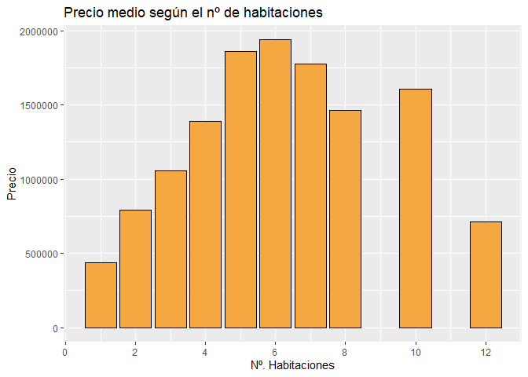<!-- -->

Se observa que el precio aumenta cuanto mayor sea el número de habitaciones hasta 6.

+ Para la variable Car se va a estudiar si cambia el precio medio de las viviendas según si tienen plaza de aparcamiento o no.


```r
carData = housing %>%
  group_by(Car) %>% 
  dplyr::summarise(AvgPriceCar = mean(Price))
  
ggplot(carData, aes(x = Car,y = AvgPriceCar, fill = Car)) +
  geom_bar(stat='identity', color='black') +
  labs(x = 'Tiene plaza de aparcamiento?', y = 'Precio', title = 'Precio medio en función de si tiene o no plaza de aparcamiento')
```

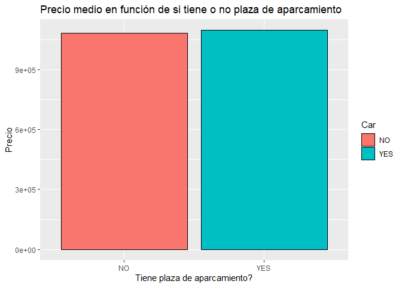<!-- -->

Parece que el precio se incrementa algo cuando tiene plaza de aparcamiento, pero no hay una diferencia considerable.

+ Se va a analizar cómo cambia el precio de las viviendas según el Suburbio en el que estén situadas. En la variable suburbData se guardan el nombre del suburbio y el precio medio de las viviendas que pertenecen a él (AvgPricePerSuburb). Además se ordenan de mayor a menor y se le añade el símbolo del dolar.


```r
suburbData = housing %>%
             group_by(Suburb) %>% 
             dplyr::summarise(AvgPricePerSuburb = round(median(Price),0)) %>%
             arrange(desc(AvgPricePerSuburb))

suburbData$AvgPriceSuburb = scales::dollar(suburbData$AvgPricePerSuburb)
```

Con los datos de los suburbios más caros se crea un gráfico de barras en el que se muestran los 10 más caros, indicando su precio y el nombre.


```r
suburbData = suburbData[0:10,]

ggplot(suburbData, aes(x = reorder(Suburb, AvgPricePerSuburb), 
                     y = AvgPricePerSuburb)) +
  geom_bar(stat='identity',colour="white", fill = '#f5a742') +
  geom_text(aes(x = Suburb, y = 1, label = paste0("(",AvgPriceSuburb,")",sep="")),
            hjust=0, vjust=.5, size = 4, colour = 'black',
            fontface = 'bold') +
  labs(x = 'Suburbio', y = 'Precio', title = 'Precio medio por Suburbio') +
  coord_flip()
```

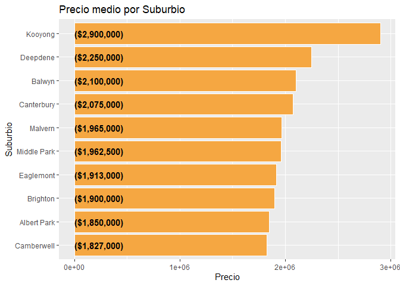<!-- -->

Se seleccionan del dataset los registros de los 10 suburbios más caros y mediante su latitud y longitud se representan en un mapa con la librería leaflet, donde cada punto es una vivienda y cada color un suburbio en concreto. Se puede apreciar dónde se sitúan las viviendas más caras en la ciudad de Melbourne.


```r
Suburbs = c(head(as.character(suburbData$Suburb),10))

SuburbsTop = housing %>% 
  filter(Suburb %in% Suburbs)

center_lon = median(SuburbsTop$Longtitude)
center_lat = median(SuburbsTop$Lattitude)

pal <- colorFactor(
  palette = 'plasma',
  domain = SuburbsTop$Suburb
)

leaflet(SuburbsTop) %>% addTiles() %>%
  addCircles(lng = ~Longtitude, lat = ~Lattitude,radius = 3,
             color = ~pal(Suburb))  %>%
  addLegend("bottomright", pal = pal, values = ~Suburb,
    title = "Distribución de viviendas Top 10 Suburbios",
    opacity = 1
  ) %>%
  # controls
  setView(lng=center_lon, lat=center_lat, zoom=11)
```

```{=html}
<div id="htmlwidget-904fea6c772275453b54" style="width:672px;height:480px;" class="leaflet html-widget"></div>
<script type="application/json" data-for="htmlwidget-904fea6c772275453b54">{"x":{"options":{"crs":{"crsClass":"L.CRS.EPSG3857","code":null,"proj4def":null,"projectedBounds":null,"options":{}}},"calls":[{"method":"addTiles","args":["//{s}.tile.openstreetmap.org/{z}/{x}/{y}.png",null,null,{"minZoom":0,"maxZoom":18,"tileSize":256,"subdomains":"abc","errorTileUrl":"","tms":false,"noWrap":false,"zoomOffset":0,"zoomReverse":false,"opacity":1,"zIndex":1,"detectRetina":false,"attribution":"&copy; <a href=\"http://openstreetmap.org\">OpenStreetMap<\/a> contributors, <a href=\"http://creativecommons.org/licenses/by-sa/2.0/\">CC-BY-SA<\/a>"}]},{"method":"addCircles","args":[[-37.8459,-37.845,-37.8481,-37.8452,-37.8431,-37.8444,-37.8405,-37.8447,-37.8443,-37.8415,-37.8422,-37.8443,-37.8421,-37.8379,-37.8415,-37.8436,-37.8422,-37.8451,-37.8407,-37.8445,-37.8443,-37.8424,-37.847,-37.8468,-37.8473,-37.8467,-37.846,-37.8427,-37.8461,-37.8421,-37.8477,-37.846,-37.8429,-37.8415,-37.8413,-37.8434,-37.8416,-37.8387,-37.8488,-37.8448,-37.8399,-37.8411,-37.8094,-37.811,-37.8128,-37.8161,-37.8028,-37.8147,-37.8085,-37.8071,-37.8124,-37.8051,-37.8134,-37.8061,-37.8092,-37.8162,-37.807,-37.8048,-37.8152,-37.8056,-37.8074,-37.8125,-37.8065,-37.8055,-37.8162,-37.814,-37.8032,-37.8116,-37.8144,-37.8125,-37.8013,-37.8044,-37.8112,-37.8088,-37.8125,-37.8063,-37.8096,-37.8042,-37.8157,-37.8122,-37.8061,-37.8117,-37.8068,-37.8116,-37.8152,-37.8068,-37.8123,-37.8161,-37.8106,-37.8036,-37.8044,-37.8134,-37.8025,-37.8039,-37.8149,-37.8092,-37.815,-37.8135,-37.8095,-37.8027,-37.8056,-37.8147,-37.8054,-37.8131,-37.8164,-37.8039,-37.8057,-37.8161,-37.8056,-37.8058,-37.8161,-37.8028,-37.8167,-37.8058,-37.8037,-37.812,-37.8049,-37.8075,-37.8058,-37.8099,-37.8092,-37.9159,-37.9038,-37.8927,-37.9071,-37.9081,-37.914,-37.9139,-37.9172,-37.8954,-37.9205,-37.8966,-37.8926,-37.9172,-37.918,-37.9243,-37.9136,-37.9082,-37.9081,-37.9122,-37.9139,-37.8956,-37.9287,-37.9166,-37.9301,-37.9118,-37.9157,-37.8954,-37.9241,-37.9249,-37.9045,-37.9119,-37.9119,-37.9042,-37.9039,-37.8943,-37.9252,-37.9225,-37.9225,-37.9097,-37.9174,-37.9264,-37.899,-37.9206,-37.9275,-37.8964,-37.9059,-37.9288,-37.9012,-37.9131,-37.8916,-37.9011,-37.9097,-37.9154,-37.9144,-37.918,-37.9228,-37.9104,-37.9153,-37.892,-37.9268,-37.8958,-37.9204,-37.914,-37.9208,-37.8975,-37.9181,-37.9112,-37.9164,-37.9012,-37.9158,-37.9188,-37.9271,-37.8965,-37.9254,-37.9166,-37.9284,-37.9075,-37.912,-37.8958,-37.9206,-37.9148,-37.8962,-37.9233,-37.9175,-37.916,-37.8987,-37.909,-37.9227,-37.9156,-37.896,-37.9159,-37.9095,-37.9249,-37.909,-37.9253,-37.8956,-37.905,-37.9152,-37.9078,-37.8989,-37.9228,-37.9118,-37.914,-37.9234,-37.9116,-37.9194,-37.9237,-37.919,-37.9121,-37.9097,-37.904,-37.921,-37.9049,-37.9262,-37.91,-37.9193,-37.9205,-37.9002,-37.9159,-37.9241,-37.8869,-37.8286,-37.8435,-37.8496,-37.8231,-37.8459,-37.8386,-37.8365,-37.842,-37.8448,-37.8347,-37.8457,-37.8357,-37.8431,-37.8493,-37.8469,-37.8433,-37.8382,-37.8237,-37.8426,-37.8479,-37.8452,-37.8314,-37.8274,-37.842,-37.8459,-37.8367,-37.8446,-37.8436,-37.8255,-37.8479,-37.8439,-37.84,-37.8255,-37.8424,-37.8482,-37.841,-37.8465,-37.8349,-37.836,-37.832,-37.8438,-37.8442,-37.8491,-37.8442,-37.8405,-37.8489,-37.847,-37.8238,-37.8448,-37.8447,-37.8233,-37.8361,-37.8316,-37.8357,-37.8454,-37.8408,-37.8437,-37.8393,-37.8439,-37.8379,-37.8362,-37.8328,-37.831,-37.8355,-37.8459,-37.8336,-37.8406,-37.8456,-37.8441,-37.8434,-37.8344,-37.8244,-37.8357,-37.8422,-37.8437,-37.8458,-37.8325,-37.836,-37.8399,-37.8303,-37.8421,-37.8186,-37.8265,-37.822,-37.8295,-37.8264,-37.8292,-37.8181,-37.8264,-37.8266,-37.8326,-37.8215,-37.8233,-37.8317,-37.8323,-37.8183,-37.8205,-37.8252,-37.8227,-37.827,-37.826,-37.832,-37.826,-37.8184,-37.8257,-37.8206,-37.8234,-37.8207,-37.8236,-37.8213,-37.8273,-37.8266,-37.8206,-37.8273,-37.8291,-37.7674,-37.7594,-37.7666,-37.7612,-37.7615,-37.7659,-37.7676,-37.7612,-37.7669,-37.7618,-37.7585,-37.769,-37.7623,-37.765,-37.7652,-37.8407,-37.8597,-37.8638,-37.8607,-37.8493,-37.8515,-37.866,-37.854,-37.8562,-37.8636,-37.8644,-37.8537,-37.8515,-37.8586,-37.8613,-37.8577,-37.8502,-37.8527,-37.8462,-37.8633,-37.8511,-37.8693,-37.851,-37.858,-37.8514,-37.8684,-37.851,-37.8653,-37.8549,-37.8674,-37.8469,-37.852,-37.8575,-37.8638,-37.8602,-37.868,-37.8597,-37.8631,-37.871,-37.8637,-37.8686,-37.8514,-37.8597,-37.8563,-37.854,-37.8633,-37.8603,-37.8499,-37.8516,-37.8477,-37.8474,-37.8522,-37.852,-37.8468,-37.8541,-37.8556,-37.8507,-37.8508,-37.8549,-37.8518,-37.8551,-37.8498,-37.8536,-37.847,-37.8513,-37.8474,-37.8473,-37.8487,-37.8453,-37.8426,-37.8441,-37.8436,-37.8459,-37.8473,-37.8435,-37.8441,-37.8445,-37.894,-37.9104,-37.9164,-37.902,-37.911,-37.8993,-37.8981,-37.928,-37.9181,-37.8868,-37.8847,-37.8981,-37.9043,-37.9049,-37.8953,-37.9037,-37.921,-37.901,-37.9056,-37.9107,-37.9163,-37.9099,-37.8985,-37.8405,-37.8446,-37.8378,-37.8411,-37.8442,-37.8434,-37.8355,-37.8427,-37.8378,-37.8269,-37.8416,-37.8418,-37.845,-37.8333,-37.823,-37.8284,-37.8304,-37.8417,-37.8378,-37.8192,-37.8322,-37.8214,-37.8179,-37.8178,-37.8203,-37.8691,-37.8486,-37.8515,-37.8654,-37.8636,-37.8021,-37.8078,-37.8114,-37.8101,-37.762,-37.7605,-37.8447,-37.8468,-37.8527,-37.8471,-37.8484,-37.8496,-37.8481,-37.80156,-37.90876,-37.88468,-37.92615,-37.84716,-37.83202,-37.84689,-37.82091,-37.84583,-37.84763,-37.84152,-37.84396,-37.84098,-37.80511,-37.90597,-37.90115,-37.91155,-37.91068,-37.91677,-37.9031,-37.92109,-37.84,-37.8356,-37.83271,-37.82012,-37.76689,-37.86916,-37.85905,-37.86824,-37.86561,-37.85356,-37.85231,-37.85411,-37.80648,-37.80292,-37.81167,-37.89571,-37.91728,-37.89886,-37.84085,-37.84361,-37.84753,-37.826,-37.76774,-37.84807,-37.84469,-37.842,-37.81369,-37.92829,-37.92576,-37.82277,-37.81653,-37.84587,-37.84431,-37.81172,-37.80626,-37.81623,-37.81192,-37.89168,-37.88623,-37.9146,-37.92465,-37.90899,-37.84473,-37.84627,-37.8279,-37.83208,-37.81792,-37.83201,-37.863,-37.86162,-37.85327,-37.84962,-37.84118,-37.90542,-37.8401,-37.84812,-37.75825,-37.87012,-37.81303,-37.81462,-37.81363,-37.92335,-37.9214,-37.91733,-37.90904,-37.88779,-37.84349,-37.84603,-37.82831,-37.82794,-37.83057,-37.82024,-37.81007,-37.86044,-37.85189,-37.85183,-37.8079,-37.90396,-37.9041,-37.76093,-37.85557,-37.81675,-37.81161,-37.83856,-37.81143,-37.806,-37.80345,-37.89569,-37.91814,-37.92545,-37.92894,-37.84143,-37.84115,-37.83473,-37.84403,-37.83227,-37.84237,-37.76457,-37.89544,-37.84457,-37.84197,-37.80563,-37.82875,-37.86115,-37.84908,-37.8503,-37.80576,-37.88879,-37.91414,-37.90192,-37.84317,-37.83176,-37.84136,-37.84684,-37.86552,-37.80455,-37.81016,-37.80708,-37.89293,-37.90542,-37.92314,-37.83254,-37.76617,-37.80199,-37.84578,-37.83825,-37.84398,-37.84479,-37.91559,-37.90034,-37.90217,-37.8296,-37.82359,-37.84391,-37.85612,-37.84804,-37.84265,-37.83411,-37.84588,-37.84787,-37.81266,-37.8184,-37.8042,-37.84954,-37.85601,-37.84502,-37.81691,-37.80824,-37.80984,-37.90397,-37.83818,-37.75991,-37.86411,-37.84476,-37.80513,-37.80759,-37.80198,-37.92304,-37.9213,-37.89335,-37.89238,-37.90946,-37.90148,-37.89946,-37.92798,-37.84628,-37.83904,-37.84159,-37.83448,-37.83715,-37.81781,-37.8433,-37.8111,-37.8936,-37.8862,-37.9244,-37.8398,-37.8158,-37.9133,-37.9059,-37.8326,-37.8366,-37.8231,-37.8097,-37.858,-37.8491,-37.8707,-37.81654,-37.92124,-37.92276,-37.83613,-37.81243,-37.81454,-37.86361,-37.80708,-37.80694,-37.90683,-37.89233,-37.92086,-37.90119,-37.84184,-37.82718,-37.84614,-37.84647,-37.8442,-37.83725,-37.82299,-37.86567,-37.85508,-37.84937,-37.8092,-37.80596,-37.81191,-37.81705,-37.89085,-37.92093,-37.88786,-37.90914,-37.9065,-37.90841,-37.84717,-37.84198,-37.84593,-37.84003,-37.75922,-37.86202,-37.85154,-37.9053,-37.80311,-37.80699,-37.9026,-37.83704,-37.83924,-37.84064,-37.82993,-37.85736,-37.84862,-37.80646,-37.81151,-37.80467,-37.80828,-37.91902,-37.92022,-37.89359,-37.90725,-37.91341,-37.84824,-37.84406,-37.84019,-37.83252,-37.84938,-37.82359,-37.76248,-37.85279,-37.84783,-37.84802,-37.85372,-37.80862,-37.89911,-37.89538,-37.90664,-37.91852,-37.84899,-37.84764,-37.83989,-37.84842,-37.82901,-37.84136,-37.84865,-37.84455,-37.8371,-37.82282,-37.82294,-37.84382,-37.86062,-37.85168,-37.84535,-37.84794,-37.84812,-37.85205],[144.9555,144.9538,144.9499,144.9488,144.9565,144.9484,144.9521,144.9523,144.9598,144.952,144.9554,144.9579,144.9571,144.9539,144.9585,144.9557,144.949,144.9511,144.9523,144.9501,144.9481,144.9562,144.9575,144.9546,144.9551,144.9475,144.9542,144.9546,144.9528,144.9517,144.9558,144.9517,144.9493,144.9585,144.95,144.9495,144.9488,144.9519,144.9551,144.9453,144.9577,144.9497,145.0807,145.0958,145.0975,145.0812,145.0768,145.0748,145.0764,145.0908,145.0916,145.1016,145.0972,145.0801,145.0778,145.0771,145.0635,145.0708,145.0843,145.0788,145.0826,145.0901,145.065,145.0699,145.0841,145.0966,145.0693,145.0724,145.0993,145.0775,145.0652,145.1006,145.0881,145.0991,145.0849,145.0705,145.0735,145.1042,145.0795,145.0879,145.0878,145.0775,145.0786,145.0789,145.0839,145.0827,145.0821,145.0772,145.0848,145.0715,145.0853,145.081,145.0665,145.0714,145.0747,145.0789,145.076,145.0995,145.0782,145.0694,145.071,145.084,145.0771,145.1,145.0846,145.0631,145.0825,145.0748,145.0688,145.0882,145.0809,145.0768,145.0797,145.0627,145.0636,145.0876,145.0748,145.1011,145.0781,145.0792,145.1016,145.0068,145.0001,145.0005,144.9898,145.0043,144.9878,144.9878,144.996,145.0026,145.0007,144.993,144.9991,145.004,145.0035,144.9989,144.9886,144.9968,145.0015,145.0038,145.0035,145.0026,144.992,144.9942,144.9935,144.9984,144.9973,145.0017,145.0008,144.9903,145.0043,144.9871,145.0037,144.9954,145.0009,144.9907,145.0004,144.9891,144.991,144.9914,144.9895,145.0044,144.9901,145.0051,145.0046,144.9972,144.9927,144.9954,144.9878,144.995,145.0017,145.0011,144.9914,145.001,145.0004,144.9911,144.9996,145.002,144.9924,144.9918,144.991,144.9994,145.0028,144.9914,144.9996,144.9991,144.993,144.9909,145.0002,144.997,144.9984,144.9942,145.0034,145.0022,145.0045,144.9926,144.9986,145.0064,144.9994,144.9982,145,145.0009,145.0011,144.9944,144.9949,145.0064,144.9953,145.0005,145.0043,145.0013,144.9957,144.9936,145.004,144.9928,145.0005,145.0034,145.0037,144.9959,144.993,145.0051,145.0008,145.0022,145.0041,145.003,145.0042,144.9978,145.0003,145.0056,144.9953,144.9953,144.9981,144.9919,144.9966,145.0069,144.9969,144.989,144.9898,145.0012,144.9928,144.9933,145.0028,144.9982,145.0686,145.0695,145.0869,145.0585,145.088,145.067,145.0802,145.0888,145.0723,145.057,145.0611,145.0697,145.0962,145.0877,145.0589,145.0695,145.0904,145.0638,145.0943,145.0958,145.0959,145.0611,145.0688,145.0542,145.0644,145.0934,145.068,145.0581,145.0592,145.0958,145.0718,145.0548,145.0592,145.0639,145.0949,145.0824,145.0743,145.0758,145.0914,145.0599,145.066,145.0578,145.086,145.0668,145.0903,145.088,145.0672,145.0624,145.071,145.0916,145.0644,145.0599,145.068,145.0786,145.0707,145.0905,145.0623,145.0662,145.0662,145.0849,145.064,145.0679,145.0621,145.0633,145.0721,145.0612,145.0545,145.0865,145.0806,145.081,145.0818,145.064,145.0595,145.064,145.069,145.0611,145.0649,145.056,145.0912,145.0668,145.0719,145.0706,145.072,145.0864,145.0774,145.0824,145.0852,145.0668,145.0741,145.0849,145.081,145.0731,145.0769,145.0738,145.0842,145.0667,145.0828,145.0721,145.0845,145.0737,145.0729,145.0853,145.0734,145.0702,145.0856,145.0785,145.0731,145.0854,145.0729,145.079,145.0786,145.072,145.0678,145.0752,145.0826,145.0518,145.0594,145.0591,145.0663,145.0705,145.0585,145.0597,145.0676,145.0521,145.0649,145.0568,145.0616,145.0569,145.0646,145.0687,145.0343,145.0318,145.0379,145.0373,145.0395,145.0324,145.039,145.041,145.0373,145.0301,145.0302,145.041,145.0372,145.0375,145.0393,145.0406,145.0418,145.0301,145.0386,145.0338,145.0317,145.0348,145.03,145.0351,145.0361,145.035,145.0316,145.0304,145.0298,145.0355,145.0377,145.0343,145.0392,145.0298,145.0399,145.038,145.0322,145.0353,145.0364,145.0373,145.038,145.0361,145.0318,145.0369,145.041,145.0336,145.0322,144.957,144.9624,144.9607,144.9625,144.9678,144.9654,144.9612,144.9665,144.9669,144.9591,144.9589,144.9662,144.9663,144.968,144.9628,144.9625,144.9594,144.9586,144.9582,144.9495,144.9511,144.949,144.9563,144.9522,144.9558,144.9574,144.955,144.9538,144.9598,144.9489,144.9977,144.9999,144.9974,144.9922,144.9866,145.0046,144.9902,145.0002,144.9933,144.9968,144.9972,145,145.0048,144.9969,144.9974,144.9926,144.9999,145.0026,144.9893,145.0077,144.9901,144.9899,145.0048,145.0924,145.0735,145.089,145.062,145.0942,145.0675,145.0665,145.0824,145.0909,145.0661,145.0959,145.0916,145.071,145.0616,145.0621,145.0673,145.0709,145.097,145.0949,145.067,145.0816,145.0843,145.0694,145.0649,145.0785,145.0345,145.0321,145.0372,145.0297,145.0301,145.0637,145.1031,145.0793,145.0844,145.0645,145.0593,144.9604,144.9612,144.9657,144.9595,144.963,144.963,144.9566,145.06715,145.00743,144.99722,145.00282,145.07351,145.06095,145.05863,145.06011,144.95658,144.95175,144.95027,144.95659,144.95115,145.08972,145.00208,144.98776,145.00657,145.00394,145.00372,144.9938,145.00088,145.07853,145.08005,145.08414,145.08526,145.05206,145.03565,145.03229,145.03504,145.03602,144.96415,144.96373,144.96409,145.08274,145.06424,145.08595,144.99796,145.00206,144.99462,145.05415,145.07099,145.07198,145.0707,145.05303,144.96017,144.95578,144.95601,145.09486,145.00281,144.99233,145.0581,145.05971,144.94828,144.95532,145.08175,145.08776,145.0841,145.07506,144.99162,144.99858,145.00535,144.9992,145.00046,145.09218,145.08366,145.07403,145.07533,145.06244,145.08163,145.03946,145.03065,144.96223,144.95856,144.95023,144.99817,145.09113,145.07414,145.05438,145.03545,145.07468,145.08776,145.09942,144.99982,145.00454,144.99747,144.99868,144.99933,145.07367,145.06954,145.06581,145.08435,145.08482,145.06172,145.06792,145.0335,145.03335,145.03863,145.09162,144.99126,144.9993,145.056,145.03968,145.07716,145.07622,145.08602,145.07108,145.09511,145.07969,144.99881,144.99297,145.00277,145.00341,145.08705,145.0743,145.05698,145.09545,145.06325,145.09257,145.06555,145.00279,145.06218,145.09374,145.10304,145.08403,145.03217,144.95753,144.96376,145.06979,144.99833,145.00527,145.00094,145.05688,145.0652,145.08149,145.03893,145.03529,145.06478,145.07341,145.09699,144.99138,145.00604,144.99777,145.07907,145.05332,145.06486,145.08436,145.08163,144.95044,144.94429,144.99885,144.99609,144.99337,145.06442,145.0693,145.03376,145.03273,144.96066,145.08199,145.06916,144.95559,144.95333,145.09329,145.08624,145.10312,145.0924,144.96596,144.94504,145.07615,145.07432,145.08321,144.99582,145.0915,145.06414,145.032,144.95164,145.09383,145.0783,145.06523,145.00039,145.00454,144.98643,144.98907,144.98919,144.99392,145.00537,144.9948,145.06363,145.07381,145.09606,145.08381,145.0929,145.06337,144.9457,145.0782,144.9982,144.9974,144.9989,145.058,145.0777,144.9971,144.992,145.0685,145.095,145.0744,145.061,145.034,145.0395,145.0357,145.07165,144.99822,144.99957,145.09037,145.07002,145.06008,145.03063,145.07156,145.0866,144.99208,144.9925,144.9983,144.99559,145.06585,145.07,145.093,145.07116,145.08142,145.06799,145.07513,145.03433,144.968,144.95414,145.10299,145.0694,145.09783,145.08319,144.99983,145.00499,144.99853,145.00477,145.00572,145.00497,145.09062,145.09534,145.09538,145.0691,145.05555,145.03635,144.96518,144.99382,145.06336,145.08436,144.99608,145.08336,145.06768,145.09714,145.08411,145.03923,144.95131,145.09628,145.09528,145.10322,145.09503,144.99987,144.99824,144.9936,145.00634,144.99034,145.08901,145.09005,145.07703,145.06832,145.08812,145.06034,145.05423,145.03059,145.03492,145.03341,144.96579,145.07452,144.9933,145.00121,145.00569,144.99742,145.09039,145.09273,145.06877,145.08584,145.06714,145.09452,145.09152,145.0931,145.09231,145.07807,145.08129,145.03643,145.03984,145.03181,144.96044,144.96117,144.9624,144.96481],3,null,null,{"interactive":true,"className":"","stroke":true,"color":["#16078A","#16078A","#16078A","#16078A","#16078A","#16078A","#16078A","#16078A","#16078A","#16078A","#16078A","#16078A","#16078A","#16078A","#16078A","#16078A","#16078A","#16078A","#16078A","#16078A","#16078A","#16078A","#16078A","#16078A","#16078A","#16078A","#16078A","#16078A","#16078A","#16078A","#16078A","#16078A","#16078A","#16078A","#16078A","#16078A","#16078A","#16078A","#16078A","#16078A","#16078A","#16078A","#310597","#310597","#310597","#310597","#310597","#310597","#310597","#310597","#310597","#310597","#310597","#310597","#310597","#310597","#310597","#310597","#310597","#310597","#310597","#310597","#310597","#310597","#310597","#310597","#310597","#310597","#310597","#310597","#310597","#310597","#310597","#310597","#310597","#310597","#310597","#310597","#310597","#310597","#310597","#310597","#310597","#310597","#310597","#310597","#310597","#310597","#310597","#310597","#310597","#310597","#310597","#310597","#310597","#310597","#310597","#310597","#310597","#310597","#310597","#310597","#310597","#310597","#310597","#310597","#310597","#310597","#310597","#310597","#310597","#310597","#310597","#310597","#310597","#310597","#310597","#310597","#310597","#310597","#310597","#4D02A1","#4D02A1","#4D02A1","#4D02A1","#4D02A1","#4D02A1","#4D02A1","#4D02A1","#4D02A1","#4D02A1","#4D02A1","#4D02A1","#4D02A1","#4D02A1","#4D02A1","#4D02A1","#4D02A1","#4D02A1","#4D02A1","#4D02A1","#4D02A1","#4D02A1","#4D02A1","#4D02A1","#4D02A1","#4D02A1","#4D02A1","#4D02A1","#4D02A1","#4D02A1","#4D02A1","#4D02A1","#4D02A1","#4D02A1","#4D02A1","#4D02A1","#4D02A1","#4D02A1","#4D02A1","#4D02A1","#4D02A1","#4D02A1","#4D02A1","#4D02A1","#4D02A1","#4D02A1","#4D02A1","#4D02A1","#4D02A1","#4D02A1","#4D02A1","#4D02A1","#4D02A1","#4D02A1","#4D02A1","#4D02A1","#4D02A1","#4D02A1","#4D02A1","#4D02A1","#4D02A1","#4D02A1","#4D02A1","#4D02A1","#4D02A1","#4D02A1","#4D02A1","#4D02A1","#4D02A1","#4D02A1","#4D02A1","#4D02A1","#4D02A1","#4D02A1","#4D02A1","#4D02A1","#4D02A1","#4D02A1","#4D02A1","#4D02A1","#4D02A1","#4D02A1","#4D02A1","#4D02A1","#4D02A1","#4D02A1","#4D02A1","#4D02A1","#4D02A1","#4D02A1","#4D02A1","#4D02A1","#4D02A1","#4D02A1","#4D02A1","#4D02A1","#4D02A1","#4D02A1","#4D02A1","#4D02A1","#4D02A1","#4D02A1","#4D02A1","#4D02A1","#4D02A1","#4D02A1","#4D02A1","#4D02A1","#4D02A1","#4D02A1","#4D02A1","#4D02A1","#4D02A1","#4D02A1","#4D02A1","#4D02A1","#4D02A1","#4D02A1","#4D02A1","#4D02A1","#4D02A1","#6200A7","#6200A7","#6200A7","#6200A7","#6200A7","#6200A7","#6200A7","#6200A7","#6200A7","#6200A7","#6200A7","#6200A7","#6200A7","#6200A7","#6200A7","#6200A7","#6200A7","#6200A7","#6200A7","#6200A7","#6200A7","#6200A7","#6200A7","#6200A7","#6200A7","#6200A7","#6200A7","#6200A7","#6200A7","#6200A7","#6200A7","#6200A7","#6200A7","#6200A7","#6200A7","#6200A7","#6200A7","#6200A7","#6200A7","#6200A7","#6200A7","#6200A7","#6200A7","#6200A7","#6200A7","#6200A7","#6200A7","#6200A7","#6200A7","#6200A7","#6200A7","#6200A7","#6200A7","#6200A7","#6200A7","#6200A7","#6200A7","#6200A7","#6200A7","#6200A7","#6200A7","#6200A7","#6200A7","#6200A7","#6200A7","#6200A7","#6200A7","#6200A7","#6200A7","#6200A7","#6200A7","#6200A7","#6200A7","#6200A7","#6200A7","#6200A7","#6200A7","#6200A7","#6200A7","#6200A7","#6200A7","#6400A7","#6400A7","#6400A7","#6400A7","#6400A7","#6400A7","#6400A7","#6400A7","#6400A7","#6400A7","#6400A7","#6400A7","#6400A7","#6400A7","#6400A7","#6400A7","#6400A7","#6400A7","#6400A7","#6400A7","#6400A7","#6400A7","#6400A7","#6400A7","#6400A7","#6400A7","#6400A7","#6400A7","#6400A7","#6400A7","#6400A7","#6400A7","#6400A7","#6400A7","#9C179E","#9C179E","#9C179E","#9C179E","#9C179E","#9C179E","#9C179E","#9C179E","#9C179E","#9C179E","#9C179E","#9C179E","#9C179E","#9C179E","#9C179E","#D8576B","#DE5F65","#DE5F65","#DE5F65","#DE5F65","#DE5F65","#DE5F65","#DE5F65","#DE5F65","#DE5F65","#DE5F65","#DE5F65","#DE5F65","#DE5F65","#DE5F65","#DE5F65","#DE5F65","#DE5F65","#DE5F65","#DE5F65","#DE5F65","#DE5F65","#DE5F65","#DE5F65","#DE5F65","#DE5F65","#DE5F65","#DE5F65","#DE5F65","#DE5F65","#DE5F65","#DE5F65","#DE5F65","#DE5F65","#DE5F65","#DE5F65","#DE5F65","#DE5F65","#DE5F65","#DE5F65","#DE5F65","#DE5F65","#DE5F65","#DE5F65","#DE5F65","#DE5F65","#DE5F65","#E56A5D","#E56A5D","#E56A5D","#E56A5D","#E56A5D","#E56A5D","#E56A5D","#E56A5D","#E56A5D","#E56A5D","#E56A5D","#E56A5D","#E56A5D","#E56A5D","#E56A5D","#E56A5D","#E56A5D","#E56A5D","#E56A5D","#16078A","#16078A","#16078A","#16078A","#16078A","#16078A","#16078A","#16078A","#16078A","#16078A","#16078A","#4D02A1","#4D02A1","#4D02A1","#4D02A1","#4D02A1","#4D02A1","#4D02A1","#4D02A1","#4D02A1","#4D02A1","#4D02A1","#4D02A1","#4D02A1","#4D02A1","#4D02A1","#4D02A1","#4D02A1","#4D02A1","#4D02A1","#4D02A1","#4D02A1","#4D02A1","#4D02A1","#6200A7","#6200A7","#6200A7","#6200A7","#6200A7","#6200A7","#6200A7","#6200A7","#6200A7","#6200A7","#6200A7","#6200A7","#6200A7","#6200A7","#6200A7","#6200A7","#6200A7","#6200A7","#6200A7","#6400A7","#6400A7","#6400A7","#6400A7","#6400A7","#6400A7","#DE5F65","#DE5F65","#DE5F65","#DE5F65","#DE5F65","#310597","#310597","#310597","#310597","#9C179E","#9C179E","#E56A5D","#E56A5D","#E56A5D","#E56A5D","#E56A5D","#E56A5D","#16078A","#310597","#4D02A1","#4D02A1","#4D02A1","#6200A7","#6200A7","#6200A7","#6400A7","#16078A","#16078A","#16078A","#16078A","#16078A","#310597","#4D02A1","#4D02A1","#4D02A1","#4D02A1","#4D02A1","#4D02A1","#4D02A1","#6200A7","#6200A7","#6400A7","#6400A7","#9C179E","#DE5F65","#DE5F65","#DE5F65","#DE5F65","#E56A5D","#E56A5D","#E56A5D","#310597","#310597","#310597","#4D02A1","#4D02A1","#4D02A1","#6200A7","#6200A7","#6200A7","#6200A7","#9C179E","#E56A5D","#16078A","#16078A","#310597","#4D02A1","#4D02A1","#6200A7","#6400A7","#16078A","#16078A","#310597","#310597","#310597","#310597","#4D02A1","#4D02A1","#4D02A1","#4D02A1","#4D02A1","#6200A7","#6200A7","#6400A7","#6400A7","#6400A7","#6400A7","#DE5F65","#DE5F65","#E56A5D","#E56A5D","#16078A","#4D02A1","#6200A7","#6200A7","#9C179E","#DE5F65","#310597","#310597","#310597","#4D02A1","#4D02A1","#4D02A1","#4D02A1","#4D02A1","#6200A7","#6200A7","#6200A7","#6400A7","#6400A7","#6400A7","#8E0CA4","#DE5F65","#DE5F65","#DE5F65","#310597","#4D02A1","#4D02A1","#9C179E","#DE5F65","#310597","#310597","#6200A7","#8E0CA4","#310597","#310597","#4D02A1","#4D02A1","#4D02A1","#4D02A1","#6200A7","#6200A7","#6200A7","#6200A7","#6200A7","#6200A7","#9C179E","#4D02A1","#6200A7","#6200A7","#310597","#6400A7","#DE5F65","#E56A5D","#E56A5D","#310597","#4D02A1","#4D02A1","#4D02A1","#6200A7","#6200A7","#6200A7","#DE5F65","#DE5F65","#310597","#310597","#310597","#4D02A1","#4D02A1","#4D02A1","#6400A7","#9C179E","#310597","#6200A7","#6200A7","#16078A","#16078A","#4D02A1","#4D02A1","#4D02A1","#6200A7","#6400A7","#D8576B","#DE5F65","#E56A5D","#6200A7","#6200A7","#16078A","#16078A","#310597","#310597","#310597","#6200A7","#E56A5D","#16078A","#310597","#310597","#310597","#4D02A1","#6200A7","#9C179E","#DE5F65","#16078A","#310597","#310597","#310597","#4D02A1","#4D02A1","#4D02A1","#4D02A1","#4D02A1","#4D02A1","#4D02A1","#4D02A1","#6200A7","#6200A7","#6200A7","#6200A7","#6200A7","#6400A7","#16078A","#310597","#4D02A1","#4D02A1","#4D02A1","#6200A7","#310597","#4D02A1","#4D02A1","#6200A7","#6200A7","#6400A7","#8E0CA4","#DE5F65","#DE5F65","#DE5F65","#310597","#4D02A1","#4D02A1","#6200A7","#8E0CA4","#8E0CA4","#DE5F65","#310597","#310597","#4D02A1","#4D02A1","#4D02A1","#4D02A1","#6200A7","#6200A7","#6200A7","#6200A7","#6200A7","#6200A7","#6400A7","#DE5F65","#E56A5D","#16078A","#310597","#310597","#310597","#310597","#4D02A1","#4D02A1","#4D02A1","#4D02A1","#4D02A1","#4D02A1","#6200A7","#6200A7","#6200A7","#6200A7","#9C179E","#DE5F65","#E56A5D","#4D02A1","#310597","#310597","#4D02A1","#6200A7","#6200A7","#6200A7","#6400A7","#DE5F65","#16078A","#310597","#310597","#310597","#310597","#4D02A1","#4D02A1","#4D02A1","#4D02A1","#4D02A1","#6200A7","#6200A7","#6200A7","#6200A7","#6200A7","#6200A7","#9C179E","#DE5F65","#DE5F65","#DE5F65","#E56A5D","#310597","#4D02A1","#4D02A1","#4D02A1","#4D02A1","#6200A7","#6200A7","#6200A7","#6200A7","#6200A7","#6200A7","#6200A7","#6200A7","#6200A7","#6400A7","#6400A7","#D8576B","#DE5F65","#DE5F65","#E56A5D","#E56A5D","#E56A5D","#E56A5D"],"weight":5,"opacity":0.5,"fill":true,"fillColor":["#16078A","#16078A","#16078A","#16078A","#16078A","#16078A","#16078A","#16078A","#16078A","#16078A","#16078A","#16078A","#16078A","#16078A","#16078A","#16078A","#16078A","#16078A","#16078A","#16078A","#16078A","#16078A","#16078A","#16078A","#16078A","#16078A","#16078A","#16078A","#16078A","#16078A","#16078A","#16078A","#16078A","#16078A","#16078A","#16078A","#16078A","#16078A","#16078A","#16078A","#16078A","#16078A","#310597","#310597","#310597","#310597","#310597","#310597","#310597","#310597","#310597","#310597","#310597","#310597","#310597","#310597","#310597","#310597","#310597","#310597","#310597","#310597","#310597","#310597","#310597","#310597","#310597","#310597","#310597","#310597","#310597","#310597","#310597","#310597","#310597","#310597","#310597","#310597","#310597","#310597","#310597","#310597","#310597","#310597","#310597","#310597","#310597","#310597","#310597","#310597","#310597","#310597","#310597","#310597","#310597","#310597","#310597","#310597","#310597","#310597","#310597","#310597","#310597","#310597","#310597","#310597","#310597","#310597","#310597","#310597","#310597","#310597","#310597","#310597","#310597","#310597","#310597","#310597","#310597","#310597","#310597","#4D02A1","#4D02A1","#4D02A1","#4D02A1","#4D02A1","#4D02A1","#4D02A1","#4D02A1","#4D02A1","#4D02A1","#4D02A1","#4D02A1","#4D02A1","#4D02A1","#4D02A1","#4D02A1","#4D02A1","#4D02A1","#4D02A1","#4D02A1","#4D02A1","#4D02A1","#4D02A1","#4D02A1","#4D02A1","#4D02A1","#4D02A1","#4D02A1","#4D02A1","#4D02A1","#4D02A1","#4D02A1","#4D02A1","#4D02A1","#4D02A1","#4D02A1","#4D02A1","#4D02A1","#4D02A1","#4D02A1","#4D02A1","#4D02A1","#4D02A1","#4D02A1","#4D02A1","#4D02A1","#4D02A1","#4D02A1","#4D02A1","#4D02A1","#4D02A1","#4D02A1","#4D02A1","#4D02A1","#4D02A1","#4D02A1","#4D02A1","#4D02A1","#4D02A1","#4D02A1","#4D02A1","#4D02A1","#4D02A1","#4D02A1","#4D02A1","#4D02A1","#4D02A1","#4D02A1","#4D02A1","#4D02A1","#4D02A1","#4D02A1","#4D02A1","#4D02A1","#4D02A1","#4D02A1","#4D02A1","#4D02A1","#4D02A1","#4D02A1","#4D02A1","#4D02A1","#4D02A1","#4D02A1","#4D02A1","#4D02A1","#4D02A1","#4D02A1","#4D02A1","#4D02A1","#4D02A1","#4D02A1","#4D02A1","#4D02A1","#4D02A1","#4D02A1","#4D02A1","#4D02A1","#4D02A1","#4D02A1","#4D02A1","#4D02A1","#4D02A1","#4D02A1","#4D02A1","#4D02A1","#4D02A1","#4D02A1","#4D02A1","#4D02A1","#4D02A1","#4D02A1","#4D02A1","#4D02A1","#4D02A1","#4D02A1","#4D02A1","#4D02A1","#4D02A1","#4D02A1","#4D02A1","#6200A7","#6200A7","#6200A7","#6200A7","#6200A7","#6200A7","#6200A7","#6200A7","#6200A7","#6200A7","#6200A7","#6200A7","#6200A7","#6200A7","#6200A7","#6200A7","#6200A7","#6200A7","#6200A7","#6200A7","#6200A7","#6200A7","#6200A7","#6200A7","#6200A7","#6200A7","#6200A7","#6200A7","#6200A7","#6200A7","#6200A7","#6200A7","#6200A7","#6200A7","#6200A7","#6200A7","#6200A7","#6200A7","#6200A7","#6200A7","#6200A7","#6200A7","#6200A7","#6200A7","#6200A7","#6200A7","#6200A7","#6200A7","#6200A7","#6200A7","#6200A7","#6200A7","#6200A7","#6200A7","#6200A7","#6200A7","#6200A7","#6200A7","#6200A7","#6200A7","#6200A7","#6200A7","#6200A7","#6200A7","#6200A7","#6200A7","#6200A7","#6200A7","#6200A7","#6200A7","#6200A7","#6200A7","#6200A7","#6200A7","#6200A7","#6200A7","#6200A7","#6200A7","#6200A7","#6200A7","#6200A7","#6400A7","#6400A7","#6400A7","#6400A7","#6400A7","#6400A7","#6400A7","#6400A7","#6400A7","#6400A7","#6400A7","#6400A7","#6400A7","#6400A7","#6400A7","#6400A7","#6400A7","#6400A7","#6400A7","#6400A7","#6400A7","#6400A7","#6400A7","#6400A7","#6400A7","#6400A7","#6400A7","#6400A7","#6400A7","#6400A7","#6400A7","#6400A7","#6400A7","#6400A7","#9C179E","#9C179E","#9C179E","#9C179E","#9C179E","#9C179E","#9C179E","#9C179E","#9C179E","#9C179E","#9C179E","#9C179E","#9C179E","#9C179E","#9C179E","#D8576B","#DE5F65","#DE5F65","#DE5F65","#DE5F65","#DE5F65","#DE5F65","#DE5F65","#DE5F65","#DE5F65","#DE5F65","#DE5F65","#DE5F65","#DE5F65","#DE5F65","#DE5F65","#DE5F65","#DE5F65","#DE5F65","#DE5F65","#DE5F65","#DE5F65","#DE5F65","#DE5F65","#DE5F65","#DE5F65","#DE5F65","#DE5F65","#DE5F65","#DE5F65","#DE5F65","#DE5F65","#DE5F65","#DE5F65","#DE5F65","#DE5F65","#DE5F65","#DE5F65","#DE5F65","#DE5F65","#DE5F65","#DE5F65","#DE5F65","#DE5F65","#DE5F65","#DE5F65","#DE5F65","#E56A5D","#E56A5D","#E56A5D","#E56A5D","#E56A5D","#E56A5D","#E56A5D","#E56A5D","#E56A5D","#E56A5D","#E56A5D","#E56A5D","#E56A5D","#E56A5D","#E56A5D","#E56A5D","#E56A5D","#E56A5D","#E56A5D","#16078A","#16078A","#16078A","#16078A","#16078A","#16078A","#16078A","#16078A","#16078A","#16078A","#16078A","#4D02A1","#4D02A1","#4D02A1","#4D02A1","#4D02A1","#4D02A1","#4D02A1","#4D02A1","#4D02A1","#4D02A1","#4D02A1","#4D02A1","#4D02A1","#4D02A1","#4D02A1","#4D02A1","#4D02A1","#4D02A1","#4D02A1","#4D02A1","#4D02A1","#4D02A1","#4D02A1","#6200A7","#6200A7","#6200A7","#6200A7","#6200A7","#6200A7","#6200A7","#6200A7","#6200A7","#6200A7","#6200A7","#6200A7","#6200A7","#6200A7","#6200A7","#6200A7","#6200A7","#6200A7","#6200A7","#6400A7","#6400A7","#6400A7","#6400A7","#6400A7","#6400A7","#DE5F65","#DE5F65","#DE5F65","#DE5F65","#DE5F65","#310597","#310597","#310597","#310597","#9C179E","#9C179E","#E56A5D","#E56A5D","#E56A5D","#E56A5D","#E56A5D","#E56A5D","#16078A","#310597","#4D02A1","#4D02A1","#4D02A1","#6200A7","#6200A7","#6200A7","#6400A7","#16078A","#16078A","#16078A","#16078A","#16078A","#310597","#4D02A1","#4D02A1","#4D02A1","#4D02A1","#4D02A1","#4D02A1","#4D02A1","#6200A7","#6200A7","#6400A7","#6400A7","#9C179E","#DE5F65","#DE5F65","#DE5F65","#DE5F65","#E56A5D","#E56A5D","#E56A5D","#310597","#310597","#310597","#4D02A1","#4D02A1","#4D02A1","#6200A7","#6200A7","#6200A7","#6200A7","#9C179E","#E56A5D","#16078A","#16078A","#310597","#4D02A1","#4D02A1","#6200A7","#6400A7","#16078A","#16078A","#310597","#310597","#310597","#310597","#4D02A1","#4D02A1","#4D02A1","#4D02A1","#4D02A1","#6200A7","#6200A7","#6400A7","#6400A7","#6400A7","#6400A7","#DE5F65","#DE5F65","#E56A5D","#E56A5D","#16078A","#4D02A1","#6200A7","#6200A7","#9C179E","#DE5F65","#310597","#310597","#310597","#4D02A1","#4D02A1","#4D02A1","#4D02A1","#4D02A1","#6200A7","#6200A7","#6200A7","#6400A7","#6400A7","#6400A7","#8E0CA4","#DE5F65","#DE5F65","#DE5F65","#310597","#4D02A1","#4D02A1","#9C179E","#DE5F65","#310597","#310597","#6200A7","#8E0CA4","#310597","#310597","#4D02A1","#4D02A1","#4D02A1","#4D02A1","#6200A7","#6200A7","#6200A7","#6200A7","#6200A7","#6200A7","#9C179E","#4D02A1","#6200A7","#6200A7","#310597","#6400A7","#DE5F65","#E56A5D","#E56A5D","#310597","#4D02A1","#4D02A1","#4D02A1","#6200A7","#6200A7","#6200A7","#DE5F65","#DE5F65","#310597","#310597","#310597","#4D02A1","#4D02A1","#4D02A1","#6400A7","#9C179E","#310597","#6200A7","#6200A7","#16078A","#16078A","#4D02A1","#4D02A1","#4D02A1","#6200A7","#6400A7","#D8576B","#DE5F65","#E56A5D","#6200A7","#6200A7","#16078A","#16078A","#310597","#310597","#310597","#6200A7","#E56A5D","#16078A","#310597","#310597","#310597","#4D02A1","#6200A7","#9C179E","#DE5F65","#16078A","#310597","#310597","#310597","#4D02A1","#4D02A1","#4D02A1","#4D02A1","#4D02A1","#4D02A1","#4D02A1","#4D02A1","#6200A7","#6200A7","#6200A7","#6200A7","#6200A7","#6400A7","#16078A","#310597","#4D02A1","#4D02A1","#4D02A1","#6200A7","#310597","#4D02A1","#4D02A1","#6200A7","#6200A7","#6400A7","#8E0CA4","#DE5F65","#DE5F65","#DE5F65","#310597","#4D02A1","#4D02A1","#6200A7","#8E0CA4","#8E0CA4","#DE5F65","#310597","#310597","#4D02A1","#4D02A1","#4D02A1","#4D02A1","#6200A7","#6200A7","#6200A7","#6200A7","#6200A7","#6200A7","#6400A7","#DE5F65","#E56A5D","#16078A","#310597","#310597","#310597","#310597","#4D02A1","#4D02A1","#4D02A1","#4D02A1","#4D02A1","#4D02A1","#6200A7","#6200A7","#6200A7","#6200A7","#9C179E","#DE5F65","#E56A5D","#4D02A1","#310597","#310597","#4D02A1","#6200A7","#6200A7","#6200A7","#6400A7","#DE5F65","#16078A","#310597","#310597","#310597","#310597","#4D02A1","#4D02A1","#4D02A1","#4D02A1","#4D02A1","#6200A7","#6200A7","#6200A7","#6200A7","#6200A7","#6200A7","#9C179E","#DE5F65","#DE5F65","#DE5F65","#E56A5D","#310597","#4D02A1","#4D02A1","#4D02A1","#4D02A1","#6200A7","#6200A7","#6200A7","#6200A7","#6200A7","#6200A7","#6200A7","#6200A7","#6200A7","#6400A7","#6400A7","#D8576B","#DE5F65","#DE5F65","#E56A5D","#E56A5D","#E56A5D","#E56A5D"],"fillOpacity":0.2},null,null,null,{"interactive":false,"permanent":false,"direction":"auto","opacity":1,"offset":[0,0],"textsize":"10px","textOnly":false,"className":"","sticky":true},null,null]},{"method":"addLegend","args":[{"colors":["#16078A","#310597","#4D02A1","#6200A7","#6400A7","#8E0CA4","#9C179E","#D8576B","#DE5F65","#E56A5D"],"labels":["Albert Park","Balwyn","Brighton","Camberwell","Canterbury","Deepdene","Eaglemont","Kooyong","Malvern","Middle Park"],"na_color":null,"na_label":"NA","opacity":1,"position":"bottomright","type":"factor","title":"Distribución de viviendas Top 10 Suburbios","extra":null,"layerId":null,"className":"info legend","group":null}]}],"limits":{"lat":[-37.9301,-37.75825],"lng":[144.94429,145.1042]},"setView":[[-37.845,145.039265],11,[]]},"evals":[],"jsHooks":[]}</script>
```

+ Ahora se va a representar cómo cambia el precio según la fecha en la que se haya vendido la vivienda. Para ello se representa en el eje X la fecha de venta (variable convertida a tipo Date) y en el eje Y el precio de venta.


```r
housingDate = housing
housingDate$Date = as.Date(housingDate$Date,format = "%d/%m/%Y")
price_trend = housingDate %>% 
  group_by(Date) %>% 
  dplyr::summarise(Average = sum(Price)/n())  
  
ggplot(price_trend, aes(x = Date, y = Average)) + 
  geom_line(color = "steelblue")
```

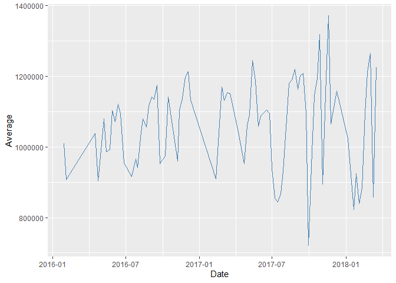<!-- -->

Se aprecian datos algo más elevado cuanto más posterior es la fecha, pero no se identifica ninguna tendencia concreta en la variación del precio, probablemente porque el lapso de tiempo es de algo más de dos años.

+ En la siguiente representación se muestra mediante boxplots cómo cambia el precio y entre qué valores se mueve en función de la región a la que pertenece la vivienda.


```r
housing %>%
  ggplot(aes(x=Regionname, y = Price, fill=Regionname)) +
  geom_boxplot()+
  coord_flip()
```

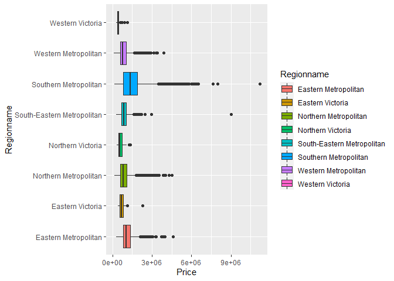<!-- -->

Se aprecian regiones con un precio más elevado que otras, Southern Metropolitan (en azul) parece ser la región más cara.

+ Se representa también la variación del precio según el tipo de vivienda mediante boxplots de diferentes colores.


```r
housing %>%
  ggplot(aes(x=Type, y = Price, fill=Type)) +
  geom_boxplot()
```

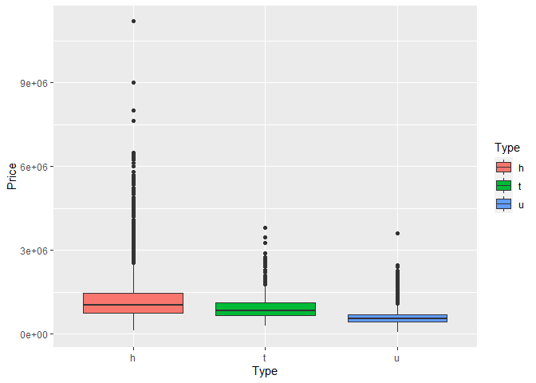<!-- -->

Se puede comprobar que el tipo de vivienda influye claramente en el precio, siendo más elevado para el tipo h (house) que para el u (unit). Más cara para una casa que para un apartamento.

+ Se hace el mismo tipo de representación de la variable método de venta frente al precio para ver su influencia y si tiene relación.


```r
housing %>%
  ggplot(aes(x=Method, y = Price, fill=Method)) +
  geom_boxplot()
```

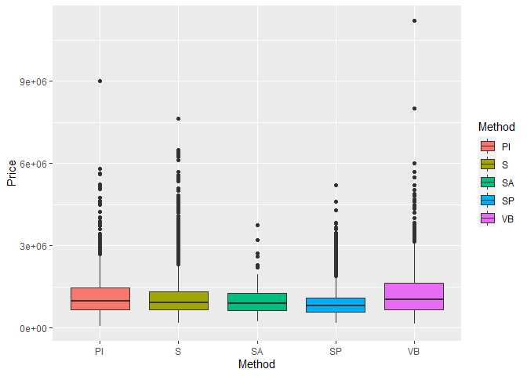<!-- -->

+ A continuación, se estudia la distribución de la variable Distancia, que indica la distancia al distrito de negocios de Melbourne y se representa de nuevo junto al precio mediante un diagrama de dispersión. 


```r
housing %>% 
  ggplot(data = housing, mapping = aes(x = Distance, y = Price)) +
  geom_point() +
  geom_smooth(se = FALSE)
```

```
## `geom_smooth()` using method = 'gam' and formula 'y ~ s(x, bs = "cs")'
```

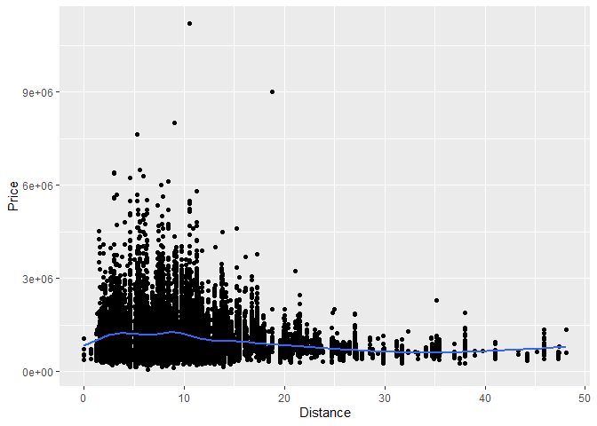<!-- -->

Se aprecia una relación negativa, a menor distancia mayor puede ser el precio de las viviendas. Las viviendas con precio más elevado en ningún caso se encuentran cercanas al centro de negocios.

+ Por último, se analizará como están distribuidos los valores de la variable Price mediante un histograma y una curva de densidad.


```r
housing %>% 
  ggplot(aes(x=Price))+
  geom_histogram(aes(y=stat(density)), fill="steelblue", color = "black") + 
  geom_density(color="red", size=1.5)
```

```
## `stat_bin()` using `bins = 30`. Pick better value with `binwidth`.
```

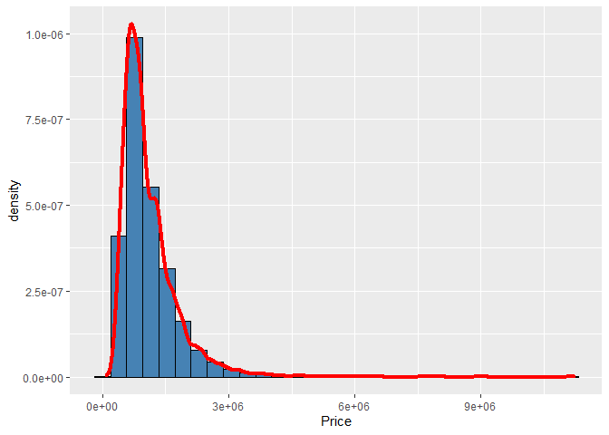<!-- -->

Los valores se concentran en las viviendas de un millón de dólares, y cuanto mayor es el precio menos viviendas hay con precio elevado.


# Modelo de prediccion de precio (incompleto - aún por modificar)

Vamos a trabajar con un subconjunto de las variables para determinar su influencia en el valor del precio.


```r
house_data = housing %>% 
  select(Suburb, Regionname, Rooms, Bathroom, Car, Type, Method, SellerG, Distance, Landsize, Propertycount, Price)
```


```r
numvars <- sapply(house_data, class) %in% c("integer","numeric")
C <- cor(house_data[,numvars])
corrplot::corrplot(C, method = "circle")
```

<!-- -->

Segun el analisis anterior decidimos seleccionar un subconjunto de variables mas influyentes en el precio para hacer un analisis de prediccion de precios mediante un modelo de regresion lineal.


```r
fdata = select(house_data, Regionname, Rooms, Car, Type, Distance, Price)
```


```r
# Construyendo el modelo
modelo = lm(Price ~ ., data = fdata)
modelo$coefficients
```

```
##                          (Intercept)           RegionnameEastern Victoria 
##                            854530.65                            390480.99 
##      RegionnameNorthern Metropolitan          RegionnameNorthern Victoria 
##                           -280598.49                            267621.70 
## RegionnameSouth-Eastern Metropolitan      RegionnameSouthern Metropolitan 
##                            205764.33                            315283.63 
##       RegionnameWestern Metropolitan           RegionnameWestern Victoria 
##                           -336206.18                            -45241.62 
##                                Rooms                               CarYES 
##                            276226.25                             63400.09 
##                                Typet                                Typeu 
##                           -282275.69                           -546131.86 
##                             Distance 
##                            -45193.08
```


```r
summary(modelo)
```

```
## 
## Call:
## lm(formula = Price ~ ., data = fdata)
## 
## Residuals:
##      Min       1Q   Median       3Q      Max 
## -2044784  -254098   -59387   169821  9336408 
## 
## Coefficients:
##                                       Estimate Std. Error t value Pr(>|t|)    
## (Intercept)                           854530.7    21506.5  39.734  < 2e-16 ***
## RegionnameEastern Victoria            390481.0    46182.5   8.455  < 2e-16 ***
## RegionnameNorthern Metropolitan      -280598.5    12030.5 -23.324  < 2e-16 ***
## RegionnameNorthern Victoria           267621.7    46243.8   5.787 7.28e-09 ***
## RegionnameSouth-Eastern Metropolitan  205764.3    19630.8  10.482  < 2e-16 ***
## RegionnameSouthern Metropolitan       315283.6    11940.6  26.404  < 2e-16 ***
## RegionnameWestern Metropolitan       -336206.2    12212.3 -27.530  < 2e-16 ***
## RegionnameWestern Victoria            -45241.6    57505.8  -0.787    0.431    
## Rooms                                 276226.3     4348.6  63.521  < 2e-16 ***
## CarYES                                 63400.1    13818.8   4.588 4.51e-06 ***
## Typet                                -282275.7    13092.3 -21.560  < 2e-16 ***
## Typeu                                -546131.9    10895.6 -50.124  < 2e-16 ***
## Distance                              -45193.1      697.7 -64.770  < 2e-16 ***
## ---
## Signif. codes:  0 '***' 0.001 '**' 0.01 '*' 0.05 '.' 0.1 ' ' 1
## 
## Residual standard error: 441200 on 17666 degrees of freedom
## Multiple R-squared:  0.5479,	Adjusted R-squared:  0.5476 
## F-statistic:  1784 on 12 and 17666 DF,  p-value: < 2.2e-16
```


```r
# normalidad de los residuo
plotModelo = plot(modelo, which = 2, pch=19)
qqline(modelo$residuals, col="blue")   
```

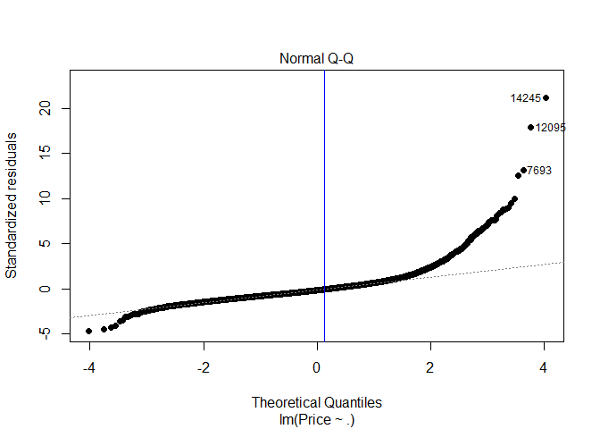<!-- -->


```r
plotModelo = plot(modelo, which = 1, pch=19, lwd= 12)
segments(x0 = c(2.3, 2.3), y0 = c(1, -1), x1 = c(3.7, 3.7), y1 = c(3, -2), 
         lty=3, lwd=12, col="blue")
```

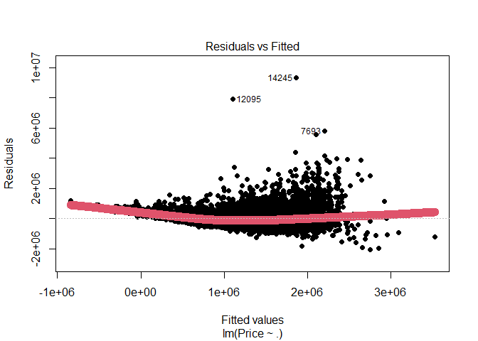<!-- -->


```r
# Gráfico scale-location. 
plotModelo = plot(modelo, which = 3, pch=19)
```

<!-- -->


```r
# Usando predict
predict(modelo, newdata = data.frame(Regionname= 'Southern Metropolitan', Rooms=4, Car='YES', Type='h' , Distance=43))
```

```
##        1 
## 394817.1
```


